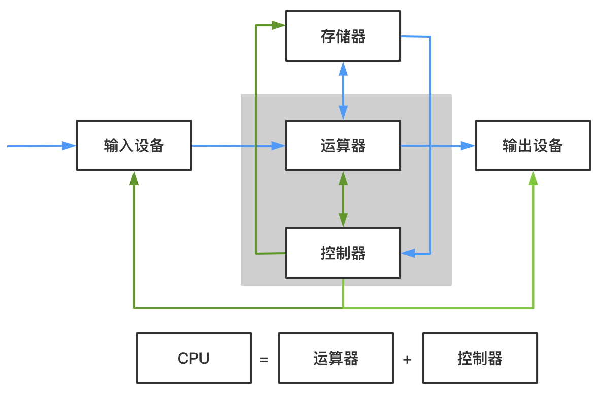
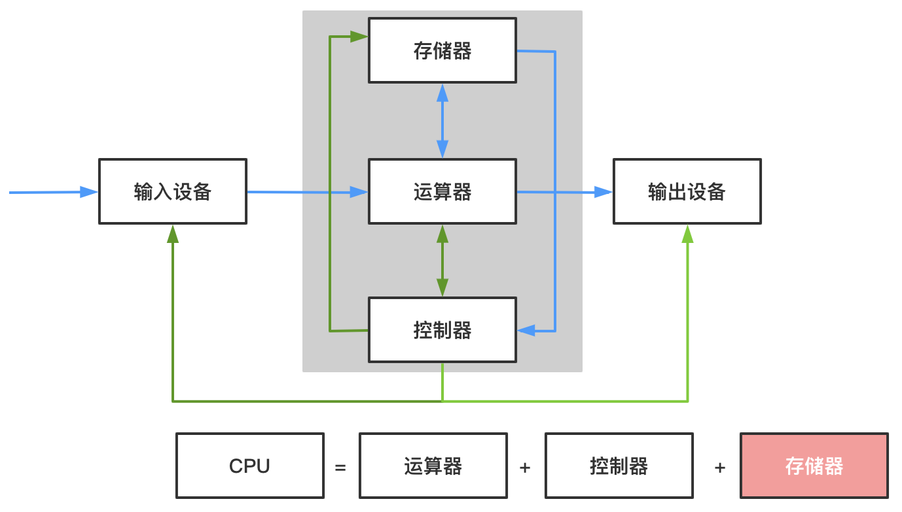

# 计算机组成原理

计算机体系与结构

## 计算机分类

- 超级计算机
- 大型计算机
- 迷你计算机
- 工作站
- 微型计算机

## 计算机的体系与结构

## 冯诺依曼体系

> 将程序指令和数据一起存储的计算机设计概念结构

### 计算机发展

### 组成

- 必须有一个存储器
- 必须有一个控制器
- 必须有一个运算器
- 必须有输入设备
- 必须有输出体系

**现代计算机都是冯诺依曼机**

### 特点

- 能够把需要的程序和数据送至计算机中
- 能够长期记忆程序、数据、中间结果以及最终运算结果的能力
- 能够具备算术、逻辑运算和数据传送等数据加工处理的能力
- 能够按照要求处理结果输出给用户

### 结构

### 问题

在冯诺依曼体系中 CPU与存储器是分开的，会导致CPU与存储器速率之间的问题无法调和。

### 冯诺依曼瓶颈

- CPU经常空转等待数据传输（CPU处理速度 > 传输速度）

### 现代计算机的结构

- 现代计算机在冯诺依曼体系结构基础上进行修改
- 解决CPU与存储设备之间的性能差异问题 

> 这里的存储器指的是围绕CPU的高速存储设备，如内存，CPU寄存器，不是广义上的存储数据的介质。

**可以理解为以存储器为核心**