# 计算机系统概论

## 1.1计算机简介

### 程序翻译

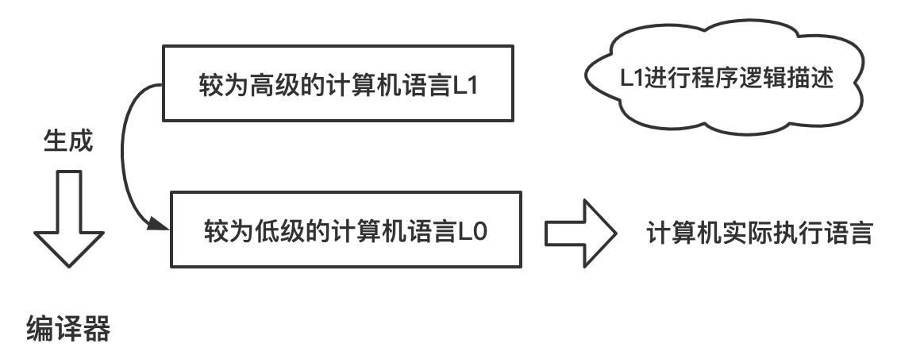

> 在执行L1写的程序之前生成一个等价的L0指令序列来替代它，生成的程序全部由L0指令组成。计算机执行等效的L0程序来替代原来的L1的程序。
>
> — 《计算机组成结构化方法》

### 程序解释

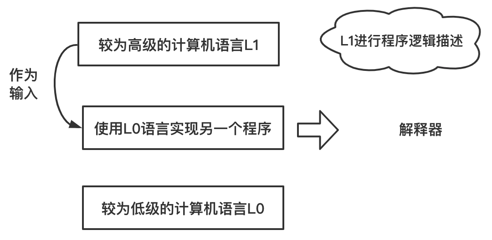

> 用L0写一个程序，将L1的程序作为输入数据，按顺序检查他的每条指令，然后直接执行等效的L0指令序列计算出结果。它不需要事先生成一个L0语言的新程序。
>
> — 《计算机组成结构化方法》

### 常见语言分类

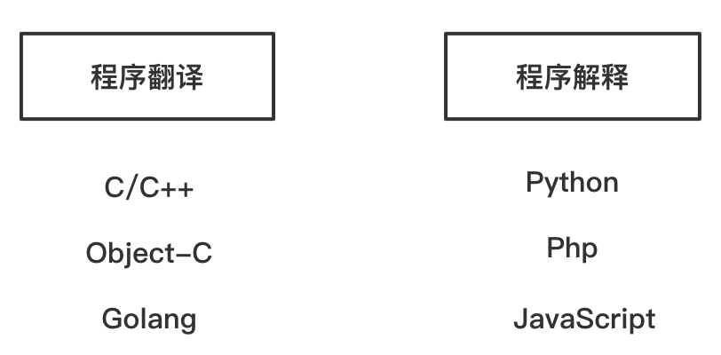

**翻译+解释(java为例)**

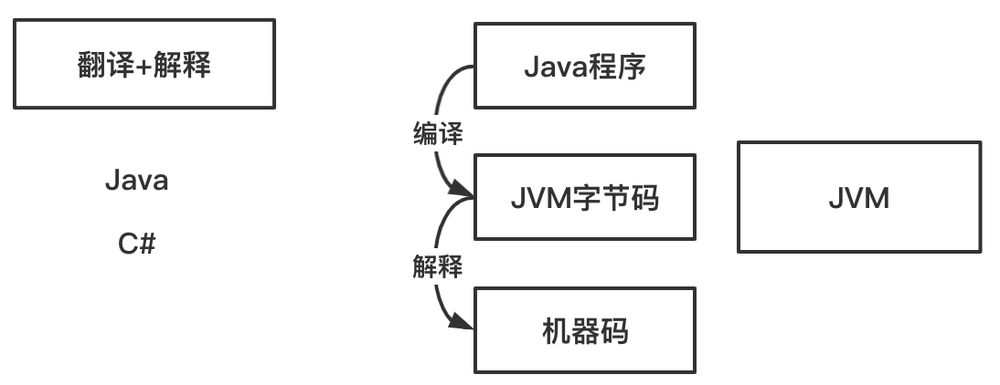

### 计算机系统层次结构

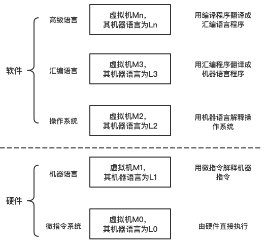

## 1.2计算机基本组成

### 冯诺依曼计算机

#### 冯诺依曼计算机特点

- 由5大部分组成
- 指令和数据以同等地位存于存储器，可按地址寻访
- 指令和数据二进制表示
- 指令由操作码和地址码组成
- **可以存储程序（核心）**
- 以运算器为中心

> 上述第二点提到指令和数据都存储在存储器中，那么是否可以分开？
>
> #### 哈佛结构
>
> 哈佛结构是一种将程序指令存储和数据存储分开的存储器结构，它的主要特点是将程序和数据存储在不同的存储空间中，即程序存储器和数据存储器是两个独立的存储器，每个存储器独立编址、独立访问，目的是为了减轻程序运行时的访存瓶颈。
>
> 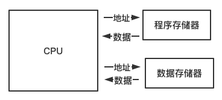

#### 冯诺依曼硬件框图

#### 冯·诺伊曼瓶颈

**CPU速度远大于存储器读写速率**

> 在CPU与存储器之间的流量（数据传输率）与存储器的容量相比起来相当小，在现代电脑中，流量与CPU的工作效率相比之下非常小，在某些情况下（当CPU需要在巨大的数据上运行一些简单指令时），数据流量就成了整体效率非常严重的限制。CPU将会在数据输入或输出存储器时闲置。
>
> — 维基百科

### 现代计算机硬件框图

**以存储器为中心**

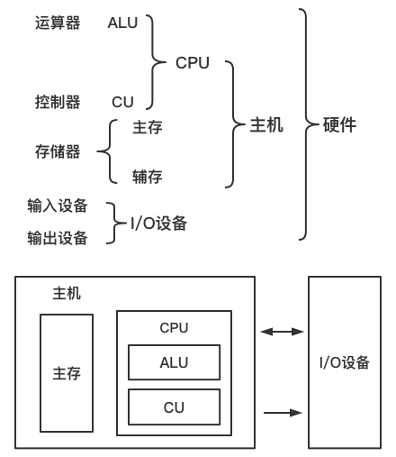

### 指令格式

**操作码 + 地址码**

> **例如：计算$ax^2 + bx + c$程序清单？**
>
> <table border=0 cellpadding=0 cellspacing=0 width=643 style='border-collapse:
>  collapse;table-layout:fixed;width:483pt'>
>  <col width=129 style='mso-width-source:userset;mso-width-alt:4138;width:97pt'>
>  <col width=100 style='mso-width-source:userset;mso-width-alt:3200;width:75pt'>
>  <col width=149 style='mso-width-source:userset;mso-width-alt:4778;width:112pt'>
>  <col width=265 style='mso-width-source:userset;mso-width-alt:8490;width:199pt'>
>  <tr height=21 style='mso-height-source:userset;height:16.0pt'>
>   <td rowspan=2 height=42 class=xl65 width=129 style='height:32.0pt;width:97pt'>指令和数据存于主存单元的地址</td>
>   <td colspan=2 class=xl66 width=249 style='width:187pt'>指令</td>
>   <td rowspan=2 class=xl67 width=265 style='width:199pt'>注释</td>
>  </tr>
>  <tr height=21 style='mso-height-source:userset;height:16.0pt'>
>   <td height=21 class=xl66 style='height:16.0pt'>操作码</td>
>   <td class=xl66>地址码</td>
>  </tr>
>  <tr height=24 style='height:18.0pt'>
>   <td height=24 class=xl66 style='height:18.0pt'>0</td>
>   <td class=xl68>000001</td>
>   <td class=xl68>0000001000</td>
>   <td class=xl69>取数x至ACC</td>
>  </tr>
>  <tr height=24 style='height:18.0pt'>
>   <td height=24 class=xl66 style='height:18.0pt'>1</td>
>   <td class=xl68>000100</td>
>   <td class=xl68>0000001001</td>
>   <td class=xl69>乘a得到ax，存于ACC中</td>
>  </tr>
>  <tr height=24 style='height:18.0pt'>
>   <td height=24 class=xl66 style='height:18.0pt'>2</td>
>   <td class=xl68>000011</td>
>   <td class=xl68>0000001010</td>
>   <td class=xl69>加b得到ax+b，存于ACC中</td>
>  </tr>
>  <tr height=24 style='height:18.0pt'>
>   <td height=24 class=xl66 style='height:18.0pt'>3</td>
>   <td class=xl68>000100</td>
>   <td class=xl68>0000001000</td>
>   <td class=xl69>乘x得（ax+b）x，存于ACC中</td>
>  </tr>
>  <tr height=24 style='height:18.0pt'>
>   <td height=24 class=xl66 style='height:18.0pt'>4</td>
>   <td class=xl68>000011</td>
>   <td class=xl68>0000001011</td>
>   <td class=xl69>加c得ax^2+bx+c,存于ACC中</td>
>  </tr>
>  <tr height=24 style='height:18.0pt'>
>   <td height=24 class=xl66 style='height:18.0pt'>5</td>
>   <td class=xl68>000010</td>
>   <td class=xl68>0000001100</td>
>   <td class=xl69>将ax^2+bx+c，存于主存单元</td>
>  </tr>
>  <tr height=24 style='height:18.0pt'>
>   <td height=24 class=xl66 style='height:18.0pt'>6</td>
>   <td class=xl68>000101</td>
>   <td class=xl68>0000001100</td>
>   <td class=xl69>打印</td>
>  </tr>
>  <tr height=24 style='height:18.0pt'>
>   <td height=24 class=xl66 style='height:18.0pt'>7</td>
>   <td class=xl68>000110</td>
>   <td class=xl68></td>
>   <td class=xl69>停机</td>
>  </tr>
>  <tr height=24 style='height:18.0pt'>
>   <td height=24 class=xl66 style='height:18.0pt'>8</td>
>   <td colspan=2 class=xl68>x</td>
>   <td class=xl69>原始数据x</td>
>  </tr>
>  <tr height=24 style='height:18.0pt'>
>   <td height=24 class=xl66 style='height:18.0pt'>9</td>
>   <td colspan=2 class=xl68>a</td>
>   <td class=xl69>原始数据a</td>
>  </tr>
>  <tr height=24 style='height:18.0pt'>
>   <td height=24 class=xl66 style='height:18.0pt'>10</td>
>   <td colspan=2 class=xl68>b</td>
>   <td class=xl69>原始数据b</td>
>  </tr>
>  <tr height=24 style='height:18.0pt'>
>   <td height=24 class=xl66 style='height:18.0pt'>11</td>
>   <td colspan=2 class=xl68>c</td>
>   <td class=xl69>原始数据c</td>
>  </tr>
>  <tr height=24 style='height:18.0pt'>
>   <td height=24 class=xl66 style='height:18.0pt'>12</td>
>   <td colspan=2 class=xl68></td>
>   <td class=xl69>存放结果</td>
>  </tr>
>  <![if supportMisalignedColumns]>
>  <tr height=0 style='display:none'>
>   <td width=129 style='width:97pt'></td>
>   <td width=100 style='width:75pt'></td>
>   <td width=149 style='width:112pt'></td>
>   <td width=265 style='width:199pt'></td>
>  </tr>
>  <![endif]>
> </table>

### 存储器的基本组成

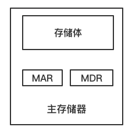

#### 存储体

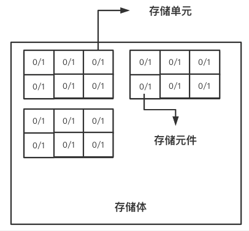

##### 存储单元
- 存放一串二进制代码
- 存储单元是**按地址寻访的**
- 每一个存储单元**赋予一个地址**

##### 存储字

存储单元中二进制代码的组合

##### 存储字长

存储单元中二进制代码的位数

> 存储体 - 存储单元 - 存储元件（0/1）
>
> 大楼  -  房间    - 床位 （有人/无人）

#### MAR

- 存储器地址寄存器

- 反应存储单元的个数

> 比如有32个存储单元，而存储单元的地址是用二进制来表示的，那么5位二进制数就可以32个存储单元。那么，MAR的位数就是5位。

#### MDR

- 存储器数据寄存器

- 反映存储字长
- MDR存放的是从存储元件读出，或者要写入某存储元件的数据（二进制数）。

> 如果MDR=16,，每个存储单元进行访问的时候，数据是16位，那么存储字长就是16位。

### 运算器基本组成

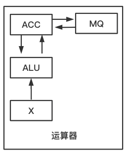

> 运算器的核心，通常是组合电路，所以一般在其输入端有 两个寄存器。其中一个就是 ACC 累加器 (Accumulator)，另一个是称为 X 的 数据寄存器；
> 因为乘法得出的结果的长度是操作数的两倍，多出来的长度存放在 MQ 寄存器中，运算结果保存在 ACC 中。

### 运算器进行运算

|      | ACC         | MQ             | X      |
| ---- | ----------- | -------------- | ------ |
| 加法 | 被加数 和   |                | 加数   |
| 减法 | 被减数 差   |                | 减数   |
| 乘法 | 乘积高位    | 乘数  乘积低位 | 被乘数 |
| 除法 | 被除数 余数 | 商             | 除数   |

#### 加法操作过程

**指令** ： 加 M

**初态**： ACC 中已经存储了被加数

1. **[M] —> X**   将加数M放入X寄存器中
2. **[ACC] + [X] —> ACC**   将ACC寄存器中的内容与X寄存器中的内容相加，结果放入到ACC寄存器中

#### 减法操作过程

**指令** ： 减 M

**初态**： ACC 中已经存储了被减数

1. **[M] —> X**   将减数M放入寄存器X中
2. **[ACC] - [X] —> ACC**  将ACC寄存器中的值与X寄存器的值相减，结果放入ACC寄存器中

#### 乘法操作过程

**指令** ： 乘 M

**初态**： ACC 中已经存储了被乘数

1. **[M] —> MQ**   将乘数M放入到MQ寄存器中
2. **[ACC] —> X**   将ACC中的值放入到X寄存器中
3. **0 —> ACC**   将ACC寄存器归零
4. **[X] x [MQ] —> ACC //MQ**   将X寄存器中的值与MQ寄存器中的值相乘 结果高位放入ACC寄存器，低位放入MQ寄存器

#### 除法操作过程

**指令** ：除 M

**初态**： ACC 中已经存储了被除数

1**.[M] —> X** 将除数M放入到X寄存器中

2.**[ACC] / [X] —> MQ 余数在ACC中** 将ACC寄存器中的值与X寄存器中的值做除法，商放入到MQ寄存器中，余数放入到ACC寄存器中

### 控制器基本结构

#### 控制器功能

- 解释指令
- 保证指令的按序进行

#### 完成一条指令

- 取指令 PC
- 分析指令 IR
- 执行指令 CU

#### 控制器基本组成

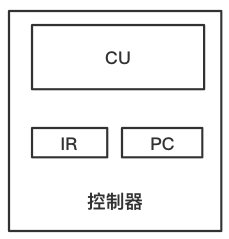

- **PC (Program Counter) 程序计数器** 它指向下一条将被取出用于执行的指令
- **IR(Instruction Register) 指令寄存器** 存放着当前正在执行的指令

#### 主机完成一条指令

##### 以取数指令为例

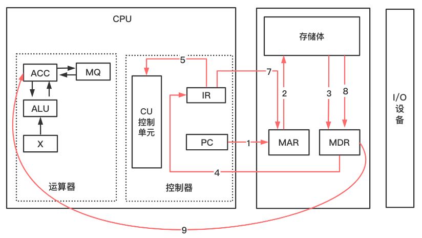

**取指令 步骤1234**

1.PC将指令的地址送给MAR

2.MAR送给存储体

3.在控制器控制下，存储体把指定存储单元中保存的取数指令取出来送入到MDR中

4.将MDR中的指令送入到IR中（因为IR保存当前执行的指令）

**分析指令 步骤5**

5.将IR指令寄存器中的操作码送入到CU单元中进行分析

5.1 CU转化为电信号控制执行

**执行 步骤6789**

6.IR中保存当前这条指令的操作数地址，所以将IR的地址码取出，送入MAR。

7.由MAR送入存储体

8.在控制器控制下，存储体把指定存储单元中保存的取数指令的要取的数取出来送入到MDR中

9.由MDR中送入到ACC寄存器中

##### 以存数指令为例

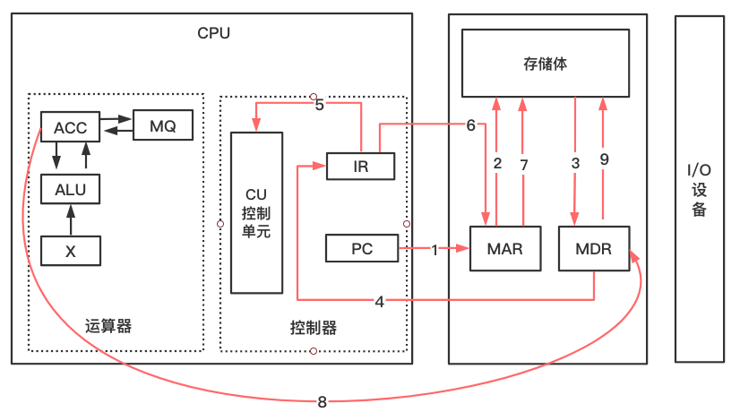

**取指令 步骤1234**

1.PC将指令的地址送给MAR

2.MAR送给存储体

3.在控制器控制下，存储体把指定存储单元中保存的取数指令取出来送入到MDR中

4.将MDR中的指令送入到IR中（因为IR保存当前执行的指令）

**分析指令 步骤5**

5.将IR指令寄存器中的操作码送入到CU单元中进行分析

5.1 CU转化为电信号控制执行

**执行 步骤6789**

6.IR中保存当前这条指令的操作数地址，所以将IR的地址码取出，送入MAR。

7.由MAR送入存储体

8.在控制器控制下，将ACC寄存器中的数据送入到MDR中

9.由MDR中送入到存储体中

> **再谈$ax^2 + bx + c$程序的运行过程**
>
> - 将程序通过输入设备送至计算机
> - 程序首地址 —> PC
> - 启动程序运行
> - 取指令 PC —> MAR —> M —> MDR —> IR,(PC)+1 —> PC
> - 分析指令 IR —> CU
> - 执行指令 IR —> MAR —> M —> MDR —> ACC
> - ...
> - 打印结果
> - 停机

## 1.3 计算机硬件主要技术指标

### 1.机器字长

CPU 一次能处理数据的位数与CPU中的**寄存器位数**有关

### 2.运算速度

- **主频**（与运算速度没有直接关系）
- **核数**（与运算速度没有直接关系），每个核支持的线程数
- **吉普森法** 加权平均值 用指令执行速度衡量 分为指令的静态使用频率，动态使用频率
- **CPI** 执行一条指令所需时钟周期数
- **IPC** 一个时钟周期能完成多少个指令。用于超流水线，超标量的计算机
- **MIPS** 每秒执行百万条指令
- **FLOPS** 每秒浮点运算次数

### 3.存储容量

存放二进制信息的总位数

- **主存容量** 

**存储单元个数 x 存储字长**

> 例如： 
>
> | MAR  | MDR  |       容量        |
> | :--: | :--: | :---------------: |
> |  10  |  8   |  1K(2^10) X 8位   |
> |  16  |  32  | 64K（2^16）x 32位 |

**字节数**

> 如 2^13bit = 1KB
>
> 2^21bit = 256KB

- **辅存容量**

字节数 80GB

## 参考
**[书籍]**

1.（荷）Andrew S.Tanenbaum,（美）Todd Austin.计算机组组成结构化方法 Structured Computer Organization[M].机械工业出版社:北京,2014.7

**[网站]**

1. https://blog.csdn.net/u014470361/article/details/79774331

2. https://blog.csdn.net/qq_43763494/article/details/104370125

3. [https://zh.wikipedia.org/wiki/%E5%93%88%E4%BD%9B%E7%BB%93%E6%9E%84](https://zh.wikipedia.org/wiki/哈佛结构)

4. [https://zh.wikipedia.org/wiki/%E5%86%AF%C2%B7%E8%AF%BA%E4%BC%8A%E6%9B%BC%E7%BB%93%E6%9E%84#.E5.86.AF.C2.B7.E8.AF.BA.E4.BC.8A.E6.9B.BC.E7.93.B6.E9.A0.B8](https://zh.wikipedia.org/wiki/冯·诺伊曼结构#.E5.86.AF.C2.B7.E8.AF.BA.E4.BC.8A.E6.9B.BC.E7.93.B6.E9.A0.B8)

5. https://www.bilibili.com/video/BV1WW411Q7PF?p=10

6. https://zhuanlan.zhihu.com/p/115007548

