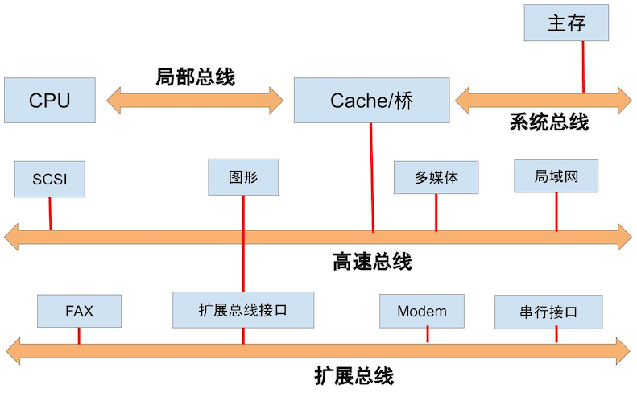
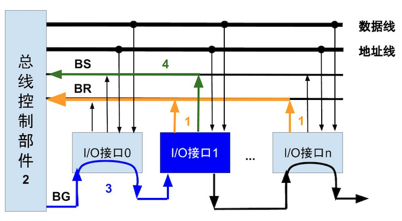
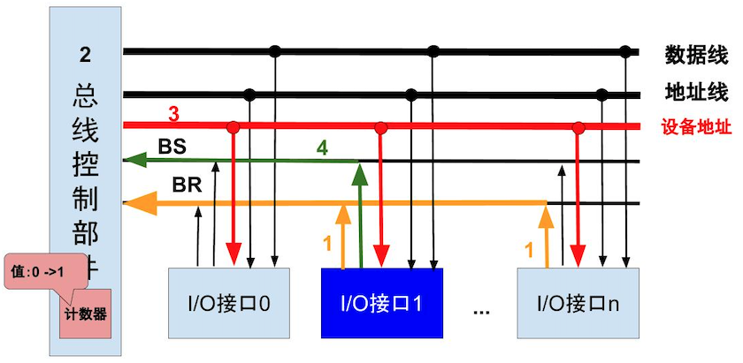
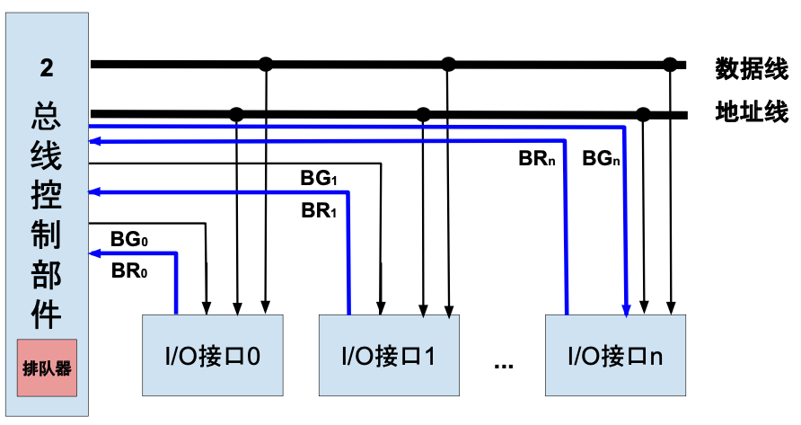

# 系统总线

## 2.1 什么是总线?

总线是连接各个不见得信息的传输线，是各个部件共享的传输介质

## 2.2 总线上信息的传送

- **串行** 一位一位的传

- **并行** 多位多位的传，传输距离较短

> 问题:现在高速信号传输使用串行还是并行？
>
> 高速信号的传输采用的是串行
> 原因 连接线大大减少，更易实现，成本低

## 2.3 总线分类

- **片内总线** 芯片内部的总线

- **系统总线** 计算机各个部件之间的信息传输线

  按照传输数据的不同分为三类：

  - **数据总线**

     双向 与机器字长、存储字长有关

  - **地址总线**

    - 由CPU单向发出 与存储地址、I/O地址有关

    - 寻址到字节，按字节编址

    - 按字寻址，一个字含多个字节

    - 地址总线宽度表明CPU寻址能力

  - **控制总线** 有出、有入

    主要用来传输 控制信号、时序信号
    常见的信号有：

    - CPU发出的，
    - 读/写信号、片选信号、中断响应信号 等
    - 反馈给CPU的，中断申请信号、复位信号、总线请求信号 等 

- **通信总线**

  用于计算机之间或计算机系统与其他系统（如控制仪表，移动通信）之间的通信

## 2.4 总线特性以及性能指标

### 总线物理实现

总线印刷在主板上，留出一些接口，其他部件通过接口连接到主板

### 总线特性

- **机械特性** 机械连接方面，尺寸，管脚数，排列顺序
- **电气特性** 传输方向和有效电平范围
- **功能特性** 每根传输线的功能（地址，数据，控制）
- **时间特性** 信号的时序关系

### 总性能指标

- **总线宽度** 数据线的根数

- **标准传输率** 每秒传输的最大字节数（MBps）

- **时钟同步/异步** 同步、不同步

- **总线复用** 地址线与数据线复用

  > 8086，20条地址线中16条数据线，减少芯片管脚数
  > 不同信号在同一条信号线上分时传输；通常是地址线与数据线复用

- **信号线数** 地址线、数据线、控制线的总和

- **总线控制方式** 突发、自动、仲裁、逻辑、计数

- **总线带宽**
  衡量总线本身所能达到最高传输速率的重要指标
  **总线带宽 = 总线时钟频率 × 总线宽度** (**/ 8**)
  时钟频率 = 1 / 时钟周期
  带宽，
  数字信号系统中，用来表示通信线路传送数据的能力(bps)

## 2.5 总线结构

### 单总线结构

严重影响 CPU 运行速度，延迟
总线争用 硬盘优于 CPU；总线成为发展瓶颈

### 面向CPU的双总线结构

一条 I/O 总线连接外设，一条 M 总线连接主存
CPU 执行仍会被打断

### 以存储器为中心的双总线结构

一条系统总线，一条存储总线，现在仍是分时工作的

### 双总线结构

**通道**：具有特殊功能的处理器，由通道对I/O统一管理

I/O总线和主存总线通过**通道**连接；

### 三总线结构

### 三总线结构又一形式

- **DMA总线** (连主存与**高速I/O**)；
- **局部总线** (连CPU与Cache)；
- **主存总线** (连CPU与主存)；
- **I/O总线** (连CPU与I/O)；
- **扩展总线** (通过扩展总线接口连扩展总线与系统总线/高速总线)；
- **系统总线** (连Cache/桥与主存)；

### 四总线结构

## 2.6 总线控制

###  总线判优

#### 基本概念

- **主设备（模块）** 对总线有控制权
- **从设备（模块）** 响应从主设备发来的总线命令

#### 总线判优控制

- **集中式**
  - **链式查询**
  - **计数器定时查询**
  - **独立请求方式**

- **分布式**

#### 集中式

> **数据线**：用于数据传输
>
> **地址线**：用于从设备查找

##### 链式查询

> **BS**: 总线忙
>
> **BR**: 总线请求
>
> **BG**: 总线同意

1.挂接在总线上的I/O接口有总线占用请求，会通过BR向总线控制部件提出占用请求

2.总线控制部件接收到I/O占用请求信号后，在可以响应的情况下让出控制权（交由I/O设备使用）

3.总线控制部件通过BG逐个查询I/O的优先权（碰到第一个提出总线占用请求的部件），确定交由哪个I/O部件

4.接口1通过BS设置总线忙，获得总线使用权

> **优点：**
>
> 控制线少
>
> **缺点：**
>
> 对电路故障敏感，优先级低的设备难请求

##### 计数器定时查询

> **BS**: 总线忙
>
> **BR**: 总线请求
>
> **设备地址**: 该线上传输的地址，是由控制部件中的计数器给出的
>
> **计数器**：计数器的初值可以是0也可以是其他数

1.挂接在总线上的I/O接口有总线占用请求，会通过BR向总线控制部件提出占用请求

2.总线控制部件接收到I/O占用请求信号后，在可以响应的情况下让出控制权（交由I/O设备使用）

3.通过设备地址，查询设备的总线占用请求。（例如计数器初始值为0，通过设备地址，查询I/0接口0是否有总线占用请求）。如果没有请求计数器会自动**加一**，直到碰到第一个提出总线占用请求的部件。

4.接口1通过BS设置总线忙，获得总线使用权

> **优点：**
>
> 可控制（可以通过软件设置计数器的初始值，从而使得优先级顺序改变）
>
> **缺点**：
>
> 设备地址线的宽度与设备数有关（有n个设备，需要的宽度是$log2N$向上取整）

##### 独立请求方式

> **BG**: 应当信号
>
> **BR**: 总线占用请求
>
> **排队器**：优先级顺序（可调整）

1.任何一个设备都具有两条BG,BR线

> **优点**：
>
> 响应快，优先次序控制灵活
>
> **缺点**：
>
> 所需的线数增加，n个设备需要2n条这样的线

###  总线通信控制

**总线周期**：完成一次总线操作的时间

**目的**： 解决通信双方协调配合问题

#### 总线传输周期

- **申请分配阶段**  主模块申请，总线仲裁决定
- **寻址阶段** 主模块向从模块 ***给出地址*** 和 ***命令***
- **传输阶段** 主模块和从模块 ***交换数据***
- **结束阶段** 主模块 ***撤销有关信息***

#### 总线通信四种方式

- **同步通信** 由 ***统一时标*** 控制数据传送
- **异步通信** 采用 ***应答方式***，没有公共时钟标准
- **半同步通信** 同步，异步结合
- **分离式通信**  充分挖掘系统总线每个瞬间的潜力

## 参考

**[书籍]**

1.（荷）Andrew S.Tanenbaum,（美）Todd Austin.计算机组组成结构化方法 Structured Computer Organization[M].机械工业出版社:北京,2014.7

**[网站]**

1. https://blog.csdn.net/weixin_46654114/article/details/105812651

2. https://www.bilibili.com/video/BV1ix41137Eu?p=20

