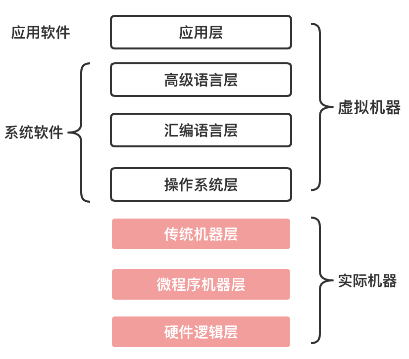

# 计算机组成原理

计算机的层次与编程语言

## 程序翻译与程序解释

需要将人类语言翻译为计算机语言，进行语言之间的转换

### 程序翻译

### 程序解释

### 两者的关联

- 计算机执行的指令都是L0
- 翻译过程生成新的L0程序，解释过程不生成新的L0程序
- 解释过程由L0编写的解释器去解释L1程序

### 语言分类

### 翻译+解释

### 计算机的层次与编程语言

#### 硬件逻辑层

- 门，触发器等逻辑电路组成

#### 微程序机器层

- 编程语言是**微指令集**
- **微指令**所组成的**微程**序直接交由硬件执行

#### 传统机器层

- 编程语言是**CPU指令集（机器指令）**
- 编程语言和硬件直接相关
- 不同架构的CPU使用不同的CPU指令集

#### 微指令，微程序，机器指令关系

**微指令** < **微程序** = **机器指令**

- 一条机器指令对应一个微程序
- 一个微程序对应一组微指令

#### 操作系统层

- 向上提供了简易的操作界面
- 向下对接了指令系统，管理硬件资源
- 操作系统层是软件和硬件之间的适配层

#### 汇编语言层

- 编程语言是**汇编语言**
- 汇编语言可以**翻译**成可执行的机器语言
- 完成翻译的过程的程序及时汇编器

#### 高级语言层

- 编程语言为广大程序员所接受的**高级语言**
- 高级语言的类型非常多，有几百种
- 常见：Python、java等

#### 应用层

- 满足计算机针对某种用途而专门设计

### 目的

分层的目的是便于理解