# 存储器(一)

## 3.1 概述

### 存储器分类

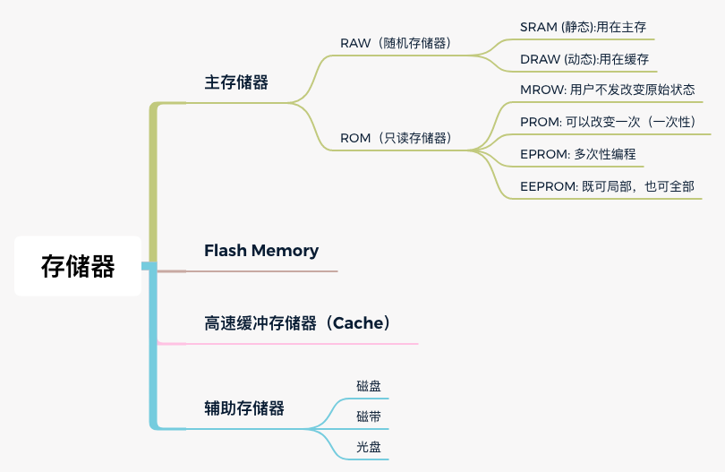

### 存储器层次结构

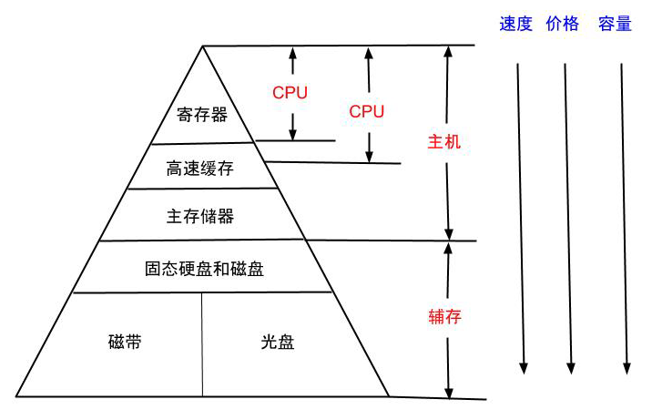

### 缓存-主存层次和主存-辅存层次

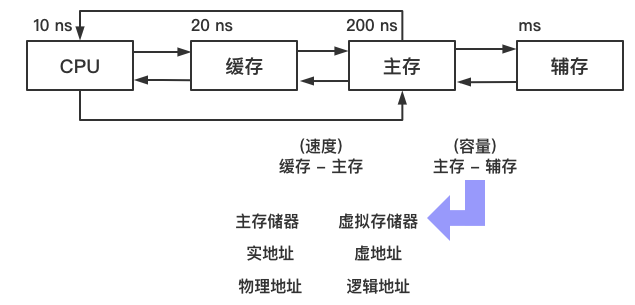

## 3.2 主存储器

### 主存的基本组成

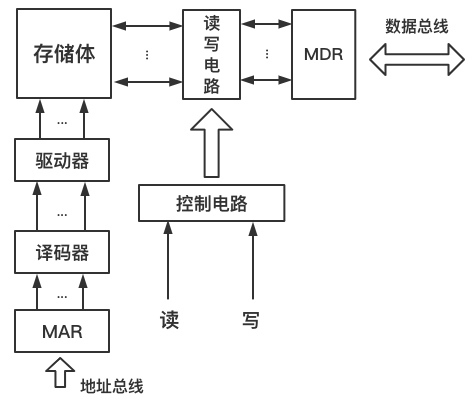

### 主存和CPU的联系

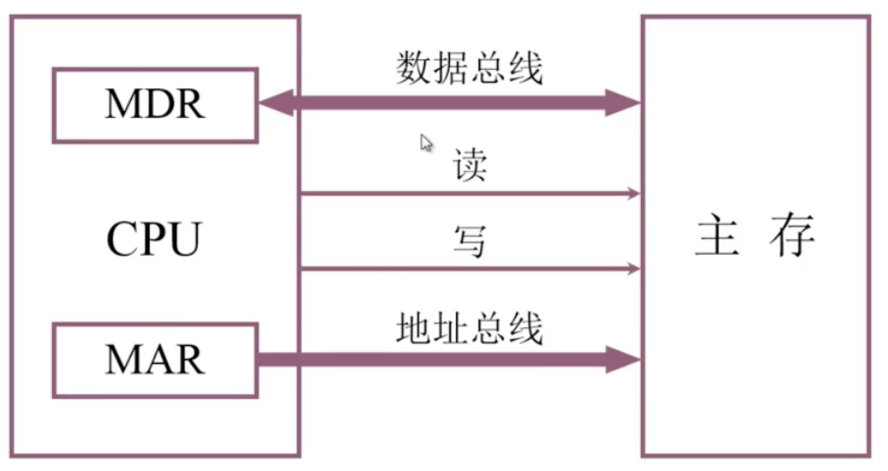

> 注意：这里**MDR**、 **MAR** 集成在CPU中
>
> **MAR** 和 **MDR** 制作在**CPU**里面，因为它们同属于寄存器，**CPU**从主存读取数据的时候，对这两个寄存器的访问频率极高，放在主存的话，速度低很多。而且**MAR** 和 **MDR** 本就是为主存配置的，方便从中存取数据，并不是物理意义上实实在在地被放在了主存中.
>
> — 知乎 https://www.zhihu.com/question/65081251

### 主存中存储单元地址的分配

> 问：**12345678H **这个数据如何在主存储器中进行存储？

#### 高位字节（大段、大尾）
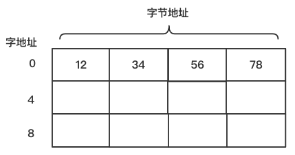

#### 低位字节（小端、小尾）
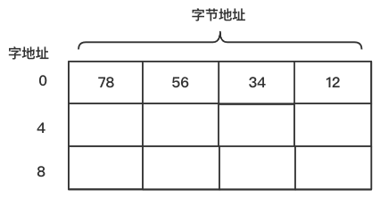

设地址线 **24** 根 按 **字节** 寻址 **2^24 = 16MB**

***ps：1MB=1024kb，1kb=1024byte，1024是2的10次方***

若字长 **16** 位 ，按字寻址 **8MW**

> 总容量16MB/字长16bit = 16M x 8bit/16bit = 8MW

若字长 **32** 位， 按字寻址 **4MW**

> 总容量16MB/字长32bit = 16M x 8bit/32bit = 4MW

拓展：https://blog.csdn.net/qq_26222859/article/details/50558253

**总结：寻址范围，地址总线宽度决定寻址能力，通俗讲就是最多能用到多少内存。**

### 主存的技术指标

#### **存储容量** 

主存存放二进制代码的总位数

#### 存储速度

- **存储时间** 存储器访问时间 读出时间 写入时间
- **存储周期** 连续两次独立的存储器操作（读或写）所需的最小间隔时间

#### 存储器的带宽 

位/秒

### 半导体芯片简介

#### 半导体存储芯片的基本结构

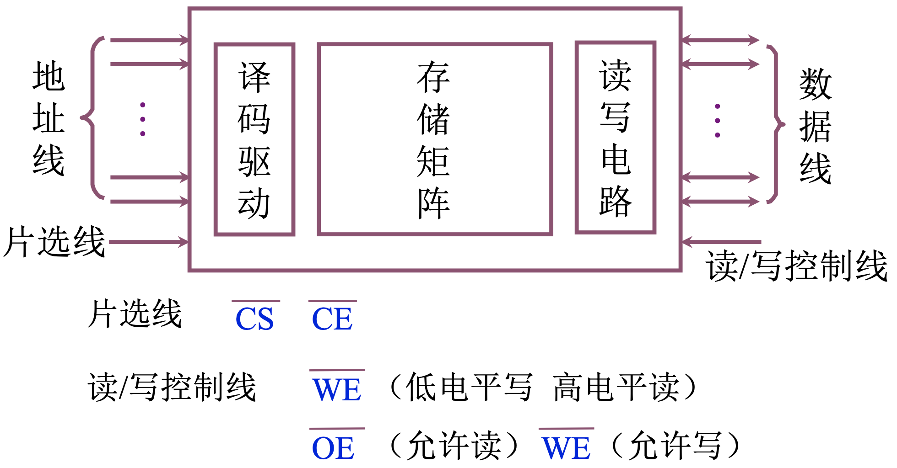

| 地址线（单向） | 数据线（双向） | 芯片容量                  |
| -------------- | -------------- | ------------------------- |
| 10             | 4              | 1K X 4bit（ $2^x (x=10)$  X 4bit ） |
| 14             | 1              | 16K X 1bit（2^x (x=16) X 1bit） |
| 13             | 8              | 8K X 8bit（$2^x (x=13) $X 8bit）  |

#### 存储芯片片选线的作用

**问：用16K X 1bit 的存储芯片组成64K X 8bit 的存储器？**

答：

**字方向扩展**了64K／16K=4倍，**位方向扩展**了8bit／lbit=8倍。

所以要达到一次读8位，需要用8个**16K X 1bit**连接在一起，同时进行读写。

同时将**8个16K X 1bit**看做一组，步骤**4组**满足64K的选址。

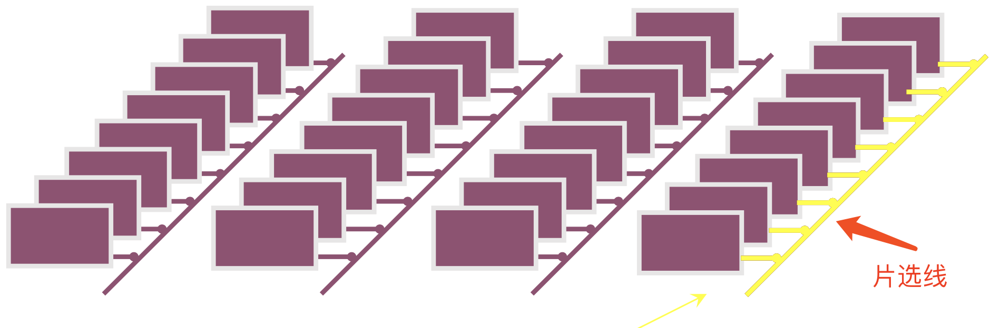

#### 译码驱动方式

##### 线选法

缺点：容量大的话线太多

##### 重合法

行列地址分别译码，行地址打开数据，列地址打开管子 (通道)

### 随机存取存储器 ( RAM )

#### 静态RAW **SRAM**

核心：触发器

Intel 2114 RAM芯片，矩阵 64 × 64，分四组，每组16列，每个列选信号需要选中4列

#### 动态RAW DRAW

核心：电容充放电，有电为1，没电为0

#### 动态 RAM 和静态 RAM 的比较

|          | DRAW | SRAW   |
| -------- | ---- | ------ |
| 存储原理 | 电容 | 触发器 |
| 集成度   | 高   | 低     |
| 芯片引脚 | 少   | 多     |
| 功耗     | 小   | 大     |
| 价格     | 低   | 高     |
| 速度     | 慢   | 快     |
| 刷新     | 有   | 无     |

### 只读存储器ROM

断电无影响，内部信息在脱机状态下由专门设备写入

- **固定掩模式 ROM (Mask ROM)**，用户不可修改
- **可编程只读存储器 PROM（Programmable ROM)**，用户通过特殊的可编程设备将所需程序写入芯片中（只能进行一次编程）
- **可擦除只读存储器 EPROM(Erasable Programmable ROM)**，可以通过紫外线照射将所有信息擦除，重新通过可编程设备写入信息
- **电可擦除编程存储器EEPROM(Electrically EPROM)**，不需要特殊可编程设备，可以进行百万次的编程

### 存储器容量的扩展

#### **位扩展（增加存储字长）**

**问：用2片 1K×4位 存储芯片组成 1K×8位 的存储器？**

答：1K×8位 10根地址线 8根数据线

组成如图：

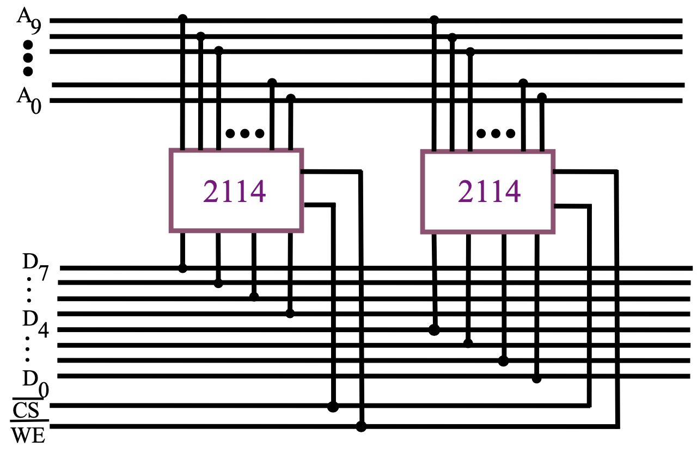

位扩展是为了保证两个芯片同时进行读操作和写操作，关键是连接到同一个**片选线**

#### 字扩展（增加存储字的数量）

**问：用2片1K×8位 存储芯片组成 2K×8位 的存储器？**

答：2K×8位 11根地址线 8根数据线

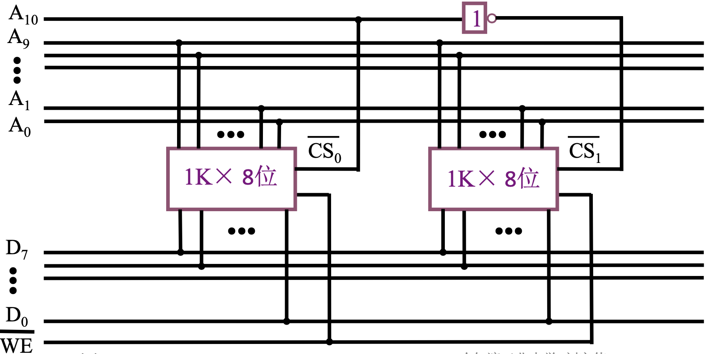

- A0~A9用于两个芯片的地址输入

- 两个芯片不能同时进行工作，同时工作每个芯片提供8位数据，会造成混乱
- 利用A10来控制哪个芯片工作，通过 开关如果A10等于1第二芯片工作，否者第一个芯片工作

#### 字、位扩展

**问：用8片1K×4位 存储芯片组成 4K×8位 的存储器？**

4K×8位 12根地址线 8根数据线

- 首先 2个1K×4位的芯片同时工作可以构成 1K×8位，所以可以将两个这样的芯片看成一组，连接相同的片选信号，需要4组

- A10,A11用来做片选译码，用来判断选择**哪组芯片**

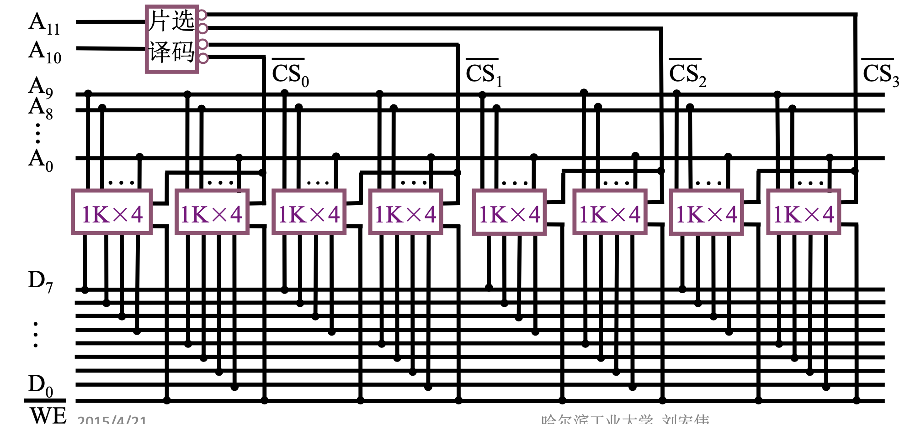

### 存储器与 CPU 的连接

- **地址线的连接** 高位地址线用作片选 低位用作芯片地址

- **数据线的连接** CPU数据线条数比存储器数据线条数多

- **读/写命令线的连接** 比较简单

- **片选线的连接** 高位地址线 确保访问的芯片在给定地址范围内

- **合理选择存储芯片** 

  选**ROM** 系统程序区，配置信息区 (内容不轻易改变)

  选**RAM** 用户程序区，系统程序运行区(系统程序工作区)

  芯片数量尽可能少，片选逻辑尽可能简单

#### 练习

**问1：**

**设CPU共有16根地址线，8根数据线，并用MREQ（低电平有效）做访存控制信号，用WR作读写控制信号，现有下列存储芯片：**

**RAM：1K×4位、4K×8位、8K×8位。**

**ROM：2K×8位、4K×8位，8K×8位以及74138译码器和各种门电路，画出CPU与存储器的连接图。**

**要求：**

**（1）已知主存地址空间分配：6000H—67FFH为系统程序区；6800H-6BFFH为用户程序区。请根据题目要求确定ROM和RAM的总容量，分配地址线。**

**（2）合理选用上述存储芯片，说明各选几片？详细画出存储芯片的片选逻辑图**

答：

（1）

1. **将6000H—67FFH写成二进制代码**

0110 0000 0000 0000 — 0110  0111 1111 1111

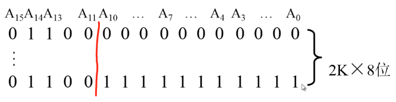

该区间大小可以看到，红色竖线之前额数值都没有变化，之后的数值从全0变成全1一共11位，所以是2^11 = 2K

2. **将6800H-6BFFH写成二进制代码**

0110 1000 0000 0000 — 0110 1011 1111 1111

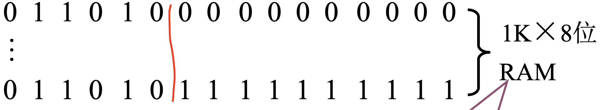

该区间大小可以看到，红色竖线之前额数值都没有变化，之后的数值从全0变成全1一共10位，所以是2^10 = 1K

3. **确定芯片的数量及类型**

根据题意，6000H—67FFH为系统程序区（不可修改，只读），大小为： 2K X8位，刚好有一片符合该要求的芯片，所以选择1片；

6800H-6BFFH为用户程序区（可读写），大小1K X 8位，可以通过2片1K×4位同时工作达到位扩展。

总上：

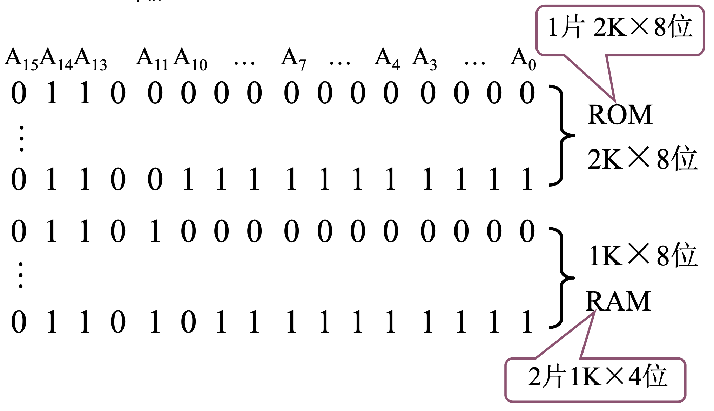

4. **分配地址线**

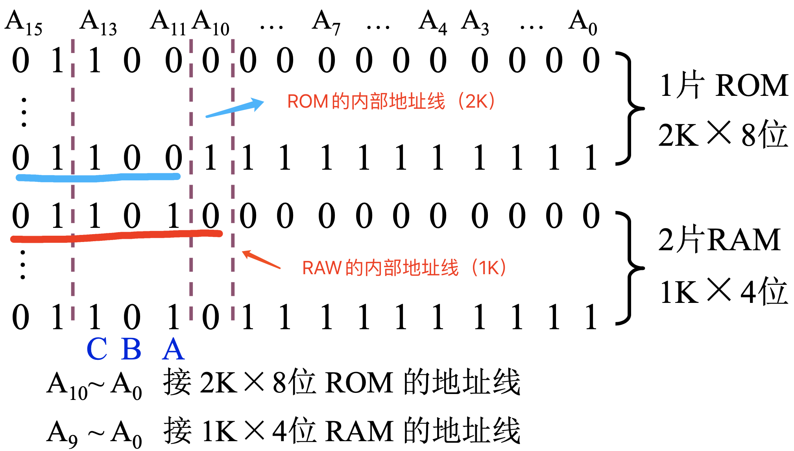

图中使用的是**138译码器**，有三个输入CBA

(2) 如图所示

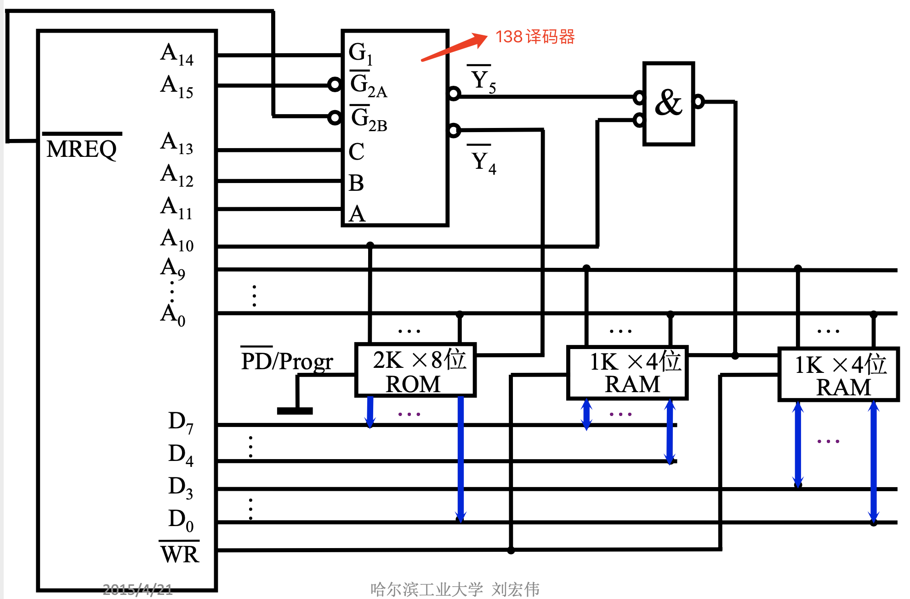

**问2：假设同前，要求最小 4K为系统程序区，相邻 8K为用户程序区。**

答：

1. 4K为系统程序区

   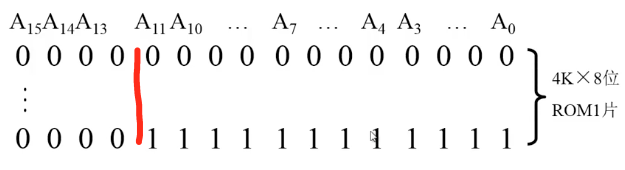

2. 相邻 8K

   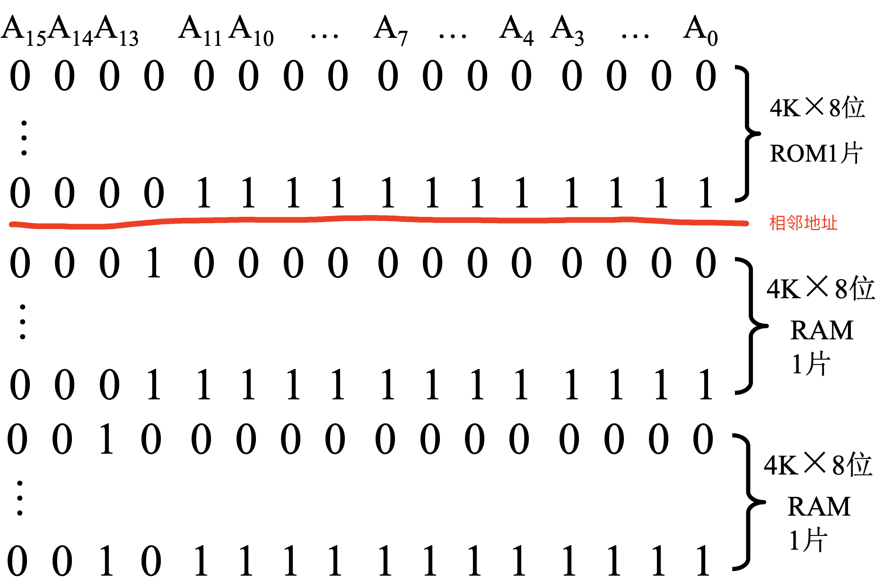

   3. 综上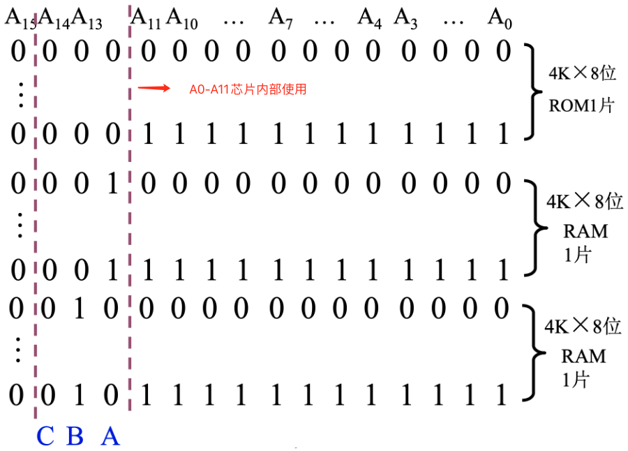

   4. 画图

      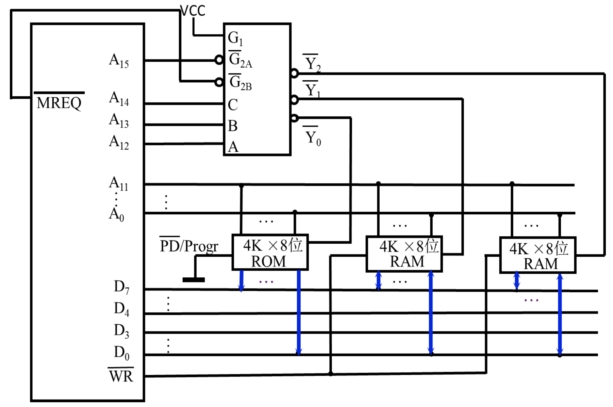

#### 总结

做这种题目的步骤

1. 写出对应的二进制地址码
2. 确定芯片的数量及类型
3. 分配地址线
4. 确定片选信号
5. 确定片选逻辑

### 存储器的校验

**问：为什么要对存储器的信息进行校验？**

答：电容充放电和触发器反转 导致存储信息出错；导致程序运行错误，甚至更大的事故

#### 合法代码集合

1.{000，001，010，011，100，101，110，111} **检0位错、纠0位错**

2.如果含有一组代码集，其中任何一个代码出错，依然是这个集合中的合法代码

{000， 011，101，110}

错误代码：100

对上述代码集进行改在，假设只包含了以上代码集中的4个编码

此时出现100 可以检测出代码发生一位错，但是不能确定是哪位。也就是可能是000第一位错，或者101第三位错，或者110第二位错

**检1位错，纠0位错**

3.{000，111}

错误代码：100 ，110

假如采用**三倍冗余**的方式存储，用000表示计算机中的一个0，111表示计算机中一个1。那么如果出现100可以确定出现错误，如何判断哪位出错？**在存储器存储过程中，1位存储出错的概率超过90%，也就是位数出错越多的概率越小**。所以可以判断100是000发生了错误。同理如果出现110，那么我们也会看成111存储出错，而不是000两位出错。

**检1位错，纠1位错**

4.{0000，1111}

错误代码：1000 1100

如果采用**四倍冗余**，出现1000可以判断是存储1位出错，应当是0000。那么如果是1100可以判断是存储2位出错，但是无法判断是哪两位出错，可能是0000的前两位出错，也可能是1111的后两位出错。

**检2位错，纠1位错**

5.{00000，11111}

错误代码：11000，11100

采用**五倍冗余**，11000可以确认是00000前两位错，11100是11111后两位错。

**检2位错，纠2位错**

#### 编码的最小距离

任意两组合法代码之间 **二进制位数** 的 **最少差异**（也就是合法代码中，从一个合法代码改变得到另一个合法代码的最小位数）

**编码的纠错 、检错能力与编码的最小距离有关**

$L - 1 = D + C ( D≥C )$

L— 编码的最小距离

D — 检测错误的位数

C — 纠正错误的位数

如L = 3,如果代码具有1位纠错能力，那么必须需要1位检错能力

#### 汉明码

**汉明码是具有一位纠错能力的编码**

- 汉明码采用**奇偶校验**
- 汉明码采用**分组校验**

例： 现在需要传输一个8位信息 00100011

**采用偶校验**

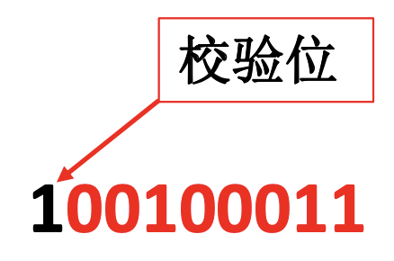

如果我们读出的信息，发现1的个数是奇数个，我们可以知道发生1位错误，但是不知道是哪一位

采用2位校验位

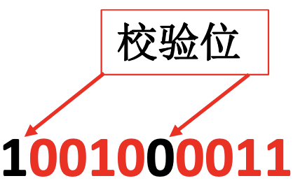

那么可以缩小出错的范围

##### 汉明码的分组

汉明码的分组是一种非划分方式

例：现在含有7位数据

分成3组，每组1位校验位，共包含4位数据位

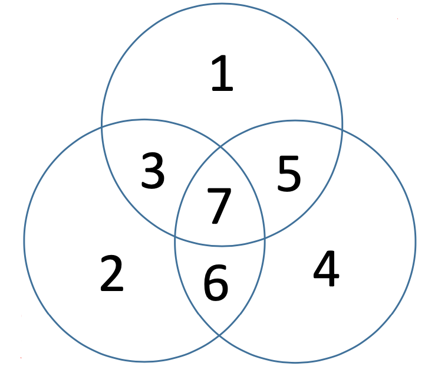

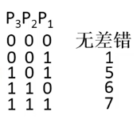

**1，2，4，8 位置放校验码** 检测位每组独有的($2^i$)

##### 汉明码的组成

问：如何分组的呢?

答：

第1组 XXXX1

第2组 XXX1X 

第3组 XX1XX 

第4组 X1XXX

第5组 1XXXX

###### 组成汉明码的三要素

- 汉明码的组成需增添 ?位检测位（也就是把汉明码分成多少组）

  $2^k ≥ n + k + 1$

- 检测位的位置 ?

  $2^i (I=0，1,2,3,… )$

- 检测位的取值 ?

  检测位的取值与该位所在的检测“小组” 中；承担的**奇偶校验**任务有关

**各检测位 Ci 所承担的检测小组为**

C1 检测的 g1 小组包含第 1，3，5，7，9，11， …  **位置的二进制编码为X...XXX1**

C2 检测的 g2 小组包含第 2，3，6，7，10，11，… **位置的二进制编码为X...XX1X**

C4 检测的 g3 小组包含第 4，5，6，7，12，13，… **位置的二进制编码为X...X1XX**

C8 检测的 g4 小组包含第 8，9，10，11，12，13，… **位置的二进制编码为X...1XXX**

**问：求 0101 按 “偶校验” 配置的汉明码**

解: ∵ n = 4

根据 $2^k ≥ n + k + 1$

得k=3

因为采用偶校验

汉明码排序如下:

| 二进制序号                    | 1                   | 2                     | 3    | 4                     | 5    | 6    | 7    |
| ----------------------------- | ------------------- | --------------------- | ---- | --------------------- | ---- | ---- | ---- |
| 名称                          | C1                  | C2                    | 0    | C4                    | 1    | 0    | 1    |
| (校验位+数据位使得个数为偶数) | 0(3是0，5是1，7是1) | 1（3是0，6是0，7是1） | 0    | 0（5是1，6是0，7是1） | 1    | 0    | 1    |

∴ 0101 的汉明码为 **0100101**

**问：按配偶原则配置 0011 的汉明码**

解：∵ n = 4

根据 $2^k ≥ n + k + 1$

得k=3

因为采用偶校验

汉明码排序如下:

| 二进制序号                    | 1                   | 2                     | 3    | 4                     | 5    | 6    | 7    |
| ----------------------------- | ------------------- | --------------------- | ---- | --------------------- | ---- | ---- | ---- |
| 名称                          | C1                  | C2                    | 0    | C4                    | 0    | 1    | 1    |
| (校验位+数据位使得个数为偶数) | 1(3是0，5是0，7是1) | 0（3是0，6是1，7是1） | 0    | 0（5是0，6是1，7是1） | 0    | 1    | 1    |

C1=3⊕5⊕7=1

C2=3⊕6⊕7=0 

C4=5⊕6⊕7=0

∴ 0011 的汉明码为 1000011

###### 汉明码的纠错过程

形成新的检测位 Pi ，其位数与增添的检测位有关

例如： 增添3位 ( k = 3 )，新的检测位为P4，P2，P1 

​	P1 = 1⊕3⊕5⊕7

​	P2 = 2⊕3⊕6⊕7

​	P4 = 4⊕5⊕6⊕7

对于按 **“偶校验”** 配置的汉明码不出错时

**P1= 0，P2 = 0，P4 = 0**

**问：已知接收到的汉明码为0100111， (按配偶原则配置)试问要求传送的信息是什么?**

解：纠错过程如下

​	P1 = 1 ⊕ 3 ⊕ 5 ⊕ 7 = 0 **无错**

​	P2 = 2 ⊕ 3 ⊕ 6 ⊕ 7 = 1 **有错**

​	P4= 4 ⊕ 5 ⊕ 6 ⊕ 7 = 1 **有错**

​	∴ P4P2P1 = 110

第 6 位出错，可纠正为 0100101，故要求传送的信息为 0101。

**问：写出按偶校验配置的汉明码 0101101 的纠错过程**

P4= 4 ⊕ 5 ⊕ 6 ⊕ 7 = 1 **有错**

P2 = 2 ⊕ 3 ⊕ 6 ⊕ 7 = 0 **无错**

P1 = 1 ⊕ 3 ⊕ 5 ⊕ 7 = 0 **无错**

∴ P4P2P1 =100 **第4位错，可不纠**（第4位是校验位）

### 提高访存速度的措施

#### 采用高速器件

- **SDRAM (同步 DRAM)**  在系统时钟的控制下进行读出和写入 CPU 无须等待
- **RDRAM** 由 Rambus 开发，主要解决 存储器带宽 问题
- **带 Cache 的 DRAM** 在 DRAM 的芯片内 集成 了一个由 SRAM 组成的 Cache ，有利于 猝发式读取

#### 采用层次结构 **Cache - 主存**

- 调整主存结构

  - 单体多字系统 增加存储器带宽

    缺点：如果往存储体中写入W位 会修改其余个W位（错误修改），除非再单独实现控制电路，增加复杂性。其次对于一些极端场景，如读出第一个W位是跳转指令，也就是读出这么多指令不是连续执行，此时又要读新的。

    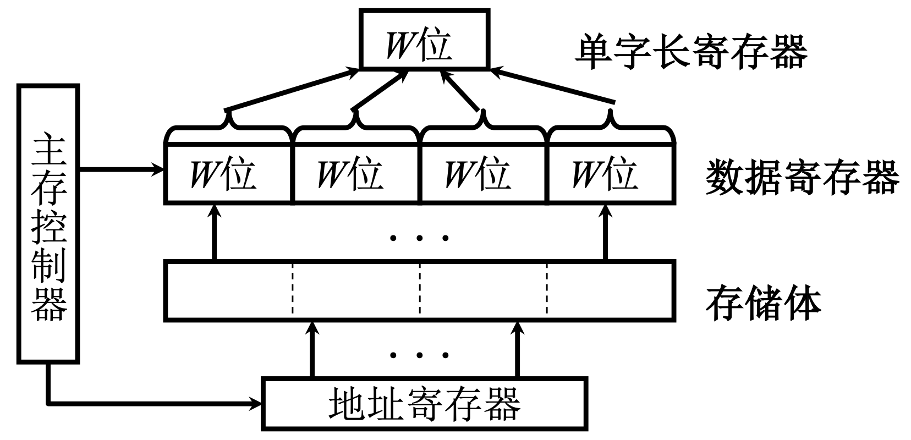

  - 多体并行系统

    - **高位交叉**  顺序编址 `体号 + 体内地址` 存储器容量扩展

      **适用于存储器的扩展**

      缺点：由于采用顺序编址，程序按照顺序执行，会造成摸一个存储器过于繁忙，其余空闲。

      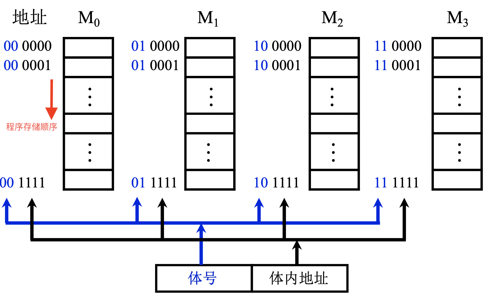

    - **低位交叉** 各个体轮流编址 `体内地址 + 体号`

      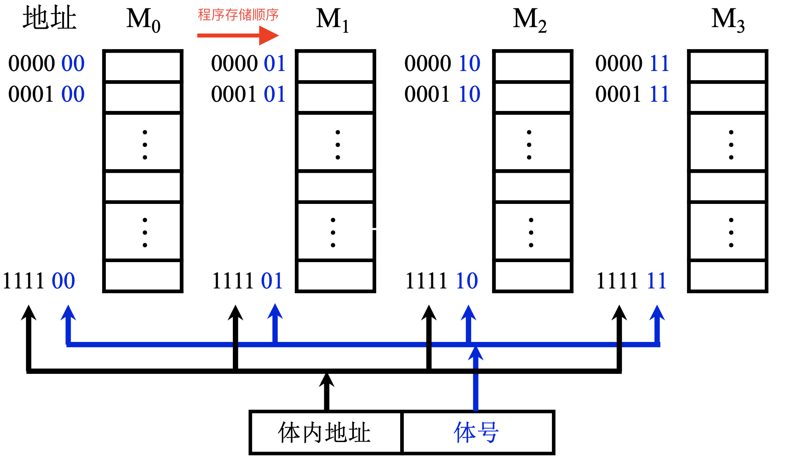

      ​	特点：不改变存取周期的前提下，增加存储器带宽和访问速度 (联系 分离式通信)

      ​	存取周期为T，总线传输周期 为τ，为实现流水线方式存取，应满足 T = 4τ。

      ​	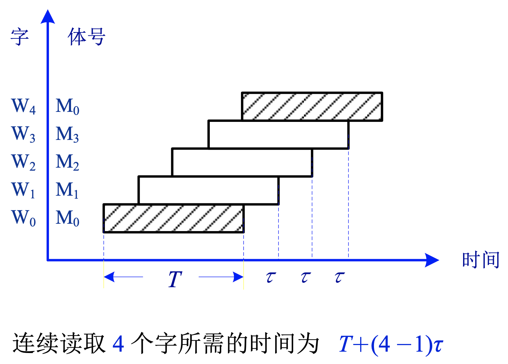

## 总结&参考

存储器这一块的知识非常多，这篇文章也是拖了很久才总结撰写完毕。其后还包含Cache先关部分，由于篇幅较长所以决定拆分为另一篇写。这些知识都是重点，毕竟现在计算机是以存储器为核心。所以要反复复习和理解！

**[书籍]**

1.（荷）Andrew S.Tanenbaum,（美）Todd Austin.计算机组组成结构化方法 Structured Computer Organization[M].机械工业出版社:北京,2014.7

**[网站]**

1. https://blog.csdn.net/weixin_46654114/article/details/105812651

2. https://www.bilibili.com/video/BV1ix41137Eu?p=20