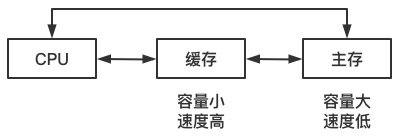
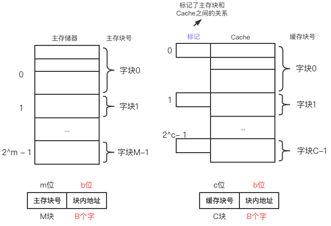
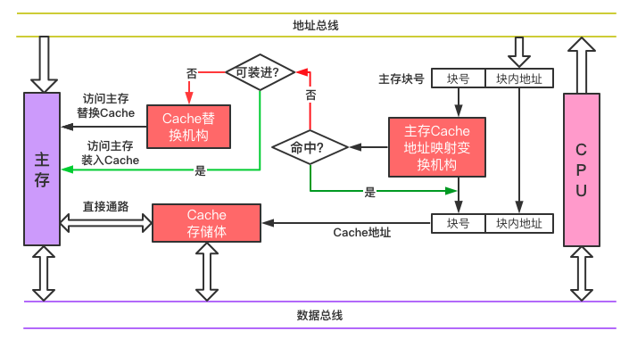
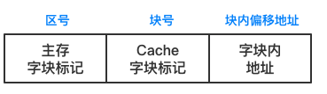
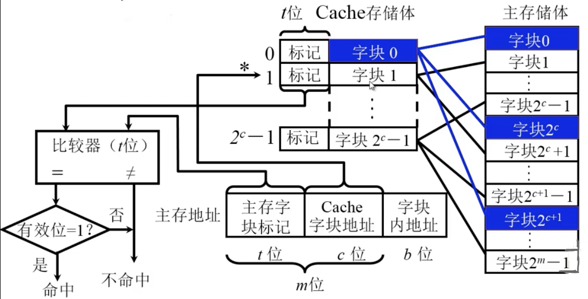
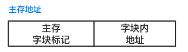
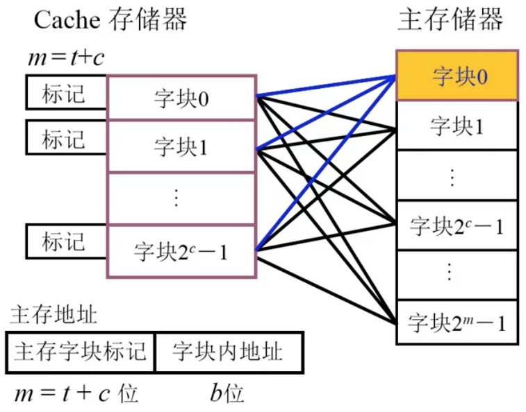
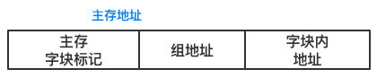
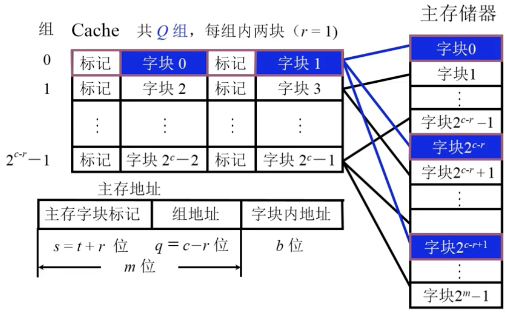

# 存储器(二)

## 3.3高速缓冲器

### 概述

> 问：为什么使用高速缓冲器？
>
> 答：避免CPU”空等”现象，CPU和主存（DRAW）的速度差异
>
> 

#### Cache工作原理

##### 主存和缓存的编址

特点：

- **主存和缓存按块存储**
- **块的大小相同**（也就是从内存往Cache拷贝时，是一整块进行传送，并且块中字节的顺序不会发生变化）

##### 命中与未命中

- 缓存共有C块
- 主存共有M块 M>>C

***命中*** 

> 主存块 **调入** 缓存
>
> 主存块与缓存块 **建立** 了对应关系
>
> 用  **标记记录** 与某缓存块建立了对应关系的 **主存块号**
>

***未命中***

> 主存块 ***未调入*** 缓存
>
> 主存块与缓存块 **未建立** 对应关系

##### Cache的命中率

- CPU欲访问的信息在Cache中的比率

- ***命中率*** 与 Cache的 ***容量*** 与 ***块长*** 有关

- 一般每块可取4~8个字

- **块长取一个存取周期内从主存调出的信息长度**

##### Cache-主存系统的效率

效率e 与 命中率有关

​			$$ e = { 访问Cache时间 \over 平均访问时间 } \times 100\% $$

设Cache 命中率为 h，访问Cache的时间为$t_c$ ，访问主存的时间为$t_m$ 则

​		$$ e = { t_c \over h \times t_c + (1-h) \times t_m } \times 100\% $$

#### Cache的基本结构

> **映射机构**：完成了主存当中的一个块在Cache当中的查找操作。
> **替换机构**：主存的块可以放到缓存那些块当中。

### Cache-主存的地址映射

#### 直接映射

##### CPU 地址格式

##### 方式

存储体任何区的 **第一块**（以Cache的长度分区），**只能**放到Cache存储体的 **第0块**，以此类推。

##### 缺点

直接映射（不灵活）：某一 主存块只能固定映射到某一缓存块。cache利用率低。

#### 全相联映射

##### CPU 地址格式

##### 方式

全相联映射：某一主存块能 映射到任一缓存块

##### 缺点

- 比较位数多（确定是否在Cache中存在） 

- 电路复杂 

- 效率低，速度慢
- 成本高

#### 组相联映射

##### CPU 地址格式

##### 方式

- Cache分成多少组，主存储器中每一个区就有多少块
- 映射时候，主存储器中每个区的第0块，可以放在Cache中第0组（直接映射）任何位置（全相联映射），以此类推。**也就说每个块在主存区里的编号，直接决定了它在Cache中是哪个组。**

**某一 主存块只能映射到某一缓存组中的存储块当中**

#### 三种映射方式在多层次Cache中的选择

- 靠近CPU的Cache层次，要求高速度。可以采用 **直接相联** 或 **路数较少的组相联**
- 中间层次的Cache层次。可以采用 **组相联**。
- 距离CPU最远。我们对Cache速度的要求较低，对利用率要求较高。可以采用 **全相联**。

### 替换算法

Cache中没有位置可以装入新的块，需要替换算法选择哪一个Cache块从Cache中退出。

1. **先进先出（First-In-First-out,FIFO）**算法。
2. **近期最少使用（Least Recently Used,LRU）**算法。

## 3.4辅助存储器（外部存储器）

> 特点：不直接与CPU交换信息
> 与主存一起组成了存储器系统的主存-辅存层次

## 总结&参考

至此存储器中主存储器，Cache，辅助存储器总结完毕。正如之前所说，涉及的知识点非常多，需要反复的复习。

**[书籍]**

1.（荷）Andrew S.Tanenbaum,（美）Todd Austin.计算机组组成结构化方法 Structured Computer Organization[M].机械工业出版社:北京,2014.7

**[网站]**

1. https://blog.csdn.net/weixin_46654114/article/details/105812651

2. https://www.bilibili.com/video/BV1ix41137Eu?p=20

