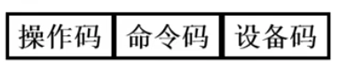
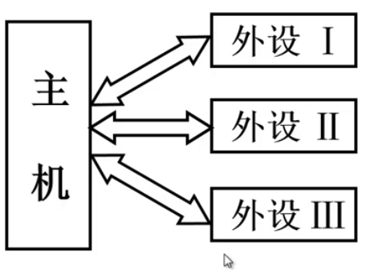
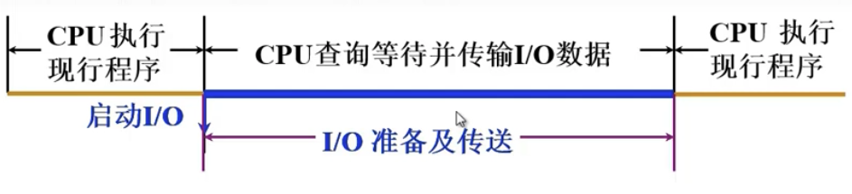
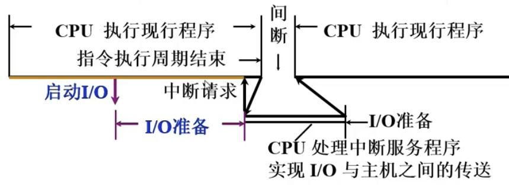
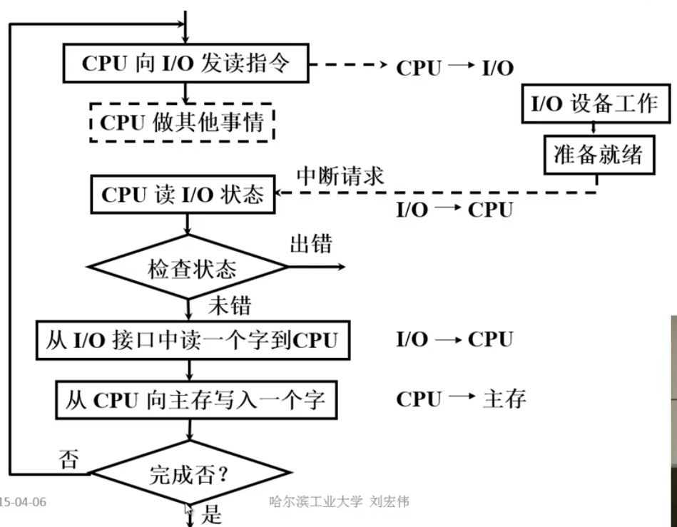
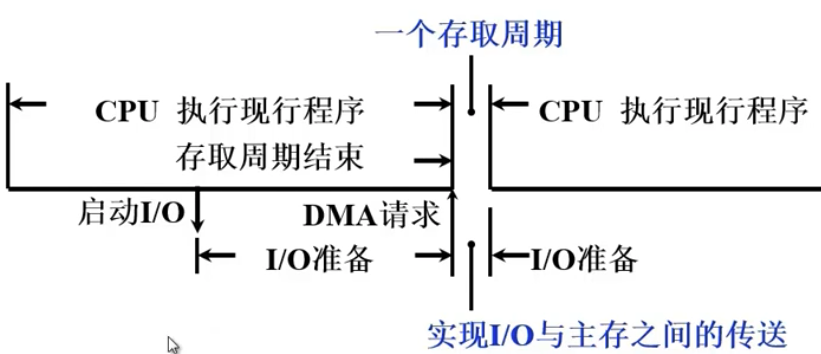
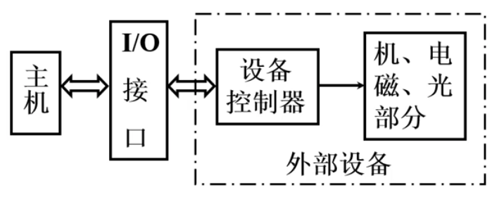
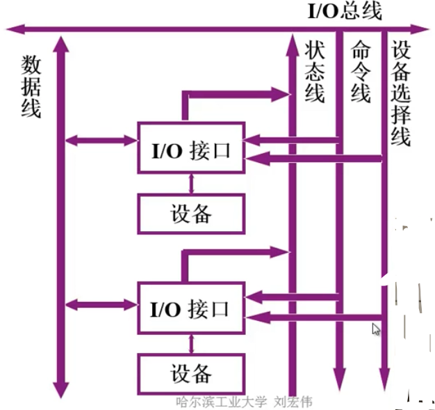

# 输入输出系统

## 5.1 概述

### 输入输出系统的发展概括

#### 1.早期

- ***分散连接***

- CPU 和 IO设备 **串行**工作 
- 程序查询方式

#### 2.接口模块和DMA阶段

- ***总线连接***

- CPU 和 IO 设备 **并行**工作

- 中断方式，**DMA**方式

#### 3.具有通道结构的阶段

**通道**：可以简单看做一个小型的处理器

#### 4.具有IO处理机的阶段

### 输入输出系统的组成

#### 1. IO软件

**`IO 指令`** **CPU**指令的一部分

- **操作码**：相当于IO指令的标志，它表示这样的操作码是IO指令
- **命令码**：相当于CPU中普通指令的操作码，它指出对IO设备做什么操作
- **设备码**：IO设备的地址，或IO设备中某一个寄存器的地址

**`通道指令`** 通道自身的指令

指出数组的首地址，传送字数，操作命令

#### 2.IO硬件

IO设备， IO接口，设备控制器（通道方式），通道

### IO设备与主机的联系方式

#### 1. IO设备编址方式

1. **统一编址**：把IO设备的地址看做是内存地址的一部分 *（用存数，取数指令）*
2. **不统一编址(单独编址)**：在内存地址空间之外，专门设置额外的地址空间 *（有专门的IO指令）*

#### 2. 设备选址

用**设备选择电路**识别是否被选中

#### 3. 数据传送方式

(1) **串行** 传输速度慢，适合远程传输

(2)  **并行** 同时有多位数据在数据线上传输，数据线有多条

#### 4. 联络方式

1. **立刻响应**
2. **异步工作采用应答信号**
   - 并行
   - 串行
3. **同步工作采用同步时标**

#### 5. IO设备与主机的连接方式

1. **辐射式连接**（分散连接）

​	*不便于增删设备*

2. **总线连接** 外部设备通过接口与主机连接

   *便于增删设备*

### IO设备与主机信息传送的控制方式

#### 1. 程序查询方式

CPU 和IO**串行**工作 踏步等待

#### 2.程序中断方式

**中断**：CPU在执行程序过程中，如果发生意外事件或者特殊事件，CPU需要中断当前程序的处理执行，通过执行中断程序的方式去处理这些异常和特殊事件。处理结束后，要返回到被中断的程序的程序断点，继续执行原来的程序。

对程序查询方式的改进，将IO工作分为两个阶段

- **自身准备** : CPU不查询
- **与主机交换信息**： CPU暂停现行程序

**优点:**

- CPU 和 IO部分的并行工作

- 没有踏步等待现象
- 中断现行程序

**缺点：**

- 仍然需要CPU的参与
- 对于中断时，需要保护当前执行程序的现场（相当于打断点），中断服务程序执行完毕后，需要恢复现场（恢复断点）需要时间。
- 若外部设备与内存主机传入数据非常少，可能需要即使条指令完成现场的保护和恢复，消耗CPU资源

**程序中断方式流程**

### 3.DMA方式

- 主存和IO之间有一条**直接数据通道**

- **不中断**现行程序

- 周期挪用（周期窃取）

- CPU和IO**并行**工作

## 5.2 IO设备

- **输入设备**
  - 键盘，鼠标...
- **输出设备**
  - 显示器
  - 打印机

### 5.3 IO接口

#### 1. 功能

- 选址功能
- 传送命令
- 传送数据
- 反应设备的状态

#### 2.总线连接方式的IO接口电路

## 总结&参考

至此输入输出系统模块已经总结完毕。本章中主要总结了现代计算机中IO部分的知识，重点在于IO与主机传送信息的方式。

**[网站]**

1. https://blog.csdn.net/weixin_46654114/article/details/105812651

2. https://www.bilibili.com/video/BV1ix41137Eu?p=20

