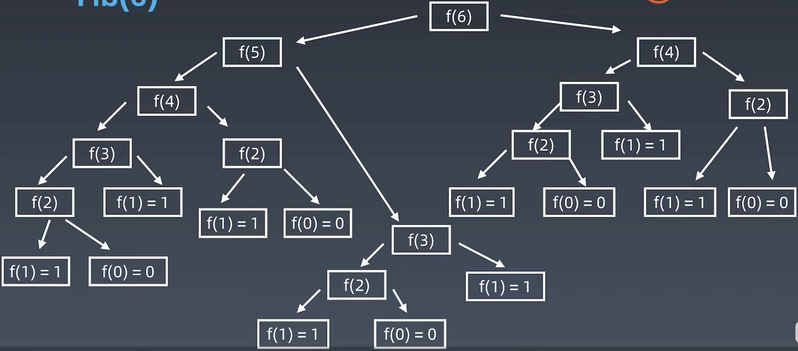
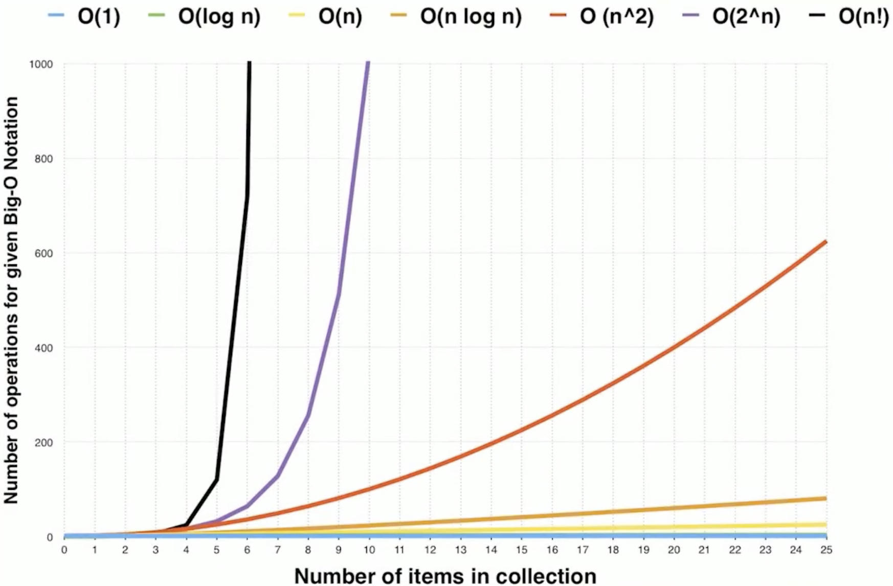

# 算法和数据结构-01

### 时间复杂度（Big O notation）

> 常见时间复杂度

* ##### $O(1)$ Constant Complexity 常熟复杂度

* ##### $O(log n)$ Logarithmic Complexity 对数复杂度

* ##### $O(n)$ Linear Complexity 线性时间复杂度

* ##### $O(n^2)$ N square Complexity 平方

* ##### $O(n^3)$ N square Complexity 立方

* ##### $O(2^n)$ Exponential Growth 指数

* ##### $O(n!)$Factorial 阶乘

> 注意：只看最高复杂度的运算


### 如何计算时间复杂度？

> #### 最常见的方法就是看一段代码根据n的不同情况会运行多少次

```java
int n = 1000;
System.out.println(n);

---------------------------------

int n = 1000;
System.out.println(n);
System.out.println("hey" + n);
System.out.println("yes" + n);
```

 以上的两端代码的时间复杂度都是 $O(1)$ ,因为无论n为多少，打印只执行一次

```java
for(int i = 1; i <= n; i++){
	System.out.println(i);
}
```

这一段代码中，这个loop的执行次数是根据我们n是几来判断的，所以时间复杂度是 $O(n)$

````java
for(int i = 1; i <= n; i++){
	for(int j = 1; j <= n; j++){
		System.out.println(j);
	}
}
````

这一段代码中，是一个嵌套循环，也就是第一次循环每执行一次，第二层循环都会执行n次，所以最后一共执行了n^2次，对应的时间复杂度是 $O(n^2)$

```java
for(int i = 1; i <= n; i = i*2){
	System.out.println(i);
}
```

这一段代码中，i每执行一次都会变为原来的2倍，也就是如果n = 100，i执行50次，所以时间复杂度为 $O(log (n))$


```java
int fib(int n){
	if(n <=2) return n;
	return fib(n-1) + fib(n-2);
}
```

这一段代码是一个递归函数，也就是求解斐波那契数列，可以看到递归求解的时间复杂度是 **O(k^n)**,其中k为常数。也就是一个指数级的增长


> ### 递归程序时间复杂度 -> 递归树
>
> 
>
> 每展开一层，是原来的两倍也就是2^6


### 时间复杂度曲线



> #### 可以看到n在10以内时间复杂度对应的操作都是差不多的，但是一旦n变大时，对应的函数的递增是天壤之别的


### 应用程序中常见算法

|       算法       |          表达式           |    运行时    |
| :--------------: | :-----------------------: | :----------: |
|     二分查找     |  $T(n) = T(n/2) + O(1)$   |  $O(log n)$  |
|    二叉树遍历    |  $T(n) = 2T(n/2) + O(1)$  |    $O(n)$    |
| 二维有序矩阵查找 | $T(n)=2T(n/2) + O(log n)$ |    $O(n)$    |
|     归并排序     |  $T(n) = 2T(n/2)+ O(n)$   | $O(n log n)$ |

> Tip: 二叉树的中序、前序、后序：时间复杂度是多少？
>
> 无论是按照什么顺序遍历，所有的节点都应该执行一次，所以时间复杂度是 $O(n)$

