# 算法和数据结构-02


## 数组、链表、跳表


### 数组

```
int a[100]; //java

let a = [1,2,3] //javascript
```

数组的底层实现：

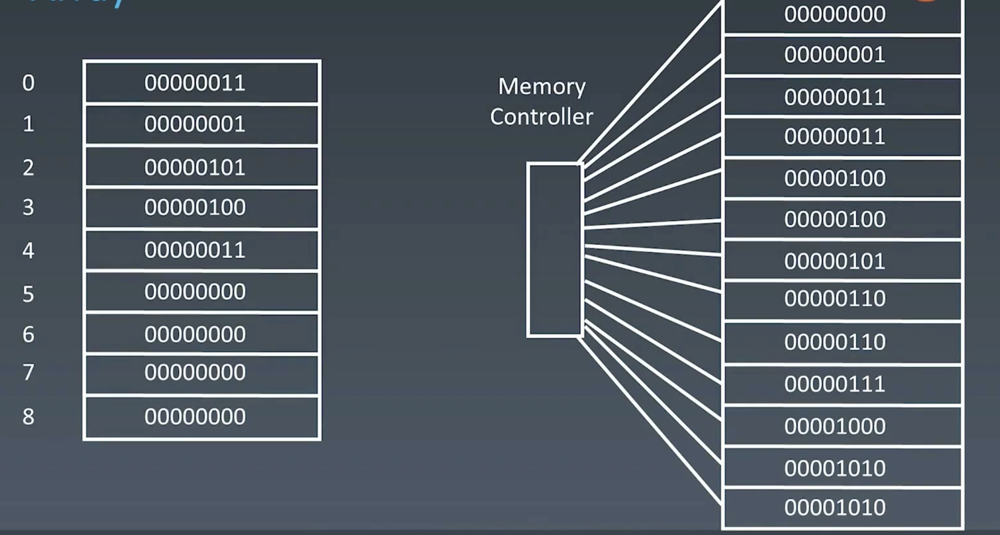

> #### 每当声明一个数组，计算机就会在内存开辟一段连续的内存用于存放该数组，通过内存管理器进行访问


#### 访问元素

时间复杂度 $O(1)$


#### 添加元素

时间复杂度 $O(n)$

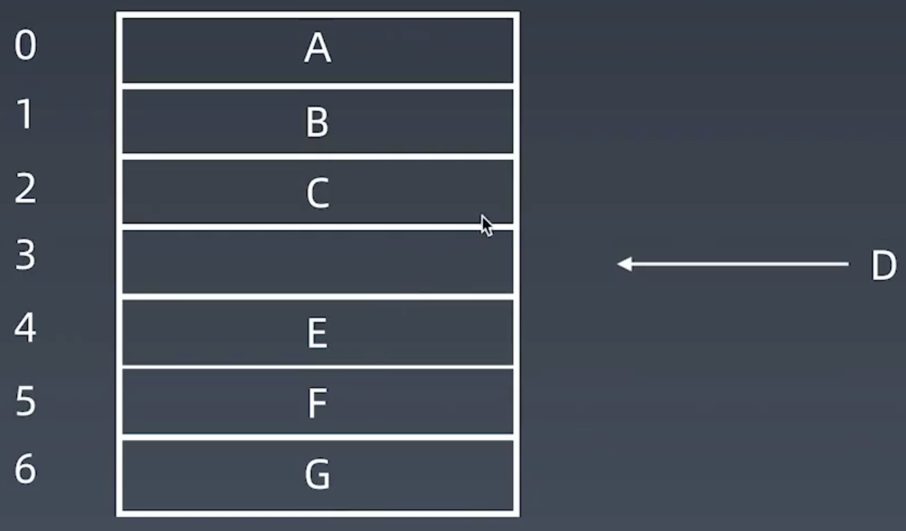


#### 删除元素

时间复杂度 $O(n)$

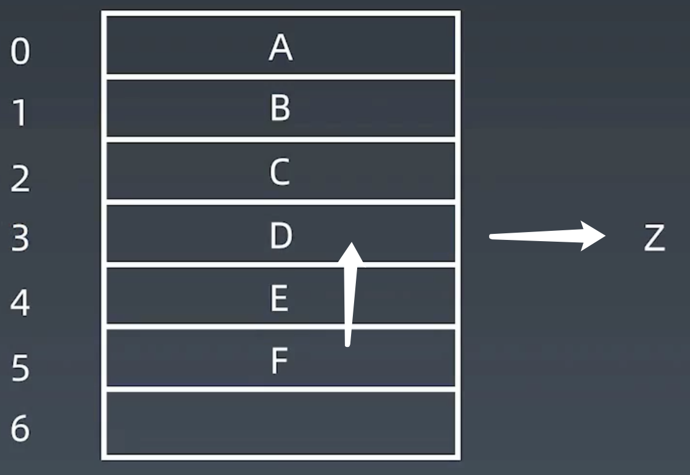


### 链表

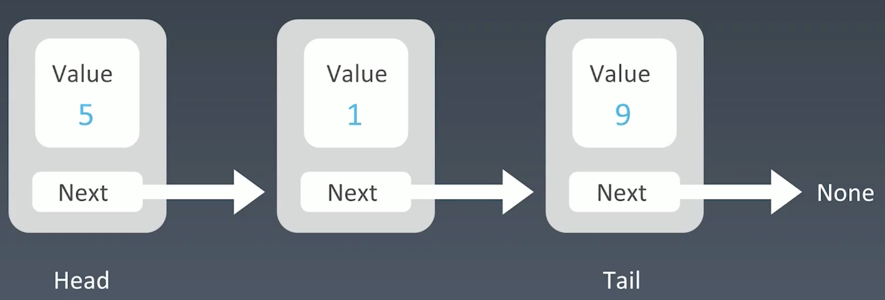


#### 访问元素

时间复杂度 $O(n)$


#### 添加元素

时间复杂度 $O(1)$

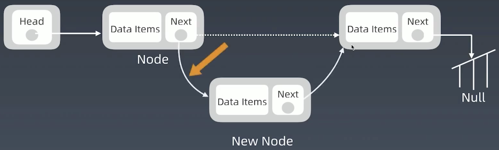


#### 删除元素

时间复杂度 $O(1)$

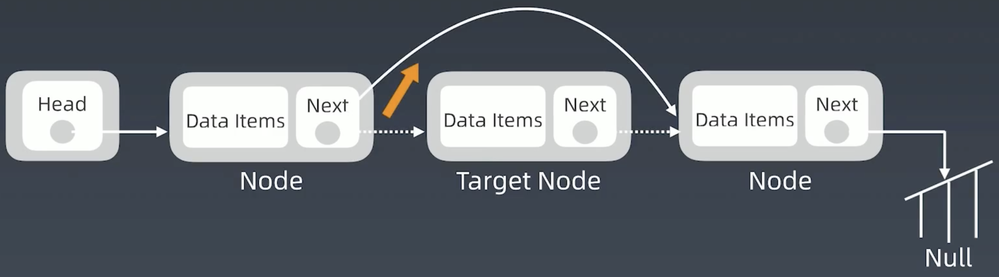


### 跳表

> #### 如何给链表的访问加速？
>
> #### **升维**  -> 添加指针


#### 添加一级索引

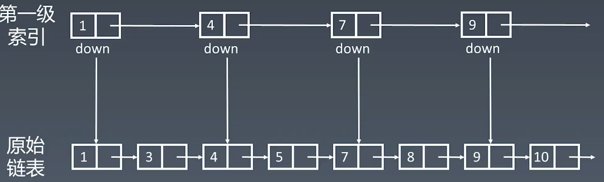

原始链表每次遍历都是走next，一级索引每次都是next+1


#### 添加二级索引

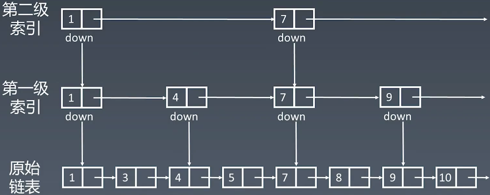


#### 增加多级索引

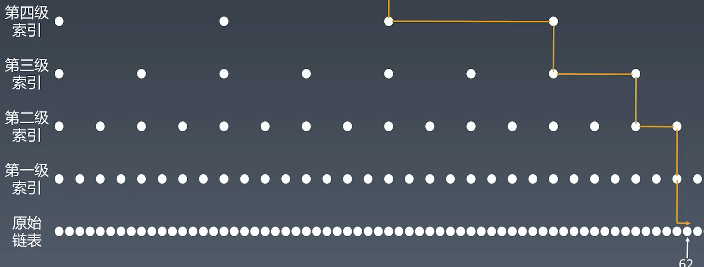


#### 跳表查询的时间复杂度分析

n/2、n/4、n/8、第k级索引结点的个数是n/(2^k)

假设索引有h级，最高级的索引有2个结点。n/(2^h) = 2,从而求得h = log2(n)-1,所以复杂度为 $O(log (n))$

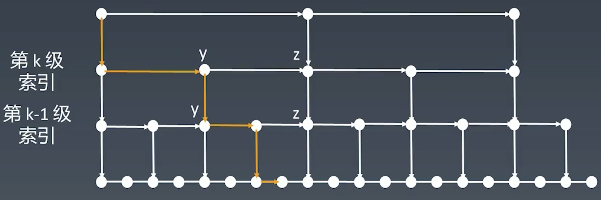


#### 跳表的空间复杂度分析

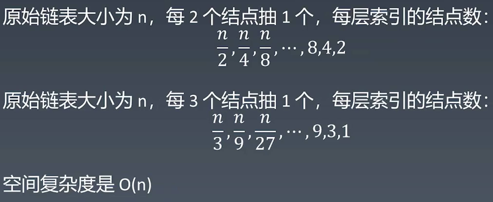


### 工程中的运用

#### [LRU缓存算法](https://www.jianshu.com/p/b1ab4a170c3c)

#### [Redis 跳跃表](https://redisbook.readthedocs.io/en/latest/internal-datastruct/skiplist.html)

#### [为啥 redis 使用跳表而不是使用red-black?](https://www.zhihu.com/question/20202931)

