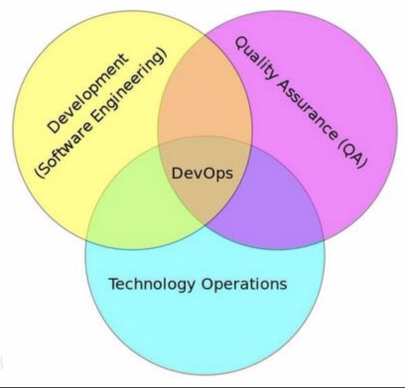

# Devops

## What is the DevOps?

> #### **DevOps** is a set of practices that combines [software development](https://en.wikipedia.org/wiki/Software_development) (*Dev*) and [information-technology operations](https://en.wikipedia.org/wiki/Information_technology_operations) (*Ops*) which aims to shorten the [systems development life cycle](https://en.wikipedia.org/wiki/Systems_development_life_cycle) and provide [continuous delivery](https://en.wikipedia.org/wiki/Continuous_delivery) with high [software quality](https://en.wikipedia.org/wiki/Software_quality).
>
> ——from wiki

## 什么是DevOps?

> #### **DevOps**（**Dev**elopment和**Op**erations的组合词）是一种重视“软件开发人员（Dev）”和“IT运维技术人员（Ops）”之间沟通合作的文化、运动或惯例。透过自动化“软件交付”和“架构变更”的流程，来使得构建、测试、发布软件能够更加地快捷、频繁和可靠。
>
> —来自维基百科

**本模块重点关注devops文化中的重要实践,如何高效集成自动化运维等**

