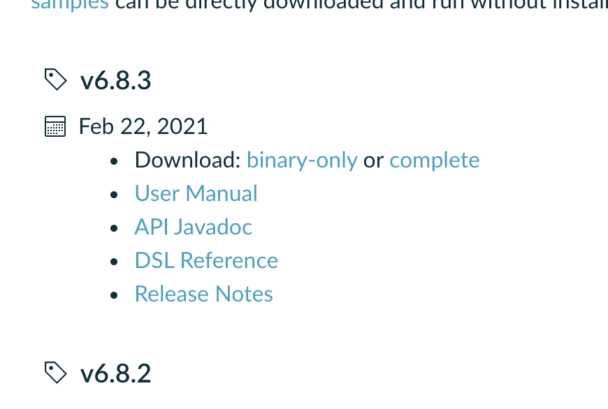
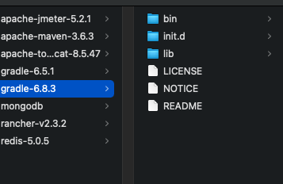
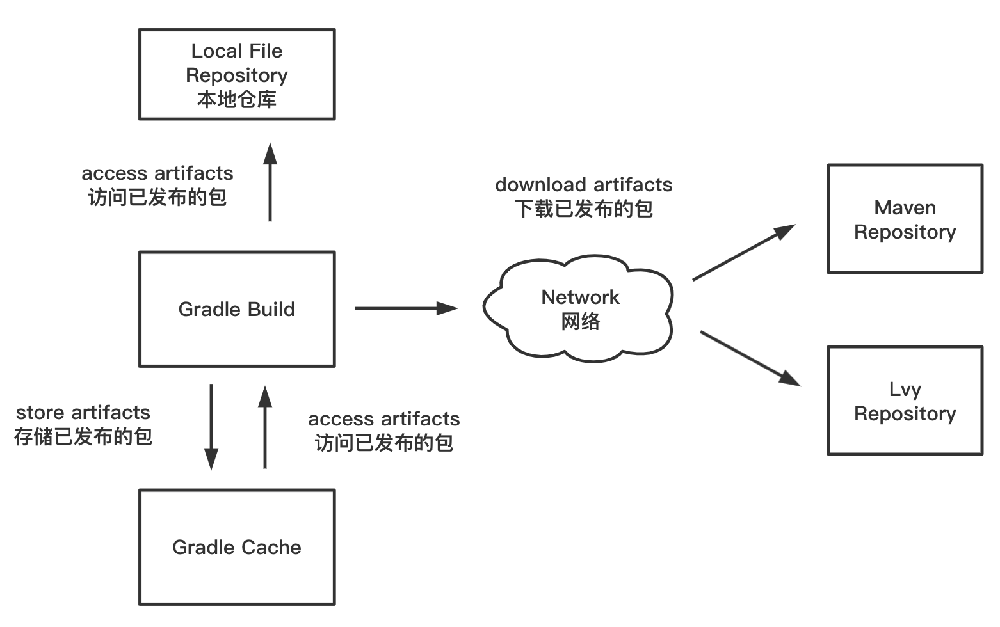
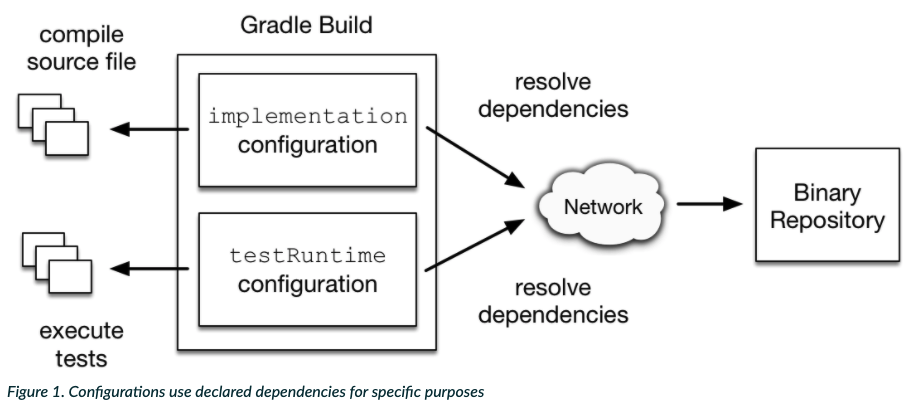
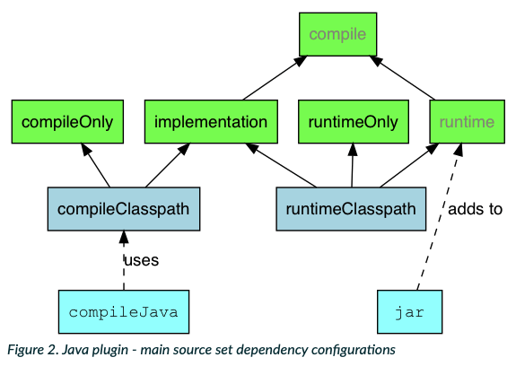
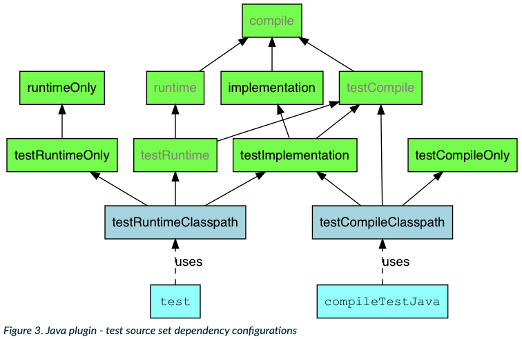

# Gradle


## 前言

Java生态体系中有三大构建工具：`Ant`、`Maven`和 `Gradle`. Gradle 算的上是后起之秀, 在Ant已经销声匿迹, Maven 称为行业标准的时候。它吸收了 Maven 和 Ant 的优点, Ant显得冗余复杂，抛弃了Maven 的基于XML的繁琐配置, 取而代之的是采用了领域特定语言Groovy的配置, 大大简化了构建代码的行数. 特点明显: 简洁、灵活、可读性强。


### **特性**

- 按约定声明构建和建设；
- 强大的支持多工程的构建
- 强大的依赖管理（基于Apache ivy），提供最大的便利去构建工程
- 权利支持已有的Maven或者lvy仓库基础建设
- 支持传递性依赖管理，在不需要远程仓库和pom.xml 和 ivy配置文件的前提下；
- 基于groovy脚本构建，其 build 脚本使用groovy语言编写
- 具有广泛的领域模型支持构建；
- 深度API
- 易迁移
- 自由开源源码


## 安装

### 前提

已经安装 `jdk8` 及以上的java环境, 可以使用命令 `java -version`:


### 手动安装

**1.** 前往[官网](https://gradle.org/releases/)**下载最新的Gradle版本**



- Binary-only: 已经编译好的二进制文件
- Complete: 包含源码


2. **解压文件**后得到如下的文件目录结构



**3. 配置环境变量**

```bash
code ~/.bash_profile #使用vscode的code命令打开bash_profile文件
```

3.1 拷贝之前解压的gradle的目录，例如

```bash
/Users/lomofu/Documents/util/gradle-6.8.3
```

3.2 写入到`.bash_profile`文件中，保存

```bash
export GRADLE_HOME=/Users/lomofu/Documents/util/gradle-6.8.3
# ...其他path配置
export PATH=${PATH}:$GRADLE_HOME/bin
```

这里我起名叫`GRADLE_HOME`, 并且在PATH中指定`GRADLE_HOME/bin`。你也可以在GRADLE_HOME中写完整到bin目录下，总之就是别忘了

4. source `.bash_profile`文件生效

```bash
source ~/.bash_profile
```

5. 测试是否安装成功，在终端执行

```bash
gradle -v
```

如果得到以下返回信息，gradle已经手动安装成功了，和maven的安装类似都非常简单

```bash
------------------------------------------------------------
Gradle 6.5.1
------------------------------------------------------------

Build time:   2020-06-30 06:32:47 UTC
Revision:     66bc713f7169626a7f0134bf452abde51550ea0a

Kotlin:       1.3.72
Groovy:       2.5.11
Ant:          Apache Ant(TM) version 1.10.7 compiled on September 1 2019
JVM:          14.0.2 (Oracle Corporation 14.0.2+12-46)
OS:           Mac OS X 10.16 x86_64
```

其他的安装方式，如mac的brew等，可以前往[官网的文档](https://docs.gradle.org/current/userguide/installation.html)查看


## 构建脚本

Gradle构建脚本文件用来处理两件事情： 一个是**项目** , 另外一个就是**任务**。

每一个Gradle生成表示一个或者多个项目。 简单来说一个项目是由不用的任务组成。一个任务是指构建执行的一块工作。任务可能是编译一些类，创建一个jar，产生的javadoc或者发布一些归档文件库。


### 简单编写构建脚本

Gradle提供一个域特定语言(DSL)，用于描述构建。它使用Groovy语言，使其更容易来形容和构建。Gradle中的每一个构建脚本使用UTF8进行编码保存，并命名为`build.gradle`.

**目标**：在控制台输出 hello this is a gradle project。

**步骤**：

1. 创建`build.gradle`文件

```bash
> touch build.gradle
```

2. 编写脚本

```groovy
task helloGradle{
    doLast{
        println "hello this is a gradle project"
    }
}
```
>脚本中定义了一个任务名称为 `helloGradle`，这个任务用来打印字符串


3. 在`build.gradle` 所在的目录下执行，得到:

```bash
> gradle -q helloGradle
hello this is a gradle project
```

> **-q / —quiet**: 表示静默模式运行（quiet）,只会打印错误日志


### 简单实用Gradle中的API

1. 在`build.gradle`文件中，定义一个任务

```groovy
task strApi{
    doLast{
        String expStr = 'hello'
        println "original: $expStr"
        println "upper: ${expStr.toUpperCase()}"
    }
}

task count{
    doLast{
      	//循环0-3
        4.times{
            println "$it"
        }
    }
}
```

书写方式与java十分类似

2. 分别执行task, 得到

```bash
> gradle -q strApi
original:hello
upper:HELLO

----------------

> gradle -q count      
0
1
2
3
```


### build的三个阶段

gradle构建的生命周期主要为三个阶段: `Initialization`, `Configuration`, `Execution`

- **Initialization**: Gradle支持单个或者多个工程的构建。在initialization阶段，Gradle决定哪些工程将参与当前构建过程，并为每一个这样的工程创建一个**Project**实例。一般情况下，参与构建的工程信息将在`settings.gradle`中定义

  

- **Configuration**: 在这一阶段，配置**project**实例。所有工程的构建脚本都会被执行。**Task**, **configuration**和许多其他的对象将被创建和配置。

  

- **Execution**: 在之前的**configuration**阶段，**task**的一个子集被创建并配置。这些子集来自于作为参数传入gradle命令的task名字，在execution阶段，这一子集将被依次执行。


> 问：doLast语句处于哪个阶段
>
> 是在**Execution**阶段执行，如果task中没有使用doLast包裹，那么其代码是在**Configuration**阶段执行


**例子**：

1.创建`settings.gradle`文件，并写入：

```bash
> echo "rootProject.name = 'basic'
println 'This is executed during the initialization phase (setting.gradle).'">> settings.gradle
```

2.修改`build.gradle`文件如下：

```groovy
println 'This is executed during the configuration phase (build.gradle).'

task configured {
    println 'This is also executed during the configuration phase.'
}

task test {
    doLast {
        println 'This is executed during the execution phase.'
    }
}

task testBoth {
	doFirst {
	  println 'This is executed first during the execution phase.'
	}
	doLast {
	  println 'This is executed last during the execution phase.'
	}
	println 'This is executed during the configuration phase as well.'
}
```

```bash
> gradle -q test testBot

# Initialization
This is executed during the initialization phase (setting.gradle).

# Configuration
> Configure project :
This is executed during the configuration phase (build.gradle).
This is also executed during the configuration phase.
This is executed during the configuration phase as well.

# Execution
> Task :test
This is executed during the execution phase.

> Task :testBoth
This is executed first during the execution phase.
This is executed last during the execution phase.

BUILD SUCCESSFUL in 475ms
2 actionable tasks: 2 executed
```


## Gradle任务

Gradle构建脚本描述一个或者多个项目，每个项目都由不同的Task组成。

Task 是**构建执行的一项工作**，可以编译一些类，将类文件存储到单独的目标文件，创建JAR, 生成javaDoc或将一些归档发布到存储库。


### 定义Task

**task**是用于将任务定义到构建脚本中的关键字。

`build.gradle`

```groovy
tasks.register('hello') {
    doLast {
        println 'hello'
    }
}

task taskDec

tasks.register('copy', Copy) {
    from(file('srcDir'))
    into(buildDir)
}
```


### 任务依赖

我们也可以声明任务依赖于其他任务，例如：

```groovy
task taskDec{
    dependsOn tasks.helloGradle
    doLast{
        println "done"
    }
}

//----------------另外一种写法

task taskDec(dependsOn:helloGradle){
  doLast{
    println "done"
  }
}


//----------------闭包写法(比如依赖一系列方法)

taskDec.dependsOn{
  tasks.findAll{
    task-> task.name.startsWith('lib')
  }
}

task lib1{
  doLast{
    prinln "lib1"
  }
}


task lib2{
  doLast{
    prinln "lib1"
  }
}


task lib3{
  doLast{
    prinln "lib1"
  }
}
```

```bash
> gradle -q taskDec
hello this is a gradle project
done

-----------闭包结果--------
> gradle -q taskDec
lib1
lib2
lib3
done
```

**懒加载** Lazy dependsOn： 其他任务不存在，或者还没有时

```groovy
task A {
    dependsOn 'B'
    do Last{
        println "this is A"
    }
}

task B {
    doLast{
        println "this is B"
    }
}
```

```bash
> gradle -q A
this is B
this is A
```

任务A 依赖于任务B， 但是任务B 可能在任务A之后才被声明。但是仍然可以执行成功


> task之间能否相互依赖？
>
> `build.gradle`
>
> ```groovy
> task taskX(dependsOn: taskY){
> 	println 'this is taskX'
> }
> 
> task taskY(dependsOn: taskX){
> 	println 'this is taskY'
> }
> ```
>
> ```bash
> > gradle -q taskY
> FAILURE: Build failed with an exception.
> 
> * Where:
> Build file '/Users/lomofu/Documents/project/demo/gradle/myapp/build.gradle' line: 66
> 
> * What went wrong:
> A problem occurred evaluating root project 'basic'.
> > Could not get unknown property 'taskY' for root project 'basic' of type org.gradle.api.Project.
> 
> * Try:
> Run with --stacktrace option to get the stack trace. Run with --info or --debug option to get more log output. Run with --scan to get full insights.
> 
> * Get more help at https://help.gradle.org
> ```
>
> 答： 任务间不能相互依赖


### 定位Task

我们经常需要查找我们已经定义的任务在一个构件文件中，例如，我们需要配置这个任务，或者使用这个任务作为依赖。有好几种方法定位任务。

1. **使用`tasks`集合来定位。**

   通常，任务们都可以通过`tasks`集合得到，例子如下：

```groovy
tasks.register('taskLocate')
tasks.register('taskLocate1')

println tasks.named('taskLocate').get().name
println tasks.taskLocate1.name
```

```
> gradle -q
taskLocate
taskLocate1
```


### 安排任务顺序

在有一些情况下，我们需要有严格的先后执行顺序，但是我们并没有声明精确的依赖关系。当然两者的区别在于，任务依赖不会影响任务的执行，只是安排先后的执行顺序而已。

`build.gradle`

```groovy
def taskX = tasks.register('taskX') {
    doLast {
        println 'taskX'
    }
}
def taskY = tasks.register('taskY') {
    doLast {
        println 'taskY'
    }
}
taskY.configure {
    mustRunAfter taskX
}
```

```bash
> gradle -q taskDec
lib1
lib2
lib3
done
```


### 添加任务描述

可以向任务添加描述，执行Gradle任务时会显示此描述。

`build.gradle`

```groovy
tasks.register('taksDesc') {
   description 'this is a task of description'
}
```


### 跳过任务

Gradle提供多种方式跳过一个任务的执行

1. **使用谓词跳过**

```groovy
def hello = tasks.register('hello') {
    doLast {
        println 'hello world'
    }
}

hello.configure {
    onlyIf { !project.hasProperty('skipHello') }
}
```

```bash
> gradle hello -PskipHello

BUILD SUCCESSFUL in 490ms
```

2. **使用`StopExecutionException`异常**

如果需要跳过的任务无法使用逻辑谓词来表示，我们可以使用这个`StopExecutionException`。如果这个异常在一个action中被抛出，那么其他将要执行的任务不会受到影响，但是会跳过这个任务。

`build.gradle`

```groovy
def compile = tasks.register('compile') {
    doLast {
        println 'We are doing the compile.'
    }
}

compile.configure {
    doFirst {
        // Here you would put arbitrary conditions in real life.
        if (true) {
            throw new StopExecutionException()
        }
    }
}
tasks.register('myTask') {
    dependsOn('compile')
    doLast {
        println 'I am not affected'
    }
}
```

```bash
> gradle -q myTask
I am not affected
```

3. **使用 `enable` flag**

每个任务都有一个 `enable`的标志位，并且默认是true。如果我们将其设置为false，那么就可以做到阻止一个任务的执行。

`build.gradle`

```groovy
def disableMe = tasks.register('disableMe') {
    doLast {
        println 'This should not be printed if the task is disabled.'
    }
}

disableMe.configure {
    enabled = false
}
```

```bash
> gradle disableMe
> Task :disableMe SKIPPED

BUILD SUCCESSFUL in 0s
```

4. **任务超时**

每一个任务都有一个 `timeout` 属性可以用来限制任务执行的时间。当一个任务达到了超时时间，任务执行的线程将会被打断。任务会被标记为失败。其他的任务还是会继续执行。如果我们使用`—continue`, 其他任务将会继续在这个任务后执行。

```groovy
tasks.register("hangingTask") {
    doLast {
        Thread.sleep(100000)
    }
    timeout = Duration.ofMillis(500)
}
```


## Gradle依赖管理

依赖管理主要由`项目依赖` 和 `项目发布`

1. **项目依赖** :  一般的大型工程都需要引入一切其他工程的文件来完成某项功能。比如我们如果需要Spring就得把它的类库加入进来。这些加载进来的文件就是工程的依赖。对于Gradle，我们需要告诉它工程的依赖是什么，它们在哪里。然后帮助你加入到工程中，依赖可能需要去远程库下载，比如 `Maven` 或者`lvy` 库。 也可以是本地库，甚至可能是另一个工程。我们称这个过程叫`依赖解决`。

   通常，依赖本身也有依赖。Gradle构建你的工程时候，会去找这些依赖。我们称之为`依赖解决`。

   

2. **项目发布**：大部分工程构建的主要目的脱离工程使用。例如，生成jar包，包括源代码，文档等，然后发布出去。这些输出的文件构成了项目的发布内容。Gradle 也会为你分担这些工作。你声明了发布到哪，Gradle 就会发布到哪。“发布”的意思就是你想做什么。比如，复制到某个目录，上传到 `Maven` 到 `lvy` 仓库。或者其他项目使用，这些都可以称之为 `发行`。




### 依赖声明

#### 声明依赖

`build.gradle`

```groovy
apply plugin 'java'

repositories {
  mavenCentral()
}

dependencies {
  compile group: 'org.hibernate', name:'hibernate-core',version: '5.4.2.Final'
  testCompile group : 'junit', name: 'junit', version: '5.+'
}
```


- 声明了 `Hibernate-core 5.4.2.Final.jar` 是编译期必需的依赖。并且与其关联的依赖也会一并被加载进来。
- 声明了 **项目测试阶段**是  `5.0`  版本以上的 `Junit`。
- 声明了 Gradle 可以去 `Maven`中央仓库去找这些依赖。


对比Maven

```xml
<dependencies>
        <dependency>
            <groupId>org.springframework.boot</groupId>
            <artifactId>spring-boot-starter-web</artifactId>
        </dependency>
        <dependency>
            <groupId>org.apache.commons</groupId>
            <artifactId>commons-lang3</artifactId>
            <version>3.11</version>
        </dependency>
</dependencies>
```


#### 什么是依赖配置？

Gradle 中依赖以组的形式来划分不同的配置，每个配置只有一组指定的依赖。我们称之为**依赖配置**。例如，一些依赖应该被用于编译源代码，剩余其他只在运行时才可以使用。





许多 `Gradle plugins` 预先在项目中配置。例如 `Java plugins`， 增加了许多源码编译时候需要的`classpaths`， 执行`tests` 和其他。







- **Compile**

  编译范围依赖在所有的classpaths 中可以使用，同时把它们打包

- **Runtime**

  `runtime`依赖在运行和测试系统时需要，但是在编译时候不需要。比如编译时只需要`JDBC API JAR`,而只在运行时候才需要`JDBC驱动`实现。默认情况下，还包括编译时依赖项。

- **testCompile**

  测试阶段需要的附加依赖。默认情况下，包括编译的产生的类和编译时的依赖。

- **testRuntime**

  测试运行期需要

  不同的插件提供了不同的标准配置，甚至可以定义自己的配置项。默认情况下，它包括运行时和测试编译依赖项


#### 外部依赖

依赖的类型有很多，其中一种类型称之为`外部依赖`。这种依赖由外部构建或者不同的仓库中，例如`Maven`中央仓库 或者 `Ivy`仓库中或者你的本地文件系统中的某个文件目录。


**定义外部依赖**

`build.gradle`

```groovy
dependencies {
	compile group: 'org.hibernate', name:'hibernate-core',version: '5.4.2.Final'
}
```

外部依赖包含 `group`， `name`， `version` 几个属性。根据选取的仓库不同， group 和 version也可能是可选的。

当然也可以更加简洁的方式来声明外部依赖。采用：将三个属性拼接在一起即可。**`group:name:version`**

```groovy
dependencies {
    compile 'org.hibernate:hibernate-core:3.6.7.Final'
}
```


#### 仓库

Gradle 会去仓库寻找所需要的外部依赖。仓库是一个按照 `group`， `name` 和 `version` 规则进行存储一些文件。 Gradle
可以支持不同的仓库存储格式，例如`Maven` 和 `Ivy`, 并且还提供了多种与仓库进行通信的方式，如通过 **本地文件系统** 或者 **HTTP**。

**使用Maven中央仓库**

```groovy
repositories {
    mavenCentral()
}
```

**使用Maven远程仓库**

```groovy
repositories {
    maven {
        url "http://repo.mycompany.com/maven2"
    }
}
```

**使用Ivy仓库**

```groovy
repositories {
    ivy {
        url "http://repo.mycompany.com/repo"
    }
}
```

**使用Ivy本地目录**

```groovy
repositories {
    ivy {
        // URL can refer to a local directory
        url "../local-repo"
    }
}
```

一个项目可以**采用多个库**，Gradle会按照顺序在各个仓库中寻找所需要的依赖文件，并且一旦找到第一个便停止搜索。


#### 打包发布

依赖配置也被用于发布文件，称之为打包发布或者发布。

插件对于打包提供了完美的支持，所以通常无需特别进行配置，但是如果需要发布，则需要在`uploadArchives`任务中添加一个仓库。

**发布到Ivy仓库**

```groovy
uploadArchives {
    repositories {
        ivy {
            credentials {
                username "username"
                password "pw"
            }
            url "http://repo.mycompany.com"
        }
    }
}
```

执行 `gradle uploadArchives`，Gradle便会构建并上传你的jar 包，同时生成`ivy.xml`一起上传到目标仓库。

**发布到Maven仓库**

```groovy
apply plugin: 'maven'
uploadArchives {
    repositories {
        mavenDeployer {
            repository(url: "file://localhost/tmp/myRepo/")
        }
    }
}
```

发布到Maven仓库时，需要Maven插件的支持。当然Gradle也会为你生成一个`pom.xml`一起上传到目标仓库


# Reference

1.https://www.w3cschool.cn/gradle/sh8k1htf.html

2.https://docs.gradle.org/current/userguide/declaring_dependencies.html