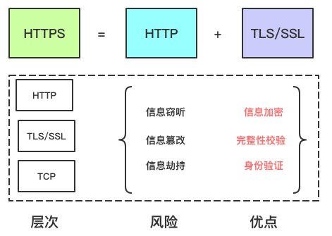
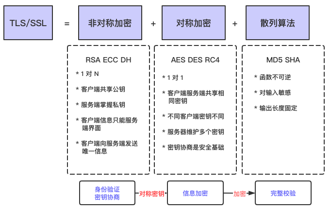
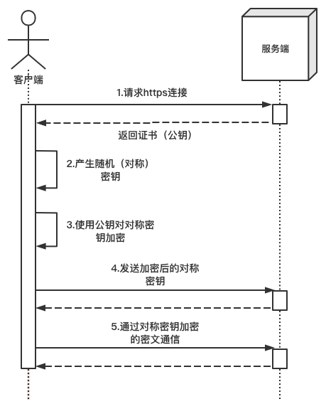
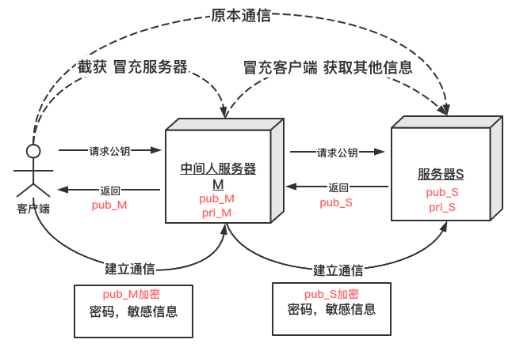
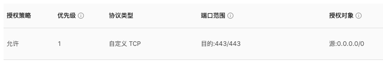
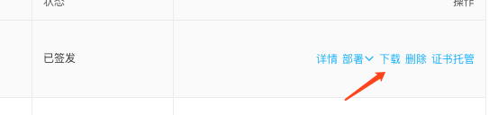
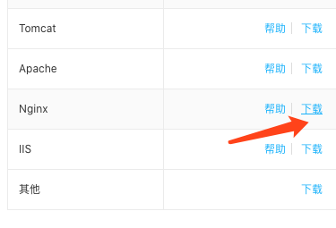
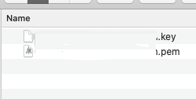
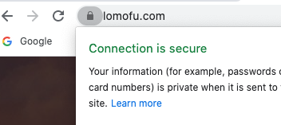

# [DevOps]如何在Docker的Nginx配置Https


## 什么是HTTPS?

> **超文本传输安全协议**（英语：**H**yper**T**ext **T**ransfer **P**rotocol **S**ecure，缩写：**HTTPS**；常称为HTTP over TLS、HTTP over SSL或HTTP Secure）是一种通过计算机网络进行安全通信的传输协议。HTTPS经由HTTP进行通信，但利用SSL/TLS来加密数据包。HTTPS开发的主要目的，是提供对网站服务器的身份认证，保护交换数据的隐私与完整性。这个协议由网景公司（Netscape）在1994年首次提出，随后扩展到互联网。
>
> —- wiki


简单总结就是

**HTTP+加密+认证+完整性保护 = HTTPS**





## TLS/SSL工作原理

> **TLS/SSL**的功能实现主要依赖于三类基本算法：散列函数 Hash、对称加密和非对称加密，其利用非对称加密实现身份认证和密钥协商，对称加密算法采用协商的密钥对数据加密，基于散列函数验证信息的完整性。





### 非对称加密

算法：RSA 、ECC 、HD

特点：密钥成对出现，一般称为**公钥(公开)**和**私钥(保密)**。公钥加密的信息只能私钥解开，私钥加密的信息只能公钥解开。因此掌握公钥的不同客户端之间不能互相解密信息，只能和掌握私钥的服务器进行加密通信，服务器可以实现1对多的通信，客户端也可以用来验证掌握私钥的服务器身份。


### 对称加密

算法：AES-CBC、DES、3DES、AES-GCM等

特点：相同的密钥可以用于信息的加密和解密，掌握密钥才能获取信息，能够防止信息窃听，通信方式是1对1; 


### 散列函数Hash

算法：MD5、SHA1、SHA256

特点：函数单向不可逆、对输入非常敏感、输出长度固定，针对数据的任何修改都会改变散列函数的结果，用于防止信息篡改并验证数据的完整性; 


### TLS/SSL工作方式

**客户端使用非对称加密与服务器进行通信，实现身份验证并协商对称加密使用的密钥， 然后对称加密算法采用协商密钥对信息以及信息摘要进行加密通信，不同的节点之间采用的对称密钥不同，从而可以保证信息只能通信双方获取。**





## 身份验证CA和证书

身份验证和密钥协商是TLS的基础功能，要求的前提是合法的服务器掌握着对应的私钥。但是RSA算法无法确保服务器身份的合法应，因此存在**中间人攻击**和**信息抵赖**。

### 中间人攻击

- 客户端C和服务器S进行通信，中间节点M截获了二者的通信;

- 节点M自己计算产生一对公钥pub_M和私钥pri_M;

- C向S请求公钥时，M把自己的公钥pub_M发给了C;

- C使用公钥 pub_M加密的数据能够被M解密，因为M掌握对应的私钥pri_M，而 C无法根据公钥信息判断服务器的身份，从而 C和 * M之间建立了"可信"加密连接;

- 中间节点 M和服务器S之间再建立合法的连接，因此 C和 S之间通信被M完全掌握，M可以进行信息的窃听、篡改等操作。

  



### 信息抵赖

服务器也可以对自己的发出的信息进行否认，不承认相关信息是自己发出。


### 身份验证CA和证书

- 解决上述身份验证问题的关键是确保获取的公钥途径是合法的，能够验证服务器的身份信息，为此需要引入权威的第三方机构CA。

- CA负责审核信息，然后对关键信息利用私钥进行"签名"，公开对应的公钥，客户端可以利用公钥验证签名。CA也可以吊销已经签发的证书。


## 实践部署

这里以我的个人网站的HTTPS部署实践为例。


### 1.开放端口

**我的网站是托管在云服务器上的，所以首先确保安全组放行443端口**




### 2.申请证书

**申请域名证书，很多云厂商都有免费申请的，申请成功后，点击下载证书**




### 3.下载证书

**选择nginx证书**




### 4.查看证书

**查看下载证书**



- 证书文件：以.pem为后缀或文件类型。
- 密钥文件：以.key为后缀或文件类型。


### 5.上传证书

**将以上两个文件拷贝到服务器上例如 我放在 `/usr/nginx/cert`下**


### 6.配置nginx.conf

增加虚拟服务器

```nginx
 server {
    listen 443 ssl;
    server_name xxxxx #你的域名;
    #容器中的证书目录
    ssl_certificate /usr/cert/xxxx.pem;
    ssl_certificate_key /usr/cert/xxxxx.key;
    ssl_session_timeout 5m;
    ssl_ciphers ECDHE-RSA-AES128-GCM-SHA256:ECDHE:ECDH:AES:HIGH:!NULL:!aNULL:!MD5:!ADH:!RC4;
    ssl_protocols TLSv1 TLSv1.1 TLSv1.2;
    ssl_prefer_server_ciphers on;   
    location / {
      proxy_set_header HOST $host;
      proxy_set_header X-Forwarded-Proto $scheme;
      proxy_set_header X-Real-IP $remote_addr;
      proxy_set_header X-Forwarded-For $proxy_add_x_forwarded_for;

      proxy_pass xxxxx; #这里我配置的是反向代理，你可以直接配置到root目录下
 }  
```

可选：设置HTTP请求自动跳转HTTPS

```nginx
server {
 listen 80;
 server_name localhost;   #将localhost修改为您证书绑定的域名，例如：www.example.com。
rewrite ^(.*)$ https://$host$1 permanent;   #将所有http请求通过rewrite重定向到https。
 location / {
index index.html index.htm;
}
}
```

完整

```nginx
server {
 listen 80;
 server_name localhost;   #将localhost修改为您证书绑定的域名，例如：www.example.com。
	rewrite ^(.*)$ https://$host$1 permanent;   #将所有http请求通过rewrite重定向到https。
 location / {
		index index.html index.htm;
	}
}
server {
listen 443 ssl;
server_name localhost;
root html;
index index.html index.htm;
ssl_certificate cert/domain name.pem;   #将domain name.pem替换成您证书的文件名。
ssl_certificate_key cert/domain name.key;   #将domain name.key替换成您证书的密钥文件名。
ssl_session_timeout 5m;
ssl_ciphers ECDHE-RSA-AES128-GCM-SHA256:ECDHE:ECDH:AES:HIGH:!NULL:!aNULL:!MD5:!ADH:!RC4;
ssl_protocols TLSv1 TLSv1.1 TLSv1.2;
ssl_prefer_server_ciphers on;
location / {
index index.html index.htm;
}
```


### 7.利用docker部署nginx服务器

运行以下命令

```bash
docker run --name nginx -d -p 80:80 -p 443:443 -v /somewhere/nginx.conf:/etc/nginx/nginx.conf  -v /usr/nginx/cert:/usr/cert nginx
```

注意：

- 该容器暴露 80 和 443端口
- 挂载nginx.conf文件到容器中
- 挂载cert文件夹中的证书到容器中


### 8.验证



大功告成


## 注意

https是不可以访问http的资源，而http是可以访问https的资源。所以如果你的网站部署https出现样式问题或者其他，请确保所有资源获取都是https。


## 参考

https://juejin.im/post/5af557a3f265da0b9265a498

https://help.aliyun.com/document_detail/98728.html?spm=5176.2020520163.0.0.608456a7on62BH

https://zh.wikipedia.org/wiki/%E8%B6%85%E6%96%87%E6%9C%AC%E4%BC%A0%E8%BE%93%E5%AE%89%E5%85%A8%E5%8D%8F%E8%AE%AE