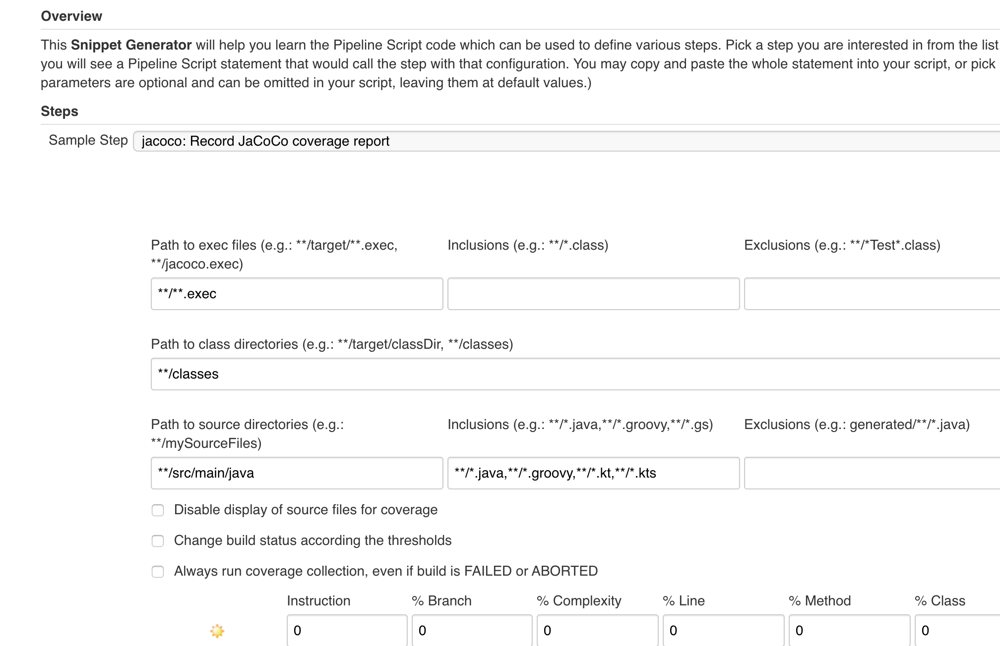
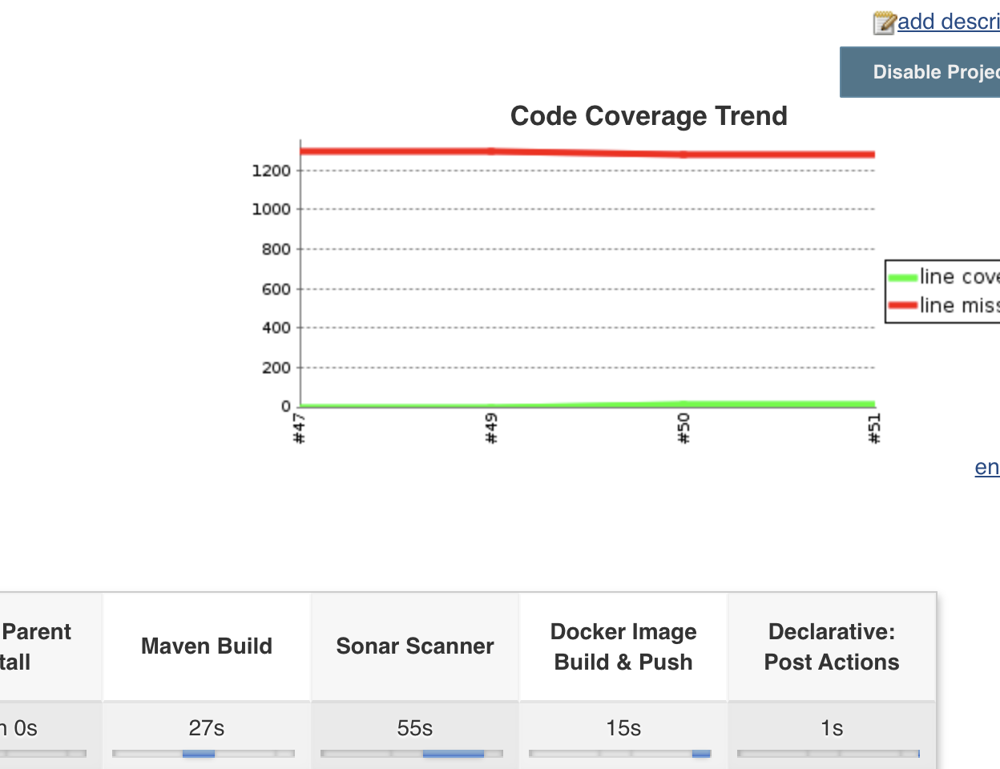
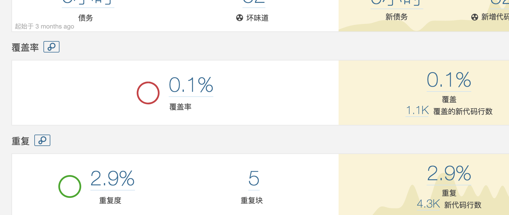

# 如何集成Jmockit+ Junit5+Jacoco

*本来想集成到devops中用Jmockit进行单元测试，用Jacoco进行覆盖路径的报告。没想到一路碰坑，查了好多资料终于算是集成成功了。*

> ### 先说一下版本吧，版本是第一个大坑：
>
> #### Jacoco:0.8.5
>
> #### Jmockit: 1.49
>
> #### Junit5:5.5.2


## 步骤

### 1.Jmockit 集成

```xml
    <dependency>
      <groupId>org.jmockit</groupId>
      <artifactId>jmockit</artifactId>
      <version>1.49</version>
      <scope>test</scope>
    </dependency>
```

### 2.需要安装Jacoco的插件

```xml
    <plugin>
      <groupId>org.jacoco</groupId>
      <artifactId>jacoco-maven-plugin</artifactId>
      <version>${jacoco.version}</version>
      <executions>
        <execution>
          <id>default-prepare-agent</id>
          <goals>
            <goal>prepare-agent</goal>
          </goals>
        </execution>
        <execution>
          <id>default-report</id>
          <phase>test</phase>
          <goals>
            <goal>report</goal>
          </goals>
          <configuration>
            <dataFile>${project.build.directory}/coverage-reports/jacoco.exec</dataFile>
            <outputDirectory>${project.reporting.outputDirectory}/jacoco</outputDirectory>
          </configuration>
        </execution>
      </executions>
    </plugin>
```

### 3.需要安装maven-surefire-plugin插件

Maven-surefire-plugin 插件其实就是maven test命令的核心运行的实际插件，但是如果你没有安装这个插件高于2.22.0的版本，你会发现你的test无法被检测到。这是因为如果你的junit版本是5以上后，需要高于这个版本才可以完美兼容junit5。这里是第一个坑的地方

```xml
    <plugin>
      <groupId>org.apache.maven.plugins</groupId>
      <artifactId>maven-surefire-plugin</artifactId>
      <!--注意版本指定-->
      <version>2.22.0</version>
      <configuration>
        <argLine>
          -javaagent:${settings.localRepository}/org/jmockit/jmockit/1.49/jmockit-1.49.jar
          -javaagent:${settings.localRepository}/org/jacoco/org.jacoco.agent/${jacoco.version}/org.jacoco.agent-${jacoco.version}-runtime.jar=destfile=${project.basedir}/target/jacoco.exec
        </argLine>
      </configuration>
    </plugin>
```

### 4.集成jacoco和jmockit

在网上的很多版本中，上述的maven-surefire-plugin 中argline没有将jacoco和jmockit集成。但是如果只配

```xml
 -javaagent:${settings.localRepository}/org/jmockit/jmockit/1.49/jmockit-1.49.jar
```

jmockit的运行 两者的生成报告会冲突，也就是jacoco的.exec无法生成。并且如果jacoco的插件版本太低，就会出现test出错。笔者这里升级到0.85后两者可以完美结合。

最后在argline加上jacoco生成.exec的输出

```xml
 -javaagent:${settings.localRepository}/org/jacoco/org.jacoco.agent/${jacoco.version}/org.jacoco.agent-${jacoco.version}-runtime.jar=destfile=${project.basedir}/target/jacoco.exec
```

### 5.在jenkins pipline中集成

如果要在jenkins中有覆盖率的显示。需要安装jacoco插件。插件市场中搜索就有。然后需要在pipeline中写入以下命令

```groovy
jacoco exclusionPattern: '**/*Test*.class', execPattern: '**/jacoco.exec', inclusionPattern: '**/*.class', sourceInclusionPattern: '**/*.java'
```



可以根据需要修改对应路径即可

> #### 几个重要参数：
>
> #### Path to exec:需要指定到之前你的jacoco生成的后缀为.exec的二进制文件的地方
>
> #### Path to class:指定maven编译后的存放java二进制的文件目录，可以看看你的maven打包结果，一般默认就行
>
> #### Path to Source:源码路径

### 6.sonar 集成

只需要在`sonar-project.properties`文件中加入

```properties
sonar.core.codeCoveragePlugin=jacoco
sonar.jacoco.reportPaths=./target/jacoco.exec
sonar.dynamicAnalysis=reuseReports
sonar.jacoco.reportMissing.force.zero=false
```

下面两项是可选填


## 最终效果：

**jenkins上**




**sonar上**




## 参考：

https://www.cnblogs.com/yanxinjiang/p/10968297.html

https://blog.csdn.net/fbb1995/article/details/79933659

https://blog.csdn.net/liuyanglglg/article/details/105386661

https://www.jacoco.org/jacoco/

https://blog.csdn.net/weixin_43291944/article/details/96485190