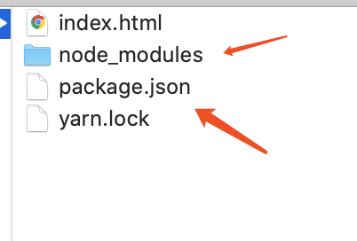
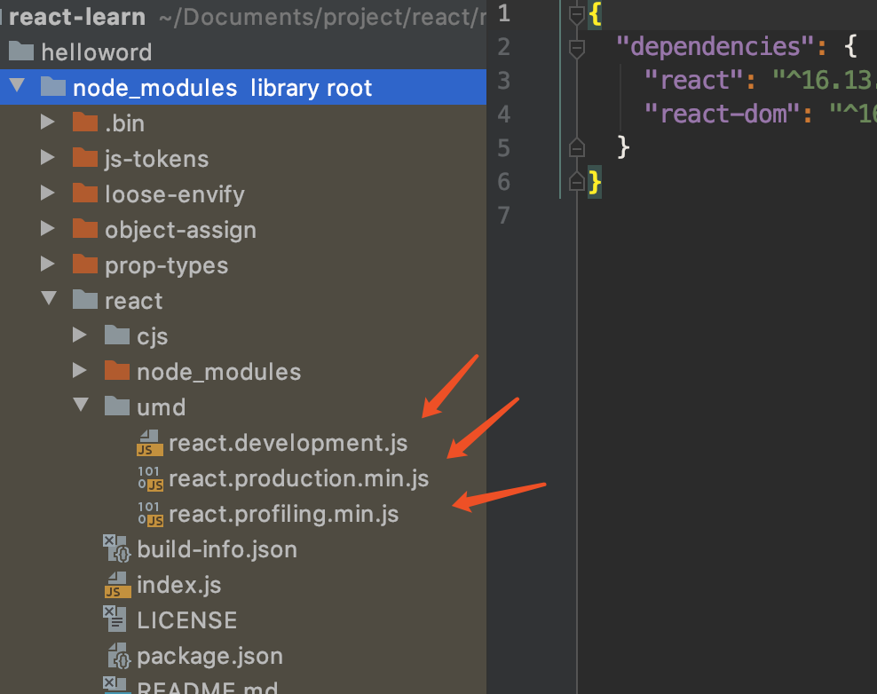
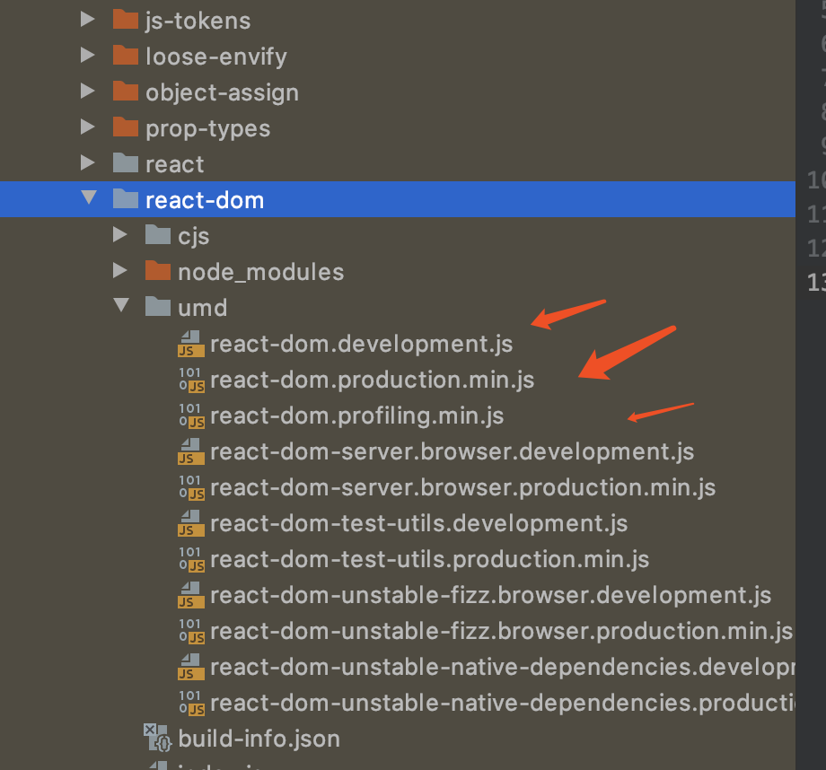
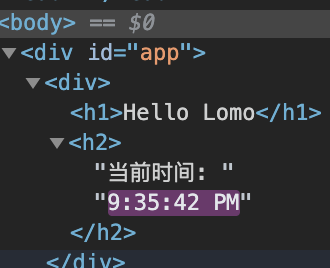
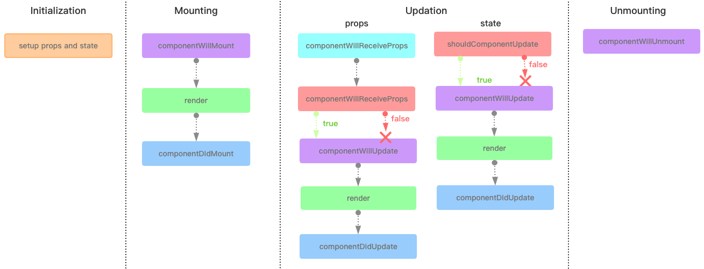
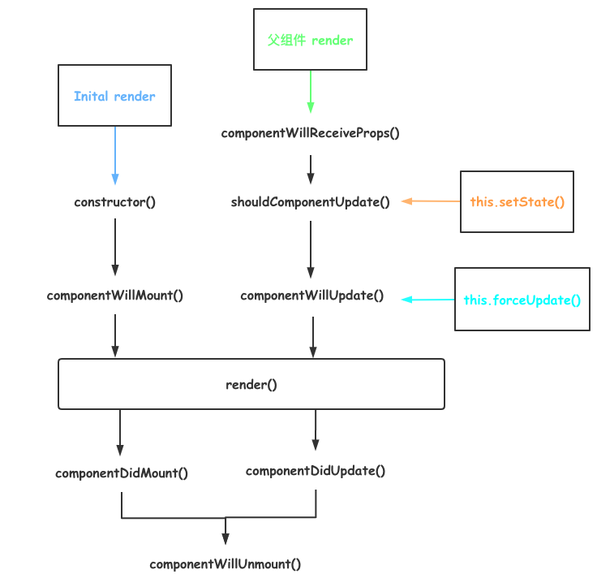

# React 基础

**React** 是一个用于构建用户界面的 JavaScript 库


## 前言

### 推荐的工具链(来自官方)

- 如果你是在**学习 React** 或**创建一个新的[单页](https://react.docschina.org/docs/glossary.html#single-page-application)应用**，请使用 [Create React App](https://react.docschina.org/docs/create-a-new-react-app.html#create-react-app)。
- 如果你是在**用 Node.js 构建服务端渲染的网站**，试试 [Next.js](https://react.docschina.org/docs/create-a-new-react-app.html#nextjs)。
- 如果你是在构建**面向内容的静态网站**，试试 [Gatsby](https://react.docschina.org/docs/create-a-new-react-app.html#gatsby)。
- 如果你是在打造**组件库**或**将 React 集成到现有代码仓库**，尝试[更灵活的工具链](https://react.docschina.org/docs/create-a-new-react-app.html#more-flexible-toolchains)。


### 一组 JavaScript 构建工具链通常由这些组成：

- ##### 包管理工具：用于集成第三方js库和各种依赖。常用的有 npm，yarn

- ##### 打包工具：用于将所有前端文件打包成一个体积较小的package。 常用的有webpack，parcel

- ##### 编译器：由于es6以上的部分语法浏览器不支持，所以需要编译为浏览器支持较好的es5语法。常见的是babel工具


## 特点

* #### Declarative(声明式编码)

* #### Componenet-Based(组件化编码)

* #### 高效-高效的DOM DIFF算法，最小化页面重绘

* #### 单向数据流


## 1.环境准备

- #### Node >= 8.10 

- #### npm >= 5.6

**上述来自官方要求，可以在命令行工具中输入** 

```bash
node -v
```

查看**nodejs**版本

```bash
npm -v
```

查看**npm**版本


## 2.知识点

- #### <a href="#编写hellword">编写helloword</a>

- #### jsx语法

- #### 元素渲染

- #### 组件和props

- #### React生命周期

- #### 事件处理

- #### 条件渲染

- #### 列表渲染

- #### 表单应用


## <a name="编写hellword">3.编写hellword</a>


### 使用yarn 添加react所需依赖

大部分的快速开始都是通过引入cdn加入。这里因为有vue的基础，所以就不这么做了。通过`yarn`或者`npm`这样的包管理工具下载react所需依赖。

#### 1.安装依赖

```bash
yarn add react react-dom --save
```



在项目目录下生成了所需依赖包含package.json


#### 2.查看目录



**在`node_modules` -> `react` -> `umd`下包含react的js库**



**在`node_modules` -> `react-dom` -> `umd`下包含react-dom的js库**


#### 3.引入依赖

在index.html中引入react所需的`react` 和`react-dom`

```html
<!DOCTYPE html>
<html lang="en">
<head>
    <meta charset="UTF-8">
    <title>React Hello Word</title>
    <!--引入react.js库-->
    <script src="node_modules/react/umd/react.development.js"></script>
    <!--引入react-dom.js库-->
    <script src="node_modules/react-dom/umd/react-dom.development.js"></script>
</head>
<body>

</body>
</html>
```


### 编写helloword例子

```html
<!DOCTYPE html>
<html lang="en">
<head>
    <meta charset="UTF-8">
    <title>React Hello Word</title>
    <!--引入react.js库-->
    <script src="node_modules/react/umd/react.development.js"></script>
    <!--引入react-dom.js库-->
    <script src="node_modules/react-dom/umd/react-dom.development.js"></script>
</head>
<body>
<div id="app">

</div>
<script>
    var el = React.createElement("h1", {}, "hello word");
    ReactDOM.render(el, document.getElementById("app"))
</script>
</body>
</html>
```

**通过`React`的静态方法 `createElement()`生成元素**

- ### createElement(元素标签，属性{}，标签中的内容)

*通过此方法可以生成一个dom对象*

**通过`ReactDOM` 的静态方法`render()` 渲染页面元素**

- ### render（dom对象，渲染节点）


### 3.3再改造

对于上述的`render()` 函数中除了通过`createElement()`生成外，也可以使用jsx的语法糖方式直接写元素标签，不过需要babel的支持。

#### 1.加入babel的支持

使用`babel-standalone`库实现在线转换

> 由于 **Babel** 本身的设计是基于 **node.js** 环境下运行使用的，而这个名为 **babel-standalone** 的开源项目，则支持非 **node.js** 环境下使用 **Babel**。
>
> ---babel standalone

```bash
npm install --save babel-standalone
```

#### 2.例子

```html
<!DOCTYPE html>
<html lang="en">
<head>
    <meta charset="UTF-8">
    <title>React Hello Word</title>
    <!--引入react.js库-->
    <script src="node_modules/react/umd/react.development.js"></script>
    <!--引入react-dom.js库-->
    <script src="node_modules/react-dom/umd/react-dom.development.js"></script>
    <script src="node_modules/babel-standalone/babel.min.js"></script>
</head>
<body>
<div id="app">

</div>
<!--指定此脚本通过babel处理-->
<script type="text/babel">
    // var el = React.createElement("h1", {}, "hello word");
    ReactDOM.render(
        <h1>hello word</h1>,
    document.getElementById("app"));
</script>
</body>
</html>
```

需要注意的是 在script标签下需要指定为babel，否则无法识别这种写法


## 4.JSX

### 1.什么是jsx？

```javascript
const element = <h1>Hello, world!</h1>;
```

> #### 这个有趣的标签语法既不是字符串也不是 HTML。
>
> #### 它被称为 JSX，是一个 JavaScript 的语法扩展。我们建议在 React 中配合使用 JSX，JSX 可以很好地描述 UI 应该呈现出它应有交互的本质形式。JSX 可能会使人联想到模版语言，但它具有 JavaScript 的全部功能。
>
> #### ----React 官网

以上是React官方对于jsx的解释，其实jsx是一种语法糖。所以需要babel这样的工具进行编译转换

### 2.例子

```jsx
ReactDOM.render(
        <h1 className="text" name="front">hello word</h1>,
        document.getElementById("app"));
```

> `className` 是为了和 html 标签的 `class` 区分

还可以写成

```jsx
 // ReactDOM.render(
    //     <h1 className="text" name="front">hello word</h1>,
    //     document.getElementById("app"));

    var name = 'lomo';
    var el = <h1 className="text" name="front">hello {name}</h1>;
    ReactDOM.render(el, document.getElementById("app"));
```

完整

```html
<script type="text/babel">
    ReactDOM.render(
        <h1 className="text" name="front">hello word</h1>,
        document.getElementById("app"));
</script>
```


## 5.元素渲染

> #### 元素是构成 React 应用的最小砖块。

react中的元素是一个普通对象，而React DOM会负责更新浏览器的DOM与React元素保持一致。

```jsx
function tick() {
        const element = <div>
            <h1>Hello Lomo</h1>
            <h2>当前时间: {new Date().toLocaleTimeString()}</h2>
        </div>;
        ReactDOM.render(element, document.getElementById("app"));
    }

    setInterval(tick, 1000)
```

通过循环来动态更新时间



发现react只更新它需要更新的部分，也就是让react元素和dom进行绑定建立关系,通过修改react中的元素，驱动dom的更新。这就类似vue创建的虚拟dom树与vue节点进行绑定。

所以我们在更新视图时，react只更新所需节点的内容。

完整

```html
<script type="text/babel">
    function tick() {
        const element = <div>
            <h1>Hello Lomo</h1>
            <h2>当前时间: {new Date().toLocaleTimeString()}</h2>
        </div>;
        ReactDOM.render(element, document.getElementById("app"));
    }

    setInterval(tick, 1000)
</script>
```


## 6.组件和Props

- #### React.createClass() 已废弃

- #### 函数式组件（无状态组件）没有生命周期

- #### React.component(有状态组件)


### 1.createClass()

```jsx
 var el = React.createElement("h1", {}, "hello word");
```


### 2.函数式组件(无状态组件）

```jsx
<script type="text/babel">
function Hello() {
        return <h1>Hello Lomo</h1>
    }
    function Hello1(props) {
        return <div>
            <h1>Hello {props.name}</h1>
        </div>
    }

    ReactDOM.render(<Hello/>, document.getElementById("app-function"))
    ReactDOM.render(<Hello1 name="jack"/>, document.getElementById("app-function1"))
</script>
```

> #### 该函数是一个有效的 React 组件，因为它接收唯一带有数据的 “props”（代表属性）对象与并返回一个 React 元素。这类组件被称为“函数组件”，因为它本质上就是 JavaScript 函数。
>
> ---react 官网


### 3.React.component(有状态组件)

```jsx
 //通过React.Component
    class HelloClass extends React.Component{
        render() {
            return <div>
                <h1>Hello Tim</h1>
            </div>;
        }
    }
    //通过React.Component
    class HelloClass1 extends React.Component{
        render() {
            //通过此方式创建的组件是有状态的，所以可以通过this获取
            return <div>
                <h1>Hello {this.props.name}</h1>
            </div>;
        }
    }

    ReactDOM.render(<HelloClass/>, document.getElementById("app"))
    ReactDOM.render(<HelloClass1 name="Mary"/>, document.getElementById("app1"))
```

通过extendsReact.Component 可以创建有状态组件,在这样的创建中，this指向通过React.Component创建的组件实例


## 4.React生命周期

### 四个阶段：

- #### 组件初始化阶段

- #### 组件加载阶段

- #### 数据更新阶段

- #### 组件销毁阶段






#### **Initialization**

##### *constructor():* 

> #### constructor()中完成了React数据的初始化，它接受两个参数：props和context，当想在函数内部使用这两个参数时，需使用super()传入这两个参数。
>
> ####  注意：只要使用了constructor()就必须写super(),否则会导致this指向错误。


#### Mounting

##### *componentWillMount()：*

> #### componentWillMount()一般用的比较少，它更多的是在服务端渲染时使用。它代表的过程是组件已经经历了constructor()初始化数据后，但是还未渲染DOM时。

##### *componentDidMount()：*

> #### 组件第一次渲染完成，此时dom节点已经生成，可以在这里调用ajax请求，返回数据setState后组件会重新渲染


#### Updation

##### *componentWillReceiveProps (nextProps)*

> #### 1.在接受父组件改变后的props需要重新渲染组件时用到的比较多
>
> #### 2.接受一个参数nextProps
>
> #### 3.通过对比nextProps和this.props，将nextProps的state为当前组件的state，从而重新渲染组件

##### *shouldComponentUpdate(nextProps,nextState)*

> #### 1.主要用于性能优化(部分更新)
>
> #### 2.唯一用于控制组件重新渲染的生命周期，由于在react中，setState以后，state发生变化，组件会进入重新渲染的流程，在这里return false可以阻止组件的更新
>
> #### 3.因为react父组件的重新渲染会导致其所有子组件的重新渲染，这个时候其实我们是不需要所有子组件都跟着重新渲染的，因此需要在子组件的该生命周期中做判断

##### *componentDidUpdate(prevProps,prevState)*

> #### 组件更新完毕后，react只会在第一次初始化成功会进入componentDidmount,之后每次重新渲染后都会进入这个生命周期，这里可以拿到prevProps和prevState，即更新前的props和state。

##### *render*

> #### render函数会插入jsx生成的dom结构，react会生成一份虚拟dom树，在每一次组件更新时，在此react会通过其diff算法比较更新前后的新旧DOM树，比较以后，找到最小的有差异的DOM节点，并重新渲染.

测试代码：

```jsx
<script type="text/babel">
    class Hello extends React.Component {
        constructor(props) {
            console.log('初始化阶段');
            //将props传递给父类构造器构造
            super(props);
            //初始化状态
            this.state = {
                name: 'lomo',
                age: '23'
            }
        }
        componentWillMount() {
            console.log('组件加载前阶段')
        }
        componentDidMount() {
            console.log('组件加载后')
        }
        //使用箭头函数，不然click的作用域会发生变化
        updateUser = () => {
            this.setState({
                name: 'Tim',
                age: '30'
            })
        };
        shouldComponentUpdate(nextProps, nextState, nextContext) {
            console.log('数据是否需要更新，true会更新，false不允许更新')
            return true;
        }
        componentWillUpdate(nextProps, nextState, nextContext) {
            console.log('数据将要更新')
        }
        componentDidUpdate(prevProps, prevState, snapshot) {
            console.log('数据更新完毕')
        }

        render() {
            console.log('组件加载或者数据更新');
            return <div>
                <h1>Hello {this.state.name}</h1>
                <h1>年龄 {this.state.age}</h1>
                <button onClick={this.updateUser}>更新数据</button>
            </div>;
        }
    }
    ReactDOM.render(<Hello></Hello>, document.getElementById('app'))
</script>

//结果：

//第一次:
// 初始化阶段 constructor
// 组件加载前阶段 componentWillMount
// 组件加载或者数据更新 render
// 组件加载后 componentDidMount

//触发按钮更新状态:
// 数据是否需要更新，true会更新，false不允许更新 shouldComponentUpdate
// 数据将要更新 componentWillUpdate
// 组件加载或者数据更新 render
// 数据更新完毕 componentDidUpdate


```


## 5.事件处理

React中 事件的命名采用的是驼峰

### 用法

JSX中：

```jsx
button onClick={activateLasers}>
  Activate Lasers
</button>
```

> 在 React 中另一个不同点是你不能通过返回 `false` 的方式阻止默认行为。你必须显式的使用 `preventDefault` 。


### 关于this绑定

> #### 在处理事件的回调函数中，我们需要将this指向react的实例
>
> 在 JavaScript 中，class 的方法默认不会绑定(https://developer.mozilla.org/en/docs/Web/JavaScript/Reference/Global_objects/Function/bind) `this`。如果你忘记绑定 `this.handleClick` 并把它传入了 `onClick`，当你调用这个函数的时候 `this` 的值为 `undefined`。

####  1.通过bind（）

```
<script type="text/babel">
 class Hello extends React.Component {
        constructor(props) {
            super(props);
            this.state = {
                name: 'lomo'
            }
            //1.初始化阶段绑定
            this.handleClick2 = this.handleClick1.bind(this);
        }
        //普通函数this undefinded
        handleClick1() {
            console.log(this)
        }
        //初始化阶段 通过bind函数绑定改变此函数的作用域
        handleClick2() {
            console.log(this)
        }
        //2.jsx后写bind函数
         handleClick3() {
            console.log(this)
        }
        render() {
            return <div>
                <h1>{this.state.name}</h1>
                <button onClick={this.handleClick1}>普通函数 this</button>
                <button onClick={this.handleClick2}>通过bind函数绑定后的普通函数</button>
                <button onClick={this.handleClick3.bind(this)}>通过bind函数绑定后的普通函数</button>
            </div>;
        }
    }

    ReactDOM.render(<Hello></Hello>, document.getElementById('app'))
</script>
```

> 附上javascript this机制
>
> ##### The `bind()` method creates a new function that, when called, has its `this` keyword set to the provided value, with a given sequence of arguments preceding any provided when the new function is called.
>
> ```javascript
> const module = {
>   x: 42,
>   getX: function() {
>     return this.x;
>   }
> }
> 
> const unboundGetX = module.getX;
> console.log(unboundGetX()); // The function gets invoked at the global scope
> // expected output: undefined
> 
> const boundGetX = unboundGetX.bind(module);
> console.log(boundGetX());
> // expected output: 42
> 
> ```

#### 2.通过箭头函数

```jsx
<script type="text/babel">
    class Hello extends React.Component {
        constructor(props) {
            super(props);
            this.state = {
                name: 'lomo'
            }
        }
        //1.通过箭头函数绑定react实例
        handleClick = () => {
            console.log(this);
            this.setState({
                name: '你点击了我'
            })
        };
        //2.在onClick事件中直接使用箭头函数
        handleClick3() {
            console.log(this)
        }
        render() {
            return <div>
                <h1>{this.state.name}</h1>
                <button onClick={this.handleClick}>通过箭头函数得到this</button>
                <button onClick={()=>this.handleClick3()}>通过bind函数绑定后的普通函数</button>
            </div>;
        }
    }
    ReactDOM.render(<Hello></Hello>, document.getElementById('app'))
</script>
```
> #### onClick={()=>this.handleClick3()}
>
> #### ES6中箭头函数：
>
> ##### （1）默认指向定义它时，所处上下文的对象的this指向。即ES6箭头函数里this的指向就是上下文里对象this指向，偶尔没有上下文对象，this就指向window
>
> ##### （2）即使是call，apply，bind等方法也不能改变箭头函数this的指向


## 6.条件渲染

> #### React 中的条件渲染和 JavaScript 中的一样，使用 JavaScript 运算符 `if` 或者`条件运算符`去创建元素来表现当前的状态，然后让 React 根据它们来更新 UI。

### 1.例子

```jsx
<script type="text/babel">
    function Login() {
        return <button>登录</button>
    }

    function LoginOut() {
        return <button>登出</button>
    }

    class App extends React.Component {
        state = {
            isLogin: false
        };
        updateLoginState = () => {
            this.setState({
                isLogin: true
            })
        };

        render() {
            //const isLogin = this.state.isLogin;
            const {isLogin} = this.state;
            let button;
            if (isLogin) {
                button = <Login/>
            } else {
                button = <LoginOut/>
            }
            return <div>
                {button}
                {isLogin ? <Login/> : <LoginOut/>}
                <button onClick={this.updateLoginState}>更新</button>
            </div>
        }
    }

    ReactDOM.render(<App/>, document.getElementById("app"))
</script>
```

可以通过混合js代码的方式 或者 三元表达式进行条件渲染

### 2.if 通过父组件自定义传值

```jsx
<script type="text/babel">
    function Login(props) {
        return <button onClick={props.update}>登录</button>
    }

    function LoginOut(props) {
        return <button onClick={props.update}>登出</button>
    }

    class App extends React.Component {
        state = {
            isLogin: false
        };
        updateLoginState = () => {
            this.setState({
                isLogin: !this.state.isLogin
            })
        };

        render() {
            //通过父组件传递自定义事件方法，子组件调用父组件方法
            const {isLogin} = this.state;
            return <div>
                {isLogin ? <Login update={this.updateLoginState}/> : <LoginOut update={this.updateLoginState}/>}
                <button onClick={this.updateLoginState}>更新</button>
            </div>
        }
    }

    ReactDOM.render(<App/>, document.getElementById("app"))
</script>
```


## 7.列表渲染

### 1.例子

```jsx
<script type="text/babel">
    class List extends React.Component {
        state = {
            list: ['1', '2', '3']
        };

        render() {
            const arr = this.state.list;
            const res = arr.map((e, index) => <li key={index}>{e}</li>);
            return <div>
                <ul>
                    {res}
                </ul>
            </div>;
        }
    }

    ReactDOM.render(<List/>, document.getElementById('app'))
</script>
```

同vue一样 在每一项中都需要有一个key

### 2.key

> #### key 帮助 React 识别哪些元素改变了，比如被添加或删除。因此你应当给数组中的每一个元素赋予一个确定的标识。

- **一个元素的 key 最好是这个元素在列表中拥有的一个独一无二的字符串。通常，我们使用数据中的`	id `来作为元素的 key**

- **当元素没有确定 id 的时候，万不得已你可以使用元素索引` index` 作为 key**


## 8.表单应用

> #### 在 React 里，HTML 表单元素的工作方式和其他的 DOM 元素有些不同，这是因为表单元素通常会保持一些内部的 state。而在 React 中，可变状态（mutable state）通常保存在组件的 state 属性中，并且只能通过使用 `setState()`来更新。
>
> #### 可以把两者结合起来，使 React 的 state 成为“唯一数据源”。渲染表单的 React 组件还控制着用户输入过程中表单发生的操作。被 React 以这种方式控制取值的表单输入元素就叫做“受控组件”

```jsx
<script type="text/babel">
    class ToDoList extends React.Component {
        state = {
            val: '',
            list: []
        };
        handleChange = (event) => {
            this.setState({
                val: event.target.value
            })
        };
        add = () => {
            const {val, list} = this.state;
            list.push(val);
            //更新触发render函数，否则无法生效
            this.setState({
                list
            })
        };

        render() {
            const {val, list} = this.state;
            const renderList = list.map((e, index) => <li key={index}>{e}</li>);
            //通过将组建中state与input内部的state进行绑定
            return <div>
                <input placeholder="input some text" value={val} onChange={this.handleChange}/>
                <button onClick={this.add}>添加</button>
                <ul>
                    {renderList}
                </ul>
            </div>;
        }
    }

    ReactDOM.render(<ToDoList/>, document.getElementById('app'))
</script>
```

>#### input框的value与react的state绑定，在发生变化时，调用其对应的事件，更新react中state，从而实现`“双向绑定"`的效果


## 总结

通过对React 的基础学习，对比vue，发现两者在设计思路上各有不同，也不能说谁就是比谁厉害。因为两者身上都有一些相似的地方，当然本质上两者都是非常好的前端框架。

