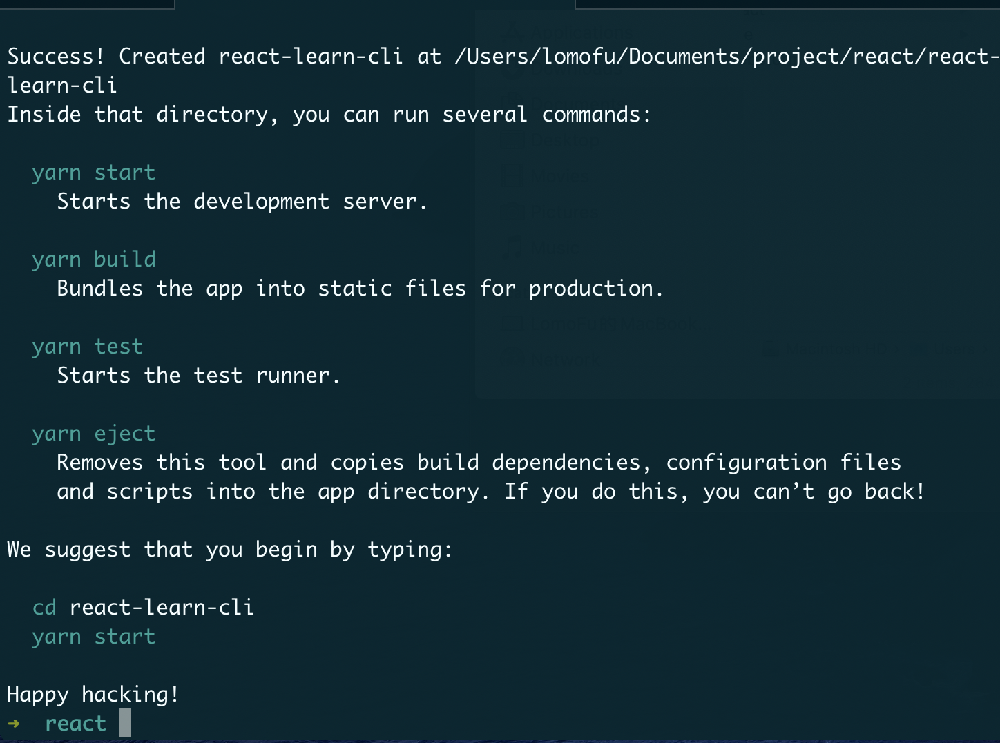
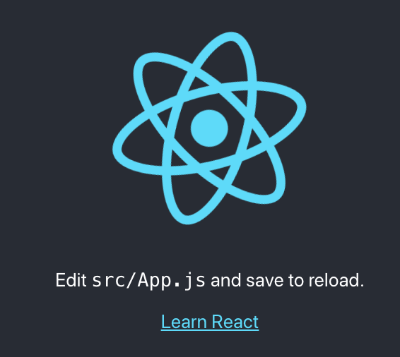
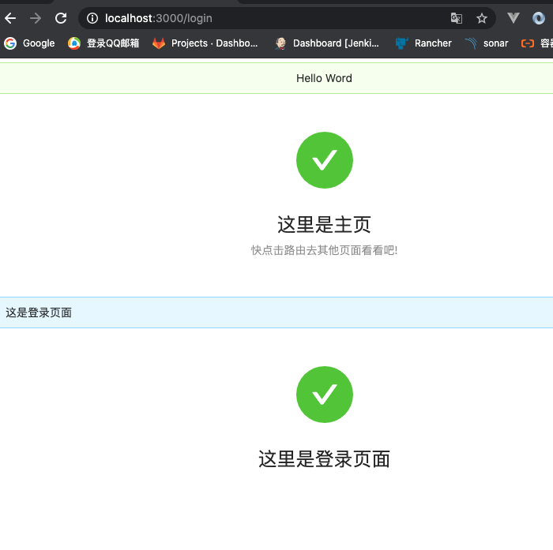
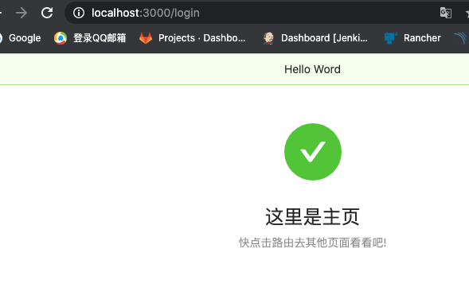
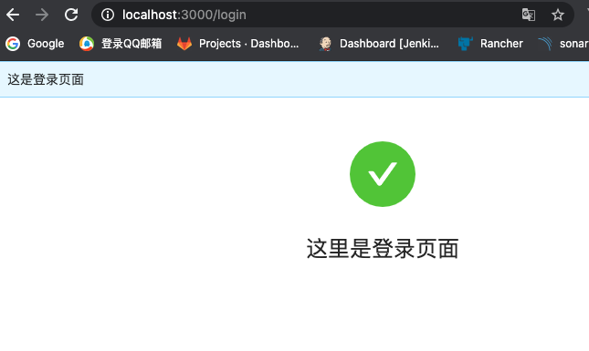
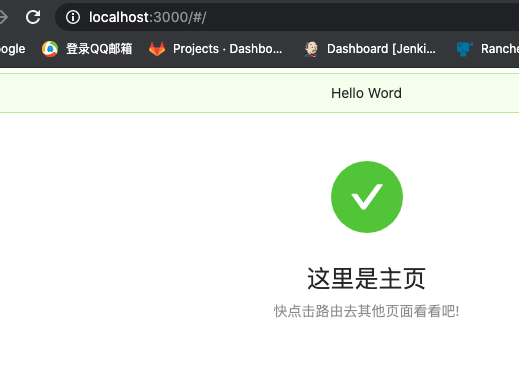

# React 进阶

通过简单引入js文件，过了一遍React基本知识点和jsx。接下来开始使用脚手架，通过实际中工程上手。


## 1.脚手架

### Create React App

> #### **Create React App** 是一个用于**学习 React** 的舒适环境，也是用 React 创建**新的单页应用**的最佳方式。
>
> #### 它会配置你的开发环境，以便使你能够使用最新的 JavaScript 特性，提供良好的开发体验，并为生产环境优化你的应用程序。

说白了就是类似vue推出的vue cli，会帮你配置一些工具链中需要的东西，不用每一次都进行繁琐的配置

执行

```bash
npm install -g create-react-app
create-react-app 项目名
```

或者

```bash
npx create-react-app 项目名
```

>#### 1.上面第一个命令是全局安装create-react-app这个脚手架，之后创建react项目 使用create-react-app 项目名
>
>#### 2.第二个是执行npm安装create-react-app后 再执行create-react-app 项目名。就是将两个命令合二为一了

如果出现yarn超时错误：

```bash
yarn config set registry https://registry.npm.taobao.org
```



出现以下画面 单页应用工程创建完成


运行异常：create-react-app npm star 关于解决webpack版本过高导致的报错

```bash
There might be a problem with the project dependency tree.
It is likely not a bug in Create React App, but something you need to fix locally.

The react-scripts package provided by Create React App requires a dependency:

  "webpack": "4.42.0"

Don't try to install it manually: your package manager does it automatically.
However, a different version of webpack was detected higher up in the tree:

```

> #### 1.大概意思就是在我的目录下检测到4.41.2版本的webpack.
>
> #### 2.然后我按照[这里](https://blog.csdn.net/muzi190/article/details/84108714)的方法进行webpack删除重新安装还是出问题，
>
> #### 3.最后删除4.41.2的那个所在目录的webpack文件夹后重新install了一下就行了




## 2.工程目录


### 1.默认脚手架生成的目录

---

|——*node_modules*  依赖

|——*public*

​	|—— *静态目录*（可以将图片，json等静态资源放在这里

|—— *src* 源码

​	|—— *App.css* （app根节点 css样式）

​	|—— *App.js* （app根节点jsx）

​	|—— *App.test.js* （app根节点测试）

​	|—— *index.css* （index.html样式 全局）

​	|—— *index.js* （类似vue中main.js 也是应用的入口）

​	|—— *logo.svg*

​	|—— *serviceWorker.js* （sw相关的离线缓存等技术）

​	|—— *setupTests.js* （单元测试相关的配置）

|—— *.gitignore*

|—— *package.json*

|—— *README.md*

|—— *yarn.lock*

---


### 2.命令

```json
"scripts": {
    "start": "react-scripts start",
    "build": "react-scripts build",
    "test": "react-scripts test",
    "eject": "react-scripts eject"
  }
```

在`package.json`中有如下命令，需要关注的是`eject`这项

这个命令是暴露webpack相关的一些配置文件，需要注意的是这个操作是不可逆的，一旦暴露就不能恢复。

> #### 在执行这个命令时需要将本地所有修改文件提价git或者回滚，否则会执行失败


**执行后的目录结构**

---

|——***config*** **（webpack相关的配置）**

|——***scripts*** **（执行的上述的脚本）**

|——*node_modules*  （依赖）

|——*public*

​	|—— *静态目录*（可以将图片，json等静态资源放在这里

|—— *src* 源码

​	|—— *App.css* （app根节点 css样式）

​	|—— *App.js* （app根节点jsx）

​	|—— *App.test.js* （app根节点测试）

​	|—— *index.css* （index.html样式 全局）

​	|—— *index.js* （类似vue中main.js 也是应用的入口）

​	|—— *logo.svg*

​	|—— *serviceWorker.js* （sw相关的离线缓存等技术）

​	|—— *setupTests.js* （单元测试相关的配置）

|—— *.gitignore*

|—— *package.json*

|—— *README.md*

|—— *yarn.lock*

---


##  3.使用

同vue一样，react的入口也是从app开始

### 添加对saas支持

react官方已经支持了saas的使用，只需要安装saas插件，无需配置webpack

```bash
yarn add node-saas -S
```

然后将文件的后缀改成saas的扩展名就可以使用saas了


## 4.使用第三方组件库

基本同vue一样

- ### [ant design](https://ant.design/docs/react/getting-started-cn)

- ### [material-ui](https://material-ui.com/zh/)

- ### [有赞](https://youzan.github.io/zent/zh/guides/install)


## 5.路由

路由应该是单页spa的灵魂所在了，学过vue-router后来上手react-router 有相似也有不同


### react-router与react-router-dom的区别

> 1. react-router: 实现了路由的核心功能
> 2. react-router-dom: 基于react-router，加入了在浏览器运行环境下的一些功能，例如： Link组件，会渲染一个a标签，Link组件源码a标签行; BrowserRouter和HashRouter组件，前者使用pushState和popState事件构建路由，后者使用window.location.hash和hashchange事件构建路由
> 3. react-router-dom依赖react-router，所以我们使用npm安装依赖的时候，只需要安装相应环境下的库即可，不用再显式安装react-router。基于浏览器环境的开发，只需要安装react-router-dom

### 安装

```bash
yarn add react-router-dom
```

### 路由组件

#### 1.BrowserRouter

> 使用 HTML5 提供的 history API (`pushState`, `replaceState` 和 `popstate` 事件) 来保持 UI 和 URL 的同步。

**1.在项目目录下创建一个js文件用来管理路由，并写入**

```jsx
import { BrowserRouter as Router, Route } from "react-router-dom";
import React from "react";
import App from "../App";
import Login from "../pages/Login";
import Home from "../pages/Home";
export default function IRouter() {
  return (
    <Router>
      <Route path="/" component={App}></Route>
      <Route path="/login" component={Login}></Route>
      <Route path="/home" component={Home}></Route>
    </Router>
  );
}
```

> 1.引入路由组件，这个和vue-router是有所不同，vue-router是对象，而react是组件
>
> 2.接下来配置很像，就是通过不用的path加载不同的组件，类似vue中的views文件下的那些

**2.修改index.js下的根节点渲染**

```jsx
import React from "react";
import ReactDOM from "react-dom";
import * as serviceWorker from "./serviceWorker";
import Router from "./router";
ReactDOM.render(
  <React.StrictMode>
    <Router />
  </React.StrictMode>,
  document.getElementById("root")
);
```

> 这里和`vue-router`区别还是蛮大的，vue中的路由视图渲染是通过`<router-view>`放入到模板中，而react将`router`看做一个`组件`，所有的路由变化都是基于这个组件的所以render节点换成刚刚上面定义的`Router组件`

**3.效果**




#### 2.Switch

上面的例子在最后我们会发现，当输入`/login`会匹配`/`和`/login`两个路由下的组件，所以就会出现上图的两个组件都加载了

> ### Switch 组件会加载第一个匹配的

 效果：	
 但是我们会发现，这样的话当输入`/login`匹配到`/`就停止了，而实际上我们只想加载login页面

> ### 使用exact 精准匹配

```jsx
 <Router>
      <Switch>
        <Route exact path="/" component={App}></Route>
        <Route path="/home" component={Home}></Route>
        <Route path="/login" component={Login}></Route>
      </Switch>
    </Router>
```

通过对`/`加上exact 精准匹配，从而避免了`/login`匹配到`/`就结束了



#### 3.HashRouter

> 使用 URL 的 `hash` 部分（即 `window.location.hash`）来保持 UI 和 URL 的同步。

 这个就是类似vue中默认用的那个hash模式,会有`#`

````jsx
import { HashRouter as Router, Route, Switch } from "react-router-dom";
import React from "react";
import App from "../App";
import Login from "../pages/Login";
import Home from "../pages/Home";
export default function IRouter() {
  return (
    <Router>
      <Switch>
        <Route exact path="/" component={App}></Route>
        <Route path="/home" component={Home}></Route>
        <Route path="/login" component={Login}></Route>
      </Switch>
    </Router>
  );
}
````

**效果**：




### 路由操作

#### 1.路由跳转 Link

```jsx
import React from "react";
import { Alert, Result } from "antd";
import { Link } from "react-router-dom";

export default function Home() {
    return (
        <div>
            <Alert message="个人中心"></Alert>
            <Result status="success" title="欢迎来到个人中心"></Result>
            <Link to="/login">点击跳转回登录页面</Link>
        </div>
    );
}
```

> 很像route-link标签… 实际上dom也是生成一个`<a>`标签

#### 2.NavLink

> `<NavLink>`是`<Link>`的一个特定版本，会在匹配上当前的url的时候给已经渲染的元素添加参数，组件的属性有

- #### activeClassName(string)：设置选中样式，默认值为active

- #### activeStyle(object)：当元素被选中时，为此元素添加样式

- #### exact(bool)：为true时，只有当导致和完全匹配class和style才会应用

- #### strict(bool)：为true时，在确定为位置是否与当前URL匹配时，将考虑位置pathname后的斜线

- #### isActive(func)判断链接是否激活的额外逻辑的功能


#### 3.使用按钮跳转

上述组件为函数式组件，没有状态，需要使用this进行跳转，所以需要有状态组件

```jsx
export default class Class extends React.Component {
  render() {
    return (
      <div>
        <Alert message="个人中心"></Alert>
        <Result status="success" title="欢迎来到个人中心"></Result>
        <Button onClick={() => this.props.history.push("/login")}>
          点击跳转回登录页面
        </Button>
      </div>
    );
  }
}
```

> 其实写到这里突然很香vue-router通过$route.push(‘/’)方式，而react中需要通过有状态组件获得this,通过`this.props.history.push`进行跳转
>
> 但是react有hooks可以解决上述问题，在后续学习中也会了解到

