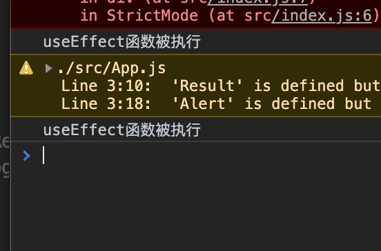
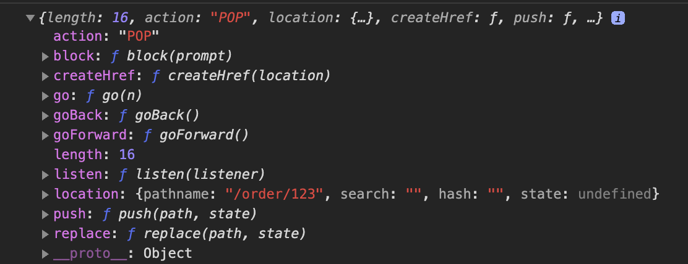
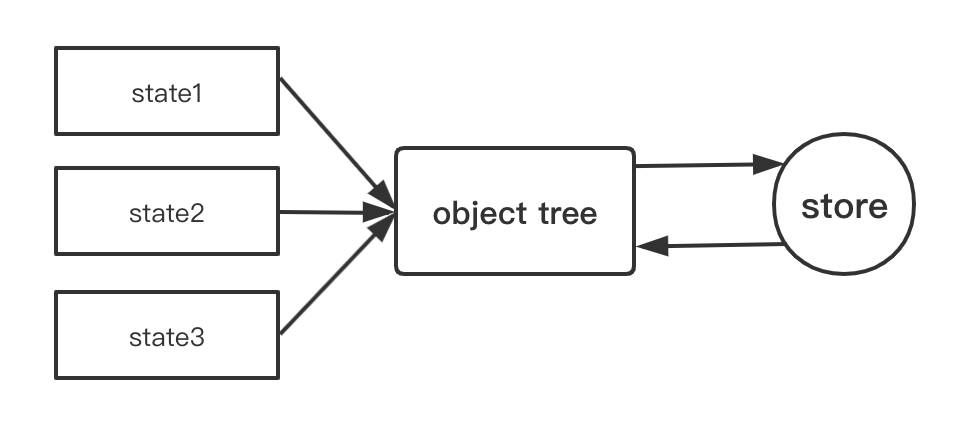
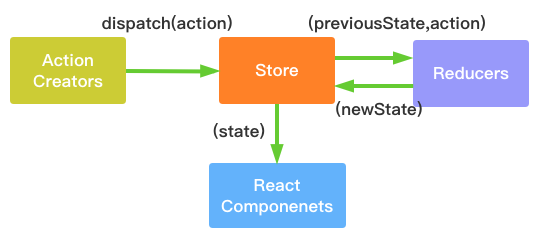

# React 进阶

通过简单引入js文件，过了一遍React基本知识点和jsx。接下来开始使用脚手架，通过实际中工程上手。


## 1.脚手架

### Create React App

> #### **Create React App** 是一个用于**学习 React** 的舒适环境，也是用 React 创建**新的单页应用**的最佳方式。
>
> #### 它会配置你的开发环境，以便使你能够使用最新的 JavaScript 特性，提供良好的开发体验，并为生产环境优化你的应用程序。

说白了就是类似vue推出的vue cli，会帮你配置一些工具链中需要的东西，不用每一次都进行繁琐的配置

执行

```bash
npm install -g create-react-app
create-react-app 项目名
```

或者

```bash
npx create-react-app 项目名
```

>#### 1.上面第一个命令是全局安装create-react-app这个脚手架，之后创建react项目 使用create-react-app 项目名
>
>#### 2.第二个是执行npm安装create-react-app后 再执行create-react-app 项目名。就是将两个命令合二为一了

如果出现yarn超时错误：

```bash
yarn config set registry https://registry.npm.taobao.org
```


出现以下画面 单页应用工程创建完成


运行异常：create-react-app npm star 关于解决webpack版本过高导致的报错

```bash
There might be a problem with the project dependency tree.
It is likely not a bug in Create React App, but something you need to fix locally.

The react-scripts package provided by Create React App requires a dependency:

  "webpack": "4.42.0"

Don't try to install it manually: your package manager does it automatically.
However, a different version of webpack was detected higher up in the tree:

```

> #### 1.大概意思就是在我的目录下检测到4.41.2版本的webpack.
>
> #### 2.然后我按照[这里](https://blog.csdn.net/muzi190/article/details/84108714)的方法进行webpack删除重新安装还是出问题，
>
> #### 3.最后删除4.41.2的那个所在目录的webpack文件夹后重新install了一下就行了


## 2.工程目录


### 1.默认脚手架生成的目录

---

|——*node_modules*  依赖

|——*public*

​	|—— *静态目录*（可以将图片，json等静态资源放在这里

|—— *src* 源码

​	|—— *App.css* （app根节点 css样式）

​	|—— *App.js* （app根节点jsx）

​	|—— *App.test.js* （app根节点测试）

​	|—— *index.css* （index.html样式 全局）

​	|—— *index.js* （类似vue中main.js 也是应用的入口）

​	|—— *logo.svg*

​	|—— *serviceWorker.js* （sw相关的离线缓存等技术）

​	|—— *setupTests.js* （单元测试相关的配置）

|—— *.gitignore*

|—— *package.json*

|—— *README.md*

|—— *yarn.lock*

---


### 2.命令

```json
"scripts": {
    "start": "react-scripts start",
    "build": "react-scripts build",
    "test": "react-scripts test",
    "eject": "react-scripts eject"
  }
```

在`package.json`中有如下命令，需要关注的是`eject`这项

这个命令是暴露webpack相关的一些配置文件，需要注意的是这个操作是不可逆的，一旦暴露就不能恢复。

> #### 在执行这个命令时需要将本地所有修改文件提价git或者回滚，否则会执行失败


**执行后的目录结构**

---

|——***config*** **（webpack相关的配置）**

|——***scripts*** **（执行的上述的脚本）**

|——*node_modules*  （依赖）

|——*public*

​	|—— *静态目录*（可以将图片，json等静态资源放在这里

|—— *src* 源码

​	|—— *App.css* （app根节点 css样式）

​	|—— *App.js* （app根节点jsx）

​	|—— *App.test.js* （app根节点测试）

​	|—— *index.css* （index.html样式 全局）

​	|—— *index.js* （类似vue中main.js 也是应用的入口）

​	|—— *logo.svg*

​	|—— *serviceWorker.js* （sw相关的离线缓存等技术）

​	|—— *setupTests.js* （单元测试相关的配置）

|—— *.gitignore*

|—— *package.json*

|—— *README.md*

|—— *yarn.lock*

---


##  3.使用

同vue一样，react的入口也是从app开始

### 添加对saas支持

react官方已经支持了saas的使用，只需要安装saas插件，无需配置webpack

```bash
yarn add node-saas -S
```

然后将文件的后缀改成saas的扩展名就可以使用saas了


## 4.使用第三方组件库

基本同vue一样

- ### [ant design](https://ant.design/docs/react/getting-started-cn)

- ### [material-ui](https://material-ui.com/zh/)

- ### [有赞](https://youzan.github.io/zent/zh/guides/install)


## 5.路由

路由应该是单页spa的灵魂所在了，学过vue-router后来上手react-router 有相似也有不同


### react-router与react-router-dom的区别

> 1. react-router: 实现了路由的核心功能
> 2. react-router-dom: 基于react-router，加入了在浏览器运行环境下的一些功能，例如： Link组件，会渲染一个a标签，Link组件源码a标签行; BrowserRouter和HashRouter组件，前者使用pushState和popState事件构建路由，后者使用window.location.hash和hashchange事件构建路由
> 3. react-router-dom依赖react-router，所以我们使用npm安装依赖的时候，只需要安装相应环境下的库即可，不用再显式安装react-router。基于浏览器环境的开发，只需要安装react-router-dom

### 安装

```bash
yarn add react-router-dom
```

### 路由组件

#### 1.BrowserRouter

> 使用 HTML5 提供的 history API (`pushState`, `replaceState` 和 `popstate` 事件) 来保持 UI 和 URL 的同步。

**1.在项目目录下创建一个js文件用来管理路由，并写入**

```jsx
import { BrowserRouter as Router, Route } from "react-router-dom";
import React from "react";
import App from "../App";
import Login from "../pages/Login";
import Home from "../pages/Home";
export default function IRouter() {
  return (
    <Router>
      <Route path="/" component={App}></Route>
      <Route path="/login" component={Login}></Route>
      <Route path="/home" component={Home}></Route>
    </Router>
  );
}
```

> 1.引入路由组件，这个和vue-router是有所不同，vue-router是对象，而react是组件
>
> 2.接下来配置很像，就是通过不用的path加载不同的组件，类似vue中的views文件下的那些

**2.修改index.js下的根节点渲染**

```jsx
import React from "react";
import ReactDOM from "react-dom";
import * as serviceWorker from "./serviceWorker";
import Router from "./router";
ReactDOM.render(
  <React.StrictMode>
    <Router />
  </React.StrictMode>,
  document.getElementById("root")
);
```

> 这里和`vue-router`区别还是蛮大的，vue中的路由视图渲染是通过`<router-view>`放入到模板中，而react将`router`看做一个`组件`，所有的路由变化都是基于这个组件的所以render节点换成刚刚上面定义的`Router组件`

**3.效果**


#### 2.Switch

上面的例子在最后我们会发现，当输入`/login`会匹配`/`和`/login`两个路由下的组件，所以就会出现上图的两个组件都加载了

> ### Switch 组件会加载第一个匹配的

 效果：	
 但是我们会发现，这样的话当输入`/login`匹配到`/`就停止了，而实际上我们只想加载login页面

> ### 使用exact 精准匹配

```jsx
 <Router>
      <Switch>
        <Route exact path="/" component={App}></Route>
        <Route path="/home" component={Home}></Route>
        <Route path="/login" component={Login}></Route>
      </Switch>
    </Router>
```

通过对`/`加上exact 精准匹配，从而避免了`/login`匹配到`/`就结束了


#### 3.HashRouter

> 使用 URL 的 `hash` 部分（即 `window.location.hash`）来保持 UI 和 URL 的同步。

 这个就是类似vue中默认用的那个hash模式,会有`#`

````jsx
import { HashRouter as Router, Route, Switch } from "react-router-dom";
import React from "react";
import App from "../App";
import Login from "../pages/Login";
import Home from "../pages/Home";
export default function IRouter() {
  return (
    <Router>
      <Switch>
        <Route exact path="/" component={App}></Route>
        <Route path="/home" component={Home}></Route>
        <Route path="/login" component={Login}></Route>
      </Switch>
    </Router>
  );
}
````

**效果**：


### 路由操作

#### 1.路由跳转 Link

```jsx
import React from "react";
import { Alert, Result } from "antd";
import { Link } from "react-router-dom";

export default function Home() {
    return (
        <div>
            <Alert message="个人中心"></Alert>
            <Result status="success" title="欢迎来到个人中心"></Result>
            <Link to="/login">点击跳转回登录页面</Link>
        </div>
    );
}
```

> 很像route-link标签… 实际上dom也是生成一个`<a>`标签

#### 2.NavLink

> `<NavLink>`是`<Link>`的一个特定版本，会在匹配上当前的url的时候给已经渲染的元素添加参数，组件的属性有

- #### activeClassName(string)：设置选中样式，默认值为active

- #### activeStyle(object)：当元素被选中时，为此元素添加样式

- #### exact(bool)：为true时，只有当导致和完全匹配class和style才会应用

- #### strict(bool)：为true时，在确定为位置是否与当前URL匹配时，将考虑位置pathname后的斜线

- #### isActive(func)判断链接是否激活的额外逻辑的功能


#### 3.使用按钮跳转

上述组件为函数式组件，没有状态，需要使用this进行跳转，所以需要有状态组件

```jsx
export default class Class extends React.Component {
  render() {
    return (
      <div>
        <Alert message="个人中心"></Alert>
        <Result status="success" title="欢迎来到个人中心"></Result>
        <Button onClick={() => this.props.history.push("/login")}>
          点击跳转回登录页面
        </Button>
      </div>
    );
  }
}
```

> 其实写到这里突然很香vue-router通过$route.push(‘/’)方式，而react中需要通过有状态组件获得this,通过`this.props.history.push`进行跳转
>
> 但是react有hooks可以解决上述问题，在后续学习中也会了解到


#### 4.动态路由

一般我们都有动态的id传入然后根据id来渲染组件的需求，相同的是react对于动态路由和vue是类似的传值通过 `:参数名` 来实现

```jsx
export default function IRouter() {
  return (
    <Router>
      <Switch>
        <Route exact path="/" component={Home}></Route>
        <Route path="/home" component={Home}></Route>
        <Route path="/login" component={Login}></Route>
        <Route path="/order/:id" component={Order}></Route>
      </Switch>
    </Router>
  );
}
```

> 代码中order后的id就是通过动态的传入，需要注意的是如果id不写的话，那么路由就无法匹配到


#### 5.重定向redirect

对于一些业务，需要登录或者权限才可以看到，否则重定向到另一个页面，vue中在路由对象中添加redirect关键字，而react中是引入`Redirect`组件

```jsx
import {
  BrowserRouter as Router,
  Route,
  Switch,
  Redirect,
} from "react-router-dom";


 <Route path="/home" component={Home}>
          <Redirect to="/login"></Redirect>
 </Route>
```

> 上述代码 当输入/home 会跳转到登录页面


## 6.React Hooks

*使用react hooks要确保版本大于 `16.8`* 

>#### React Hooks 所要解决的就是有状态组件繁重的生命周期，需要写很多重复的代码。而通过hook的机制，可以让我们在hooks写原来生命周期所写的逻辑，但是组件本身使用的是无状态的函数式组件。


### 1.useState

useState 替代的是之前有状态组件中state，并且更新是通过`setState()`方法触发

```jsx
import React, { useState } from "react";
```

首先是引入该api

```jsx
  const [count, setCount] = useState(0);
```

通过调用useState方法，往里传入状态的初始值，左侧通过一个数组接受返回值，第一个是该状态的名称，第二个是更新该状态的方法名称

```jsx
<h1>当前函数式组件：{count}</h1>
```

渲染直接写该名称即可

```jsx
<Button onClick={() => setCount(count + 1)}>增加</Button>
```

更新状态也十分简单，调用之前写的更新状态的函数名，传入新的值即可。这里这个函数名并不一定要写setXX，也可以是其他命名。

```jsx
import React, { useState } from "react";
import { Alert, Result, Button } from "antd";
import { Link } from "react-router-dom";

export default function Home() {
  const [count, setCount] = useState(0);
  return (
    <div>
      <Alert message="个人中心"></Alert>
      <Result status="success" title="欢迎来到个人中心"></Result>
      <h1>当前函数式组件：{count}</h1>
      <Button onClick={() => setCount(count + 1)}>增加</Button>
      <br />
      <Link to="/login">点击跳转回登录页面</Link>
    </div>
  );
}
```

完整代码

> 通过对比可以发现，hooks api省去了有状态组件需要首先定义`state`，然后通过统一的`setState`方法调用更新。并且在render函数中，需要通过this.state.状态名调用。而相比之下，useState的方式显然更加简洁。


### 2.useEffect

useEffect函数的对应的有生命周期组件的 `componentDidMount()` 和 `componentDidUpdate` 。也就是在组件加载时会执行，或者当组件中state发生变化时会执行。

```jsx
  useEffect(() => console.log("useEffect函数被执行"));
```

当我们渲染完界面，并点击按钮更新count后，控制台打印如下



可以发现，该函数的确被执行了两次。也就是说，当我们的**组件加载**的时候和**数据发生更新**的时候就会执行该函数。


但是假如在该函数中进行ajax异步请求，每次在更新数据时都会进行一次ajax请求，这不是我们想要的，这时候如果希望该函数在数据更新时不会执行，只需要在第二个参数中传入一个空数组即可

```jsx
  useEffect(() => console.log("useEffect函数被执行"),[]);
```

这里只是入门，后续会针对hooks再学习


## 7.路由Hooks

通过hooks可以对路由的参数，路由的跳转等实现


### 1.useParams

先来看看有状态组件获取路由参数

```jsx
this.props.match.params.路由参数名
```

不得不说真的好长。。。

那么hooks就相对简单了

```jsx
 import { useParams } from "react-router-dom";

const params = useParams();

console.log(params);
//{id: "123"}
```

 该函数返回的是一个json对象 

完成的例子:

```jsx
import React from "react";
import { useParams } from "react-router-dom";
import { Card } from "antd";

export default function Order() {
  const { id } = useParams();
  return (
    <Card title={`订单号：${id}`}>
      <p>内容1</p>
      <p>内容2</p>
      <p>内容3</p>
    </Card>
  );
}
```


### 2.useHistory

顾名思义该函数式是用来操作路由的跳转相关的

```jsx
import { useParams, useHistory } from "react-router-dom";
 
 const router = useHistory();
 console.log(router);
```

同样该函数返回一个json对象



都是与路由操作相关的

```jsx
<Button onClick={() => router.push("/login")}>登录</Button>
```

使用也比较简单，而在有状态组件中需要

```jsx
this.props.history.push("/")
```

所以对比一下就会发现hooks带来的是减少代码，并且使用更加简单


# 8.Redux

类似vuex用来全局状态管理,它是一个单独的js库,不是react的插件


### 三大原则

#### 单一数据源

**整个应用的 state 储存在一棵 object tree 中，并且这个 object tree 只存在于唯一一个store中。**



>其实和vuex差不多的

#### State 是只读的

**唯一改变 state 的方法就是触发 action，action 是一个用于描述已发生事件的普通对象。**

>同样的对于vuex而言，更改数据的唯一方法就是通过mutations对象中的方法


#### 使用纯函数来执行修改

**为了描述 action 如何改变 state tree ，你需要编写 reducers。**

>*Reducer* (也称为 *reducing function*) 函数接受两个参数：之前累积运算的结果和当前被累积的值，返回的是一个新的累积结果。该函数把一个集合归并成一个单值。


**纯函数**是函数式编程的概念，必须遵守以下一些约束。

> - 不得改写参数
>
> - 不能调用系统 I/O 的API
>
> - #### 不能调用`Date.now()`或者`Math.random()`等不纯的方法，因为每次会得到不一样的结果

由于 Reducer 是纯函数，就可以保证同样的State，必定得到同样的 View。Reducer 函数里面不能改变 State，必须返回一个全新的对象

```javascript
// State 是一个对象
function reducer(state, action) {
  return Object.assign({}, state, { thingToChange });
  // 或者
  return { ...state, ...newState };
}

// State 是一个数组
function reducer(state, action) {
  return [...state, newItem];
}
```


### Redux组成

#### Store

> store 就是把action与reducer联系到一起的对象

职责:

* 维护应用的state
* 提供getState()方法获取state
* 提供dispatch()方法发送action
* 提供subscribe()来注册监听
* 通过subscribe()返回值来注销监听


#### State

> 状态


#### Action

> 描述有事情发生，并不描述如何去更新state

* 本质是一个js对象
* 必须包含type属性


#### Reducer

* 本质是函数
* 响应发过来的action
* 函数接受两个参数，一个是初始化state，第二个是发过来的action
* 必须要有return返回值


### Redux流程





### 使用

#### 安装

```bash
yarn add redux 
```

安装redux，注意这里的redux是公用的javascript库

```
yarn add react-redux
```

安装后可以在react中使用

```bash
yarn add redux-thunk
```

该中间件可以使在 Redux 应用中实现异步性，类似vuex中actions对象下所对应的异步


#### Provider 组件

> React-Redux 提供`Provider`组件，可以让容器组件拿到`state`

```react
import React from "react";
import "./App.scss";
import { Provider } from "react-redux";
import "antd/dist/antd.css";
import Router from "./router";
function App() {
  return (
    <Provider store={store}>
      <div className="app">
        <nav>菜单栏</nav>
        <Router></Router>
      </div>
    </Provider>
  );
}

export default App;
```

上面代码中，`Provider`在根组件外面包了一层，这样一来，`App`的所有子组件就默认都可以拿到`state`了


#### 创建store

使用**`createStore(reducer, [preloadedState], enhancer)`**方法

> #### 参数
>
> 1. #### `reducer` *(Function)*: 接收两个参数，分别是当前的 state 树和要处理的action，返回新的state 树。
>
> 2. #### [`preloadedState`] *(any)*: 初始时的 state。 在同构应用中，你可以决定是否把服务端传来的 state 水合（hydrate）后传给它，或者从之前保存的用户会话中恢复一个传给它。如果你使用`combineReducers` 创建 `reducer`，它必须是一个普通对象，与传入的 keys 保持同样的结构。否则，你可以自由传入任何 `reducer` 可理解的内容。
>
> 3. #### `enhancer` *(Function)*: Store enhancer 是一个组合 store creator 的高阶函数，返回一个新的强化过的 store creator。这与 middleware 相似，它也允许你通过复合函数改变 store 接口。
>
> #### 返回值
>
> #### [`Store`]: 保存了应用所有 state 的对象。改变 state 的惟一方法是 dispatch  action。你也可以 subscribe 监听 state 的变化，然后更新 UI。


```react
import { applyMiddleware, createStore } from "redux";
import thunk from "redux-thunk";

const initalState = {};

const middleware = [thunk];

const store = createStore(
  () => [],
  initalState,
  applyMiddleware(...middleware)
);

export default store;
```

>#### createStore 传入【】可能含有多个reducer,initalState（初始化的状态），applyMiddlewares()
>
>----------------------------------------------
>
>#### `applyMiddlewares`这个方法到底是干什么的？
>
>#### 它是 Redux 的原生方法，作用是将所有中间件组成一个数组，依次执行。所以这里定义了一个中间件数组，并使用es6的剩余写法传入此方法中。


#### 改造reducers

一个项目中的reducers是非常多的，如果全部写在一起，体积也是非常庞大，所以需要分模块来书写，最后通过 `combineReducers`方法进行合并


```react
import { combineReducers } from "redux";
import commonFn from "./common/index";

export default combineReducers({
  common: commonFn,
});
```


```react
const initialState = {
  name: "lomofu",
};

export default function (state = initialState, action) {
  switch (action.type) {
    default:
      return state;
  }
}
```

写到这里是不是有一种似曾相识的感觉，没错这个不就类似vuex中modules那个概念吗


#### getState()

可以获取store中的值

```react
import store from "./store";

function App() {
    console.log(store.getState())
  return (
    <Provider store={store}>
      <div className="app">
        <nav>菜单栏</nav>
        <Router></Router>
      </div>
    </Provider>
  );
}
```

> 返回一个object
>
> ```json
> {
> 	'common':{
> 		'name': "lomofu"
> 	}
> }
> ```


#### connect()