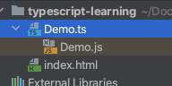
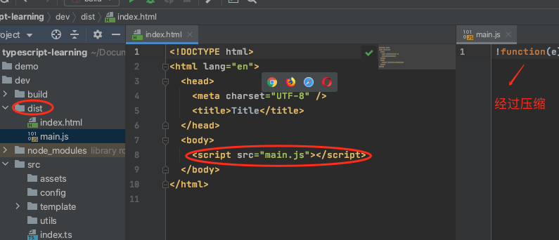

# TypeScript- 概述，环境搭建


## 什么是TypeScript？

> TypeScript extends JavaScript by adding types.
>
> By understanding JavaScript, TypeScript saves you time catching errors and providing fixes before you run code.
>
> Any browser, any OS, anywhere JavaScript runs. Entirely Open Source.
>
> #### JavaScript and More
>
> #### A Result You Can Trust
>
> #### Gradual Adoption
>
> — https://www.typescriptlang.org/


## 语言特性

- [类型批注](https://zh.wikipedia.org/wiki/类型批注)和[编译时](https://zh.wikipedia.org/wiki/编译时)[类型检查](https://zh.wikipedia.org/wiki/类型系统)
- [类型推断](https://zh.wikipedia.org/wiki/类型推断)
- [类型擦除](https://zh.wikipedia.org/wiki/类型擦除)
- [接口](https://zh.wikipedia.org/wiki/介面_(資訊科技))
- [枚举](https://zh.wikipedia.org/wiki/枚举)
- [Mixin](https://zh.wikipedia.org/wiki/Mixin)
- [泛型编程](https://zh.wikipedia.org/wiki/泛型编程)
- [名字空间](https://zh.wikipedia.org/wiki/命名空间)
- [元组](https://zh.wikipedia.org/wiki/元组)
- [Await](https://zh.wikipedia.org/wiki/Await)


## 环境准备

- 安装包含 npm 的 Node.js 环境（十分简单不再赘述）

- 针对使用npm的用户：

  ```bash
  npm install -g typescript
  ```

  

## 编写HelloWorld程序

按照国际惯例,一切从简单的helloworld开始

### 1.新建.ts文件

Demo.ts

```typescript
function hello(name: string) {
    return `hello ${name}`;
}

document.getElementById('container').innerText = hello('lomo');


```

### 2.运行TypeScript编译器

```bash
tsc Demo.ts
```

编译器会将TypeScript编译成浏览器可执行的JavaScript



### 3.Html引入

```html
<!DOCTYPE html>
<html lang="en">
<head>
    <meta charset="UTF-8">
    <title>Title</title>
</head>
<body>
<h1 id="container"></h1>
<!--引入编译后的js文件-->
<script src="Demo.js"></script>
</body>
</html>
```


## ts-node 运行

node不能直接运行ts代码，实际使用是往往需要使用tsc将ts代码编译成js代码，ts-node则包装了node，它可以直接的运行ts代码，使用起来很方便

### 1.安装依赖

```bash
npm i -g ts-node
```

### 2.代码

```typescript
function hello(name: string) {
    return `hello ${name}`;
}

console.log(hello('lomo'));
```

### 3.运行

```bash
ts-node Demo.ts 
```


## 基于Webpack搭建开发环境

### 1.全局安装typescript, tslint

```bash
npm i -g typscript tslint
```

### 2.创建目录结构

*project*

- *build —— webpack 打包相关运行的脚本*

- *src* 
  - *assets —— 静态文件*
  - *config —— 配置*
  - *utils —— 工具相关*

- *typings —— 为typescript一些模块书写的生命文件*

### 3.初始化TS配置

```bash
tsc --init
```

可以看到会生成一个 `tsconfig.json`

```json
{
  "compilerOptions": {
    /* Visit https://aka.ms/tsconfig.json to read more about this file */

    /* Basic Options */
    // "incremental": true,                   /* Enable incremental compilation */
    "target": "es5",                          /* Specify ECMAScript target version: 'ES3' (default), 'ES5', 'ES2015', 'ES2016', 'ES2017', 'ES2018', 'ES2019', 'ES2020', or 'ESNEXT'. */
    "module": "commonjs",                     /* Specify module code generation: 'none', 'commonjs', 'amd', 'system', 'umd', 'es2015', 'es2020', or 'ESNext'. */
    // "lib": [],                             /* Specify library files to be included in the compilation. */
    // "allowJs": true,                       /* Allow javascript files to be compiled. */
    // "checkJs": true,                       /* Report errors in .js files. */
    // "jsx": "preserve",                     /* Specify JSX code generation: 'preserve', 'react-native', or 'react'. */
    // "declaration": true,                   /* Generates corresponding '.d.ts' file. */
    // "declarationMap": true,                /* Generates a sourcemap for each corresponding '.d.ts' file. */
    // "sourceMap": true,                     /* Generates corresponding '.map' file. */
    // "outFile": "./",                       /* Concatenate and emit output to single file. */
    // "outDir": "./",                        /* Redirect output structure to the directory. */
    // "rootDir": "./",                       /* Specify the root directory of input files. Use to control the output directory structure with --outDir. */
    // "composite": true,                     /* Enable project compilation */
    // "tsBuildInfoFile": "./",               /* Specify file to store incremental compilation information */
    // "removeComments": true,                /* Do not emit comments to output. */
    // "noEmit": true,                        /* Do not emit outputs. */
    // "importHelpers": true,                 /* Import emit helpers from 'tslib'. */
    // "downlevelIteration": true,            /* Provide full support for iterables in 'for-of', spread, and destructuring when targeting 'ES5' or 'ES3'. */
    // "isolatedModules": true,               /* Transpile each file as a separate module (similar to 'ts.transpileModule'). */

    /* Strict Type-Checking Options */
    "strict": true,                           /* Enable all strict type-checking options. */
    // "noImplicitAny": true,                 /* Raise error on expressions and declarations with an implied 'any' type. */
    // "strictNullChecks": true,              /* Enable strict null checks. */
    // "strictFunctionTypes": true,           /* Enable strict checking of function types. */
    // "strictBindCallApply": true,           /* Enable strict 'bind', 'call', and 'apply' methods on functions. */
    // "strictPropertyInitialization": true,  /* Enable strict checking of property initialization in classes. */
    // "noImplicitThis": true,                /* Raise error on 'this' expressions with an implied 'any' type. */
    // "alwaysStrict": true,                  /* Parse in strict mode and emit "use strict" for each source file. */

    /* Additional Checks */
    // "noUnusedLocals": true,                /* Report errors on unused locals. */
    // "noUnusedParameters": true,            /* Report errors on unused parameters. */
    // "noImplicitReturns": true,             /* Report error when not all code paths in function return a value. */
    // "noFallthroughCasesInSwitch": true,    /* Report errors for fallthrough cases in switch statement. */

    /* Module Resolution Options */
    // "moduleResolution": "node",            /* Specify module resolution strategy: 'node' (Node.js) or 'classic' (TypeScript pre-1.6). */
    // "baseUrl": "./",                       /* Base directory to resolve non-absolute module names. */
    // "paths": {},                           /* A series of entries which re-map imports to lookup locations relative to the 'baseUrl'. */
    // "rootDirs": [],                        /* List of root folders whose combined content represents the structure of the project at runtime. */
    // "typeRoots": [],                       /* List of folders to include type definitions from. */
    // "types": [],                           /* Type declaration files to be included in compilation. */
    // "allowSyntheticDefaultImports": true,  /* Allow default imports from modules with no default export. This does not affect code emit, just typechecking. */
    "esModuleInterop": true,                  /* Enables emit interoperability between CommonJS and ES Modules via creation of namespace objects for all imports. Implies 'allowSyntheticDefaultImports'. */
    // "preserveSymlinks": true,              /* Do not resolve the real path of symlinks. */
    // "allowUmdGlobalAccess": true,          /* Allow accessing UMD globals from modules. */

    /* Source Map Options */
    // "sourceRoot": "",                      /* Specify the location where debugger should locate TypeScript files instead of source locations. */
    // "mapRoot": "",                         /* Specify the location where debugger should locate map files instead of generated locations. */
    // "inlineSourceMap": true,               /* Emit a single file with source maps instead of having a separate file. */
    // "inlineSources": true,                 /* Emit the source alongside the sourcemaps within a single file; requires '--inlineSourceMap' or '--sourceMap' to be set. */

    /* Experimental Options */
    // "experimentalDecorators": true,        /* Enables experimental support for ES7 decorators. */
    // "emitDecoratorMetadata": true,         /* Enables experimental support for emitting type metadata for decorators. */

    /* Advanced Options */
    "skipLibCheck": true,                     /* Skip type checking of declaration files. */
    "forceConsistentCasingInFileNames": true  /* Disallow inconsistently-cased references to the same file. */
  }
}

```

### 4.添加依赖

- 安装 webpack 相关依赖

```bash
npm install webpack webpack-cli webpack-dev-server -D
```

> 这里的webpack版本是 webpack@4.44.1，webpack4可以减少配置的书写


- 安装 ts-loader

```bash
npm install ts-loader -D
```

用ts-loader处理`.ts`,`.tsx` 相关文件


- 安装 html-webpack-plugin， clean-webpack-plugin插件

```bash
npm i clean-webpack-plugin html-webpack-plugin -D
```

**html-webpack-plugin**

> html-webpack-plugin可以根据你设置的模板，在每次运行后生成的对应的模板文件，同时所依赖的CSS/JS也都会被引入，如果CSS/JS中含有hash值，则html-webpack-plugin生成的模板文件也会正确版本的CSS/JS文件。

[GitHub](https://github.com/jantimon/html-webpack-plugin)

[配置](https://www.jianshu.com/p/07c8ff5ef37f)

**clean-webpack-plugin**

> 在使用webpack打包时，打包后的文件名如果一样，那么每次打包后，新生成的文件就会将之前打包的文件覆盖掉，但是如果给输出的文件名设置根据内容生成的hash值后，由于每次打包后生成的文件名的hash值会不一样，这样就不会因文件名相同而覆盖原来的文件，在文件目录中出现了一些多余的文件
>
> 该插件可以帮助我们自动清除完成每次打包前的文件清除工作。


- 安装 cross-env

```bash
npm  i cross-env -D  
```

> 运行跨平台设置和使用环境变量的脚本

```json
"devDependencies": {
  "clean-webpack-plugin": "^3.0.0",
  "cross-env": "^7.0.2",
  "html-webpack-plugin": "^4.3.0",
  "ts-loader": "^8.0.2",
  "webpack": "^4.44.1",
  "webpack-cli": "^3.3.12",
  "webpack-dev-server": "^3.11.0"
}
```


### 5.书写webpack运行脚本

在build目录下新建一个js文件命名为`webpack.config.js`

```js
const HtmlWebpackPlugin = require("html-webpack-plugin"); //指定一个html模板，基于这个模板进行编译
const { CleanWebpackPlugin } = require("clean-webpack-plugin"); //可以清理一些指定的额文件夹或文件

module.exports = {
  //项目编译的入口文件(没有记得去指定位置创建)
  entry: "./src/index.ts",
  //编译完成后输出文件
  output: {
    filename: "main.js",
  },
  resolve: {
    //比如import xxx from "./index" -> import xxx from "./index.js" 可省略
    extensions: [".js", ".ts", ".tsx"],
  },
  module: {
    //可以配置对指定文件的处理
    rules: [
      {
        test: /\.tsx?$/,
        use: "ts-loader",
        exclude: /node_modules/,
      },
    ],
  },
  //配置sourcemap，可以定位代码方便调试，但是上线后是不需要的 所以判断当前环境而动态选择
  devtool: process.env.NODE_ENV === "production" ? false : "inline-source-map",
  //配置webpack-dev-server
  devServer: {
    //本地开发环境，运行时基于哪个文件夹作为根目录运行
    contentBase: "./dist",
    //控制台可以打印哪些信息
    stats: "errors-only",
    host: "localhost",
    port: 8089,
  },
  plugins: [
    new CleanWebpackPlugin({
      cleanOnceBeforeBuildPatterns: ["./dist"],
    }),
    new HtmlWebpackPlugin({
      template: "./src/template/index.html",
    }),
  ],
};

```

### 6.指定启动指令

在`package.json`的scripts 中指定**start**命令

```
"start": "cross-env NODE_ENV=dev webpack-dev-server --config ./build/webpack.config.js"
```

- 该命令通过cross-env 传入NODE_ENV环境变量
- 用webpack-dev-server 启动，并指定启动路径的脚本


### 7.指定打包指令

在`package.json`的scripts 中指定**build**命令

```
"build": "cross-env NODE_ENV=production webpack --config ./build/webpack.config.js"
```

- 该命令通过cross-env 传入NODE_ENV环境变量
- 用webpack进行打包，并指定启动路径的脚本


### 7.测试

执行

```bash
npm start
```

控制台输入

```bash
> dev@1.0.0 start /Users/lomofu/Documents/project/js/typescript-learning/dev
> cross-env NODE_ENV=dev webpack-dev-server --config ./build/webpack.config.js

ℹ ｢wds｣: Project is running at http://localhost:8089/
ℹ ｢wds｣: webpack output is served from /
ℹ ｢wds｣: Content not from webpack is served from ./dist
ℹ ｢wdm｣: Compiled successfully.


```

执行

```bash
npm run build
```

会在根目录下生成dist文件夹，并且html中会引入相应main.js



至此基于Webpack搭建开发环境搭建完毕
