# Vue 3.0 周边之Vite

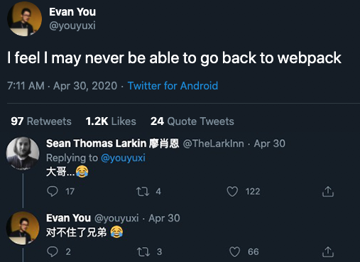

> Vite是尤哥的又一个新的工具。在宣布这个工具时候，Webpack作者也在下面留言表示很尴尬。在Vue3的分享会上，尤大也提到了Vite。那么就来看一下这个工具吧。
>
> [GitHub](https://github.com/vitejs/vit)


## 定义

> Vite is an opinionated web dev build tool that serves your code via native ES Module imports during dev and bundles it with [Rollup](https://rollupjs.org/) for production.
>
> Vite offers a no-bundler dev setup that allows you to develop Vue apps with Single-File Components without any bundling during development
>
> — vitejs

说白了Vite是一个面对现代浏览器的开发构建工具。**并且采用的是原生ES模块导入的方式来实现**。也就是说Vite在开发的时候没有打包的过程（用过Webpack都知道那个打包的过程）。而是使用ES Module规范，通过浏览器使用自带的`<script type='module'>`进行导入。并且通过Rollup 进行产品的最终上线打包。

**当遇见import依赖时，会直接发起http请求对应的模块文件。**同时用vite开发Vue SFC APP，不需要进行任何的打包编译在开发过程中。因为Vite提供了这样一个no-bundler的服务器。这对于开发而言有更好的体验。


## 优点

- Lightning fast cold server start 轻量快速的冷启动
- Instant hot module replacement(HMR) 及时的热模块替换
- True on-demand compilation 真正的按需编译


## JavaScript modules 模块

现代的js已经不再是以前的程序非常小，执行独立的脚本任务了。我们可以用js做许多事情，如构建SPA应用，甚至用来当做服务器语言。随着工程项目的庞大，模块化就十分重要。它可以使得我们的项目层次清晰，避免过于庞大臃肿的代码，易于维护等。

Js 的模块化道路可谓是百花齐放。有最初的立即执行函数方式、有基于CommonJS 和AMD规范的模块系统（如RequireJS）等等。ES2015一项重要更新就是引入新的模块化方式。使用import关键字进行导入。当然现代浏览器绝大部分都已经支持这样的标准，下面我们就以`import` 和 `export` 简单的实现一个模块化导出和导入。

1.创建一个**util.mjs**
简答的写入一个hello函数，并使用 `export`关键字导出

```javascript
const hello = name => `hello ${name}`;

export { hello };
```

> 可能会注意到我这个文件的后缀是 `.mjs`, 当然替换为`.js`也没有任何问题。这是V8推荐的拓展名写法，目的是可以清楚的辨认哪些文件是模块，哪些是常规的js文件。同时此扩展名可以更好地被构建工具识别（Babel, Node）。

2.html中引入

```html
<!DOCTYPE html>
<html lang="en">
  <head>
    <meta charset="UTF-8" />
    <meta name="viewport" content="width=device-width, initial-scale=1.0" />
    <title>Document</title>
  </head>
  <body>
    <div></div>
    //需要标注type = module
    <script type="module">
      import { hello } from "./util.mjs";
      document.getElementsByTagName("div")[0].innerText = hello("lomo");
    </script>
  </body>
</html>
```

这里需要注意两点：

- 首先在`script`标签中需要将type属性指定为`module`,声明这个脚本是一个模块，并且只能在模块内部使用 `import` 和`export` 语句 

- 如何启动？ 你需要一台http静态服务器来启动。如果你直接通过`file`的方式运行，控制台会报错：

  ```bash
  Access to script at 'file:///Users/lomofu/Documents/project/js/test/util.mjs' from origin 'null' has been blocked by CORS policy: Cross origin requests are only supported for protocol schemes: http, data, chrome, chrome-extension, https.
  ```

  **在浏览器里使用 ES module 是使用 http 请求拿到模块。**也就是说我们需要一个静态服务器。这里提供两种方案：

  ​	**1.通过命令**

  ```bash
  npx serve
  ```

  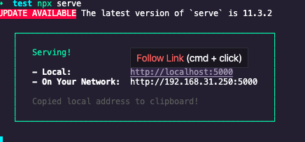

  或者

  ```bash
  npx http-server
  ```

  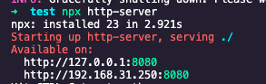

  两者都可以快速的启动一个http静态服务器。

  

  ​	**2.插件**

  ​	如果是在`vscode` 你可以安装一个`Live Server`插件

  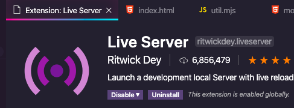

  ​	右键需要运行的Html文件 ，选择第一项：以Live Server 打开

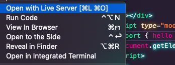

​			那么它会启动一个静态资源服务器，让你可以访问（模拟真实场景的使用）。

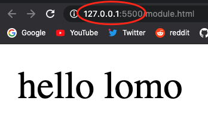

以上简单的实现了`vite`基于`module sciprt`的特性，更多关于js 模块化可以查阅：

- [JavaScript modules 模块 - MDN](https://developer.mozilla.org/zh-CN/docs/Web/JavaScript/Guide/Modules)
- [Javascript模块化编程-阮一峰](http://www.ruanyifeng.com/blog/2012/10/javascript_module.html)


## 快速使用

### 环境准备

需要拥有安装 npm/yarn 的node环境


### 创建项目

Vite 目前提供了一个简单的脚手架：**create-vite-app** ,我们可以通过这个脚手架快速创建一个使用Vite构建的Vue.js应用

> 需要注意的是，官方说目前Vite对于Vue的用户只支持Vue3.x。所以Vue2.x的用户想用上Vite是不可以的。

Npm:

```bash
npm init vite-app <project-name>
cd <project-name>
npm install
npm run dev
```

Yarn:

```bash
yarn create vite-app <project-name>
cd <project-name>
yarn
yarn dev 
```

整个构建过程只能用一个形容，那就是“快”。创建一个项目仅仅花了我10秒中的时间...

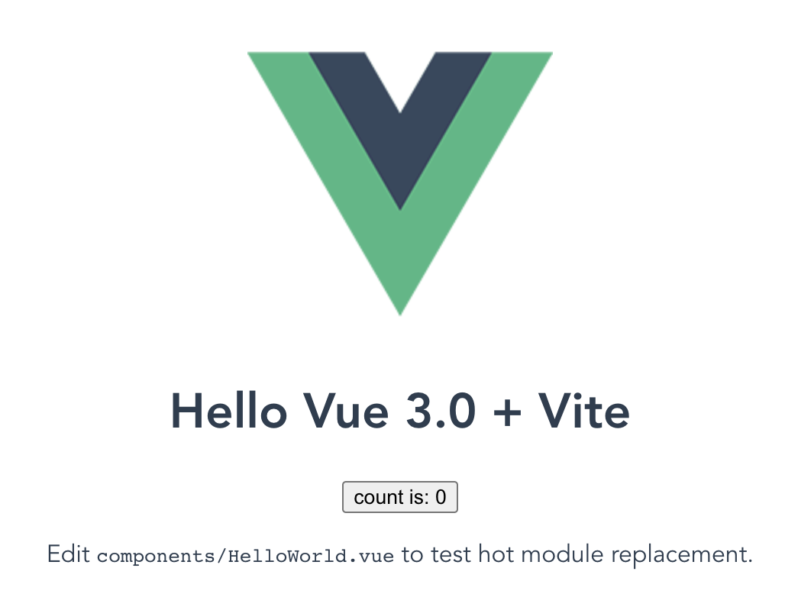

同时官方也说了，虽然Vite主要是为Vue设计的。但是其他的框架也是可以使用的，官方示例是如何创建基于Vite的React项目,运行以下命令：

```bash
npm init vite-app --template react

npm init vite-app --template preact
```


### 项目内容

我们对比一下基于Vite创建的项目与Vue-Cli（基于Webpack）创建的项目的不同。

#### 项目结构

 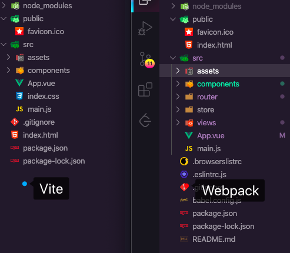

可以看到还是熟悉的配方，两者在项目结构上基本没什么差别。**唯一不用的是Vite中将index.html的位置在放在根目录下，而不是Webpack中放在public中。**

#### 依赖相关

对比两者`package.json`下相关配置

 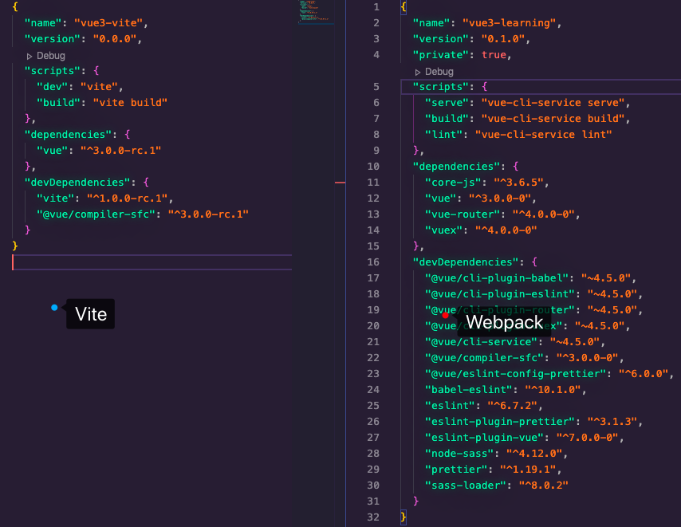

忽略其他第三方插件，可以看到相比于 webpack **少了loader，plugins这些东西,同时运行命令改为了“vite”。**

#### index.html

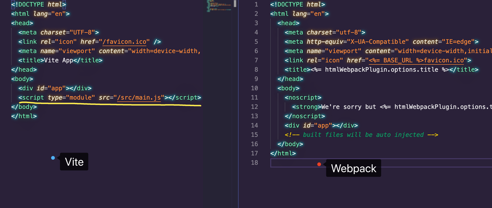

最大的区别是还是在于这个 `<script>` 标签了，也即是我们上面所说的ES 模块在浏览器端的实现。


## How is This Different from `vue-cli` or Other Bundler-based Solutions？

*相比于vue-cli或者基于打包的解决方案有什么不同？*


在前面的构建项目到启动项目时，Vite都做到了几乎秒启动。而使用`vue-cli` 启动时，有个打包的过程。为什么有如此大差别的启动速度呢？我们不妨看看两者在设计方案上的不同。

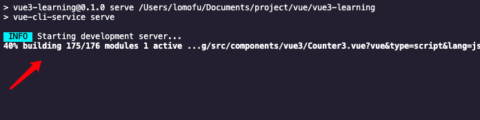


**vue-cli-service（基于Webpack）**

**当我们使用`vue-cli-service server`时候，它主要是以下步骤：**

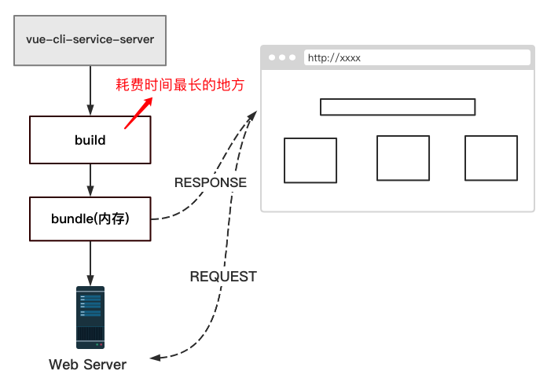

也就是说像webpack这种基于bunlder的构建工具的方案是：**会将所有的模块提前编译、打包进bundle，无论该模块是否被执行，都需要这两部操作。**这样的坏处就是当我们的在面对大型项目的打包过程时，会越来越慢。

**Vite**

Vite提供了另外一种方案：

> The ES Import syntax in your source code is served directly to the browser, and the browser parses them via native `<script module>` support, making HTTP requests for each import. 
>
> -vite.js

源代码中的ES模块会直接提供给浏览器。浏览器通过原生的`<script module>`支持解析，对于每一个import都使用HTTP 请求。

> The dev server intercepts the requests and performs code transforms if necessary. For example, an import to a `*.vue` file is compiled on the fly right before it's sent back to the browser.
>
> -vite.js

同时这个开发服务器会拦截每一个请求，并对有需要时执行代码转换。例如对于一个以`.vue`的文件在被发送给浏览器之前即时编译好。

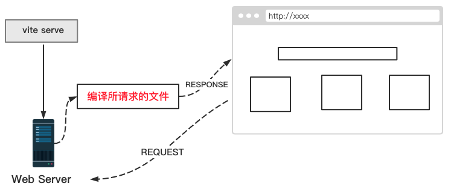

编译只发生在代码需要的时候，真正的做到了按需编译。同时对于HMR而言，模块的数量与替换性能解耦，其性能也提升了。因为并不需要替换后还需要重新进行构建打包。

当然官方也表明了，这种**基于ES moudle的方式会导致深层的导入链路**。简单来说就是你导入的a模块可能a模块中导入了b模块，b模块中导入了c模块…这也就导致了如果是整个页面重新加载会比基于打包的开发服务器略慢。当然这部分时间实际上也不是很大。而且vite也有优化，比如对于编译的文件会被缓存在内存中。

举例：

在第一次执行 `npm run dev`，我们会看到有一个build的过程，非常短暂。仿佛和我们上面讲的有出入

 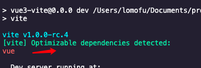

 其实不然，是因为我们在 `main.js`中import了vue。

 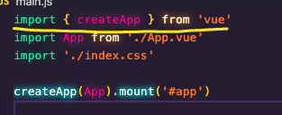

 而这个vue的依赖是存在于node_modules中，那么会出现多模块之间相互依赖（**深层的导入链路**）。考虑到我们并不会去修改node_modules中依赖，以及性能等原因。vite会在第一次启动时，将其打包放入到一个临时目录中，它位于`node_modules/.vite_opt_cache`中

 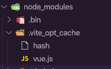

这样的如果我们的vue版本不变，那么永远就是这样一个文件。那么之后的无数次启动，都只需要这样一个文件就足够了，从而可以做到都可以做到0延迟启动。


## Vite特性

### 模块解析

**实现**

如果我们直接在原生的ES模块中载入第三方模块，如下：

```javascript
import { createApp } from "vue"
```

浏览器控制台会报错:

```bash
Uncaught TypeError: Failed to resolve module specifier "vue". Relative references must start with either "/", "./", or "../".
```

提示我们无法解析“vue”模块。也就是说在原生ES模块中，from 后面必须是一个路径（绝对、相对）。

> 平时我们写`import xxx from 'xxx'`，由 `Webpack` 等工具来帮我们找这个模块的具体路径进行打包。但是浏览器不知道你项目里有 `node_modules`，它只能通过相对路径或者绝对路径去寻找模块。

那么vite中为什么可以，打开请求查看发现：

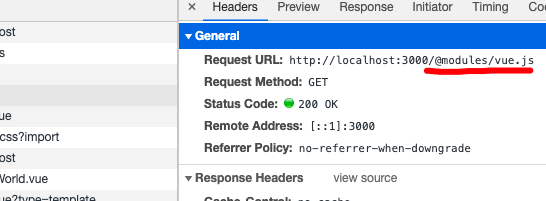

请求路径被改写了，同时查看`main.js`的返回文件可以看到：

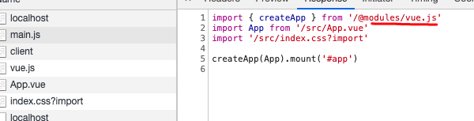

查阅官方文档发现，Vite会侦测例如`.js`文件中暴露的模块引入。并且会重新改写特殊路径像`/@modules/vue`.那么Vite在进行模块解析，会将本地`node_modules`内部的模块包。

> The above will throw an error by default. Vite detects such bare module imports in all served `.js` files and rewrites them with special paths like `/@modules/vue`. Under these special paths, Vite performs module resolution to locate the correct files from your installed dependencies.


**源码**

***改写路径***

对应的这块的源码位于`vite/src/node/server/serverPluginModuleRewrite.js`中。

vite使用的是`Koa`构建服务端，都是以`mdidleware`形式注册koa的中间件。（因为本人之前接触过Koa2，用Koa2写过服务端在我的毕设中），所以大致是能明白的。具体位于`vite/src/node/server/index.ts `，以下我截取部分代码展示：

**Index.ts**

```typescript
//引入各种所需要的配置 依赖 中间件
import Koa, { DefaultState, DefaultContext } from 'koa'
import { createResolver, InternalResolver } from '../resolver'
// 路径改写的中间件
import { moduleRewritePlugin } from './serverPluginModuleRewrite'

//....

//暴露自定义服务器API createServer,之后可以自定义插件并传入
export function createServer(config: ServerConfig): Server {
  const app = new Koa<State, Context>()
    const server = resolveServer(config, app.callback())
  const watcher = chokidar.watch(root, {
    ignored: [/\bnode_modules\b/, /\b\.git\b/]
  }) as HMRWatcher
  const resolver = createResolver(root, resolvers, alias)
  	
  //...
  
   const resolvedPlugins = [
    sourceMapPlugin,
    moduleRewritePlugin,
    htmlRewritePlugin,
    // user plugins
    ...(Array.isArray(configureServer) ? configureServer : [configureServer]),
    envPlugin,
    moduleResolvePlugin,
    proxyPlugin,
    clientPlugin,
    hmrPlugin

     //...
     
  ]
   //注册各种所需要的中间件
  resolvedPlugins.forEach((m) => m && m(context))
  
  //...
 
  return server;
}
```

**serverPluginModuleRewrite.ts**

```typescript
import {
  init as initLexer,
  parse as parseImports,
  ImportSpecifier
} from 'es-module-lexer'

//...

export const moduleRewritePlugin: ServerPlugin = ({
  root,
  app,
  watcher,
  resolver
}) => {
  app.use(async (ctx, next) => {
 		//...
    
    if (
      ctx.body &&
      ctx.response.is('js') &&
      !isCSSRequest(ctx.path) &&
      !ctx.url.endsWith('.map') &&
      // skip internal client
      publicPath !== clientPublicPath &&
      // need to rewrite for <script>\<template> part in vue files
      !((ctx.path.endsWith('.vue') || ctx.vue) && ctx.query.type === 'style')
    ) {
     	//...
      } else {
        await initLexer
        const importer = removeUnRelatedHmrQuery(
          resolver.normalizePublicPath(ctx.url)
        )
        ctx.body = rewriteImports(
          root,
          content!,
          importer,
          resolver,
          ctx.query.t
        )
       //...
  })
```

以上代码为模块解析的部分核心代码，主要做了以下的步骤

- 获取请求body
- 使用`es-module-lexer`中的 initLexer 解析抽象语法树（AST）从而获得 import 的内容
- 判断 import 的资源是否是绝对路径，绝对视为 npm 模块
- 最后返回处理后的资源路径：如："vue” -> "/@modules/vue"


***`/@module/:id`解析支持***

对于其改写后的路径的解析位于`serverPluginModuleResolve.ts`中。下面是这个中间件中的部分核心代码。

**serverPluginModuleResolve.ts**

```typescript
// plugin for resolving /@modules/:id requests.
export const moduleResolvePlugin: ServerPlugin = ({ root, app, resolver }) => {
  app.use(async (ctx, next) => {
 
		//...
    
    // special handling for vue runtime in case it's not installed 对于vue运行时没有安装的特殊处理
    if (!vueResolved.isLocal && id in vueResolved) {
      return serve(id, (vueResolved as any)[id], 'non-local vue')
    }
    
   	// already resolved and cached 已经被解析并且被缓存
    const cachedPath = moduleIdToFileMap.get(id)
    if (cachedPath) {
      return serve(id, cachedPath, 'cached')
    }

    // resolve from vite optimized modules 解析vite优化过得模块 就是位于.vite_opt_cache下的
    const optimized = resolveOptimizedModule(root, id)
    if (optimized) {
      return serve(id, optimized, 'optimized')
    }

    const referer = ctx.get('referer')
    let importer: string | undefined
    // this is a map file request from browser dev tool
    const isMapFile = ctx.path.endsWith('.map')
    if (referer) {
      importer = new URL(referer).pathname
    } else if (isMapFile) {
      // for some reason Chrome doesn't provide referer for source map requests.
      // do our best to reverse-infer the importer.
      importer = ctx.path.replace(/\.map$/, '')
    }
		
    const importerFilePath = importer ? resolver.requestToFile(importer) : root
    //node_modules 第三方依赖解析
    const nodeModulePath = resolveNodeModuleFile(importerFilePath, id)
    if (nodeModulePath) {
      return serve(id, nodeModulePath, 'node_modules')
    }
    
    //...
    
    ctx.status = 404
  })
}
```

它的主要步骤是：

- 获取请求 body
- 判断路径是否以 /@module/ 开头，如果是得到包名
- 去node_module里找到这个库，基于 package.json 返回对应的内容

如果之后有时间会写一个简易版的基于这种思路的 mini版vite文章...


### 热模块替换

- The `vue`, `react` and `preact` templates of `create-vite-app` all come with HMR out of the box. 对于vue，react, preact 通过`create-vite-app`模块创建的都支持开箱即用。

- For manual HMR, an API is provided via `import.meta.hot` 如果手动HMR,提供了 `import.meta.hot`的API使用。

  For a module to self-accept, use `import.meta.hot.accept` 对于模块接受，使用`import.meta.hot.accepet`。

  对于`*.js` 需要提供类似于 [webpack HMR 的 API](https://webpack.docschina.org/guides/hot-module-replacement#启用-hmr)。例如：

  ```javascript
  export const count = 1
  
  if (import.meta.hot) {
    import.meta.hot.accept((newModule) => {
      console.log('updated: count is now ', newModule.count)
    })
  }
  ```

  或者

  ```
  import { foo } from './foo.js'
  
  foo()
  
  if (import.meta.hot) {
    import.meta.hot.acceptDeps('./foo.js', (newFoo) => {
      newFoo.foo()
    })
  
    // Can also accept an array of dep modules:
    import.meta.hot.acceptDeps(['./foo.js', './bar.js'], ([newFooModule, newBarModule]) => {
    })
  }
  ```

  或者

  ```
  import { foo } from "./foo.js";
  import { hot } from "@hmr";
  
  foo();
  
  hot.accept("./foo.js", ({ foo }) => {
    foo();
  });
  ```

vite的热更新主要有四步：

1. 通过 watcher 监听文件改动；
2. 通过 server 端编译资源，并推送新资源信息给 client ；
3. 需要框架支持组件 rerender/reload ；
4. client 收到资源信息，执行框架 rerender 逻辑。


### CSS Modules

对于css modules 是开箱即用的，不需要配置PostCSS。并且在`.vue`组件中，可以使用`<style module>`，对于`.css`文件。你需要命名为`*.moudle.css`。


### CSS Pre-Processors

对于css预处理，安装模块即可在 `*.vue` 中使用。

```html
<style lang="scss">
/* use scss */
</style>
```

或者使用JavaScript导入

```javascript
import './style.scss'
```

 配置CSS-Processor

如果vite版本高于1.0.0-beta.9，如果需要配置pre-processor,可以使用`cssPreprocessOptions`选项。比如下面这个，就是设置less样式的全局变量

```javascript
// vite.config.js
module.exports = {
  cssPreprocessOptions: {
    less: {
      modifyVars: {
        'preprocess-custom-color': 'green'
      }
    }
  }
}
```


### Config File

同之前`vue-cli`中的配置一样，你可以创建一个名为`vite.config.js`或者`vite.config.ts`的文件在项目中。如果你的命名是自定义的，可以使用命令:

```bash
vite --config my-config.js
```

大可不必太担心，尤大也说了尽可能的做到与原来的vue-cli中的配置项相同，比如也支持 `alias`, `transforms`, and `plugins` 这些的。详情的配置项可以看[这里](https://github.com/vitejs/vite/blob/master/src/node/config.ts),我大致浏览了一下，基本和原来的那套差不多。还是非常人性化的。


### Dev Server Proxy

在做前后端分离开发时候会遇到跨域的问题，可以通过配置代理来解决。

之前基于webpack配置:

```javascript
module.exports = {
  devServer: {
    proxy: {
      '/api': {
        target: '<url>',
        ws: true,
        changeOrigin: true
      },
      '/foo': {
        target: '<other_url>'
      }
    }
  }
}
```

vite中：

```javascript
// vite.config.js
module.exports = {
  proxy: {
    // string shorthand
    '/foo': 'http://localhost:4567/foo',
    // with options
    '/api': {
      target: 'http://jsonplaceholder.typicode.com',
      changeOrigin: true,
      rewrite: path => path.replace(/^\/api/, '')
    }
  }
}
```


### Production Build

Vite 支持最终打包。其中一个原因是因为ES Module 每一个import都需要发送一个request请求，这样会导致瀑布式的网络请求，使得最终上线版本的加载时间变长。（当然这种情况是基于HTTP1.1的，每一个请求都会建立一个TCP连接导致的，实际上HTTP2可以解决这个问题，因为其本身提供了多个请求合并为一次TCP执行等特性。）

使用`vite build`来完成项目的打包，其底层是基于`Rollup`的打包工具进行的（不是webpack哦）。打包后的样子和vue-cli中基本差不多。

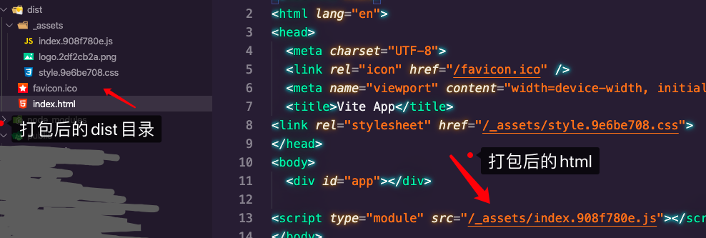


同时也支持相应的API用于自定义BUILD:

```javascript
const { build } = require('vite')

;(async () => {
  // All options are optional.
  // check out `src/node/build/index.ts` for full options interface.
  const result = await build({
    rollupInputOptions: {
      // https://rollupjs.org/guide/en/#big-list-of-options
    },
    rollupOutputOptions: {
      // https://rollupjs.org/guide/en/#big-list-of-options
    },
    rollupPluginVueOptions: {
      // https://github.com/vuejs/rollup-plugin-vue/tree/next#options
    }
    // ...
  })
})()
```


### Customize the Dev Server

前面也说过，本身Vite是基于`Koa`服务器的。那么就可以自定义一些中间件。

```typescript
const { createServer } = require('vite')

const myPlugin = ({
  root, // project root directory, absolute path
  app, // Koa app instance
  server, // raw http server instance
  watcher // chokidar file watcher instance
}) => {
  app.use(async (ctx, next) => {
    // You can do pre-processing here - this will be the raw incoming requests
    // before vite touches it.
    if (ctx.path.endsWith('.scss')) {
      // Note vue <style lang="xxx"> are supported by
      // default as long as the corresponding pre-processor is installed, so this
      // only applies to <link ref="stylesheet" href="*.scss"> or js imports like
      // `import '*.scss'`.
      console.log('pre processing: ', ctx.url)
      ctx.type = 'css'
      ctx.body = 'body { border: 1px solid red }'
    }

    // ...wait for vite to do built-in transforms
    await next()

    // Post processing before the content is served. Note this includes parts
    // compiled from `*.vue` files, where <template> and <script> are served as
    // `application/javascript` and <style> are served as `text/css`.
    if (ctx.response.is('js')) {
      console.log('post processing: ', ctx.url)
      console.log(ctx.body) // can be string or Readable stream
    }
  })
}

createServer({
  configureServer: [myPlugin]
}).listen(3000)
```


### 其他

- TypeScript Vite很好的支持ts，并且对于ts的转换速度比tsc快20多倍
- JSX with React/Preact 支持JSX
- HTTPS/2 支持HTTP2、HTTPS
- Modes and Environment Variables 支持模式（多环境），以及环境变量
- ...

因为目前Vite还处于快速迭代开发的阶段，所以我主要标注了核心和已有的这些功能。后续也会继续关注Vite相关。

更多可以查看[官方文档](https://github.com/vitejs/vite)


## 总结&参考

总的来说，第一次使用Vite那种快速还是让我惊艳到了。不得不佩服尤大的厉害之处。很多人提问关于Webpack与Vite, 以及Vite是否会替换Webpack这样的问题。我个人觉得Vite在短期内是不会替换Webpack的（毕竟正式版都没有），相比webpack的周边生态也没有完善。但是Vite潜力是巨大的，给了我们未来的前端开发的一些实践，毕竟在它采用ESM时候，已经放弃了对老的浏览器的支持（说的就是你IE）。我还是很看好Vite的前景的，期待早日上线正式版，并整合到`vue-cli`中。也正是应了开头那条尤大发的推文，确实用过后不太想用Webpack了哈哈哈。


[网站]

1.https://github.com/vitejs/vite

2.https://www.bilibili.com/video/BV1LC4y1h7BF?from=search&seid=7200015122345130218

3.https://segmentfault.com/a/1190000023009604

4.https://segmentfault.com/a/1190000022522883

5.https://juejin.im/post/6844904136299790349

6.https://zhuanlan.zhihu.com/p/150083887?from_voters_page=true

