# Vue 3.0 快速预览

vue3.0的目前版本已经在`v3.0.0-rc6`了，并且周边生态如 `vuex`，`vue-router`，`vue-cli`也逐渐完善和跟进。可以看出vue3离正式推出的时间应该不远了。所以与时俱进，看下其带来的新特性等。

**Vue3 GitHub地址**：https://github.com/vuejs/vue-next

**Vue3 官方文档（纯英文）**：https://v3.vuejs.org/

**Vue3 Compostion API文档（含中文）**:https://composition-api.vuejs.org/api.html#template-refs


## 前提准备

如果你手中的vue-cli版本高于`4.5.0`；已经支持可以选择vue3的选项了。如果你手中的vue-cli版本较低，确保更新版本高于`4.5.0`。

执行以下命令更新脚手架：

```bash
npm update -g @vue/cli
```

*\ 笔者写此文章时所用的vue-cli版本为 `@vue/cli 4.5.4`。

官方说

```bash
yarn global add @vue/cli@next
# OR
npm install -g @vue/cli@next
```

我试了一下和

```bash
npm install -g @vue/cli
```

总之你需要将你的脚手架工具版本升级或重新安全高于 `4.5.0 `即可


## 创建Vue3项目

**CDN**

```html
<script src="https://unpkg.com/vue@next"></script>
```

使用cdn简单粗暴，非常适合快速上手和学习


**脚手架**

**1.在你想要存放的项目的目录下执行：**

```npm
vue create 项目名称
```

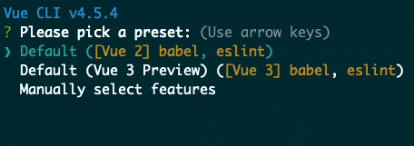

可以看到默认选项已经有 vue3 的预览了，当然这个选项创建的项目仅仅是预览。选择第三个选项 `Manually select features` 手动创建。

**2.选择所需要的配置**

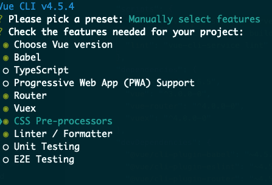

同vue2一样，基本没什么区别。选择所需要的功能。这里我选择了vuex，vue-router，css预编译，babel编译。

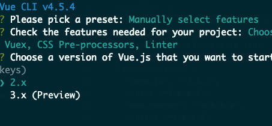

提供了是创建vue2还是vue3项目。选择vue3预览。

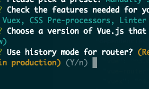

是否选择history模式路由，如果否会使用hash。

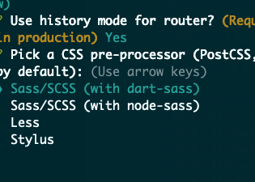

选择css的预编译器，我选择`node-saas`

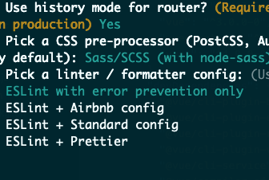

配置eslint，我选择eslint配合prettier。

后面就是选项基本同vue2时候一样，所以就不再赘述了

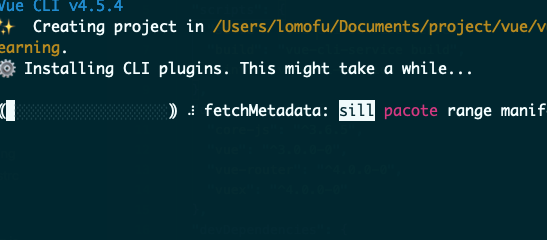

等待下载所需依赖以及构建项目模板后就可以使用了。

总的来说，项目的构建还是十分简单的，基本同vue2时候一样，上手成本也基本为0


**项目结构**

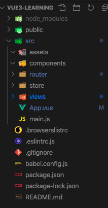

同之前创建的vue2项目一样，vue3的目录结构也没做什么变化


## 特性预览

### Composition API

#### 为什么要有Composition  API？

`Composition API` 是vue3中一个亮点新特性，刚推出就受到大家的关注，网络上也有很多文章在分析解释它的作用。我也参考整理理解一下为什么需要Composition API？对比Vue2的 `Optional API` 有哪些改进。等问题的回答。

##### 1.关于this指向

例如实现一个计数器

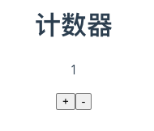

vue2中我们会这样写：

```vue
<template>
  <div class="counter">
    <h1>计数器</h1>
    <p>{{count}}</p>
    <button @click="increase">+</button>
    <button @click="decrease">-</button>
  </div>
</template>

<script>
export default {
  data: () => ({
    count: 0
  }),
  methods: {
    increase() {
      this.count++;
      print.call(this);
    },
    decrease() {
      this.count--;
    }
  }
};
</script>
```

我们可以看到 `data` ,`methods`这些属性都是在我们需要用到时候才写入。基于这种方式称为`Optional API`，它的好处就是结构化很清楚：

- 在 props 中接收参数
- 在 data 中定义变量
- 在 watch 中监听变化
- 在 computed 中定义需要使用到的计算属性
- 在 methods 中定义事件响应方法

但是也是有问题的，我们都知道在 Optional 中 this指的是当前组件实例，我们会使用 this 来获取组件上的每个属性。但如果在increase函数中定义一个函数并调用就存在this的指向问题，如下：

```javascript
    increase() {
      this.count++;
      function print() {
        console.log(this.count);
      }
      print();
    }
```

当我们调用print函数想打印count时，此时的this并不是我们increase中的this。要解决这个问题有好几种方法：

**1.保存当前this**

```
    increase() {
      this.count++;
      const self = this;
      function print() {
        console.log(self.count);
      }
      print();
    }
```

这是最经典的解决方式，通过外部变量保存this，利用函数闭包来正确传入this

**2.`call()`, `apply()`, `bind()`**

三种函数都可以改变this指向，在用法上有差别。关于三者之前的区别可以看[JS中的call、apply、bind方法详解](https://segmentfault.com/a/1190000018270750)

```javascript
    increase() {
      this.count++;
      const self = this;
      function print() {
        console.log(self.count);
      }
      print.call(this);
      print.apply(this);
      print.bind(this)();
    }
```

**3.箭头函数**

利用es6提出的箭头函数的 this 是其所被定义时所在的上下文。

```javascript
 increase() {
      this.count++;
      const print = () => console.log(this.count);
      print();
}
```

解决方案虽然有非常多。但如果一个组件中逻辑稍微复杂，那么如果涉及到this问题都需要考虑，麻烦程度可想而知。而且this上所挂在的东西非常多，也非常杂乱。


##### 2.关于功能逻辑

`Optional API` 提供了严格的结构，这在某种程度上对开发者是友好的。我们可以通过其所在的位置知道其用处和作用，轻松实现其功能。但是在这样的框架下，当我们想要实现一个功能时，需要在不同区域添加代码，这样就形成“**零散代码“**。

比如我们需要实现input框输入值更新列表，我们需要在data添加一个双向绑定的属性与input框绑定，同时我们需要在methods里面添加一些方法处理input中的各种逻辑，获取还可能用到computed...

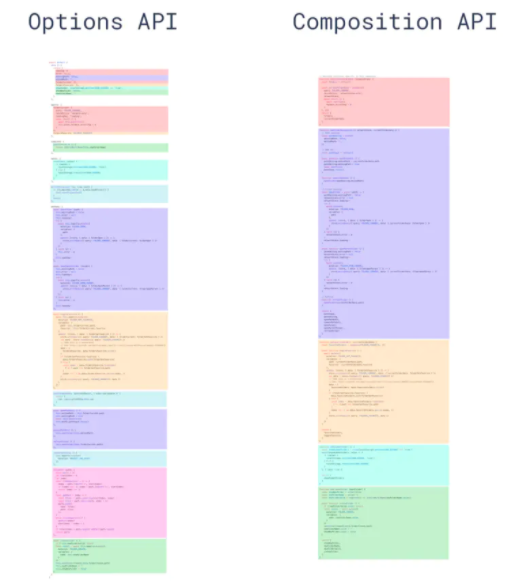

也就是说当我们实现一个功能时，我们的代码是零散分部的。比如这张图中相同色块表示一个功能中的各个代码。这样的分散状态，对于我们维护和查看功能时都十分麻烦，我们需要在这些选择中不断跳来跳去，给人一种很不连贯的感觉。


#### 什么是Composition API?

Composition英文有构成，组合方式的意思。组合API，咋一听一脸懵逼，那我们先看一下看官方如何定义：

> Introducing the **Composition API**: a set of additive, function-based APIs that allow flexible composition of component logic.
>
> －－vuejs.org（https://composition-api.vuejs.org/）

**以函数为载体，将业务相关的逻辑代码抽取到一起，整体打包对外提供相应能力**。


这里有个词很关键，以函数为载体。这也契合了函数式编程的思想，通过组合一系列函数API来完成和实现。

那么说白了就是 `Composition API` 提供了一系列 Hooks 通过组合这些 Hooks 可以完整的实现一个功能。使得看上去更加整体。

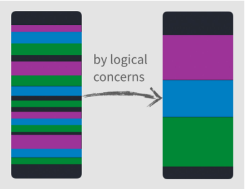

那么说到这里，就不由自主的联想到了React Hooks。其实Composition API也是借鉴React Hooks的设计思想，关于二者的比较可以看[这篇文章](https://juejin.im/post/6847902223918170126)


#### 简单使用

我们通过修改上述计数器例子来看一下`Composition API `的使用

**Vue2 Optional API**

```vue
<template>
  <div class="counter">
    <h1>计数器</h1>
    <p>{{count}}</p>
    <button @click="increase">+</button>
    <button @click="decrease">-</button>
  </div>
</template>

<script>
export default {
  data: () => ({
    count: 0
  }),
  methods: {
    increase() {
      this.count++;
      const print = () => console.log(this.count);
      print();
    },
    decrease() {
      this.count--;
    }
  }
};
</script>
```

**Vue3 Composition API** 改造如下

```vue
<template>
  <h1>计数器</h1>
  <p>{{state.count}}</p>
  <button @click="increase">+</button>
  <button @click="decrease">-</button>
</template>

<script>
import { ref } from "vue";
export default {
  name: "v3-counter",
  setup() {
    let count = ref(0);

    const increase = () => count.value++;
    const decrease = () => count.value--;

    return {
      count,
      increase,
      decrease
    };
  }
};
</script>
```

例子中我们通过在`setup()`函数中用 vue 提供的`ref()`创建响应式数据，并在模板中直接使用。

当然如果当我们数据多了时候通过ref( )一个个创建显得十分麻烦，这时候我们可以用另外一个API `reactive()`。

```vue
<template>
  <h1>计数器</h1>
  <p>{{state.count}}</p>
  <button @click="increase">+</button>
  <button @click="decrease">-</button>
</template>

<script>
import { reactive } from "vue";
export default {
  name: "v3-counter",
  setup() {
    const state = reactive({
      count: 0
    });

    const increase = () => state.count++;
    const decrease = () => state.count--;

    return {
      state,
      increase,
      decrease
    };
  }
};
</script>
```


#### setup( )

Vue3 提供了`setup()`函数。它就是我们 `Composition API` 的入口。

> #### `setup()`
>
> The `setup` function is a new component option. It serves as the entry point for using the Composition API inside components.
>
> — vuejs.org


##### **调用时机**

*setup( ) 执行是：**组件实例被创建时，初始化props的解析后立刻调用。在生命周期中，它是在 `beforeCreate` 之前。***

> `setup` is called right after the initial props resolution when a component instance is created. Lifecycle-wise, it is called before the beforeCreate hook.

##### **返回值**

setup( )中我们会返回一个对象，这个对象中包含你在setup( )创建的data或者方法等，官方实例在其上面注释为暴露给模板。

> If `setup` returns an object, the properties on the object will be merged on to the render context for the component's template
>
> — vuejs.org


```javascript
export default {
  name: "v3-counter",
  setup() {
    const state = reactive({
      count: 0
    });

	 // expose to template
   return {
      state
   };
  }
};
```

`setup()` 返回的对象中的所有属性都会被合并到渲染的上下文中给组件的模板。在以前2.0中我们在各个属性中写对应的数据。模板渲染时会自动找到对应属性上内容进行渲染。**setup( )中如果需要暴露给模板，一定记住最后需要return。**


##### **参数**

setup( props , context )

setup第一个参数是props,相信大家十分熟悉，props上面包含了该组件的一些属性。

```html
 <counter name="counter3.0"/>
```

上述的计数器组件我们加上一个属性name

在组件中我们是通过props属性定义和接受。如果我们需要在 setup 中访问 props，只需要将 props 作为 setup 第一个参数。通过 `props.`方式即可访问：

```vue
<template>
  <h1>计数器 | {{props.name}}</h1>
  <p>{{state.count}}</p>
  <button @click="increase">+</button>
  <button @click="decrease">-</button>
</template>

<script>
import { reactive } from "vue";
export default {
  name: "v3-counter",
  props: {
    name: String
  },
  setup(props) {
    const state = reactive({
      count: 0
    });
    console.log(props.name);

    const increase = () => state.count++;
    const decrease = () => state.count--;

    return {
      props,
      state,
      increase,
      decrease
    };
  }
};
</script>
```

这时候想偷懒的我觉得，既然props是作为对象传递进来的，那么完全可以用es6中的解构语法解构该对象，然后在访问时候就不需要一直 .属性了。我尝试修改成这样，

```javascript
  setup(props) {
    const state = reactive({
      count: 0
    });

    const { name } = props;

    const increase = () => state.count++;
    const decrease = () => state.count--;

    return {
      name,
      state,
      increase,
      decrease
    };
  }
```

或者这样

```javascript
  setup({ name }) {
    const state = reactive({
      count: 0
    });

    const increase = () => state.count++;
    const decrease = () => state.count--;

    return {
      name,
      state,
      increase,
      decrease
    };
  }
```

vue都编译报错

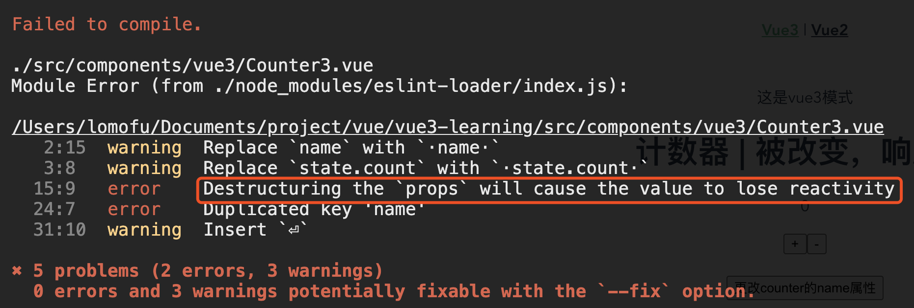

意思是解构 `props` 对象会导致其值丢失响应性。查阅官方API后得出，`props` 对象本身是响应式的，watch等都可以观察和响应props中的变化，并且官方文档中也说明了解解构它会失去响应性。

> However, do NOT destructure the `props` object, as it will lose reactivity
>
> — vuejs.org

比较友好的是，在编译时vue会告诉我们这样写是不合法的，否则后面出问题查找没想到是这里又浪费时间了：）

例子：

外部组件通过点击按钮修改 counter 的 name 属性

```vue
<template>
  <p>这是vue3模式</p>
  <counter :name="name" />
  <br />
  <br />
  <button @click="onClick">更改counter的name属性</button>
</template>

<script>
import { defineAsyncComponent } from "vue";
import { ref } from "vue";
export default {
  setup() {
    let name = ref("counter3.0");
    function onClick() {
      name.value = "被改变，响应式";
    }
    return {
      name,
      onClick
    };
  },
  components: {
    counter: defineAsyncComponent(() => import("../components/vue3/Counter3"))
  }
};
</script>
```

counter组件则需要展示其name的值在页面中

```vue
<template>
  <h1>计数器 | {{name}}</h1>
  <p>{{state.count}}</p>
  <button @click="increase">+</button>
  <button @click="decrease">-</button>
</template>

<script>
import { reactive } from "vue";
export default {
  name: "v3-counter",
  props: {
    name: String
  },
  setup(props) {
    const state = reactive({
      count: 0
    });

    const increase = () => state.count++;
    const decrease = () => state.count--;

    return {
      props,
      state,
      increase,
      decrease
    };
  }
};
</script>
```

> 需要注意的是如果你需要在页面中渲染props中的某个属性，你需要在setup()返回值中**传入props对象**，注意是传入props对象，而是通过props.方式得到的值赋值给一个变量，然后将这个变量返回。
>
> 上述操作会报错：
>
> Getting a value from the `props` in root scope of `setup()` will cause the value to lose reactivity


第二个参数是 context 对象，它代替了vue2中通过 this 进行一些操作。打印context发现：

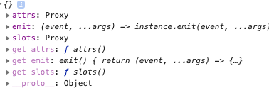

包含三个属性 `attrs`,`emit`,`slots`

|      |           Vue3            |          Vu2           | 作用                                                         |
| ---- | :-----------------------: | :--------------------: | :----------------------------------------------------------- |
|      |       context.attrs       |      this.$attrs       | 就是包含了父作用域中不作为 prop 被识别 (且获取) 的 attribute 绑定 (`class` 和 `style` 除外)。当一个组件没有声明任何 prop 时，这里会包含所有父作用域的绑定 (`class` 和 `style` 除外)；**一般可以用与嵌套属性中的传值，不需要一级一级的接收props往下传递。** |
|      | context.emit(event,args…) | this.$emit(event,args) | 解决的是子组件向父组件传值的问题，可以看到是基于事件实现。   |
|      |       context.slots       |      this.$slots       | 可以访问对应的插槽。                                         |

仔细观察我们可以发现，attrs和slots都是Proxy对象，这也就说明其本身被代理并一直保持最新值。所以这是可以解构的。比如：

```javascript
<template>
  <h1>计数器 | {{attrs.name}}</h1>
  <p>{{state.count}}</p>
  <button @click="increase">+</button>
  <button @click="decrease">-</button>
</template>

<script>
import { reactive } from "vue";
export default {
  name: "v3-counter",
  setup(props, {attrs}) {
    const state = reactive({
      count: 0
    });

    const increase = () => state.count++;
    const decrease = () => state.count--;
    console.log(attrs);

    return {
      attrs,
      state,
      increase,
      decrease
    };
  }
};
</script>
```

官方API中也说明了

> `attrs` and `slots` are proxies to the corresponding values on the internal component instance. This ensures they always expose the latest values even after updates so that we can destructure them without worrying accessing a stale reference.
>
> `attrs` 和 `slots` 都是内部组件实例上对应项的代理，可以确保在更新后仍然是最新值。所以可以解构，无需担心后面访问到过期的值.
>
> — vuejs.org 


##### **Demo:子父组件传值**

通过`setup` 中 `context` 中的 `emit` 完成一个简单的子父传值

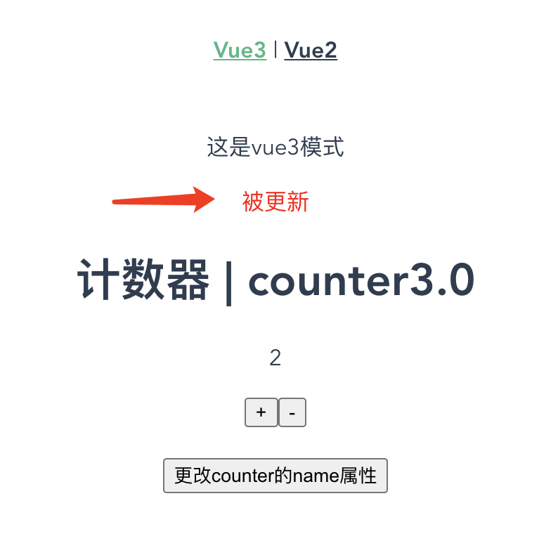

实现的效果就是点击counter组件中的+/-按钮 更改数值的同时，外部组件的一个区域会显示被更新三个字（这个字符串是子组件传出的）

**子组件**

```vue
<template>
  <h1>计数器 | {{attrs.name}}</h1>
  <p>{{state.count}}</p>
  <button @click="increase">+</button>
  <button @click="decrease">-</button>
</template>

<script>
import { reactive } from "vue";
export default {
  name: "v3-counter",
  setup(props, { attrs, emit }) {
    const state = reactive({
      count: 0
    });

    const update = () => emit("update-msg", "被更新");

    const increase = () => {
      state.count++;
      update();
    };

    const decrease = () => {
      state.count--;
      update();
    };

    return {
      attrs,
      state,
      increase,
      decrease
    };
  }
};
</script>
```

**父组件**

```vue
<template>
  <p>这是vue3模式</p>
  <p :style="{color:'red'}" v-if="flag">{{ str }}</p>
  <counter :name="name" @update-msg="onUpdate" />
  <br />
  <br />
  <button @click="onClick">更改counter的name属性</button>
</template>

<script>
import { defineAsyncComponent } from "vue";
import { ref } from "vue";
export default {
  setup() {
    let name = ref("counter3.0");
    let flag = ref(false);
    let str = ref("");

    const onClick = () => (name.value = "被改变，响应式");

    function onUpdate(val) {
      str.value = val;
      flag.value = true;
      setTimeout(() => (flag.value = !flag.value), 3000);
    }

    return {
      str,
      flag,
      name,
      onClick,
      onUpdate
    };
  },
  components: {
    counter: defineAsyncComponent(() => import("../components/vue3/Counter3"))
  }
};
</script>

```


##### 关于this

this在setup()中是不可获取的。通过打印得到的结果是 undefined 。

```javascript
setup(props, { attrs, emit }) {
    console.log(this); //undefined
}
```

 这也很好理解，setup( )的执行时机是在beforeCreated（）之前

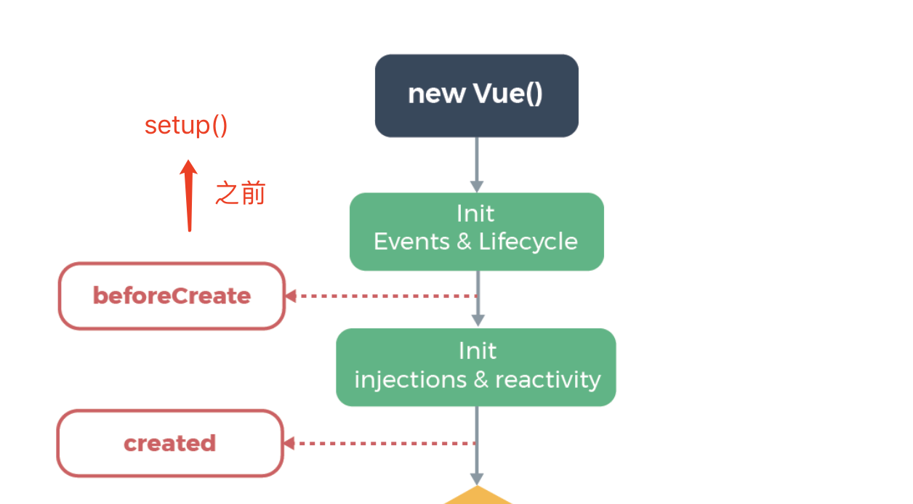

这也就意味着与2.x中选项中的this是不一样的。我们都知道[`created`](https://cn.vuejs.org/v2/api/#created) 钩子可以用来在一个实例被创建之后执行代码，而setup的执行周期要在实例创建前就执行了。以下是官方文档中提到的：

> **`this` is not available inside `setup()`.** Since `setup()` is called before 2.x options are resolved, `this` inside `setup()` (if made available) will behave quite differently from `this` in other 2.x options. Making it available will likely cause confusions when using `setup()` along other 2.x options. Another reason for avoiding `this` in `setup()` is a very common pitfall for beginners
>
> **`this` 在 `setup()` 中不可用**。由于 `setup()` 在解析 2.x 选项前被调用，`setup()` 中的 `this` 将与 2.x 选项中的 `this` 完全不同。同时在 `setup()` 和 2.x 选项中使用 `this` 时将造成混乱。在 `setup()` 中避免这种情况的另一个原因是：这对于初学者来说，混淆这两种情况的 `this` 是非常常见的错误
>
> — vuejs.org


#### Reactivity APIS

##### `ref()`

> Takes an inner value and returns a reactive and mutable ref object. The ref object has a single property `.value` that points to the inner value.
>
> If an object is assigned as a ref's value, the object is made deeply reactive by the `reactive` method.
>
> — vuejs.org

我们通过`ref()`api 并向其中传入一个值，它会返回一个响应式易变得对象。这个对象只有一个属性`.value`，以下是通过ref( )返回的对象：

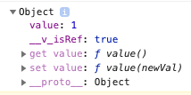

在模板中直接使用对应的对象即可。同时如果我们对**ref( )创建的对象.value**打印就可以看到

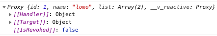

这也就印证了Vue3中的响应式是通过proxy来实现的。如果ref()中传入一个对象,那么该对象的**深度响应**是通过reactive方法进行。

ref会把传入的值包装成一个proxy，并使得全局访问时，都指向同一个内存地址，也就是引用。这很好理解，如果我们传入Number，Boolean这种非引用类型时，实际上是值传递。那么在别处访问的是其传递的值，不是相同的内存区域。


##### `reactive()`

> Takes an object and returns a reactive proxy of the original. This is equivalent to 2.x's `Vue.observable()`.
>
> — vuejs.org

***`reactive()` 接受一个对象，并且会返回一个响应式的代理对象。这与vue2中的`Vue.observable()`是等价的。***

通过打印`reactive()`返回的对象,发现是一个proxy对象

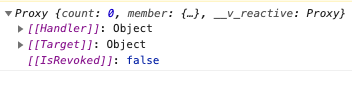

需要注意的是这里的state是传入对象的代理对象，**它并不等于源对象**。这在官方的说明下也有

> The reactive conversion is "deep": it affects all nested properties. In the ES2015 Proxy based implementation, the returned proxy is **not** equal to the original object. It is recommended to work exclusively with the reactive proxy and avoid relying on the original object.
>
>  — vuejs.org

reactive( )是深度响应的，它会影响**所有的嵌套属性**，官方也建议仅使用proxy对象，这样可以不依赖源对象。


##### `computed()`

computed( )相当于vue2中的 `computed` 属性。

默认可以传入一个 `getter` 函数，返回一个默认不可手动修改的 ref 对象。

```javascript
const state = reactive({
      count: 0
});

const computedVal = computed(() => `总共点了 ${state.count} 次`);

console.log(computedVal.value);
```

如果需要访问computed的值需要通过computed返回的对象的 `.value`获取。

需要注意的是返回的ref对象是不可修改的，当我们尝试修改：

```javascript
const computedVal = computed(() => `总共点了 ${state.count} 次`);
    console.log(computedVal.value);

computedVal.value = `新的格式 ${state.count}`;
```

不但没有效果，vue还会警告：**Write operation failed: computed value is readonly**

如果我们需要对其进行修改可以传入`setter` 函数

```javascript
const computedVal = computed({
      get: () => state.count,
      set: val => {
        state.count = val * 10;
        console.log(val);
      }
    });
    
computedVal.value++;
```


##### `readonly()`

readyonly 从字面意思就能理解，通过其创建的对象是只读的不可修改的。

> Takes an object (reactive or plain) or a ref and returns a readonly proxy to the original. A readonly proxy is deep: any nested property accessed will be readonly as well.
>
> 传入一个对象（响应式或普通）或 ref，返回一个原始对象的**只读**代理。一个只读的代理是“深层的”，对象内部任何嵌套的属性也都是只读的。
>
> — vuejs.org

```javascript
const state = reactive({
      count: 0
    });

const copy = readonly(state);

console.log(copy.count);

copy.count++; //Set operation on key "count" failed: target is readonly
```

如果是传入响应式数据进行创建，那么是可以实时获取最新的数值的。同时如果我们对 readonly 对象进行修改会报警告。


##### `watchEffect()`

> Run a function immediately while reactively tracking its dependencies, and re-run it whenever the dependencies have changed.
>
> 立即执行传入的一个函数（也成为副作用函数），并响应式追踪其依赖，并在其依赖变更时重新运行该函数。
>
> — vuejs.org

**简单实用**

```javascript
   const state = reactive({
      count: 0
});

watchEffect(() => console.log("追踪响应式" + state.count));
```

结果如下，每次被watchEffect的数据更新都会触发其传入的函数

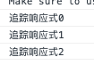

我们会发现watchEffect( )会在在组件初始化的时候就会执行一次用以收集依赖，这也是一开始就打印了”追踪响应式0“。之后当收集的依赖发生变化是，才会执行其中传入的回调函数。

**停止监听**

> When `watchEffect` is called during a component's `setup()` function or lifecycle hooks, the watcher is linked to the component's lifecycle, and will be automatically stopped when the component is unmounted.
>
> 当 `watchEffect` 在组件的 `setup()` 函数或生命周期钩子被调用时， 侦听器会被链接到该组件的生命周期，**并在组件卸载时自动停止。**
>
> — vuejs.org

也就是说它本身会自动停止，当然有时候我们也需要显式的停止监听。那么就通过其返回的函数对象，调用其函数对象完成显式取消侦听。

```vue
<template>
  <button @click="cancel">取消监听</button>
</template>
<script>
  import { reactive, watchEffect } from "vue";
export default{
  setup(){
    //... some code
	const listener = watchEffect(() => console.log("追踪响应式" + state.count));
	const cancel = () => listener();
  
  return{
    cancel
  }
  }
  
 }
</script>
```

**side effect of function**

> 函数副作用是指，当调用函数时，被调用函数除了返回[函数值](https://baike.baidu.com/item/函数值/5017986)之外，还对主调用函数产生附加的影响。例如，调用函数时在被调用函数内部：
>
> ·修改全局量的值；
>
> ·修改主调用函数中声明的变量的值(一般通过指针参数实现)。
>
> — 百度百科

说人话就是副作用的函数不仅仅只是返回了一个值，而且还做了其他的事情如：

  1、修改了一个变量

  2、直接修改数据结构

  3、设置一个对象的成员

  4、抛出一个异常或以一个错误终止

  5、打印到终端或读取用户输入

  6、读取或写入一个文件

  7、在屏幕上画图

​		...

**Side Effect Invalidation**

有时副作用函数会执行一些异步的副作用, 这些响应需要在其失效时清除（即完成之前状态已改变了)。比如在副作用函数中我们使用异步请求。所以侦听副作用传入的函数可以接收一个 `onInvalidate` 函数作入参, 用来注册清理失效时的回调。当以下情况发生时，这个**失效回调**会被触发:

- 副作用即将重新执行时 **(依赖值发生变化时)**
- 侦听器被停止 (如果在 `setup()` 或 生命周期钩子函数中使用了 `watchEffect`, 则在卸载组件时)**（显式取消侦听或组件卸载）**

比如我们侦听计数器的count数值，当我们第一次进入组件后，尝试加1操作后，结果如下

```javascript
 const listener = watchEffect(onInvalidate => {
      console.log("追踪响应式" + state.count);
      onInvalidate(() => console.log("cancel"));
 });
```

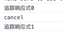

也就是在count即将变化之前，执行了 onInValidate 中传入的函数。

 

**副作用刷新时机**

> Vue's reactivity system buffers invalidated effects and flush them asynchronously to avoid unnecessary duplicate invocation when there are many state mutations happening in the same "tick". Internally, a component's update function is also a watched effect. When a user effect is queued, it is always invoked after all component update effects
>
> Vue 的响应式系统会缓存副作用函数，并异步地刷新它们，这样可以避免同一个 tick 中多个状态改变导致的不必要的重复调用。在核心的具体实现中, 组件的更新函数也是一个被侦听的副作用。当一个用户定义的副作用函数进入队列时, 会在所有的组件更新后执行

也就是说比如上述代码中：

- `count` 会在初始运行时同步打印出来 
- 更改 `count` 时，将在组件**更新后**执行副作用。

> 当然如果需要副作用函数涉及到DOM操作（或者模板ref）那么需要在`onMounted`生命周期的钩子函数中进行。结合上述setup执行时机你就能明白。

**其他参数**

```javascript
watchEffect(
  () => {
    /* ...effect function */
  },
  {
  onTrigger(e) {
      debugger
    }
  },
  onTrack(e){
  	debugger
  },
  flush: 'sync',// flush:'pre' flush:'post'
)
```

***flush***

如果我们需要改变副作用函数的执行时机，如果副作用需要同步或在组件更新之前重新运行，我们可以使用这个属性。

post:  **默认值** 也就是在组件更新**之后**重新运行

sync：与组件更新**同步**执行

pre: 在组件更新**之前**重新运行


***`onTrigger` 和 `onTrack`***

两个都是用来**调试** 侦听器的行为

|          |                      onTrigger                       |                           onTrack                            |
| -------- | :--------------------------------------------------: | :----------------------------------------------------------: |
| 触发时机 | **依赖项变更**导致副作用被触发时，将调用 `onTrigger` | 当一个 reactive 对象属性或一个 ref **作为依赖被追踪**时，将调用 `onTrack` |

> **`onTrack` 和 `onTrigger` 仅在开发模式下生效。**


##### `watch()`

完全等效于 2.x `this.$watch` （以及 `watch` 中相应的选项）

**watchEffect 和 watch 对比**

- 懒执行副作用；
- 更明确哪些状态的改变会触发侦听器重新运行副作用；
- 访问侦听状态变化前后的值。


**侦听单个数据源**

```javascript
// 侦听一个 getter
const state = reactive({ count: 0 })
watch(
  () => state.count,
  (count, prevCount) => {
    /* ... */
  }
)

// 直接侦听一个 ref
const count = ref(0)
watch(count, (count, prevCount) => {
  /* ... */
})
```

**侦听多个数据源**

```javascript
watch([fooRef, barRef], ([foo, bar], [prevFoo, prevBar]) => {
  /* ... */
})
```

watch 和 watchEffect 在[停止侦听](https://composition-api.vuejs.org/zh/api.html#手动停止侦听), [清除副作用](https://composition-api.vuejs.org/zh/api.html#清除副作用) (相应地 `onInvalidate` 会作为回调的第三个参数传入)，[副作用刷新时机](https://composition-api.vuejs.org/zh/api.html#副作用刷新时机) 和 [侦听器调试](https://composition-api.vuejs.org/zh/api.html#侦听器调试) 等方面行为一致.


#### Lifecycle Hooks

关于生命周期钩子函数，如果在`setup()`使用，只需要导入 onXxxx(名字和原来vue2中的生命周期中名字一致)

**对照表**

| Vue2(Optional API) |           Vue3 (Composition API)           |
| :----------------: | :----------------------------------------: |
|    beforeCreate    | 没有这个生命周期hook -> setup( )中直接使用 |
|      created       | 没有这个生命周期hook -> setup( )中直接使用 |
|    beforeMount     |               onBeforeMount                |
|      mounted       |                 onMounted                  |
|    beforeUpdate    |               onBeforeUpdate               |
|      updated       |                 onUpdated                  |
|   beforeDestroy    |              onBeforeUnmount               |
|     destroyed      |                onUnmounted                 |
|     activated      |                onActivated                 |
|    deactivated     |               onDeactivated                |
|   errorCaptured    |              onErrorCaptured               |
|         无         |            **onRenderTracked**             |
|         无         |           **onRenderTriggered**            |

新增了两个**调试钩子函数**，两个钩子函数都接收一个 `DebuggerEvent`，与 `watchEffect` 参数选项中的 `onTrack` 和 `onTrigger` 类似。

当然官方也没有强制要求你用vue3的新钩子。你可以选择setup( )中使用对应的钩子，也可以像vue2中那样照旧使用。


#### Dependency Injection

这个类似 2.x 的 `provide/inject`

**Vue2中**

```vue
//父组件
<template>
  <div id="v2">
    <p>这是vue2 模式</p>
    <counter />
  </div>
</template>

<script>
import { defineAsyncComponent } from "vue";
export default {
  components: {
    counter: defineAsyncComponent(() => import("../components/vue2/Counter"))
  },
  //提供
   provide() {
    return {
      strs: "外部提供"
    };
  },

};
</script>

//子组件
<template>
  <div class="counter">
  </div>
</template>

<script>
export default {
  //注入
  inject: ["strs"],
  created() {
    console.log(this.strs);
  }
};
</script>
```

**Vue3 Composition API**

```vue
//父组件
<template>
  <child/>
</template>
<script>
import { provide, defineAsyncComponent } from "vue";
export default {
  name: "parent",
  components: {
    child: defineAsyncComponent(() => import("./Vue3 copy"))
  },
  setup() {
    //提供
    provide("theme", "dark");
  }
};
</script>

//子组件
<template>
  <h1>{{theme}}</h1>
</template>
<script>
import { inject } from "vue";
export default {
  name: "child",
  setup() {
    //注入
    const theme = inject("theme", "light" /**默认 */);
    return {
      theme
    };
  }
};
</script>
```

`inject` 接受一个可选的的默认值作为第二个参数。如果未提供默认值，并且在 provide 上下文中未找到该属性，则 `inject` 返回 `undefined`。

除了初入固定数值，还可以通过`ref()`注入响应式数据。

```javascript
//父组件
setup() {
    const provided = ref("默认值");
    provide("theme", provided);
    const onClick = () => (provided.value = "改变后的响应式值");
    return {
      provide,
      onClick
    };
  }

//子组件
setup() {
    const theme = inject("theme", "light" /**默认 */);
    return {
      theme
    };
}
```


####  Template Refs

等同于vue2 的 this.$refs.名字

**vue2**

```javascript
<input ref="input">

methods: {
  // 用来从父级组件聚焦输入框
  focus: function () {
    this.$refs.input.focus()
  }
}
```

**vue3**

```vue
//父组件
<template>
  <child ref="childEl" />
</template>
<script>
import { ref, onMounted } from "vue";
import child from "./Vue3 copy"
export default {
  name: "parent",
  components: {
    // child: defineAsyncComponent(() => import("./Vue3 copy")) 这里如果采用异步组件就会取不到子组件中属性 目前还不知道为什么
    child: child
  },
  setup() {
    //创建对应组件的一个 DOM 引用
    const childEl = ref(null);

    //在onMounted中可以获取组件的引用
    onMounted(() => console.log(childEl.value));

    return {
      //暴露该引用给模板
      childEl
    };
  }
};
</script>


//子组件
<template>
</template>
<script>
import { ref } from "vue";
export default {
  name: "child",
  setup() {
    const count = ref(13);
    return {
      count
    };
  }
};
</script>
```

#### Reactivity Utilities

一些工具集，看了一下十分容易理解，这里就快速过一下

##### `unref()`

如果参数是一个 ref 则返回它的 `value`，否则返回参数本身。它是 `val = isRef(val) ? val.value : val` 的语法糖。

##### `toRef()`

```javascript
const state = reactive({
  foo: 1,
  bar: 2,
})
const fooRef = toRef(state, 'foo')

fooRef.value++
console.log(state.foo) // 2

state.foo++
console.log(fooRef.value) // 3
```

看代码非常好理解就是为一个 reactive 对象的属性创建一个 ref。这个 ref 可以被传递并且能够保持响应性。

##### `toRefs()`

```javascript
const state = reactive({
  foo: 1,
  bar: 2,
})
const stateAsRefs = toRefs(state)

state.foo++
console.log(stateAsRefs.foo.value) // 2

stateAsRefs.foo.value++
console.log(state.foo) // 3
```

把一个响应式对象转换成普通对象，该普通对象的每个 property 都是一个 ref ，和响应式对象 property 一一对应。

官方例子

```javascript
function useFeatureX() {
  const state = reactive({
    foo: 1,
    bar: 2,
  })
  
  // 返回时将属性都转为 ref
  return toRefs(state)
}

export default {
  setup() {
    // 可以解构，不会丢失响应性
    const { foo, bar } = useFeatureX()

    return {
      foo,
      bar,
    }
  },
}
```

##### `isRef`

检查一个值是否为一个 ref 对象。

##### `isProxy`

检查一个对象是否是由 `reactive` 或者 `readonly` 方法创建的代理。

##### `isReactive`

检查一个对象是否是由 `reactive` 创建的响应式代理。

如果这个代理是由 `readonly` 创建的，但是又被 `reactive` 创建的另一个代理包裹了一层，那么同样也会返回 `true`。

##### `isReadonly`

检查一个对象是否是由 `readonly` 创建的只读代理。


### The Application Instance

每一个 Vue 的应用程序都开始于创建一个新的 Vue 实例。

在Vue2 中我们是通过 `new`方式创建

```javascript
import Vue from 'vue'
import App from './App.vue'

Vue.config.ignoredElements = [/^app-/]
Vue.use(/* ... */)
Vue.mixin(/* ... */)
Vue.component(/* ... */)
Vue.directive(/* ... */)

new Vue({
  render: h => h(App)
}).$mount('#app')
```

Vue3 改为提供实例函数 `createApp()` 创建实例对象。

```javascript
import { createApp } from 'vue'
import App from './App.vue'

const app = createApp(App)
app.config.ignoredElements = [/^app-/]
app.use(/* ... */)
app.mixin(/* ... */)
app.component(/* ... */)
app.directive(/* ... */)

app.mount('#app')
```

为什么需要改变？其实也好理解，Vue3.x 核心基于函数式编程，所以**一切皆函数**。为了统一，并能保证每个函数都有自己的小 `圈子` 能独立运行。


### Fragments

> In Vue 3, components now have official support for multi-root node components, i.e., fragments!
>
> — vuejs.org

vue3现在支持组件里多节点了，这种特性叫做碎片（React路过...）。

 vue2中我们经常这样写

```vue
<template>
  <div>
    <header>...</header>
    <main>...</main>
    <footer>...</footer>
  </div>
</template>
```

会在多节点的最外层嵌套一个 `div` ，

在 https://template-explorer.vuejs.org/ 上模拟渲染

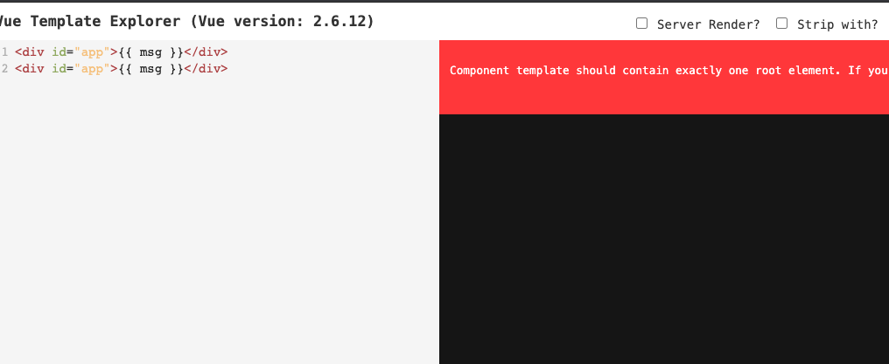

vue3并不需要

```vue
<template>
  <header>...</header>
  <main v-bind="$attrs">...</main>
  <footer>...</footer>
</template>
```

在https://vue-next-template-explorer.netlify.app/ 下查看Vue3 渲染模板

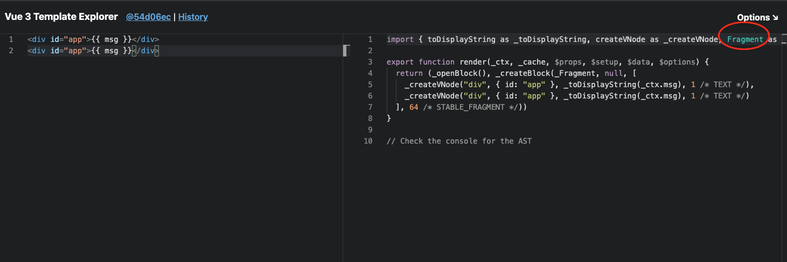

甚至可以是字符串

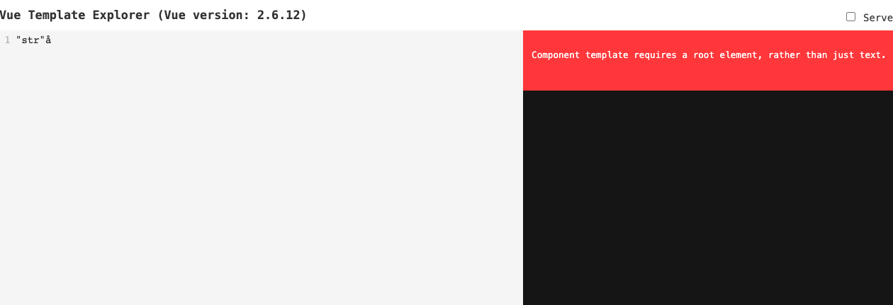

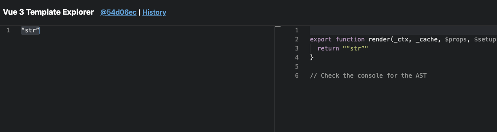


### Teleport

提供了一个最好的在父组件包含的DOM结构层级外的DOM节点渲染组件的方法。我们都知道SPA应用的根节点是一个root的dom容器，所有的视图都是基于该节点下渲染形成dom树。但是有些场景我们是需要在这个节点之外完成的，比如我们常用的弹窗、悬浮框、全局提示。

比如CSS中的[Stacking Context](https://developer.mozilla.org/zh-CN/docs/Web/Guide/CSS/Understanding_z_index/The_stacking_context)问题：

```html
    <div id="root">
      <div id="content">
        <h2>内容</h2>
        <h2>内容</h2>
        <h2>内容</h2>
      </div>
      
      <div class="modal">
        <div id="modal">
            <div id="mask"></div>
            <div id="panel">
              全局弹框
            </div>
        </div>
      </div>
    </div>
    <style>
      #content {
        position: relative;
        z-index: 2;
        background-color: red;
      }

      .modal{
        position: relative;
        z-index: 1;
      }

      #modal {
        z-index: 1;
      }

      #panel {
        position: fixed;
        top: 50%;
        left: 50%;
        background-color: aliceblue;
        z-index: 99999;
      }
      #mask {
        position: fixed;
        left: 0;
        right: 0;
        top: 0;
        bottom: 0;
        background-color: rgba(0, 0, 0, 0.521);
        z-index: 99999;
      }
    </style>
```

结果

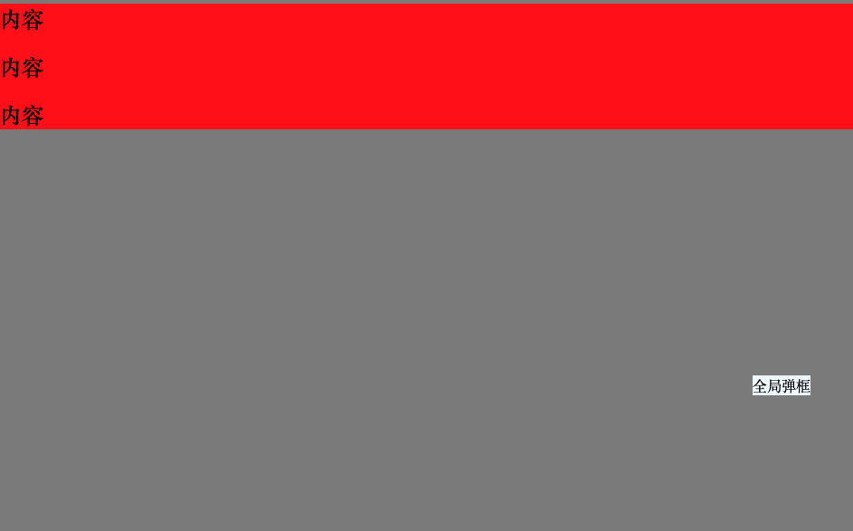

可以很清楚的看到即使我们的的弹出框在z-index上已经设置了9999了，但是因为其所在的父容器 **.modal**  `z-index:1`

而内容所在的 #content `z-index:2`，所以即使弹框z-index再大，其父容器低于另外同级容器，就会形成这样的场景。

这时候我可以将其提取出来，在root以外渲染来解决这种问题。在React中这个概念早已有,我们通过`React Portal`:

```javascript
ReactDOM.createPortal(child,container);
```

来实现，Vue3中也借鉴了Portal。并且尤哥在直播时候说为什么叫Teleport是因为Chrome有个提案，有个叫Portal的元素，为了不歧义所以叫这个名字哈哈哈。

```vue
<teleport to="#modals">
  <div>A</div>
</teleport>
<teleport to="#modals">
  <div>B</div>
</teleport>

<!-- result-->
<div id="modals">
  <div>A</div>
  <div>B</div>
</div>
```

可以看到  `<teleport to="目标节点选择器" disable="布尔值">`

- **`to` - `string`.** 

Required prop, has to be a valid query selector, or an HTMLElement (if used in a browser environment). Specifies a target element where `<teleport>` content will be moved

```html
<!-- ok -->
<teleport to="#some-id" />
<teleport to=".some-class" />
<teleport to="[data-teleport]" />

<!-- Wrong -->
<teleport to="h1" />
<teleport to="some-string" />
```

- **`disabled` - `boolean`.** 

当然也支持动态绑定

This optional prop can be used to disable the `<teleport>`'s functionality, which means that its slot content will not be moved anywhere and instead be rendered where you specified the `<teleport>` in the surrounding parent component.


### Async Components

在大型的应用中，我们需要异步组件组件来切分其成为更小的碎片，并且实现懒加载，即使用时才加载。

在 `Vue2.X` 中，我们可以

**webpack的代码分割**

```javascript
{
	path:"/somewhere",
	name:"Home",
	component:resolve => require(['@/xxxxx/your component']，resolve)
}
```

这里的require是AMD规范的引入关键词。require会先引入依赖模块，全部引入成功以后再执行resolve回调函数。

**webpack + ES6**

```vue
 components: {
    addExistEmployeeDialog: () => import("./addExistEmployeeDialog")
  },
```

import()方法是动态加载，返回一个Promise对象，then方法的参数是加载到的模块。

[详情可参考](https://cn.vuejs.org/v2/guide/components-dynamic-async.html)

在 Vue3 中，Vue has a `defineAsyncComponent` method

我们可以这样使用：

```javascript
const app = Vue.createApp({})

const AsyncComp = Vue.defineAsyncComponent(
  () =>
    new Promise((resolve, reject) => {
      resolve({
        template: '<div>I am async!</div>'
      })
    })
)

app.component('async-example', AsyncComp)
```

```javascript
 components: {
    AsyncComponent: defineAsyncComponent(() =>
      import('./components/AsyncComponent.vue')
    )
 }
```

完整API:

```javascript
const AsyncComp = defineAsyncComponent({
  // The factory function
  loader: () => import('./Foo.vue'),
  // A component to use while the async component is loading
  loadingComponent: LoadingComponent,
  // A component to use if the load fails
  errorComponent: ErrorComponent,
  // Delay before showing the loading component. Default: 200ms.
  delay: 200,
  // The error component will be displayed if a timeout is
  // provided and exceeded. Default: Infinity.
  timeout: 3000,
  // A function that returns a boolean indicating whether the async component should retry when the loader promise rejects
  retryWhen: error => error.code !== 404,
  // Maximum allowed retries number
  maxRetries: 3,
  // Defining if component is suspensible
  suspensible: false
})
```


### Suspense

一样也是一个来自React的概念。它会暂停你的组件渲染，并使用重现fallback中的内容，直到满足一个内容。

**Vue2.X中我们可能这样写**

```html
<template>
    <div>
        <div v-if="!loading">
            ...
        </div>
        <div v-if="loading">Loading...</div>
    </div>
</template>
```

或者安装这个插件：[vue-async-manager](https://www.lizenghai.com/goto/?url=https://shuidi-fed.github.io/vue-async-manager/guide.html)

然后，就变成了：

```html
<template>
    <div>
        <Suspense>
            <div>
                ...
            </div>
            <div slot="fallback">Loading...</div>
        </Suspense>
    </div>
</template>
```

**Vue3.x可以这样写**

```html
<Suspense>
  <template >
    <Suspended-component />
  </template>
  <template #fallback>
    Loading...
  </template>
</Suspense>
```

大体上差不多，#fallback是slot简写，更多是配合异步组件使用

```javascript
defineAsyncComponent({
  loader: () => import('./Foo.vue')
  loadingComponent: LoadingComponent
})
```


### 其他

- **Performance**:更好的性能，无论是SPA还是SSR
- **基于Proxy的响应式系统**
- **Tree shaking support**:可以将无用模块剔除，使得打包后项目包更小
- **Better TypeScript support**：Vue2使用TS确实十分鸡肋，Vue3对TS有了更好的支持。配合Composition API和函数式编程思想，更能写出健壮的代码。
- **Custom Renderer API**：自定义渲染API
- **静态树提升**：使用静态树提升，这意味着 Vue 3 的编译器将能够检测到什么是静态组件，然后将其提升，从而降低了渲染成本。它将能够跳过未整个树结构打补丁的过程。
- **静态属性**：Vue 3 将跳过不会改变节点的打补丁过程。

...


## 总结&参考

Vue3 其实更新了非常多的东西。但是从更新的内容上可以分成两块 `性能` 以及`新的API`。对于开发者而言性能上的需要细节可能是无感知，但是当你了解后会发现其优化的方案的妙处。因此还是很值得深入学习的。`Composition API`的引入使得我们的开发更加灵活多样，在面对大型应用时，也不会向以前为人诟病有不合理的地方。当然函数编程的引入使得其上手相对比`Optional API`会更有门槛。当然Vue还是秉持一贯的`渐进式`理念，Vue3中你仍然可以使用Vue2中这种写法，并且在你需要使用时，再入手。总的来说，Vue3使得Vue更加高效，好用。由于篇幅问题，这里先过一遍比较有特点的特性。后面会陆续补上其周边生态如VueX，Vue-router。当然还有尤哥推荐的`Vite`, 据说其性能吊打WebPack。后续也会补上...

[网站]

https://v3.vuejs.org/

https://composition-api.vuejs.org/api.html#ref

https://www.vuemastery.com/courses/vue-3-essentials/why-the-composition-api/

https://juejin.im/post/6844904148631027726

https://juejin.im/post/6844904066103902215

https://www.bilibili.com/video/BV1wk4y127fc?from=search&seid=17437175097383442749

https://www.bilibili.com/video/BV1qC4y18721?from=search&seid=17437175097383442749

https://segmentfault.com/a/1190000023669309

https://www.jianshu.com/p/0771f1643aa3

https://developer.mozilla.org/zh-CN/docs/Web/Guide/CSS/Understanding_z_index/The_stacking_context