# 一些概念


## 同步（Synchronous）和异步（Asynchronous）

*同步和异步描述的是一种消息通知的机制，主动等待消息返回，还是被动接收消息。*


**同步方法**：一旦开始，调用者必须等到方法调用返回后，才能继续后续的行为。

**异步方法**：一旦开始，方法调用会立刻返回，对于调用者而言感觉上是“瞬间完成”，调用者可以继续后续的操作，更像一个消息传递。

> **这里注意的是异步方法调用并不等同于事件驱动。以下是维基百科对于异步调用方法的描述：**
>
> **异步方法调用**或**异步方法模式**是（[多线程](https://zh.wikipedia.org/wiki/线程)）[面向对象程序设计](https://zh.wikipedia.org/wiki/面向对象程序设计)中用于[异步](https://zh.wikipedia.org/wiki/异步IO)调用对象的潜在的长期运行[方法](https://zh.wikipedia.org/wiki/方法)的一种[设计模式](https://zh.wikipedia.org/wiki/软件设计模式)[[1\]](https://zh.wikipedia.org/wiki/异步方法调用#cite_note-Async.34.2#71139-1)。它等价于Allan Vermeulen提出的**IOU模式**[[2\]](https://zh.wikipedia.org/wiki/异步方法调用#cite_note-2)[[3\]](https://zh.wikipedia.org/wiki/异步方法调用#cite_note-3)。**基于事件的异步模式**是异步方法调用的一个变种。

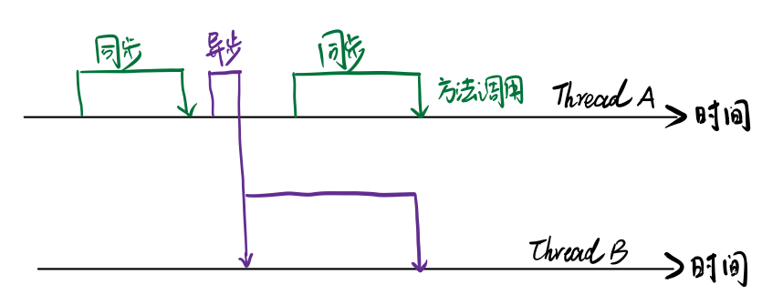

基于上图我们可以看出，同步方法和异步方法调用的区别。而异步方法通常会在另一个线程中执行，对于主线程而言无需阻塞等待。

举个最简单的例子，我们买手机，你可以去商店告诉销售人员你要买手机。销售人员让你稍等，他去仓库或者调货手机，那么你需要在商店一直等待手机到来，而此时你不能去做别的事情，这就是同步。而另一种你可以上网下单要买手机，让货到了送到你家，而你可以继续去干别的事情，这就是异步。我们最终的目的都是获得手机，程序中就是方法调用的结果（当然也有无返回值的情况），而两种模式就在于你是否需要等待这一过程执行完。


## 并发（Concurrency）和并行（Parallelism）

*并发和并行是两个经常容易搞混的概念。我在认真了解这两个概念前就是一直搞混的。他们都是表示多个任务一起执行，但两者执行方式有所不同。*


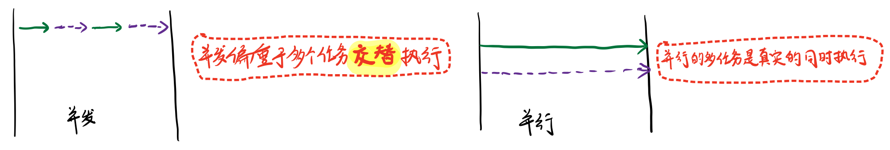

> PS:
>
> **如果系统内只有一个CPU,**而使用多进程或者多线程任务，那么真实环境中这些任务不可能是真实并行的。
>
> **毕竟一个CPU一次只能执行一次指令**。这种情况下多进程或者多线程任务是**并发**的。


## 临界区

临界区用来表示一种 `公共资源` 或是说 `共享数据`，可以被多线程使用。**但每次，只能有一个线程使用它，一旦临界区资源被占用，其他线程想要用这个资源，就必须等待（互斥）。**


## 阻塞（Blocking）和非阻塞（Non-Blocking）

*阻塞和非阻塞描述的是调用方获得消息过程的状态，阻塞等待还是立即返回。*

> - 阻塞IO: 调用方在获取消息的过程中被挂起阻塞，直到获得消息。
> - 非阻塞IO: 调用方在获取消息的过程中立即返回，不进行挂起


通常用来形容多线程间的相互影响。

- 比如一个线程占用了临界区资源，那么其他所需要这个资源的线程就必须在这个临界区进行等待，等待会导致线程挂起。这种情况就是阻塞。
- 非阻塞强调没有一个线程可以妨碍其他线程执行。


## 死锁（Deadlock）、饥饿（Starvation）和活锁（Livelock）

这三者都属于 `多线程的活跃性问题`。如果发现上述几种情况，那么相关线程可能就不再活跃，也就是说它可能很难再执行下去了。


### 死锁

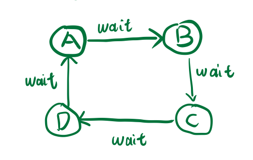

### 饥饿

某一个或者多个线程因为种种原因无法获得所需的资源，导致一直无法执行。

- 线程优先级可能比较低（Java中默认线程的优先级为5）
- 某一个线程一直占用关键资源不放，导致其他需要这个资源的线程无法正常执行。


### 活锁

如果线程都秉承“谦让”原则，主动释放资源给其他资源使用，那么会出现资源不断在两个线程中跳动，而没有一个线程可以同时拿到所有资源而正常执行。


## 并发级别

由于临界区的存在，多线程之间并发必须受到控制。根据控制并发策略，大致可以分为 `阻塞`、 `无饥饿`、 `无障碍`、 `无锁`、 `无等待`


### 阻塞（Blocking）

如果一个线程是阻塞的，那么其他线程释放资源之前，当前线程无法继续执行。

当我们使用 `synchronized` 关键字，或者 `重入锁` 时，我们得到的就是阻塞线程。这两者都会视图在执行后续代码钱，得到临界区的锁。如果得不到，线程就会挂起等待，直到占用了所需资源为止。


### 无饥饿（Starvation-Free）

线程调度总是倾向满足高优先级的线程。**对同一个资源分配是非公平的。**

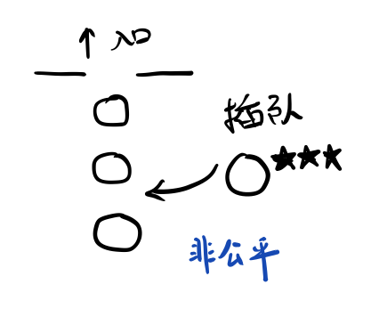

如果锁是公平的，满足先来后到。那么饥饿就不会产生。

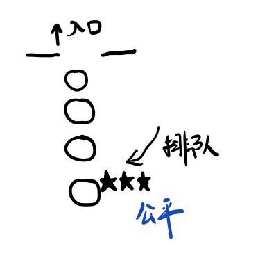

> PS:
>
> java Lock接口下，ReentrantLock可以在构造函数中开启公平锁
>
> Lock lock = new ReentrantLock(boolean fair);


### 无障碍（Obstruction-Free）

无障碍是一种最弱的非阻塞调用（乐观策略）。它认为所线程之前很可能不会发生冲突，或者说这种几率不大。因此大家可以无障碍的执行，**一旦检测到冲突，就应该回滚。**


**缺点**：无障碍线的多线程程序并不一定能顺畅进行。因为临界区存在严重的冲突时，所有的线程可能不断地回滚自己的操作，而没有一个线程可以走出临界区。


**实现**：一种实现可以依赖一个 “`一致性标记` ” 。

1. 线程操作前，先读取并保存这个标记。
2. 操作完成后，再读取，检查这个标记是否被更改过
   - 如果两者一致，则说明资源访问没有冲突
   - 如果不一致，则说明资源可能在操作过程中与其他写线程冲突，需要重试操作

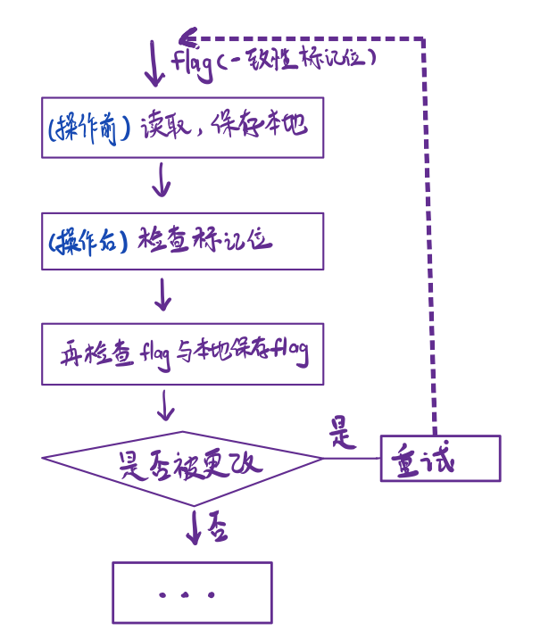

### 无锁（Lock-Free）

所有的线程都能尝试对临界区进行访问；**但不同与无障碍，无锁的并发保证必然有一个线程能够在有限步骤内完成操作并离开临界区。**


**特点**：可能包含一个无穷循环。在这循环中，线程不断尝试修改共享变量。如果没有冲突，修改成功，程序退出。否则，继续尝试修改。


### 无等待（Wait—Free）

无等待则在无锁的基础上更进一步扩展，要求所有的线程都必须在有限的步骤内完成。


一个典型的无等待结构 - **RCU( Read-Copy-Update )**

对于数据的读不加以控制。写数据时，先取得原始数据的副本（COPY）,只修改副本数据。修改完成后，在合适的时机写数据（UPDATE）。

> 例如： COW容器

显然这是一种用空间换时间的做法，所适合的场景是读多写少。


## 并行的两个重要定律


### Amdahl定律

定义了串行系统并行后的加速比的计算公式和理论上限。


**加速比**

$$加速比 = {优化前系统耗时 \over 优化后系统耗时} $$


**推导过程**：

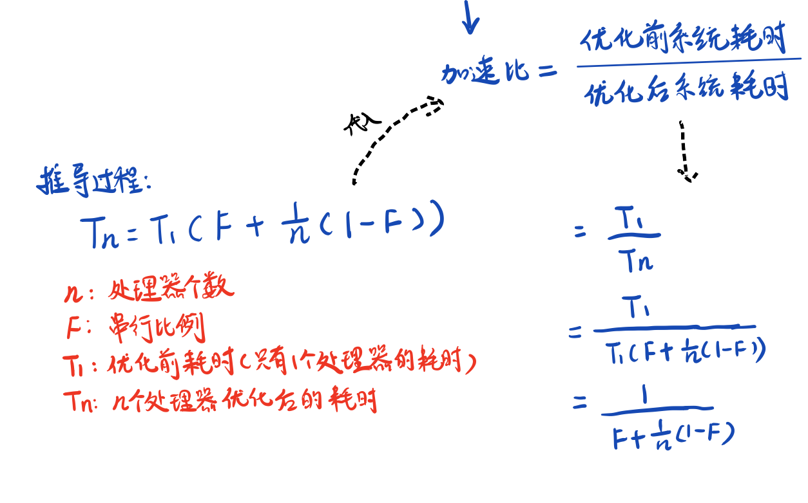

根据Aamdahl定律，使用多核CPU对系统进行优化，优化效果取决于 `CPU的数量` 以及系统中 `串行化程序的比重`。

CPU数量越多，串行化比重越低，优化效果越好，**仅提高CPU数量而不降低程序串行化比重，也无法提高系统性能。**


### Gustafson定律

试图说明处理器个数、串行比例和加速比之间的关系


**推导过程：**

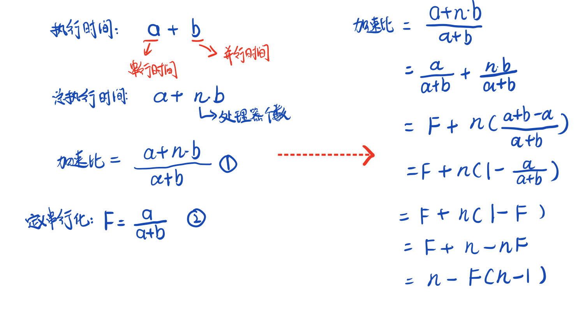

根据Gustafson定律，如果串行化比例很小，并行化比例很大，那么加速比**就是处理器的个数。只要你不断累加处理器，就能获得更快的速度。**


## JMM （Java Memory Model）

JMM的关键技术点都是围绕多线程的 `原子性`、`可见性 ` 、 `有序性`建立的。


### 原子性（Atomicity）

原子性是指一个操作是不可中断的。即使是多个线程一起执行的时候，一个操作一旦开始，就不会被其他线程干扰。

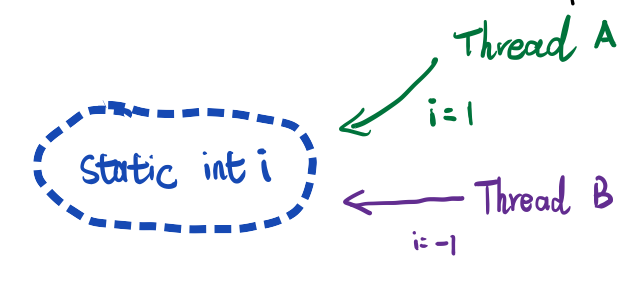

无论如何 i = 1 或者 i = -1。对于A, B来说两者之间没有干扰。

> PS:
>
> 对于32操作系统来说，long类型数据的读写是**非原子的**（因为long是64位）。


### 可见性（Visibility）

可见性指当一个线程修改某个 **共享变量** , 其他线程是否能够立即知道这个修改。


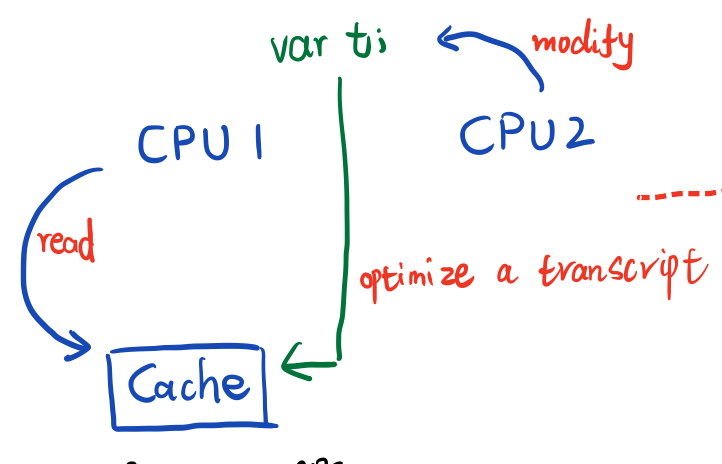

CPU1 和 CPU2 各运行一个线程，它们的共享变量t，由于编译器优化或者硬件优化的缘故。CPU1缓存t到Cache或者寄存器中。如果CPU2对t进行修改时，CPU1无法意识到修改，依然读取Cache或者寄存器中的旧值，导致数据不一致。


**可能导致可见性问题：**

- 缓存优化或硬件优化（有些内存的读写不是立即触发，会先进入一个硬件队列等待）。
- 指令重排
- 编译器优化


### 有序性（Ordering）

对于单线程，代码的执行是从前往后，依次执行。

对于多线程，程序的执行可能出现乱序（原因：程序执行时，可能出现指令重排，重拍后与原顺序未必一致）


```java
class OrderExample {
    int a = 0;
    boolean flag = false;

    public void write() {
        flag = true;
        a = 1;
    }

    public int read() {
        if (flag) {
            a = a + 1;
        }
        return a;
    }
}
```

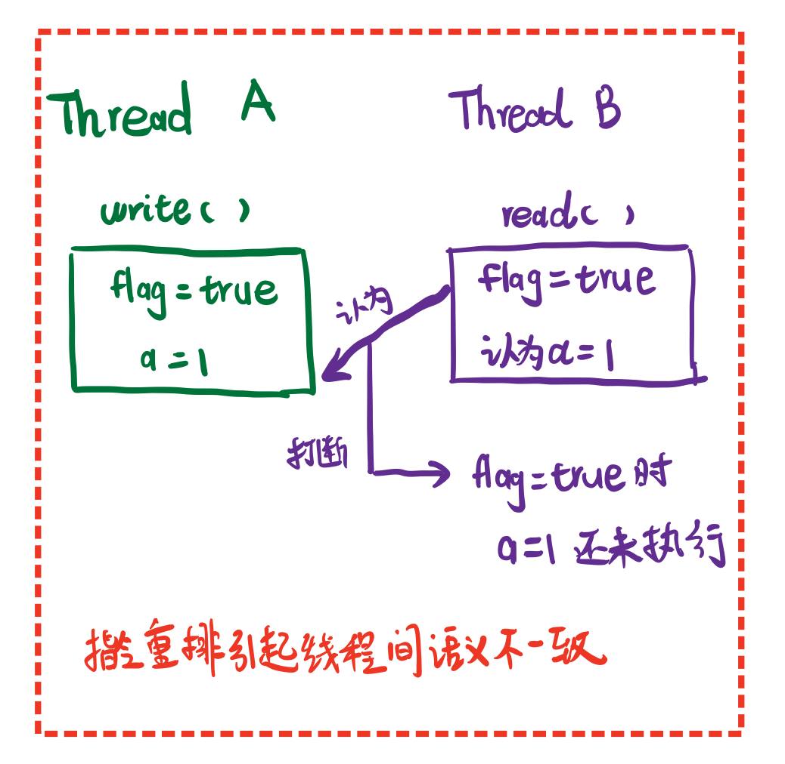

> 当然，指令重排有一个基本前提，就是**保证串行语义的一致性。**（对于一个线程来说，它看到的指令执行顺序一定是一致的）。
>
> 指令重排可以保证串行语义一致，但没有义务保证多线程间的语义一致。


**为什么需要指令重排？**

CPU 执行一条指令可以分为很多步： **取值 -> 译指 -> 执行**

例如： IF ID EX MEM WB 写入一个值

 为了提高效率，采用流水线


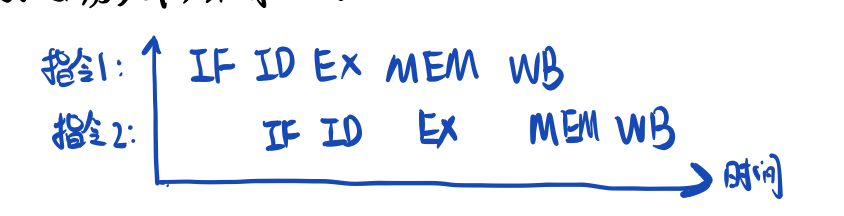

**流水线害怕被中断，一旦中断所有硬件设备进入一个停顿期。**为了避免中断，需要做指令重排。


### Happen-Before规则

以下一些基本原则，不会发生指令重排：

- **程序顺序原则**：一个线程内保证语义的串行性
- **volatile规则**：对于volatile变量的写，先发生于读，这保证了volatile变量的可见性
- **锁规则**：解锁必然发生在随后的加锁之前
- **传递性**：A优先于B, B优先于C, A必然优先于C
- **线程的start( )** 方法先于线程中的每一个动作
- **线程的中断( interrupt )** 先于被中断的代码
- 线程的所有操作先于**线程的终结 （ Thread.join( ) ）**
- **对象的构造函数执行**，结束与 finalize（）方法之前

拓展： [利用Happen-Before规则重新审视DCL](https://www.iteye.com/blog/lifethinker-260515)


## 总结&参考

本文主要总结了并发编程中经常提到的术语和概念。这也是并发编程中比较基础的储备。同时引入并行的两个定律，让我们更加直观的了解并行的性能与各种因素的关系。


[书籍]

1.葛一鸣 郭超.java高并发程序设计[M].中国工信出版集团 电子工业出版社

[网络]

1.https://www.iteye.com/blog/lifethinker-260515

2.https://zh.wikipedia.org/wiki/%E5%BC%82%E6%AD%A5%E6%96%B9%E6%B3%95%E8%B0%83%E7%94%A8

