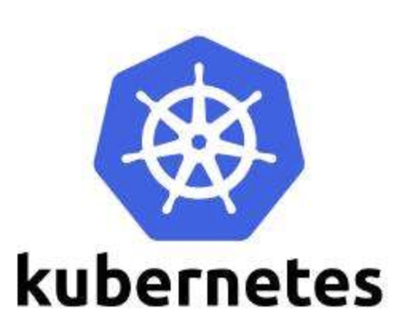

# Kubernetes

> #### 作为谷歌背书的一个容器编排平台，一经推出就受到万人追捧。同时它也是云原生道路上的重要实践。

## 参考资料

1.[kubernetes-handbook中文](https://jimmysong.io/kubernetes-handbook/cloud-native/cloud-native-definition.html) 相当不错的一本学习kubernetes的书

**本模块重点关注Kubernetes的实践、运用和总结**

