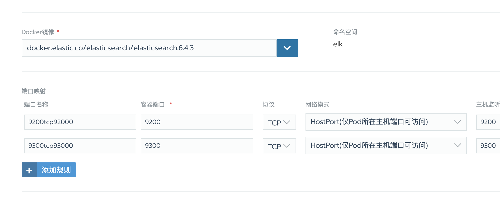
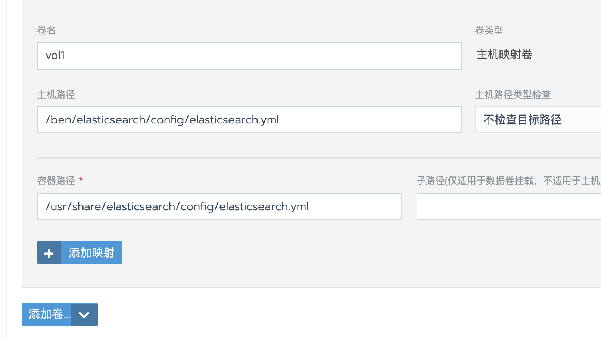
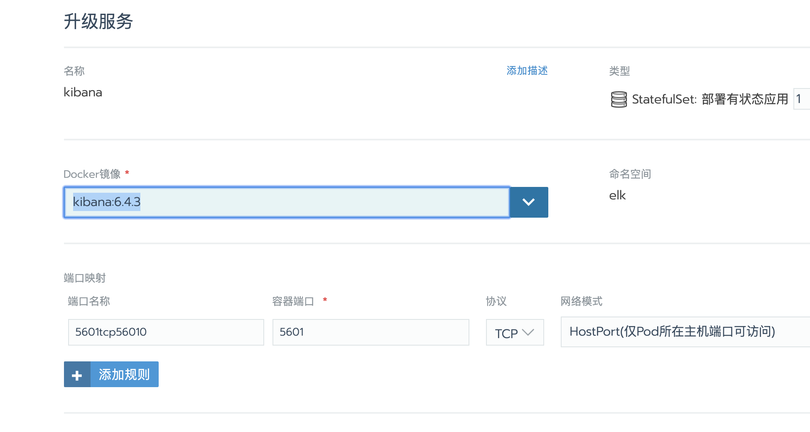
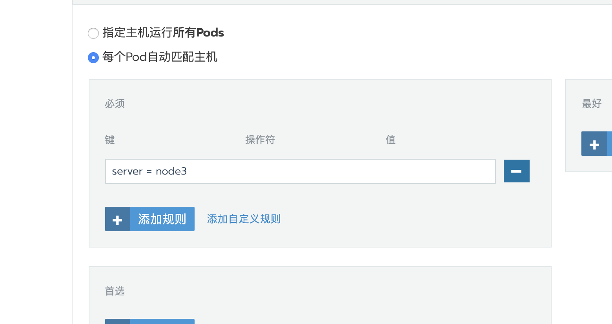
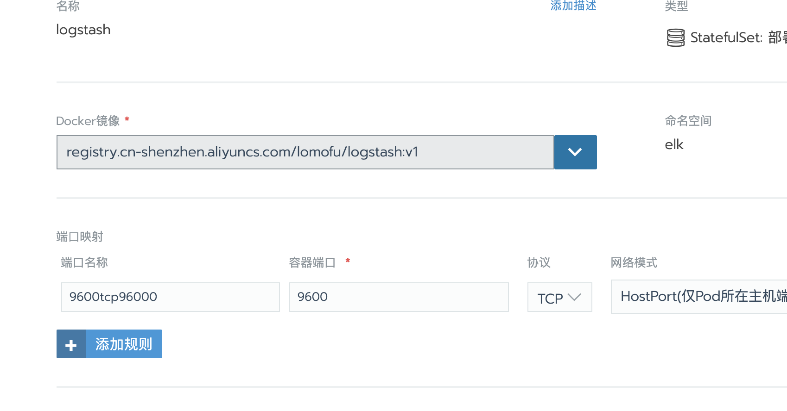

## Rancher 搭建ELK(Docker)

> 这里提供的方法是基于Docker思路移植到Rancher上本身都一样的,你也可以用k8s写好yaml或者docker-compose写好文件一键部署.


### 1.部署elasticsearch

```bash
docker pull elasticsearch:6.5.3
```



**参数**：

>  类型:	StatefulSet

>  镜像:	docker.elastic.co/elasticsearch/elasticsearch:6.4.3 

> 端口映射:	暴露9200用于访问elasticsearch

> 调度:	这里我放在node1节点 因为它本身比较耗资源需要2g的启动 当然你也可以去调整


> 数据卷:	
>
> 主机路径:	/ben/elasticsearch/config/elasticsearch.yml(随便你)
>
> 容器路径:	/usr/share/elasticsearch/config/elasticsearch.yml




记得在这个节点的服务器加入这个文件 `elasticsearch.yml`

个人建议还是不要写自己的镜像构建了 方便你后面调整参数 当然你也可以yaml里面用环境变量注入

```yaml
network.host: 0.0.0.0
xpack:
  ml.enabled: false
  monitoring.enabled: false
  security.enabled: false
  watcher.enabled: false
```


### 2.部署kibana

```bash
docker pull kibana:6.4.3
```



**参数**：

>  类型:	StatefulSet

>  镜像:	kibana:6.4.3

> 端口映射:	暴露5601用于访问elasticsearch

> 调度:	这里我放在node3节点




> 数据卷:
>
> 主机路径:	/rancher/elk/kibana/config/kibana.yml(随便你)
>
> 容器路径:	/usr/share/kibana/config/kibana.yml


记得在这个节点的服务器加入这个文件 `kibana.yml`,这里elasticsearch.url很关键不要写错了,不然无法启动

```yaml
server.host: "0.0.0.0"
elasticsearch.url: http://192.168.0.3:9200
xpack:
  apm.ui.enabled: false
  graph.enabled: false
  ml.enabled: false
  monitoring.enabled: false
  reporting.enabled: false
  security.enabled: false
  grokdebugger.enabled: false
  searchprofiler.enabled: false
```


### 3.部署logstash(附 同步mysql)

这里因为要同步mysql 所以需要安装两个插件，所以我就自己构建了docker镜像，当然你也可以在容器里面去操作，不推荐，删除就没了

```dockerfile
FROM logstash:6.4.3

#安装input插件
RUN logstash-plugin install logstash-input-jdbc

#安装output插件
RUN logstash-plugin install logstash-output-elasticsearch
```

构建完就可以用了




**参数**：

>  类型:	StatefulSet

>  镜像:	registry.cn-shenzhen.aliyuncs.com/lomofu/logstash:v1

> 端口映射:	暴露9600用于访问elasticsearch

> 调度:	这里我放在node3节点


主要就是这两个文件 ` logstash.yml`  `pipelines.yml`

> 数据卷:
>
> 主机路径:	/rancher/elk/logstash/config/logstash.yml(随便你)
>
> 容器路径:	/usr/share/logstash/config/logstash.yml


 logstash.yml

```yml
http.host: "0.0.0.0"
xpack.monitoring.elasticsearch.url: http://192.168.0.3:9200
```

pipelines.yml

```yaml
#流水线id
- pipeline.id: logstash1
#对于容器内的文件目录
  path.config: "/usr/share/logstash/pipeline/logstash.conf"（自定义）
  #多个
- pipeline.id: logstash2
#对于容器内的文件目录
  path.config: "/usr/share/logstash/pipeline/logstash1.conf"（自定义） 
```


比如

pipelines.yml中定义

```yaml
- pipeline.id: logstash2
#对于容器内的文件目录
  path.config: "/usr/share/logstash/pipeline/logstash1.conf"（自定义） 
```

那么在`usr/share/logstash/pipeline/`中定义的一个流水线对应的`logstash1.conf`


```conf
input {
 stdin { }
    jdbc {
        #注意mysql连接地址一定要用ip，不能使用localhost等
        jdbc_connection_string => "jdbc:mysql://xxxxxxxx/ben_account?useUnicode=true&characterEncoding=utf8&&autoReconnect=true&useSSL=false&&serverTimezone=CTT"
        jdbc_user => "xxxxxx"
        jdbc_password => "xxxxxxxx"
        #这个jar包的地址是容器内的地址
        jdbc_driver_library => "/opt/kibana/config/mysql-connector-java-8.0.19.jar"
        #这个jar包驱动 如果是8.0就用cj否则不需要
        jdbc_driver_class => "com.mysql.cj.jdbc.Driver"
        jdbc_paging_enabled => "true"
        jdbc_page_size => "50000"
        statement => "SELECT * FROM account"
        schedule => "*/15 * * * *"
 
	#处理中文乱码问题
      	codec => plain { charset => "UTF-8"}
	#是否记录上次运行的结果
        record_last_run => true
        #记录上次运行结果的文件位置
        last_run_metadata_path => "/opt/kibana/config/station_parameter.txt"
        #是否使用数据库某一列的值，
        use_column_value => true
        tracking_column => "createtime"
        #numeric或者timestamp
        tracking_column_type => timestamp
        
        #如果为true则会清除 last_run_metadata_path 的记录，即重新开始同步数据
        #clean_run => false
 
    }
 }
 
 filter {
    ruby {
        code => "event.timestamp.time.localtime"
    }
}
 
 output {
     stdout {
        codec => json_lines
    }
    elasticsearch {
        #elasticsearch 地址
        hosts => "192.168.0.3:9200"
        #elasticsearch 索引
        index => "account"
        #elasticsearch 文档类型
        document_type => "message"
        document_id => "%{id}"
    }
}

```


至此ELK三剑客就全部搭完了


参考:

https://www.cnblogs.com/hackyo/p/9951684.html

https://blog.csdn.net/chongshi4396/article/details/100805225

https://blog.csdn.net/supercmd/article/details/91048042

