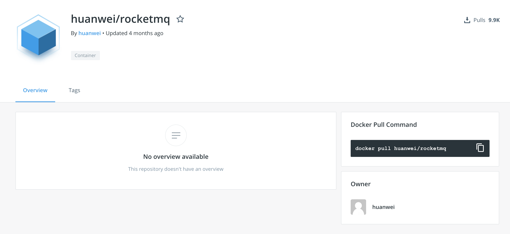
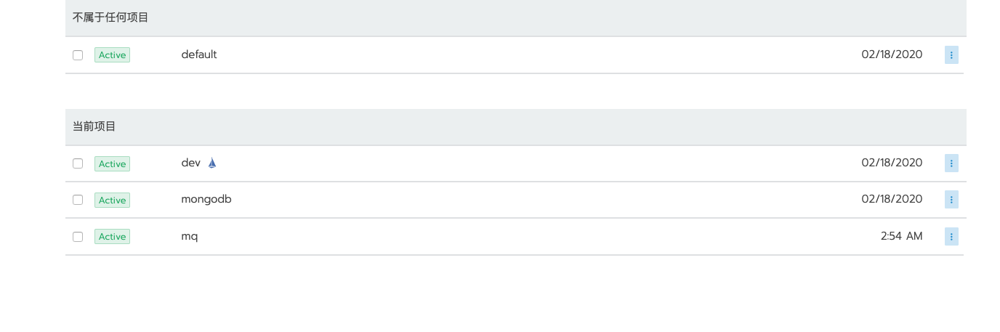
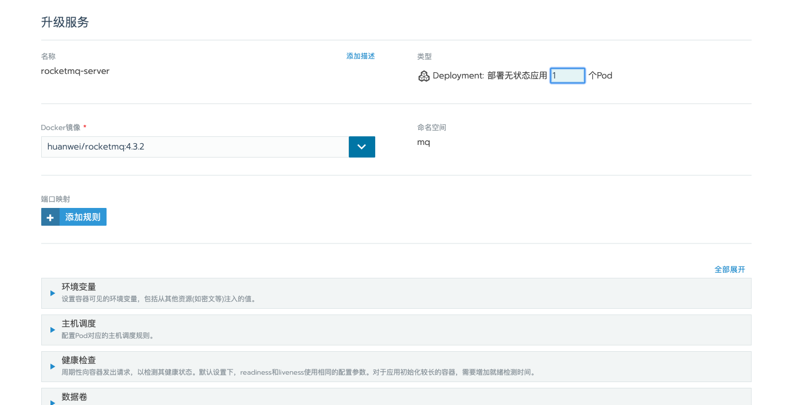
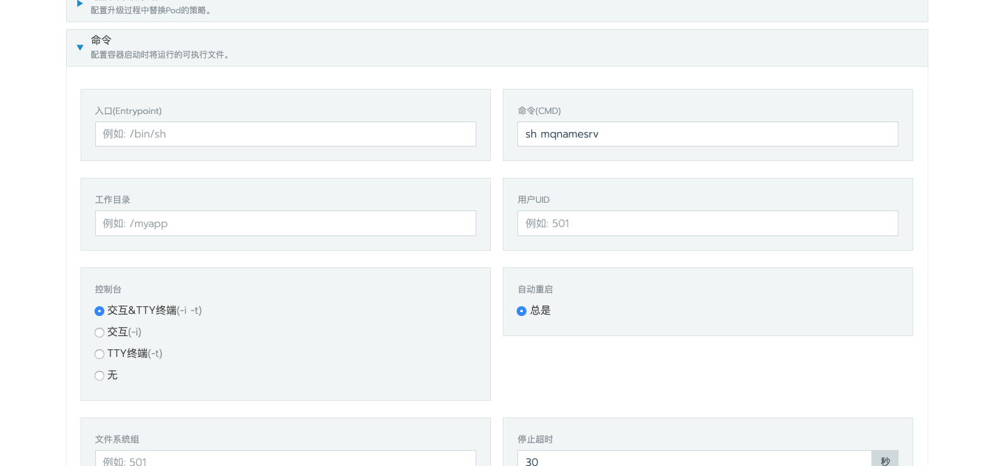
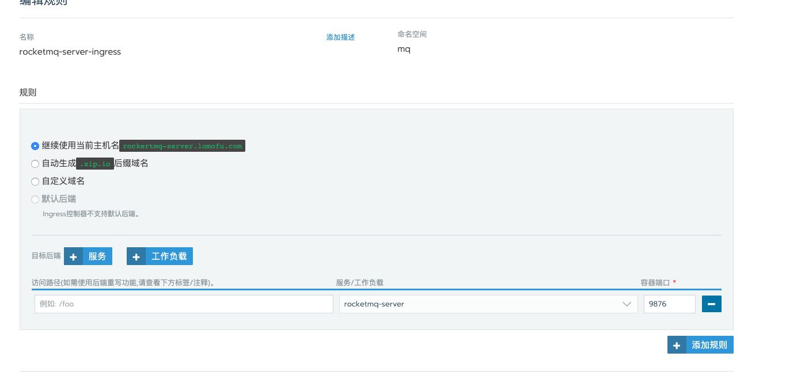
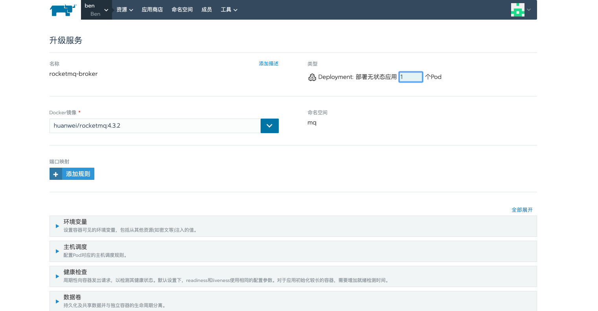
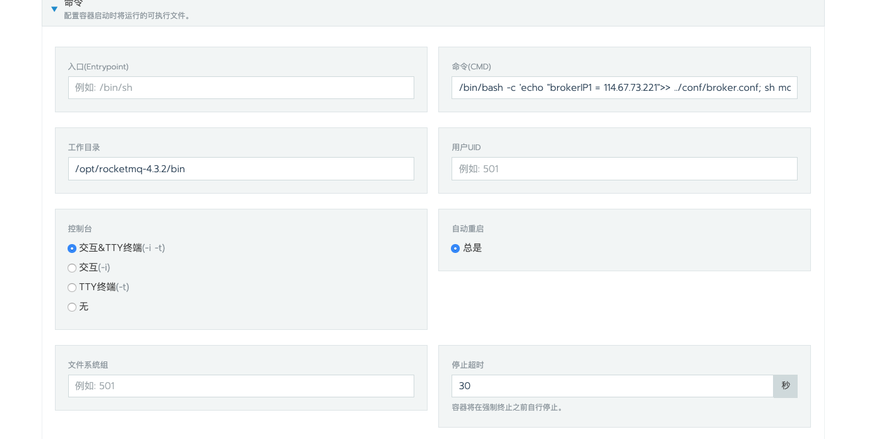
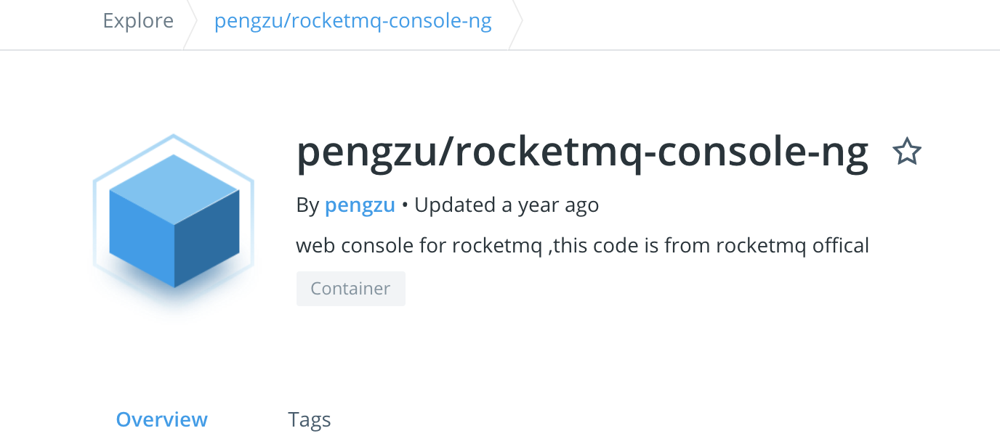

# Rancher 部署RocketMQ环境

## 1.镜像

https://hub.docker.com/r/huanwei/rocketmq



## 2.进入rancher 建立namespace

## 3.创建mq namserver





指定启动以nameserv

暴露端口

1.这里有两个思路 一个是直接通过容器暴露 以hostname 或者nodeport形式

2.我这里用的是ingress 来导向



端口为9876


## 4.搭建broker





端口10911

```bash
/bin/bash -c 'echo "brokerIP1 = 114.67.73.222">> ../conf/broker.conf; sh mqbroker -c ../conf/broker.conf autoCreateTopicEnable=true -n 114.67.73.222:9876'
```

> 解析


```bash
/bin/bash -c 'echo "brokerIP1 = 114.67.73.221">> ../conf/broker.conf; 
```

这个命令是在启动broker之前往broker.conf添加配置

```bash
sh mqbroker -c ../conf/broker.conf autoCreateTopicEnable=true -n 114.67.73.221:9876’
```

这个命令指定broker配置文件启动，-n指定namesev服务地址

最后 添加环境变量

**MAX_POSSIBLE_HEAP = 268435456 最大堆256m**


## 5.搭建控制台



https://hub.docker.com/r/pengzu/rocketmq-console-ng

```bash
docker pull pengzu/rocketmq-console-ng:latest
```

添加环境变量

> JAVA_OPTS ： -Drocketmq.namesrv.addr=nameserverip:9876 -Dcom.rocketmq.sendMessageWithVIPChannel=false -Dserver.port=8080


搞定！

## 参考

https://blog.csdn.net/a18270839119/article/details/96432478

不得不吐槽一下,这个作者不注意中文标点和…都有 属实坑了我一下