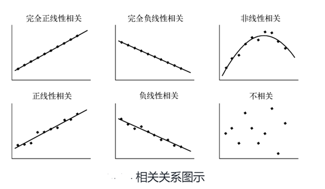
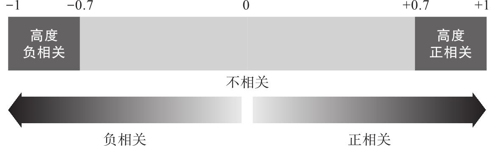

# Machine Learning 机器学习 02


## Model performance assessment 模型性能评估 

在ML中，有许多指标去评判模型的性能


### Metrics in classification 分类模型的指标

- **confusion matrix** *混淆矩阵*
- **precision** *精确率*
- **recall** *召回率*
- **accuracy** *准确性*


#### Confusion matrix

> 一种 NxN 表格，用于总结 `分类模型`的预测效果；即标签和模型预测的分类之间的关联。
>
> 在混淆矩阵中，一个轴表示模型预测的标签，另一个轴表示实际标签。N 表示类别个数。在 `二元分类` 问题中，N=2。

例如：

|                  | spam(predicted) | not-spam(predicted) |
| ---------------- | --------------- | ------------------- |
| spam(actual)     | 23 (TP)         | 1 (FN)              |
| not-spam(actual) | 12 (FP)         | 556 (TN)            |

*P (Postive）：spam*

*N (Negative) : Not-spam*

上述的混淆矩阵表示：

- 在24个垃圾邮件的样本中，该模型**正确预测**23个垃圾样本（正确且为正例 TP），1个**预测错误**认为是非垃圾邮件（错误且为负例 NP）
- 在568个正常邮件的样本中，该模型**正确预测**556个是正常邮件（TN）, 12个**预测错误**认为是垃圾邮件（FP）


**Python代码**

```python
from sklearn.metrics import confusion_matrix
from random import choice

label = ['spam','not-spam']

# actual: ['spam', 'not-spam', 'not-spam', 'spam', 'not-spam', 'not-spam', 'spam', 'not-spam', 'spam', 'not-spam'] 
actual = [ choice(label)  for i in range(10)]
# pred: ['not-spam', 'not-spam', 'spam', 'spam', 'spam', 'not-spam', 'not-spam', 'spam', 'spam', 'spam']
pred = [  choice(label)  for i in range(10)]

confusion_matrix(actual,pred,labels=label)
"""
array([[2, 2],
       [4, 2]])
"""
```

#### Precision

模型在**`预测为正类时`** **( TP+FP )** 正确的频率
$$
precision = \frac {TP} {TP + FP}
$$
例如，根据上述混淆矩阵，可以得出
$$
precision = \frac {TP} {TP + FP} = \frac {23} {23+12} ≈ 0.657
$$


**Python实现**

```python
from sklearn.metrics import precision_score

actual = ['spam', 'not-spam', 'not-spam', 'spam', 'not-spam', 'not-spam', 'spam', 'not-spam', 'spam', 'not-spam']
pred = ['not-spam', 'not-spam', 'spam', 'spam', 'spam', 'not-spam', 'not-spam', 'spam', 'spam', 'spam']

precision_score(actual, pred, pos_label= 'spam')

"""
0.3333333333333333
"""
```


#### Recall 

模型在**`所有正类中` ( TP + FN )**，预测为 **正例且正确 ( TP )** 的频率
$$
recall = \frac { TP } { TP + FN }
$$
例如，根据上述混淆矩阵，可以得出
$$
recall = \frac {TP} {TP + FN} = \frac {23} {23 + 1} ≈ 0.958
$$

**Python实现**

````python
from sklearn.metrics import recall_score

actual = ['spam', 'not-spam', 'not-spam', 'spam', 'not-spam', 'not-spam', 'spam', 'not-spam', 'spam', 'not-spam']
pred = ['not-spam', 'not-spam', 'spam', 'spam', 'spam', 'not-spam', 'not-spam', 'spam', 'spam', 'spam']

recall_score(actual, pred, pos_label= 'spam')

"""
0.5
"""
````


> #### 关于 Precision 和 Recall
>
> 1. `precision` 和 `recall` 的分子都是 TP, 即正确识别出的目标类别。也就是说，这两个指标都是用在目标类别上的，并围绕着正确识别出的目标类别转的。
> 2. `precision` 强调的是**在预测为Positive的所有数据中** (TP+FP), 有多少本来是postive的 (TP)
> 3. `recall` 强调的是**事实上本身就是Postive的所有数据中** (TP+FN), 有多少本来是postive(TP)
> 4. 当**False Negative (FN)的成本代价很高时**，我们希望能尽量避免产生FN，这时候我们要**着重考虑提高Recall指标**
> 5. 当**False Postive (FP)的成本代价很高时**，**尽可能提高Precision值**，哪怕牺牲一部分recall


#### Accuracy

模型在**`所有类中` ( TP + TN + FP + FN )**，**`预测正确的类` (TP + TN)** 占比
$$
accuracy = \frac {TP + TN} {TP + TN + FP + FN}
$$


例如，根据上述混淆矩阵，可以得出
$$
accuracy = \frac {TP + TN} {TP + TN + FP + FN} = \frac {23 + 556}{ 23+1+556+12} ≈ 0.978
$$
**Python实现**

```python
from sklearn.metrics import accuracy_score

actual = ['spam', 'not-spam', 'not-spam', 'spam', 'not-spam', 'not-spam', 'spam', 'not-spam', 'spam', 'not-spam']
pred = ['not-spam', 'not-spam', 'spam', 'spam', 'spam', 'not-spam', 'not-spam', 'spam', 'spam', 'spam']

accuracy_score(actual, pred)

"""
0.4
"""
```


> 1. `accuracy` **不管分类目标**，只用于计算**每一个分类正确的数量**与总数量的百分比
> 2. **对于不平衡数据集而言, accuracy并不是一个好指标。**会给人一种分类很好的错觉，但其实分类器或许并没有作用


### Metrics in regression 回归模型中的指标

- root mean squared error (**RMSE**) *均方根误差*
- mean absolute error (**MAE**) *平均绝对误差*


#### RMSE

$$
RMSE = \sqrt{\frac {1}{n} \sum_{i=1}^n {(\hat{y_i} - y_i)^2}}
$$

这个是开根号的MSE, **当预测值与真实值完全吻合时等于0**。例如RMSE = 10, 可以认为是**回归效果**相比真实值**平均相差**10

**Python代码**

```python
import numpy as np
from sklearn.metrics import mean_squared_error

# assume that y_true is the truth dataset, y_pred is the prediction dataset
np.sqrt(mean_squared_error(y_true, y_pred))
```


#### MAE

$$
MAE = \frac {1}{n} \sum_{i=1}^n {\abs {\hat{y_i}-y_i}}
$$

范围为 [0, +∞]，**当MAE = 0, 表示预测值与真实值吻合**；同样，如果误差越大，该值越大

**Python代码**

```python
import numpy as np
from sklearn.metrics import mean_absolute_error

# assume that y_true is the truth dataset, y_pred is the prediction dataset
mean_absolute_error(y_true, y_pred)
```


## Dataset 数据集

### Get the data 获取数据

常见的数据集获取源：

1. [UC Irvine Machine Learning Repository](https://archive.ics.uci.edu/ml/index.php)
2. [Kaggle](https://www.kaggle.com/)
3. [Amazon’s AWS datasets](https://registry.opendata.aws/)
4. [Data portals](http://dataportals.org/)
5. [Open data monitor](https://www.opendatamonitor.eu/)
6. [Quandl](https://www.quandl.com/)


### Partition the data into Three sets 划分三个数据集

对于模型来说，训练集上的误差称为 `training error 训练误差` 或者 `empirical error 经验误差` ，测试集的误差称为` testing error 测试集误差`, 而在新的样本中的误差称为 `generalization error 泛化误差`。上述我们就可以看出，我们更加关注测试误差，因为它是用来**评估摸型对于新样本的学习能力**, 即我们想要模型可以从现有数据中学习到某种规律来用于新样本中，也就是希望模型的泛化能力要强。因此，  我们需要划分三个数据集:


- Training set 训练集 【类似你上课学知识】
- Validation set  验证集 【相当于课后练习题，用于纠正和强化所学的内容】
- Test set 测试集 【相当于最终考试，用来检验你的学习成果】


#### Training set 

是用来训练模型使用的


#### Validation set

当模型训练完成后，对于模型的表现是未知的。这个时候我们可以采用 `Validation set 验证集` , 来看看模型在新数据（验证集和测试集数据是不同的）的表现如何。**同时通过调整超参数（Hyperparameters）使得模型处于最好的状态。**

> **Notation**
>
> 验证集是非必要的，如果不需要调整超参数，可以不划分验证集，直接使用测试集来评估结果。
>
> **为什么需要验证集？**
>
> 虽然模型的泛化误差我们可以通过测试集来估计，也就是直接通过模型在测试集上的误差来调节这些超参数。但是事实上是，可能模型在测试集中的误差为0，但是部署到真实场景中使用，效果可能会更非常差。以上这种现象，称为 `Data Leakage 信息泄露`。因为我们使用测试集作为泛化误差近似，所以不到最后是不能将测试集的信息泄露出去。


#### Test set

测试集用来最终评估，模型的最终效果以测试集的评估效果为准。


### Cross validation 交叉验证法

> 评估模型是否学会了「某项技能」时，**需要用新的数据来评估，而不是用训练集里的数据来评估**。这种「训练集」和「测试集」完全不同的验证方法就是交叉验证法。

#### 3 种主流的交叉验证法

- Holdout cross validation 留出法
- Leave one out cross validation 留一法
- k-fold cross validation k折交叉校验


##### Holdout cross validation 留出法

> 按照固定比例将数据集**静态的**划分为训练集、验证集、测试集的方式

1. 小规模数据集 (万级别以下)，`Training set`, `Validation set` 和 `Test set` 比例是 **6：2：2**
2. 大规模数据集（百万级以上），可以将`Training set`, `Validation set` 和 `Test set`比例调整为 **98：1：1**
3. **超参数越少，或者超参数很容易调整**，那么可以减少验证集的比例，更多的分配给训练集


**通过sklearn实现 使用`随机采样`的方式：**

```python
import pandas as pd 
import numpy as np
from sklearn.model_selection import train_test_split

spam_data = pd.read_csv('https://raw.githubusercontent.com/maalvarezl/MLAI/master/Labs/datasets/spambase.data', header=None)
spam_data = pd.read_csv('https://raw.githubusercontent.com/maalvarezl/MLAI/master/Labs/datasets/spambase.data', header=None)
spam_names_list = pd.read_csv('https://raw.githubusercontent.com/maalvarezl/MLAI/master/Labs/datasets/spambase.data.names', header=None)
number_names = np.shape(spam_names_list)[0]
spam_names = ['None']*number_names
for i in range(number_names):
    local = spam_names_list[0][i]
    colon_pos = local.find(':')
    spam_names[i] = local[:colon_pos]
spam_data.columns = spam_names

# data:需要进行分割的数据集
# random_state:设置随机种子，保证每次运行生成相同的随机数
# test_size:将数据分割成训练集的比例
train_set, test_set = train_test_split(spam_data, test_size=0.2, random_state=42)

# [4601 rows x 58 columns]
print(spam_data)
# [3680 rows x 58 columns]
print(train_set)
# [921 rows x 58 columns]
print(test_set)
```

纯随机的采样方式对于**大量数据集**以及对于**目标值分布均匀**的情况是可行的。


**通过sklearn实现 使用`分层采样`的方式**

**当数据集中数据分布不均匀**，比如一个数据集中，90%都是正类，剩余10%是负类。那么如果采用随机采样，有一种极端情况就是，所有的正类都划分到训练集，而测试集中式负类。这样训练出的模型，效果一定不会太好。而**采用分层的方式，可以保证划分出的训练集既包含一定比例的正类又包含一定比例的负类。**

```python
from sklearn.model_selection import StratifiedShuffleSplit
# 自变量
X = np.array([[1, 2], [3, 4], [5, 6], [7, 8],[1,2],[1,2]])
# 因变量
y = np.array([0, 0, 1, 1, 1, 1])

split = StratifiedShuffleSplit(n_splits=3, test_size=0.3, random_state=0)

for train_index, test_index in split.split(X,y):
    X_train, X_test = X[train_index], X[test_index]
    y_train, y_test = y[train_index], y[test_index]

print(y_train)
print(y_test)
```

> **n_splits int，默认为10**
>
> *重新改组和拆分迭代的次数。* **如果我们要划分训练集和测试集的话，将其设置为1即可**
>
> **test_size 浮点数，整数，None，可选（默认值：None）**
>
> *如果为float，则应在0.0到1.0之间，代表测试集占总数据集的比例。如果为int，则表示测试集中样本的绝对数量。如果为None，则将值设置为train_size的补数。如果train_size也是None，则将其设置为0.1。*


##### Leave one out cross validation 留一法

> 每次的测试集都**只有一个样本**，要进行m次训练和预测。

这种方法用于训练的数据只比整体数据集少了一个样本，因此最接近原始样本的分布。但是训练的复杂度增加，因为模型的数量与原始数据相同。**一般用于缺乏数据时使用。**

通过sklearn实现

```python
import numpy as np
from sklearn.model_selection import LeaveOneOut
X = np.array([[1, 2], [3, 4], [5, 6], [7, 8],[1,2],[1,2]])

split = LeaveOneOut()

for train_index, test_index in split.split(X):
    X_train, X_test = X[train_index], X[test_index]


print(X_train)
print(X_test)
```


K-fold cross validation k折交叉验证

> 这是一种动态验证的方式，可以降低数据划分带来的影响。 

1. 将数据划分为训练集和测试集
2. 将`训练集`分成k组（大小相似的互斥子集）
3. 每次使用k份中的**1份作为`测试集`**，**其他k-1用作`训练集`**，尽量保证每个子集数据分布的一致性
4. 依次得到测试结果s1,s2,…,sk
5. 对上述k个测试结果取平均值作为参数/模型的性能评估


10折交叉验证


> 1. **数据量小的时候**，k一般取10，也可以取大一点，这样训练集占整体数据集的比例大，但同时训练的模型也会变多。
>
> 2. **数据量大的时候**，k可以设置小一点。
> 3. K折交叉验证使用不重复采样，优点是每个样本只会在训练活测试中出现一次。这样得到的模型评估结果有更低的方法。

```python
import numpy as np
from sklearn.model_selection import StratifiedKFold


X = np.array([[1, 2], [3, 4], [1, 2], [3, 4]])
y = np.array([0, 0, 1, 1])

kfold = StratifiedKFold(n_splits=2)

splits = 1

for train_index,test_index in kfold.split(X,y):
  X_train, X_test  = X[train_index], X[test_index]
  y_train, y_test  = y[train_index], y[test_index]
  print('split: {} Train: {} Test: {} \n'.format(splits,X_train, X_test))
  print('split: {} Train: {} Test: {} \n'.format(splits,y_train, y_test))
  print()
  splits += 1

```


### Explore the data 探索性数据分析

#### Scatter plot 散点图

> 通过绘制散点图判断变量之间的关系形态



如果要判断多个数据的之间的关系，散点图的绘制就会显得比较繁琐，这时候要选择绘制散点矩阵，例如下图所示


#### Correlation coefficient 相关系数

> 是根据样本数据计算的度量两个变量之间**线性关系**强度的统计量。也称线性相关系数或Pearson相关系数

$$
r (X,Y) = \rho _x,_y = \frac {E \{ (X  -\mu_x) (Y- \mu_y) \}} { \sigma_x \sigma_y} = \frac {Cov(X,Y)} {\sigma_x \sigma_y}
$$


$$
\rho _x,_y 是一个可以表征x和y之间线性关系紧密程度的量, 以下用r代替
$$

>  r 的值 **大于-1 小于1**




> 相关系数越接近 1，正相关的程度越高。也就是说，一方数据增加，另一方数据也会随之增加。二者完全成比例（如果一方增至 2 倍，另一方也随之变为 2 倍）时的相关系数最大，是 1。相关系数为 0，表示两个数据没有任何关联，互相独立。实际业务中使用的第一手数据，一般都不是 0 或者 1 所表示的完全不相关或者完全成比例相关，而是介于二者之间。


通过pandas实现相关性计算

> `pandas`中`DataFrame`对象`corr()`方法的用法，该方法用来计算DataFrame对象中所有列之间的相关系数（**包括pearson相关系数、Kendall Tau相关系数和spearman秩相关**）

```python
import numpy as np
import pandas as pd 

data = pd.DataFrame({
    'A': np.random.randint(1,100,10),
    'B': np.random.randint(1,100,10),
    'C': np.random.randint(1,100,10),
})

print(data)

# 计算pearson相关系数

pearson = data.corr()
print(pearson)

# 计算kendall相关系数
kendall = data.corr('kendall')
print(kendall)

# 计算spearman相关系数
spearman = data.corr('spearman')
print(spearman)
```


### Prepare for data 数据准备

#### Data Cleaning 数据清理

- 删除数据中的异常值 (可选)

- 处理缺失的数据
  - 最常见的方式，用其所在列的**均值**来填充（利用 scikit-learn 预处理模型中的 `Imputer` 类来很轻松实现）
  - 如果数据集足够大并且缺失值的百分比很高（例如，超过50％），则可以**删除包含数据的行 ( pandas DataFrame 对象中的 `dropna`方法)**
  - 可以用0填充所有空变量来处理数值


#### Handle Categories 处理分类数据

> 机器学习仅使用数值（float或int数据类型）。因此，可以编码为虚拟变量，为每个类别分配一个数字。最简单的方法是使用`One-hot encoding `


**通过sklearn的OneHotEncoder**

```python
import numpy as np
from sklearn.preprocessing import OneHotEncoder


X = np.array([['b',2],['c',3],['a',8],['b',4],['a',4.9]])
print(X)
enc = OneHotEncoder(handle_unknown='ignore')

enc.fit(X)
print(enc.categories_)

X_encoding = enc.fit_transform(X).toarray()
print(X_encoding)
```


#### Feature scaling 缩放和规范化

因为线性回归、逻辑回归对于数值的大小很敏感，因此需要将不同量级的数据进行数值进行归一化。常见的缩放到 **[0,1]区间，或者 [-1,1]区间。**


##### **Min-Max Normalization Min-Max归一化**

>  也称`极差法` ,它是将数据集中某一列数值缩放到**0和1之间**。

**公式**
$$
{x}’=\frac{x-x_{min}}{x_{max}-x_{min}}
$$

> 注： 上述公式是缩放到0，1区间，如果需要缩放到指定区间，公式完整如下

$$
{x}’=\frac{x-x_{min}}{x_{max}-x_{min}} \times (high - low) + low
$$

> **high**为区间右边的最大值，**low**为区间左边的最小值


**通过sklearn实现**

```python
from sklearn.preprocessing import minmax_scale
import numpy as np

X = '42 47 59 27 84 49 72 43 73 59 58 82 50 79 89 75 70 59 67 35'
X = X.split()

X = [int(i) for i in X]

# 缩放到0，1区间
X_normal = minmax_scale(X)

# 缩放到-1，1区间
X_normal1 = 2 * minmax_scale(X) -1  

print(X_normal)
```


##### Z-score Standardization Z标准化

也叫`标准差标准化`，代表的是分值偏离均值的程度，经过处理的数据符合**标准正态分布**，**即均值为0，标准差为1**。

**公式**
$$
{x}’= \frac{x-\mu }{\sigma }
$$
**通过sklearn实现**

```python
from sklearn.preprocessing import StandardScaler
import numpy as np

X = '42 47 59 27 84 49 72 43 73 59 58 82 50 79 89 75 70 59 67 35'
X_raw = stu_score.split()

X = np.array([X_raw])
X.shape = len(X_raw),1

X_stand = StandardScaler().fit(X)
X_stand.transform(X)
```


##### 标准化、归一化的区别

**相同**

> 1. 都是对某个特征（或某一列，或某个样本）的数据进行缩放


**差异**

> 1. `Normalisation` **受离群点的影响大**
> 2. `Standardisation` **受离群点影响小**，因为重新创建一个新的数据分布


**选择**

- 如果**数据集小而稳定**，选择**归一化**
- 如果**数据集大且中含有噪声和异常值**，可以选择**标准化**。


#### Short-List Promising Models 列出可能的模型

- 如果数据过大，需要抽取较小的训练集，以便在合理时间内训练不同的训练模型。
- 使用标准参数训练不同类别的快速模型（例如，线性，朴素贝叶斯，SVM，随机森林，神经网络等）


## 参考

1. https://zhuanlan.zhihu.com/p/37246394
2. https://zhuanlan.zhihu.com/p/147663370
3. https://ailearning.apachecn.org/#/docs/ml/1
4. https://cloud.tencent.com/developer/article/1522913
5. https://zhuanlan.zhihu.com/p/48976706
6. https://easyai.tech/ai-definition/3dataset-and-cross-validation/
7. https://www.bilibili.com/video/BV17J411C7zZ?p=6
8. https://blog.csdn.net/JT_WPC/article/details/104565877
9. https://ljalphabeta.gitbooks.io/python-/content/kfold.html
10. https://www.cnblogs.com/jiaxin359/p/8552800.html
11. https://scikit-learn.org/stable/modules/generated/sklearn.model_selection.StratifiedKFold.html?highlight=stratifiedkfold#sklearn.model_selection.StratifiedKFold
12. https://zhuanlan.zhihu.com/p/99123384
13. https://www.jiqizhixin.com/articles/2019-02-21-15
14. https://easyai.tech/blog/data-cleaning-and-preprocessing-for-beginners/
15. https://www.biaodianfu.com/feature-scaling-normalization-vs-standardization.html#Z%E6%A0%87%E5%87%86%E5%8C%96%EF%BC%9A%E5%AE%9E%E7%8E%B0%E4%B8%AD%E5%BF%83%E5%8C%96%E5%92%8C%E6%AD%A3%E6%80%81%E5%88%86%E5%B8%83
16. https://www.datalearner.com/blog/1051521208408652

