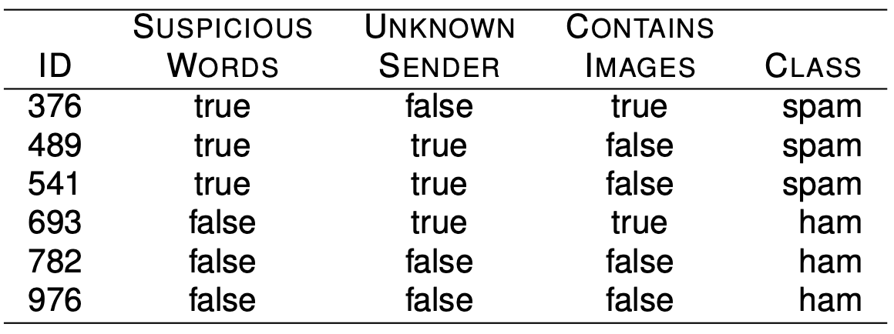
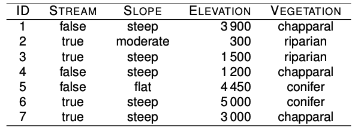
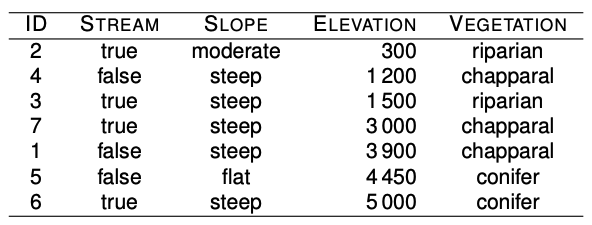
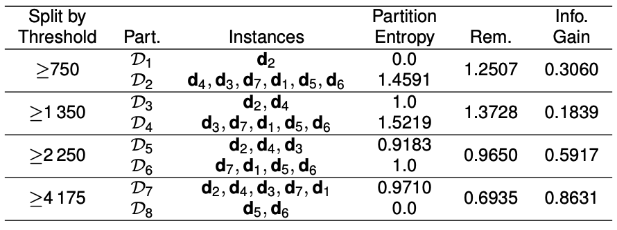
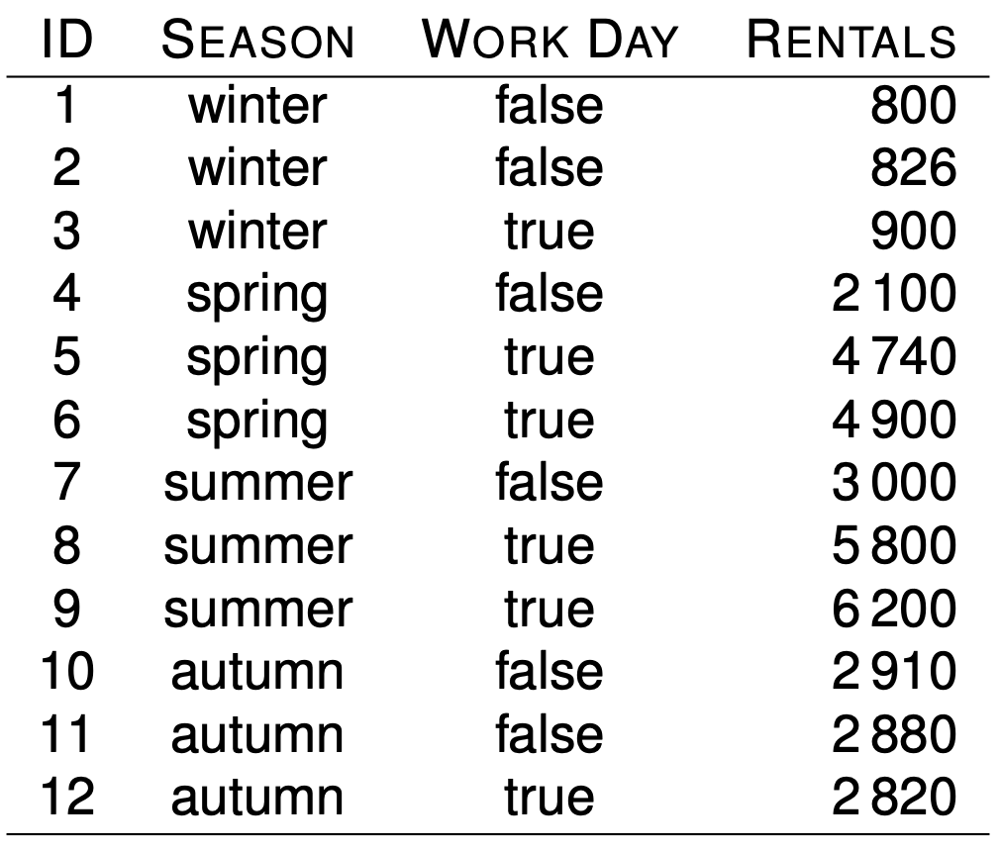
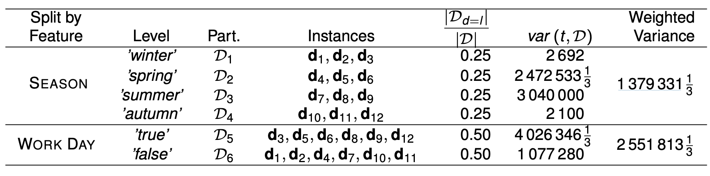
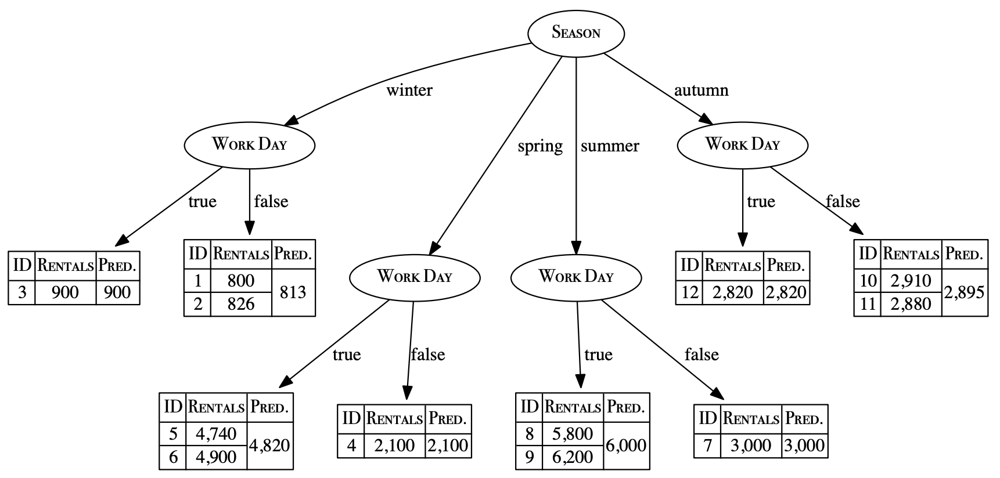
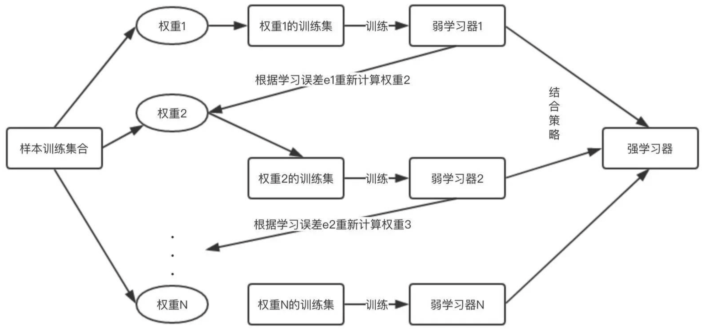
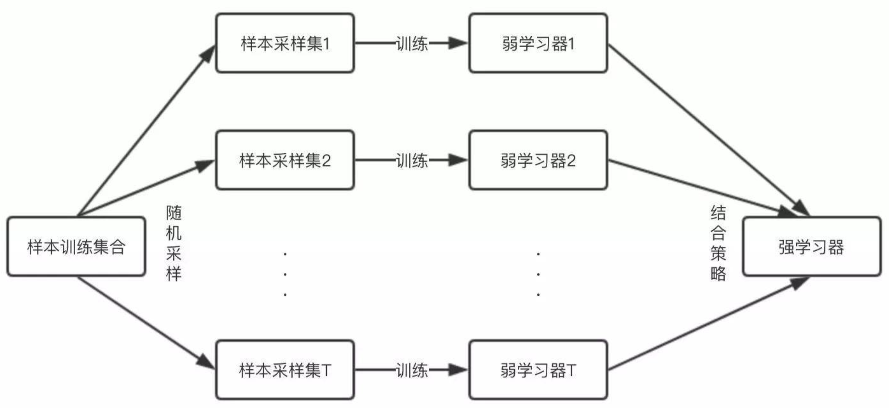
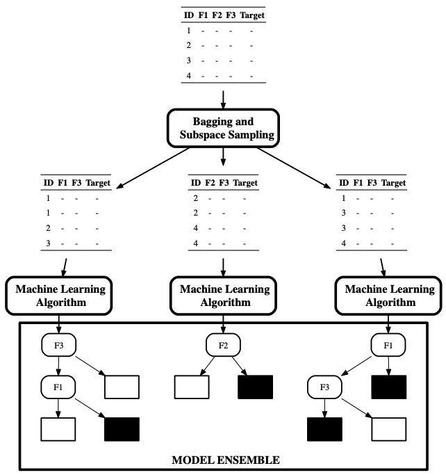

#  Machine Learning 机器学习 03 决策树和集成方法

> 树模型（tree-based model）遵循 “分而治之”的思路，以递归方式将特征空间划分为若干个矩形的区间，再在每一个区间上拟合一个简单的模型。而在分类问题中，这个简单模型即是类别的标签选择。决策树( Decision Tree) 算法是一种**基本的分类与回归方法**，如果在意模型的可解释性，决策树分类器绝对是最好的选择。我们可以把它理解成基于一系列问题对数据做出的分割选择。

例：一个邮件分类系统其决策树形式

## Definition 定义

### 一个决策树的组成

- 根节点 root node / starting node 【包含样本的全集】
- 内部节点 internal nodes 【对应特征属性测试】
- 叶结点 leaf node / terminating nodes 【代表决策的结果】

> - **非叶子节点 non-leaf nodes** ( 内部节点 internal nodes 或者 根节点 root node ) 表示**特征或者属性 (features**)
>
> - **叶节点 leaf nodes** 表示一个类 (labels)

### 使用决策树对需要测试的实例进行分类

1. 从根节点开始，对实例某一个特征进行测试，根据测试得到的结果，将实例分配到其对应的子节点
2. 这时，每一个子节点都对应该特征的一个取值
3. 如此**递归**对实例进行测试分配
4. 直至达到叶结点，最后将其分配到叶结点的类中

这是一种基于 if-then-else 规则的有监督学习算法，决策树的这些规则是通过训练得到的，而不是人工制定的。

## Entropy 熵

熵是对正在处理的信息中随机性的一种度量（即随机变量不确定性的度量）。**熵越高，从该信息得出结论就越难。**

**概率与熵 Probability and entropy**

- 高概率 -> 低熵
- 低概率 -> 高熵 (信息量越大)

**公式**

假如一个随机变量X的取值是 $X = \{{x_1,x_2,x_3, ..., x_n}\} $, 每一种概率的分别是 ${\{ p_1,p_2,p_3,..., p_n \}}$，那么X的熵定义为
$$
H(X) = - \sum_i^n {(P(X=i) \times{log_2 (P(X=i))})}
$$

***一个事情它的随机性越大就越难预测***

> 例如 ： 对于52张扑克牌来说，熵是多少？
>
> $P(card = i) =\frac {1} {52}= 0.019$
> $$
> \begin{align} 
> H(card) & = -\sum_{i=1}^{52}{(P(card=i) \times{log_2 (P(card=i))})} \\ 
> & = -\sum_{i=1}^{52}{0.019 \times{log_2 (0.019)})} \\ 
> & = -\sum_{i=1}^{52}{-0.1096} \\ 
> & = 5.700 \space bits \end{align}
> $$
> 

**当Entropy最大为1的时候，是分类效果最差的状态，当它最小为0的时候，是完全分类的状态。因为熵等于零是理想状态，一般实际情况下，熵介于0和1之间。**

## Conditional Entropy 条件熵

$H(D|A) $ ：使用某个特**征A划**分**数据集D**
$$
H(D | A) = - \sum_{a \in A} {p(x)} \sum_{ d \in D} {p(d|a)} \ log \ p(d|a)
$$

> 将 Supsicious words、Unknown sender、Contains images 代表为 {A, B, C}
>
> 根据题意，得出**D=6**，**A=Suspicious words**
> $$
> \begin{align}
> H(D|A)  &= - \sum_{a \in A} {p(a)} \sum_{ d \in D} {p(d|a)} \ log \ p(d|a) \\
> & = - [(\frac {3}{6} \times (\frac {3}{3} \times log_2(\frac{3}{3}) + \frac {0}{3} \times log_2(\frac {0}{3}))) + \frac{3}{6} \times (\frac{3}{3} \times log_2(\frac {3}{3}) + \frac{0}{3} \times log_2(\frac{0}{3}))] \\
> & = 0 bits
> \end{align}
> $$

## Information Gain 信息增益 / 互信息

信息增益表示在添加信息后能减少多少不确定性。

**定义**

特征A对数据集D的信息增益 $IG(D,A)$ 定义为集合D的**经验熵H(D)**与特征A给定的条件下D的**经验熵H(D|A)**之差
$$
IG(D,A) = H(D) - H(D|A)
$$

> 根据条件熵中给定的例子,将 Supsicious words、Unknown sender、Contains images 代表为 {A, B, C}
>
> 根据题意，得出**D=6**，A=Suspicious words, 通过计算可以得到 
> $$
> \begin{align} 
> H(D) &= -\sum_{i \in \{ 'spam' ,\ 'ham' \}} (P(i) \times log_2 {P(i)}) \\
>  & = - ((P(i='spam') \times log_2(P(i='spam'))) + P(i='ham' \times log_2(P(i='ham')))) \\
>  & = - ((\frac {3}{6} \times log_2(\frac{3}{6})) +(\frac {3}{6} \times log_2(\frac{3}{6}))　\\
>  & =　1 bit
> \end{align}
> $$
>
> 
> $$
> \begin{align} 
> H(D|A) &= - \sum_{a \in A} {p(a)} \sum_{ d \in D} {p(d|a)} \ log \ p(d|a) \\
> &= - [(\frac {3}{6} \times (\frac{3}{3} \times log_2(\frac {3}{3})+ (\frac{0}{3}) \times log_2(\frac{0}{3})) + \frac{3}{6} \times (\frac{3}{3} \times log_2(\frac{3}{3})+\frac{0}{3} \times log_2(\frac{0}{3}))] \\
> &= 0 bits
> \end{align}
> $$
> 因此
> $$
> IG(D|A) = 1	bits - 0 bits = 1 bits
> $$

## Handling continuous features 处理连续性特征

### 将连续性特征转换为布尔特征

- 对于连续性特征，我们可以定义一个 `阈值 Threshold` 把它们变成布尔特征
- `阈值 Threshold` 用来对连续性特征值的实例进行划分

### Sorting the instances 排序实例

- 根据连续性特征的值将数据集中的实例进行排序
- 在排序中，具有不同分类的相邻则被选为可能的阈值点
- 最优的阈值点可以通过计算每一个分类过渡边界的 `信息增益 Information Gain` 并选择最高 `信息增益 Information Gain`的边界作为阈值

### Treat the feature as a categorial feature 将特征作为分类特征

- 一旦设置了阈值，动态创建的新布尔特征可以与其他分类特征竞争，作为该节点的分割特征
- 在树的生成过程中，这一过程可以重复在每个节点中进行

 

###  Example 例子

给定数据集如下：

1. *Sorting the instances*

根据连续型特征 **`Elevation`**排序，得到

2. *Thresholds and partitions*

例如根据阈值 ≥750, ≥1 350, ≥2 250 和 ≥4 175.

以≥750为例子，可以分为：

| Threshold | Part                   |
| --------- | ---------------------- |
| ≥750      | d2,                    |
| ≥750      | d4, d3, d7, d1. d5, d6 |

> $$
> \begin{align}
> H(D) &= - (\sum_{l \in \{ 'riparian','chapparal', 'conifer'\}} P(i=l) \times log_2(P(i=l))) \\
> &= - (\frac {2}{7} \times log_2(\frac {2}{7})+ \frac {3}{7} \times log_2(\frac {3}{7}) + \frac {2}{7} \times log_2(\frac {2}{7})) \\
> &≈ 1.55665
> \end{align}
> $$
>
> $$
> \begin{align}
> H(D | threshold ≥750)& = \sum_{a \in {threeshold ≥750}} P(i=a) \sum_{d \in \{'riparian','chapparal', 'conifer'\}} P(d|a)*log_2(P(d|a)) \\ 
> & = - (\frac {1}{7} \times ((\frac{1}{1} \times log_2(\frac{1}{1})+\frac {0}{1} \times log_2(\frac {0}{1})+\frac {0}{1} \times log_2(\frac {0}{1}))\\
> & + \frac{6}{7} \times ((\frac{3}{6} \times log_2(\frac{3}{6})+\frac{1}{6} \times log_2(\frac{1}{6})+\frac{2}{6} \times log_2(\frac {2}{6}))) \\
> & ≈ 1.25069
> \end{align}
> $$
>
> $$
> IG(D|threshold ≥750) = H(D) - H(D|threshold ≥750) = 0.3060
> $$

以此类推，可以得到

## Growing a tree决策树生成

### ID3 Algorithm (Iterative Dichotomiser 3)

它利用**信息增益 `Information Gain`**来选取特征。 创建一个多路树，找出每个节点（即以贪心的方式）分类特征，这会产生分类目标的最大信息增益。决策树发展到最大的尺寸，通常利用剪枝来提高数对未知数据的泛化能力。

### C4.5 Algorithm

是ID3的改进版，不直接使用信息增益，而是引入了”信息增益“指标作为特征的选择依据。

### CARD (Classification and Regression Trees)

此算法可以用与分类与回归两种问题。**CART 算法使用了基尼系数取代信息熵模型。**

*scikit-learn 使用 CART 算法的优化版本。*

### Comparison 三者比较

| 算法 | 支持模型   | 树结构 | 特征选择                  | 连续值处理 | 缺失值处理 | 剪枝 |
| ---- | ---------- | ------ | ------------------------- | ---------- | ---------- | ---- |
| ID3  | 分类       | 多叉树 | 信息增益 Information Gain | No         | No         | No   |
| C4.5 | 分类       | 多叉树 | 信息增益比                | Yes        | Yes        | Yes  |
| CART | 分类，回归 | 二叉树 | 基尼指数，均方差          | Yes        | Yes        | Yes  |

## Regression trees 回归树

- 回归树的构建为了减少树中每个叶子节点上的训练实例集的差异。
- 我们使用方差测量来选择最佳属性

### Impurity for regression 回归中的不纯

一个节点的不纯 `impurity (variance)` ：
$$
var(t,D) = \frac {\sum_{i=1}^n (t_i - \overline{t})^2}{n-1}
$$
选择所得分区中加权方差最小的特征
$$
d[best] = argmin_{d \in \bold{d}} \sum_{l \in levels(d)} \frac {\abs{D_d=l}}{D} \times var(t, D_d=l)
$$

### Example 例子

根据 SEASON 的特征，可以划分为

| 划分的特征 | Level    | 实例                         | $\frac {\abs{D_d=l}}{D}$ | var(t,D)              | 加权方差                                                     |
| ---------- | -------- | ---------------------------- | ------------------------ | --------------------- | ------------------------------------------------------------ |
| SEASON     | ’winter‘ | $d_1$, $d_2$, $d_3$          | 0.25                     | 2692                  | $(2692+ 2472533\frac {1}{3} + 3040000 + 2100) \times 0.25= 1379331 \frac {1}{3}$ |
| SEASON     | ’spring’ | $d_4$, $d_5$, $d_6$          | 0.25                     | 2472533$\frac {1}{3}$ | 1379331$\frac {1}{3}$                                        |
| SEASON     | ‘summer’ | $d_7$, $d_8$, $d_9$          | 0.25                     | 3040000               | 1379331$\frac {1}{3}$                                        |
| SEASON     | ‘autumn’ | $d_{10}$, $d_{11}$, $d_{12}$ | 0.25                     | 2100                  | 1379331$\frac {1}{3}$                                        |

*依次类推*

*最终决策树*

## Gini index 基尼系数

表示在样本集合中一个随机选中的样本被分错的概率。即基尼系数越小，集合中被选中的样本被分错的概率越小，也就是说集合的纯度越高。

**公式**
$$
Gini(p) = 1 - \sum_{k=1}^K p^2_k
$$

- $p_k$ 表示选中的样本属于k类别的概率， 则这个样本被分错的概率是$1-p_k$

当为`二分类时`
$$
Gini(P) = 2p(1-p)
$$

## Information gain ratio 信息增益比

$$
GR(d,D) = \frac{IG (d,D)}{- \sum_{l \in levels(d)} \ (P(d=l) \times log_2(P(d=l)))}
$$

本质：信息增益比的本质是在 `Information Gain` 的基础上，乘一个**惩罚参数**

**惩罚参数**
$$
惩罚参数 = \frac{1}{H(d,D)} = \frac{1}{- \sum_{l \in levels(d)} \ (P(d=l) \times log_2(P(d=l)))}
$$

> 数据集D中，以特征d作为随机变量的**熵的倒数**。

## Overfitting and Tree Pruning  过拟合与树剪枝

决策树的缺点之一就是对于噪声数据产生过拟合。决策树越深，由噪声数据产生过拟合的可能性就越大。过拟合的原因是在学习时**过多的考虑如何提高对训练数据的正确分类**，从而构建出过于复杂的决策树。

### Tree Pruning 决策树剪枝

剪枝主要是对抗 `过拟合 Overfitting` , 通过主动部分分支来降低过拟合风险。

#### Pre-pruning 预剪枝

**在决策树的生成过程中**，对每个节点在划分前先进行估计，若当前的划分不能带来泛化性能的提升，则停止划分，并将当前节点标记为叶节点。

#### Post-pruning后剪枝

**先把整颗决策树构造完毕**，然后自底向上的对非叶结点进行考察，若该结点对应的子树换为叶结点能够带来泛华性能的提升，则替换。

- **使用验证集评估**  `完全生长的树` 和`修剪后的树` 所达到的预测精度。
- 如果修剪后的树的表现不比完全生长的树差，那么该节点就是修剪的候选对象。

如上图，**横轴**表示决策树创建过程中树的结点数，**纵轴**表示决策树的代价（错误分类的比率）。

- 可以看出，随着树的增长，训练集（红色虚线）的精度是单调上升的，即图中红色虚线的Cost一直在下降。
- 然而Cross-validation的精度却出现了波动，即精度先上升，后下降。在图中粉色圈出最佳选择后，精度开始下降。

## Model ensemble 集成学习

是对其他算法进行组合的一种形式，是一种**训练思路**，并不是某种具体的方法或者算法。通俗的说，当做重要决定时，可能希望吸取多个专家而不是一个人的建议。

### Boosting 提升方法

是一种可以用来减小监督学习中偏差的机器学习算法。主要也是**学习一系列弱分类器，并将其组合为一个强分类器**。**这是通过从训练数据构建模型，然后创建第二个模型来尝试从第一个模型中纠正错误来完成的。**Boosting 中有代表性的是 **`AdaBoost(Adaptive boosting)`**、 **`Gradient Boosting`**。

1. 开始时，对每一个训练实例实施相同权重的训练。

2. 然后对训练集进行t轮训练，**每次训练结束后，对训练失败的（错误分类的）的训练实例赋以较大的权重**，对训练成功的实例赋以也就是让学习算法以后更注意学错的样本，从而得到多个预测函数。

上图出自[集成学习算法(Ensemble Method)浅析](https://www.jiqizhixin.com/articles/2018-12-28-11)

### Bagging 装袋法

Bagging是bootstrap aggregating的缩写，主要是对样本训练集进行随机化抽样，通过反复的抽样训练新的模型，最终在这些模型的基础上取均值。

1. 给定一个弱学习方法，和一个训练集
2. 单个弱学习方法算法准确率不高
3. 将该学习算法使用多次，得出预测函数序列，进行投票得到分类结果；对于回归问题，计算上述模型的均值作为最后的结果
4. 最后结果准确率将得到提升

上图出自[集成学习算法(Ensemble Method)浅析](https://www.jiqizhixin.com/articles/2018-12-28-11)

#### Random forest 随机森林

随机森林是一种由决策树构成的集成算法，不同的决策树之间没有关联。当进行分类任务时，进的输入样本输入，**就让森林中每一棵决策树分别进行判断和分类，每一个决策树得到一个分类结果。**最后观察哪一个分类最多，那么随机森林就会把这个结果当做最终结果。

**算法过程**

1. 从训练数据集N中选取n （n << N）个训练数据输入。这样在训练时，每一棵树都不是全部的样本，相对而言不容易出现overfitting
2. 选取输入的训练数据后，构建决策树。每一个分裂节点从整体的特征集M中选取m （m<<M）个特征。然后从这m个属性中采用某种策略（例如信息增益）来选择一个属性作为该节点的分裂属性
3. 决策树形成过程中，每一个节点都按照步骤2来分裂（即下一次节点选出来的那个属性是刚父节点分裂时使用过的属性，则该节点已经达到子节点无需分裂）。**整个决策树形成过中没有剪枝**
4. 重复执行1~3建立大量决策树，形成随机森林

下图给出了一个随机森林的形成过程：

# 参考

1. https://ljalphabeta.gitbooks.io/python-/content/tree.html
2. https://ailearning.apachecn.org/#/docs/ml/3
3. https://easyai.tech/ai-definition/decision-tree/
4. https://time.geekbang.org/column/article/12258?utm_term=pc_interstitial_1269
5. https://www.jiqizhixin.com/articles/2020-06-09
6. http://www.woshipm.com/pmd/3993547.html
7. https://blog.csdn.net/zhangyingjie09/article/details/85639641
8. https://cloud.tencent.com/developer/article/1475554
9. https://zhuanlan.zhihu.com/p/82054400
10. https://www.devtalking.com/articles/machine-learning-16/
11. https://blog.csdn.net/u012328159/article/details/70184415
12. https://blog.csdn.net/u012328159/article/details/79285214
13. https://zhuanlan.zhihu.com/p/30296061
14. https://ailearning.apachecn.org/#/docs/ml/7
15. https://easyaitech.medium.com/%E4%B8%80%E6%96%87%E7%9C%8B%E6%87%82%E9%9B%86%E6%88%90%E5%AD%A6%E4%B9%A0-%E8%AF%A6%E8%A7%A3-bagging-boosting-%E4%BB%A5%E5%8F%8A%E4%BB%96%E4%BB%AC%E7%9A%84-4-%E7%82%B9%E5%8C%BA%E5%88%AB-6e3c72df05b8
16. https://easyai.tech/ai-definition/adaboost/
17. https://easyai.tech/ai-definition/random-forest/

