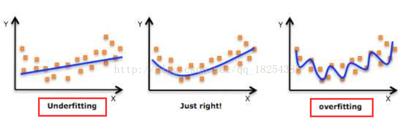
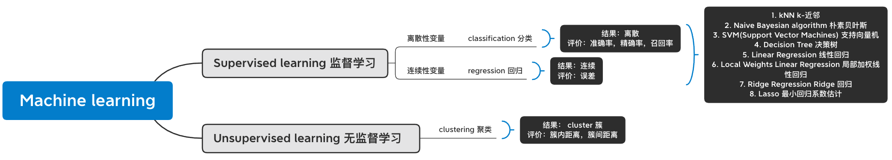

# Machine Learning 机器学习 01基础

简而言之，机器学习是从给定数据集中自动分析获得模型，并利用模型来进行预测

## ML Process 机器学习开发流程

1. 收集样本数据
2. 数据预处理
3. 分析数据：确保数据集中没有垃圾数据
4. 训练算法：如果是无监督学习跳过
5. 测试算法：评估算法效果
6. 使用算法

## Basic definitions 基本定义

### 数据集划分

- **Training set 训练集**

学习样本数据集，通过匹配一些参数来建立模型，主要用于训练模型。

- **Validation set 验证集**

对于学习出来的模型，调整模型的参数， 如在神经网络中选择隐藏单元数。它还可以用来确定网络结构或者控制模型复杂程度的参数。

- **Test set 测试集**

测试训练好的模型的分辨能力。

### 模型拟合程度

**Underfitting 欠拟合：** 模型无法得到较低的训练误差，即训练出来的模型不能很好的匹配，表现的很差

**Overfitting 过拟合：** 模型的训练误差远小于它在测试数据集 (Test set) 上的误差，即所建的机器学习模型或者深度学习模型在训练样本中表现过与优越，导致在验证数据集（Validation set）以及测试数据集 （Test set）中表现不佳。

**影响因素**

> 有很多因素可能导致两种拟合问题，这里先着重讨论两个重要因素： `模型复杂度 Model complexity` 和 `训练数据集大小 Training data set size`

**Model complexity 模型复杂度**

以多项式函数拟合为例，给定一个标量数据特征 Feature ***x*** 和对应的标量标签 ***y*** 组成的训练数据集，多项式函数拟合的目标是找一个  ***K*** 阶多项式函数来近似 ***y*** 

$$
\hat{y} = b + \sum_{k=1}^K x^k w_k
$$
**$$w_k：$$ **权重参数

**$$b：$$** 偏差参数

> 因为高阶多项式模型函数模型参数更多，模型函数的选择空间更大，所以高阶函数的复杂度更高。因此，高阶函数更容易在相同的训练数据集上得到更低的训练误差。在给定训练数据集中，模型复杂度和误差之间的关系如图：

如果给定训练数据集，模型复杂度过低，容易出现欠拟合；模型复杂度过高，容易出现过拟合。

**Training dataset size** 训练集大小

一般来说，如果训练数据集样本数过少，容易发生过拟合。另外，**泛化误差不会随训练数据集里样本数量增加而增大，因此通常训练数据集可以选择大一些。**

### Supervised learning 监督学习

>  必须确定目标变量的值，从而使得机器学习算法可以发现特征和目标变量之间的关系。**即输入数据有特征有标签，有标准答案。**

- **classification 分类：** 变量是离散的 【例如：判断邮件是否是垃圾邮件(二分类)， 手写数字的自动识别(多分类)】
- **regression 回归：** 变量是连续的 【例如：股票价格波动的预测】

**样本集：** 训练数据 + 测试数据

- *训练样本 = feature(特征) + label(目标变量)*
- *Feature*: 通常是训练样本集的列, 它们是独立测量得到的
- *Label* : 是机器学习预测算法的测试结果

**知识表示：**

- 采用`规律集的形式` 【例如： 数学成绩大于90为优秀】
- 采用`概率分布的形式` 【例如： 90%的同学数学成绩在70分以下，那么大于70分定为优秀】
- 采用训练样本集中的一个实例 【例如：通过样本集，我们训练得到的一个模型实例，该实例的特征我们认为是优秀】

### Unsupervised learning 无监督学习

在没有label的数据中，试图找到隐藏的结构。**即输入数据有特征无标签，没有标准答案**

- **clustering 聚类：**把训练集中的对象分成若干组，每一组叫一个 `cluster簇`

### 监督学习 vs 无监督学习

## 机器学习术语

- **model 模型：** 机器学习系统从训练数据 (training data) 学到的内容的表现形式
- **instance 示例 / sample 样本：** 表示对于某个对象的描述
- **attribute 属性 / feature 特征：** 对象的某方面的表现或者特征
- **hypothesis 假设：**学习模型对应了关于数据的某种潜在规则
- **ground-truth 真相：**真正存在的潜在规则
- **unseen instance 未见示例：** 没训练过的样本
- **generalization 泛化能力：** 模型对于没有见过的数据的预测能力
- **distribution 分布：** 样本空间的全体样本服从一种规律
- **independent and identically distributed 独立同分布**： 获得的每个样本都是独立从这个分布上采样获得的

# 参考

1.https://blog.csdn.net/qq_18254385/article/details/78428887?utm_medium=distribute.pc_relevant.none-task-blog-2%7Edefault%7ECTRLIST%7Edefault-1.no_search_link&depth_1-utm_source=distribute.pc_relevant.none-task-blog-2%7Edefault%7ECTRLIST%7Edefault-1.no_search_link

2.https://zhuanlan.zhihu.com/p/257900201

3.https://ailearning.apachecn.org/#/docs/ml/1

4.https://www.bilibili.com/video/BV17J411C7zZ?p=5
