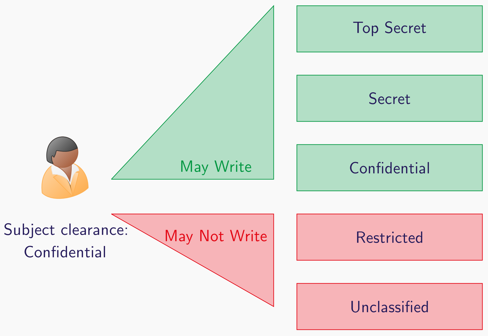
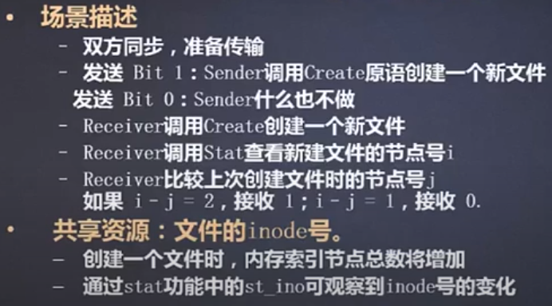

# Computer Security and Forensics 01

> Introduction, Motivation, Fundamentals and Access Control
>
> Military Security Policies and Covert Channels


## SQL Injection Attacks SQL注入攻击

### **Simplified Syntax** 

> 例如在一个典型的登录界面进行用户登录，

- **PasswordDatabase(userId) EQ randomstring OR (1==1)**

password=‘randomstring or 1=1’

```sql
select * from users where password='randomstring' or 1=1
```

- **注释注入**

username=123’or 1=1 #

password=123’or 1=1 #

```sql
select * from users where username='123' or 1=1 #' and password='123' or 1=1 #'
```


### Parse Trees

- Expected Parse Tree


- Actual Parse Tree


## Secure Design Flow 安全设计流程


> 上图展示了一个大致遵循安全设计和软件设计生命周期的的模块

一个安全设计的流程大概包含以下：

### Foundations and Security Technologies 基础和安全技术

- **Identification** 识别，**Authentication** 认证，**Authorization** 授权，**Access Control** 访问控制
- **Cryptography** 加密
- **Security Protocols** 安全协议

### **Building Secure Systems** 构建安全系统

- **Analysing Security Protocols** 分析安全协议
- **Application Security and Secure Programming**  应用程序安全和安全编程
- **Security Testing** 安全测试

### Secure Operations Response and Forensics 安全操作响应和取证

- **Secure Operations** 安全操作
- **Security Response** 安全响应
- **Forensics** 取证  

## Cyber Security 网络安全

> Cyber security refers to the protection of information systems (hardware, software and associated infrastructure), the data on them, and the services they provide, from unauthorised access, harm or misuse.

网络安全指的是保护信息系统（软硬件，相关的基础设施），系统上的数据，提供的服务不被未授权访问，伤害或者滥用。

## Typical Resources - Data 数据资源

- **Data At Rest** 静态数据：保护存储在数据库里的数据

>  引入加密的数据库

- **Data In Transit** 传输中的数据：保护正在传输的数据（例如：上传信息）

> 使用安全信道　`secure channels` （例如 `TLS 协议`）

- **Data In Execution** 执行中的数据：保护正在操作中的数据（例如： 比较）

> 　引入[同态加密](https://zh.wikipedia.org/wiki/%E5%90%8C%E6%80%81%E5%8A%A0%E5%AF%86)　`homomorphic encryption`

## CIA: Confidentiality, Integrity and Availability

**`计算机安全的关键目标`**


### Confidentiality 保密性

对信息的访问和公开进行授权限制，阻止信息泄露给未授权方

### Integrity 完整性

防止出现信息的不恰当修改和破坏

### Availability 可用性

确保信息系统能及时可靠地访问和使用

## Identity and AAA

> 为了能够判断一个 **主体 `subject`** 是不是 **授权方`authorized party` **，并且可以访问一个 **资源 `resource` **

### Identification 鉴别

与鉴别一个实体相关联

### Authentication 认证

>  检验一些东西的合法性 （通常是**系统实体声明的身份 `the claimed identity of a system entity`**）

**Types of authentication 认证的类型**

- **Knowledge** 认知 (Something that you know) :  Password, PIN

- **Ownership** 所有权 (Something that you own)：Smartcard, Keys
  - **Hardware Tokens**
    - Chip Cards
    - One-time password Generators

- **Characteristics** 特征（Something that you are）: Fingerprints, Weight distribution on a chair 
  - **Biometrics**
    - Fingerprints
    - Retinal Scans 视网膜扫描
    - Facial Recognition 面部识别

### Authorization 授权

授予或者拒绝一个系统实体的访问资源的权限

### Accountability 问责制

要求一个实体的 **行为`action`**可以唯一地追踪到该实体

## Access control 访问控制

Access control = authentication + authorization

### Abstraction 抽象概念


TAGS: **主体 `Subject`**, **目标 `Object`**, **拥有者 `Owners`**  **策略`Policies`**, **主体特权`Subject Privileges`**

- **主体 `Subject`** 想要使用 **目标 `Object`**
- **所有者 `Owners`** 拥有 **目标 `Object`**
- **拥有者 `Owners`**  使用 目标 `Object` 定义 指定 **主体特权`Subject Privileges`** 的 **`Policies` 策略**
- **拥有者 `Owners`**  创建 **实现`Implementations`** 来允许  **主体 `Subject`** 来自我认证

### Access control phases 访问控制的阶段

1. **Policy Definition Phase 策略定义阶段**：**拥有者 `Owners`**  指定谁可以访问哪个资源。
   1.  身份注册 Identity registration， 授权 authorization 会在这里发生
2. **Policy Enforcement Phase 策略执行阶段**
   1. Subject 尝试访问资源。不论结果是通过或者被拒绝，他的行为都会被记录下来

#### Policy Enforcement Phase 策略执行阶段

访问控制大致可以分为以下两类：

|                   | Physical access controls 物理访问控制          | Logical access controls 逻辑访问控制                         |
| ----------------- | :--------------------------------------------- | :----------------------------------------------------------- |
| Control Resources | **Physical resources**:  a PC, a paper records | **Electronic systems and resources**: databases, electronic records |
| Controlled by     | Facility manager 设备管理员                    | System administrators 系统管理员                             |
| Example           | Keys to office，Smart-cards                    | - Username and passwords<br />- Access to other accounts, such as email addresses. |

#### Policies vs Models 策略vs模型

|          | Security policy                                              | Security model                                               |
| -------- | ------------------------------------------------------------ | ------------------------------------------------------------ |
| Define   | What is allowed ( and / or forbidden)<br />定义了什么可以被访问或者被拒绝 | Representation of a class of systems (and their behaviour)<br />一类系统（及其行为）的表示 |
| Features | - Analogous to a set of laws (类似一个法规集)<br />- Defined in terms of rules and / or requirements 被定义为规则或者需求的形式 | - 突出显示被选定的抽象级别上的安全功能<br />- 提供制定具体策略的词汇表 |

### Access Control Models 访问控制模型

> Focus on **`authorization`**
>
> - 规定了谁被允许做什么（Permissions）
> - 如何更新和改变权限

Simple access control model 就是一个 **Subject x Object x Request** 的关系

#### Access Control Matrix Model 访问控制矩阵模型

> 基于 `Subjects` 对 `Objects` 的 `Privileges` 思想

- **Subjects**: Users, processes, agents, groups, …
- **Objects**: Data, memory banks, other processes, files, …
- **Privileges**: Right to read, write, modtify, …

|     Access Control in the **abstract**     |         Access Control implementation          |
| :----------------------------------------: | :--------------------------------------------: |
|                   Model                    |                   Mechanism                    |
| 当我们抽象地提到访问控制时，我们指的是模型 | 当我们提到访问控制的实现时，我们指的是一种机制 |

##### Protection State 保护状态

> A protection state ( relative to a set of privileges $P$ ) is a triple ($S$, $O$, $M$)
>
> 保护状态（ 相当于一组权限 $P$ ) 是一个三元组 ($S$, $O$, $M$)

- $S$: 表示一组现有的 `Subjects`
- $O$: 表示一组现有的 `Objects`
- $M$: 一个访问控制矩阵
  - 每一个 `Privilege` 特权表示为 $$ (S,O) \in O$$
  - 访问控制矩阵定义了一个关系: $$ S \times O \times P $$

| Subject $$S$$ | Object $$O$$           | Privilege $$P$$ |
| ------------- | ---------------------- | --------------- |
| sspielberg    | indy_last_crusade.txt  | Read            |
| glucas        | indy_last_crusade.txt  | Write           |
| sspielberg    | indy_crystal_skull.txt | Read            |

#### Examples of Access Control Models 一些访问控制的模型

因为不同的环境需要不同位置的 `object` 访问，因此需要定义一个更普遍化的一些 models 的集合来描述权限是如何被授予的

##### *Discretionary access control (DAC) 自主访问控制*

> The `owner ` of the `object` decides which `subjects` has which `privileges`

是一种软件机制，用来控制用户对文件和目录的访问。 DAC 允许 **`owner`所有者** 根据自己的判断来设置文件和目录的保护。

- Sharing user-created documents in Windows

##### *Mandatory access control (MAC) 强制访问控制*

> System-wide polices define `subject` access to `objects`, and `owners` cannot change this

是一种基于标签关系的，由**系统强制执行**的访问控制机制。拥有者不可以改变它

- Security clearance policies for accessing classified information.

##### *Role Based Access Control （RBAC）基于角色的访问控制*

> Access is based on a common set of **`privileges`** that apply to all subjects in the same **`role`**.

访问基于一组共有的特权的 **`角色 Role`**，作用于所有 **`Subject`** 拥有相同角色

- Late access to buildings for staff

> - **`Subjects` 主体** often have **`roles` 角色**
> - **`Roles` 角色** can often share the same **`Privileges` 权利**

RBAC 通过引入 **`roles` 角色** 来 **`decouples` 解耦** **`Subjects` 主体** 和 **`privileges`权限**。

**Formalization**

- A set of **Roles**: R$$\in R$$

- A set of **Subjects**: S $$\in S$$

- A set of **Privileges**: P $$\in P$$

- A relation $$UA \sub S \times R $$ : UA表示 `Subject`和`Role `之间的关系

- A relation $$PA \sub R \times P$$: PA 表示 `Role` 和 `Privileg` 之间的关系

  Access Control model 可以表示为 $$AC = UA \diamond PA $$

$$
AC = \{ (S,P) \in S \times P | \exist R \in \R: ((S,R)\in UA) \wedge ((R,P) \in PA)  \}
$$


##### *Rule Based Access Control (RAC) 基于规则的访问控制*

> Access to objects is based on a list of **`rules`** defined by the **`owners`** for each **`subject`**.

访问基于一组由 **`owners` 拥有者**定义的规则作用于每一个**`subject`**

- Document access in operating systems

### Next Generation Access Control

#### Usage Control

- **Controlling the use** : 例如你可以读这本书，但不允许分发。你可以在两周内看两次电影等
- **DRM (one of the form of Usage Control)**
  - Watermarking 水印
  - Monitoring 监控

## Military Security Policies and Covert Channels 军事安全策略和隐蔽通道

> - **`military security model` 军事安全模型**，`Multi-level  security`多级安全: 对model的**实现**
>
> - **`covert channels`隐秘渠道**: 用于绕过多级安全，以不寻常的方式泄露信息

### DAC: Discretionary Access Control

> 通常是军事系统的 **`minimum requirement` 最小要求**

通常通过以下方式实现（具有不同程度的可取性）：

- password
- capabilities (tickets)
- owner/group/other masks
- Acess Control Lists (ACLs)

**缺点**

DAC 没有提供防护 `Trojan Horses`特洛伊木马 的措施

### Protection Against Trojan Horses

1. **Proactive** 积极主动的：`Scrutinise` 积极检查所有的代码并验证没有木马程序：
   - 仔细阅读源码
   - 用可信的编译器在可信的硬件上编译源码
   - 使用可信的库程序 `library routine`

2. Reactive 响应式的：假设木马程序会找到进入系统的途径
   - 限制他们所能造成的伤害

将上述的两周方法合并为两个阶段：

1. 创建一个小型的受信任的计算机基地 `Trusted Computer Base (TCB)`
   - 引用监视器`Reference Monitor`是一种用于执行访问控制策略的机制
   - **Reference Monitor**必须是 **NEAT**
     - Non-bypassable 不可绕过的
     - Evaluable 可评估的
     - Always Invoked 始终调用
     - Tamper-proof 防篡改
   - 访问例程：比如磁盘文件
   - 确保没有木马存在
2. `Untrusted System` 不受信任的系统：
   1. 只可以通过TCB访问资源
   2. Reference Monitor 强制执行 MAC (Mandatory Access Control) 策略：
      - 限制泄露信息的可能性


### MAC: Mandatory Access Control

> **Often used in military contexts.**

MAC提供了一些对抗木马程序的措施

- `Subjects` 和 `Objects`通过系统中特别的安全属性 `security attributes (security classes 安全等级)`。这些被用作 `suject-access-object`的决策基础。
- 通常来说不可以被修改（或者更确切的说，属性的创建和修改受到严格的控制）


### Bell and La Padula BLP 模型 （多层级 multi-level security）

#### Classification 分类

> MAC的关键是分类的概念
>
> 一个等级制 **hierarchical**（完全有序的 **Totally ordered**）的标记来表示敏感度 **sensitivity**的等级 


#### Dominates Relation 支配关系

如何比对不同的分类，我们将这种关系称为 `dominates`

##### **Properties 性质**

- **Reflexive** 自反性： 一个类可以`dominates` 自己


- **Antisymmetric** 非对称性：类只可以在他们相等时才能相互 `dominate`


- **Transitive 传递性**： 如果 Class A `dominates` B, B `dominates` C, 那么 A `dominates` C


(>=) 有相似的性质 

#### Labelling of Objects 目标标签化

在实际实现中， `classification` 分类指的是系统中的 objects 都会被赋予一个标签来表示与之相关联的数据的敏感程度


#### Subject Clearances 主体许可

主体会被赋予一个许可 `clearance`，它表示主体被允许看或者读的最大敏感信息


#### Processes as Subjects 将进程作为主体

现实世界中的主体（通常是指Users）通常在计算机系统中代表 进程 `processes`

> **Subjects 有时候也是 Objects**

- A user (subject), 希望登录后创建一个 process( object )
- Process （subject） 可能发起活动
- 大多数的决策关系进程 process


#### Clearance: No Read Up 许可：不可上读

一个 subject 只可以读 **与它平级的或者低于 `at or below`** 它许可 clearance 的object


如何绕过这个限制？

> 假如一个 `Subject` 的许可是 `Top Secret`, 它可以读 `Top Secret` 文件的副本。然后将其拷贝给 `Unclassified` 的文件中


那么这样一来，对于许可为``Unclassified` 的 `Subject` 来说，它也可以读到 `Top Secret`的文件

 

#### No Write Up: 不可下写

为了防止上述的情况发生，对于Subject来说，它只可以写同级或者高于它等级的许可



但随之也存在问题，如果一个 subject的许可为 `TOP SECRET`， 那么它将永远不可以写任何比这个分类低的文件


#### Current clearance

Subject的许可是 Subject 能操作的最大分类 `maximum, classification`, 即 `maximum current clearance`


### Covert Channels 隐蔽通道

- 电脑系统为 `inter-subject` 主体间的交流提供了通道 `channel`，例如 **`FILES`文件**

- 这些旨在用于通信，并且系统可以监管对它们的访问。

> Possible to create unusual means of communication via elements of the system so that the intent of the mandatory policy is broken. These means are known as covert channels.

可以通过**系统元素**创建不寻常的通信方式，从而破坏 **MAC**。这些方法称为 `Covert channels`。


根据其目的分为：

- Storage Channels 存储隐蔽信道: 发送者直接或间接写目标值，接收者直接或间接接读目标值。实例：文件节点号信道。一般来说，隐蔽存储通道涉及到不同安全级主体可以共享的某种数量有限的资源（比如硬盘）



- Timing Channels 定时隐蔽信道 :发送者通过时域上调制使用资源（例如CPU）发送信息，接收者能够观测到并对信息进行解码。一个隐蔽通道是隐蔽定时通道，如果它的发送信号方式是一个进程调节自己对系统资源（比如CPU）的使用、从而影响另外一个进程观察到的真实系统响应时间。实例：CPU调度信道。


#### Object Existence 目标存在

`Covert storage channels` 使用一个目标的存在来传递信息


#### Object Attributes 目标属性

`Covert storage channels`也可以使用 `object attributes目标属性 `。

最明显的文件属性是它的内容（内容是监管访问的). 但是其他如 `formatting格式` 或者 `admin info`。


Top Secret  subject 读了 FILE_A. 系统更新 `Time Last Read` 字段, 这个字段是公开的，对于一个unclassified subject 可以观察到这个变化


#### Problem: Changing Clearances 改变许可出现的问题

> Object 重用 和 数据残留

当我们改变例如`lowering clearance`就类似创建一个新的 unclassified `object客体`, 将高层级 `Confidential` object的内容复制到创建的新客体，再将后者销毁。那么在这个过程中就会出现object重用和数据残留。

其中一种方式是，在发生层级变换是，清楚所有的本地数据。

#### Downgrading 降级

> 例如将一个 `object目标` 重新分到低的类别中显然是一个问题

- 使用户能将例如 Top Secret file 更改为一个 Unclassified 文件
- 通常只有特别 “信任”的 subjects 才能够做到这一点


#### Upgrade 升级


### Refining Classification

- **Caveats**：信息应该限制在`particular group` 特定的组别中
  - Example: UK Citizen vs EU Citizen.
  - Dominates: UK Citizen dominates UK Citizen, EU Citizen (但有的集合不可比，例如UK Citizen dominates UK Citizen, EU Citizen)
- **Codewords**: 代号用于反映 "需要知道"(need to know)
  - {Alpha, Beta, Gamma, Crypto} dominates {Alpha, Crypto}
  - {Beta, Crypto} and {Alpha, Crypto} are not comparable.

这些组的 `compound` 复合体给出了一个安全等级 `security class`

安全等级 `security class` 之间的支配权 `Dominance` 是根据以下方面的支配权来定义的

### Lattices

通常，`security classes` 构成 `Lattices` 的一部分。

`Lattices` 是具有附加属性的偏序（自反、反对称和传递）。

- 对于任何两个安全等级 X 和 Y，都有一个唯一的最小上限 lub(X, Y) 支配它们
- 对于任何两个安全等级 X 和 Y，都有一个唯一的最大下界 glb(X, Y) 由它们两者支配。


### Integrity 完整性

在这种情况下，我们认为完整性是保护资源不被不当修改。与更普遍的安全背景一样，完整性是与机密性/保密性分开的属性，需要区别对待。特别是，我们认为完整性是保密性的 "双重"。

- No write up：**低完整性的主体** 应该注意到能够写到 **高完整性的数据**。
- No read down：**高完整性的主体** 不应该读取低 **完整性的客体**。
