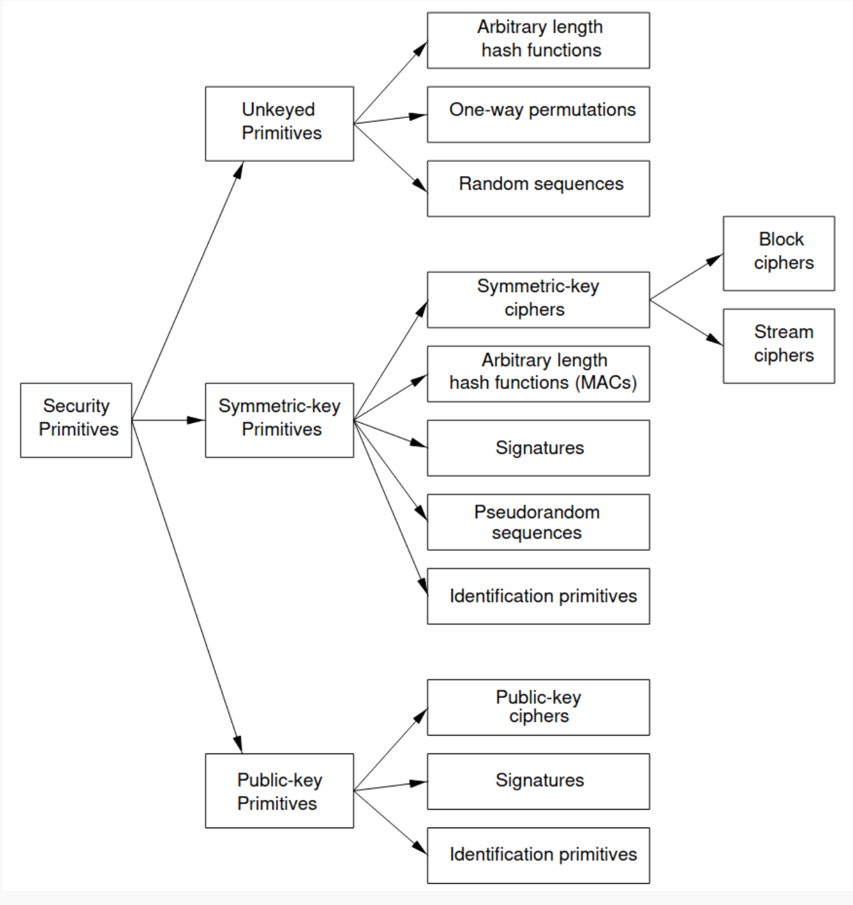
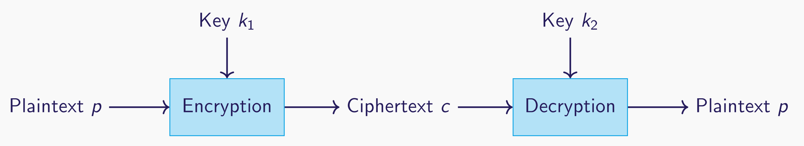
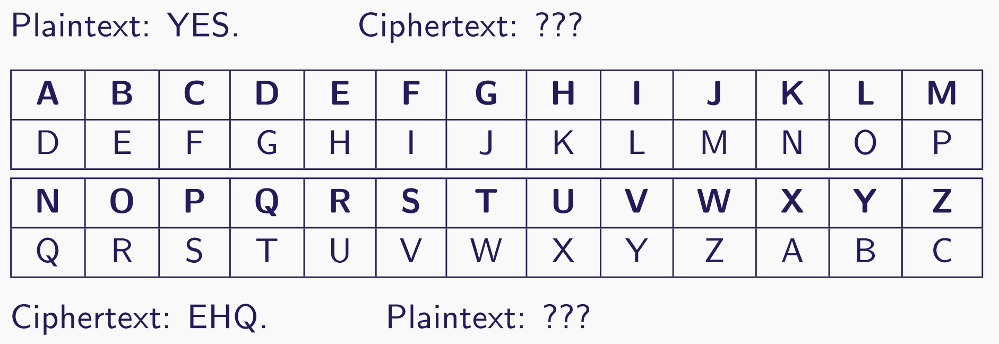
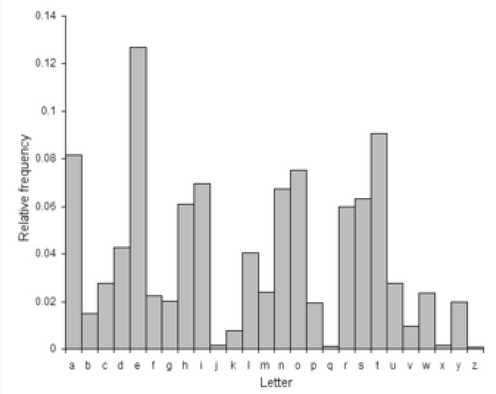
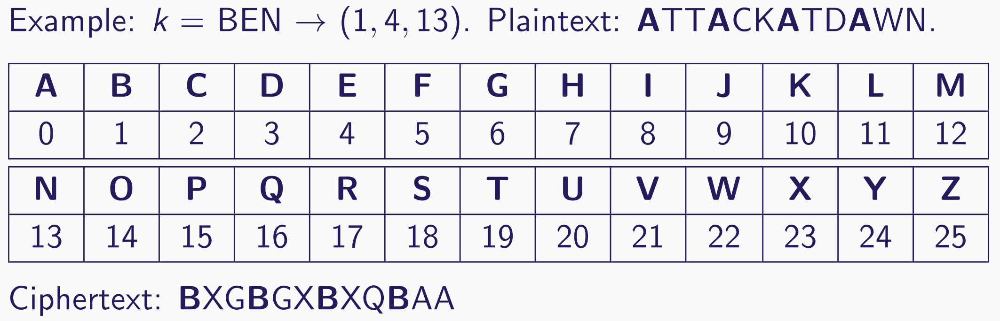

# Computer Security and Forensics 02

> Fundamentals of Cryptography
>
> 

## Clarifying Notation 概念澄清

- **Cryptography 密码学**

> Cryptography is the study of mathematical techniques related to aspects of information security such as confidentiality, data integrity, entity authentication, and data origin authentication.
>
> 密码学是对与信息安全方面相关的数学技术的研究，例如机密性、数据完整性、实体身份验证和数据来源身份验证。

- **Steganography** 隐身术
- **Cryptanalysis** 密码分析

## Cryptographic Taxonomy 密码学分类法

## Encryption 加密

### Correctness 正确性

$$Dec_{k_2}(Enc_{k_1} (p)) = p$$

即使用秘钥k2，通过对明文P进行加密得到的密文，再通过解密算法与秘钥k2解密得到的明文应该是一致的

### Symmetric encryption 对称加密

$$k_1 = k_2$$， 通常表示为key $k$

### Asymmetric Encryption 非对称加密

$$k_1 \neq k_2$$, 通常表示为 $pk$ 和 $sk$

### Kerckhoffs’ principles 柯克霍夫原则

> 定义了现代密码设计: 通过隐蔽性（隐藏密码系统的细节）`obscurity (hiding the details of a cryptosystem)`  实现安全是不够的。一个密码系统的安全性应该只依赖于所使用的（保密）钥匙 `(secrecy of) keys`。

1. 即便如果做不到数学上不可破解，系统也应在实质（实用）程度上无法破解。
2. 系统内不应含任何机密物，即使落入敌人手中也不会造成困扰。
3. 密匙必须易于沟通和记忆，而不须写下；且双方可以容易的改变密匙。
4. 密码图应可通过电报传送。
5. 系统应可以携带，不应需要两个人或以上才能使用（应只要一个人就能使用）。
6. 系统应容易使用，不致让用户的脑力过分操劳，也无需记得长串的规则。

启示：

- 没有安全的隐蔽性 （❎）
- 隐蔽性可以帮助提高安全性，但系统可以而且会被反向工程。即使系统的规格完全为人所知，系统仍然应该是安全的。此外，开放的规范可以鼓励审查和分析，提高我们对系统的信心 (✅)

### Formalisation of Encryption 加密形式化

- $A$ `alphabet` : 一个有限集

- $M$ `message space`: 有 $$M \subseteq A^*$$ , 并且  $$ 明文 p \in M $$
- $C$ `ciphertext space`: 对于**密文空间**中的字母表应当与 **Message space** 中**有所不同**
- $K$ `keyspace of keys`

每一个 $$k \in K$$ 从 $$M \rightarrow C$$ 确定一个满射函数 `bijective function`， 记为$$Enc_k()$$加密函数

每一个 $$k \in K$$ 从 $$M \rightarrow C$$ 确定一个满射函数 `bijective function`， 记为$$Dec_k()$$解密函数

## Historical Ciphers 历史密码

### The Caesar Cipher

`Mono-Alphabetic Substitution Cipher` 单字母替换密码

- 假设明文为英文表： A, B, C … , Z
- Key 是数组集 [0,25]
- 加密：向前偏移k个字母
- 解密：向后偏移k个字母

例如 k = 3 (Caesar’s favourite key)

- Enck(m) = k(m1)k(m2) . . . k(mn) = c1c2 . . . cn = c..

- Deck(c) = k−1(c1)k−1(c2) . . . k−1(cn) = m1m2 . . . mn = m.

### Substitution Cipher Security 替换密码的安全性

- 可以进行 频率分析 `frequency analysis`, 对字母的对应关系进行合理的猜测。
- 如果 X 是（合理数量）文本中最常见的字符，那么它很可能是字母 E 的加密。

### The Vigenere Cipher 

- 假设明文为英文表： A, B, C … , Z
- Key k 是一个单词或者短语 （定义了一个整数序列）
- 加密算法：使用循环顺序的字母来定义 Caesar ciphers 的序列

Keysize : $$26^t$$ 其中t是密码短语的长度

### The One-Time Pad 一次一密

- 一个明文 P = P0, P1, P2 . . . Pn， Pi 是整数集[0,25]之中
- 一个key K = K0, K1, K2, . . . Kn’， Ki 是整数集[0,25]之中，并且 n’ >= n

加密： Ci = Pi + Ki mod 26

解密： Pi= Ci - Ki mod 26

现在对于每个加密的字母，使用不同的密码 Ki，不重复

> 如果每个 Ki 都是来自 {0, 25} 的均匀随机值，并且我们只使用每个 Ki 一次，那么密文 C 不会泄露更多关于明文 P 的信息，除了它的长度。

形式上，这可以用概率来表示。假设只有固定长度的明文具有非零概率，则：

Pr(P = p|C = c) = Pr(P = p).

因此，给定密文 C，P 的后验概率与 P 的先验概率相同。

### Transposition Cipher

